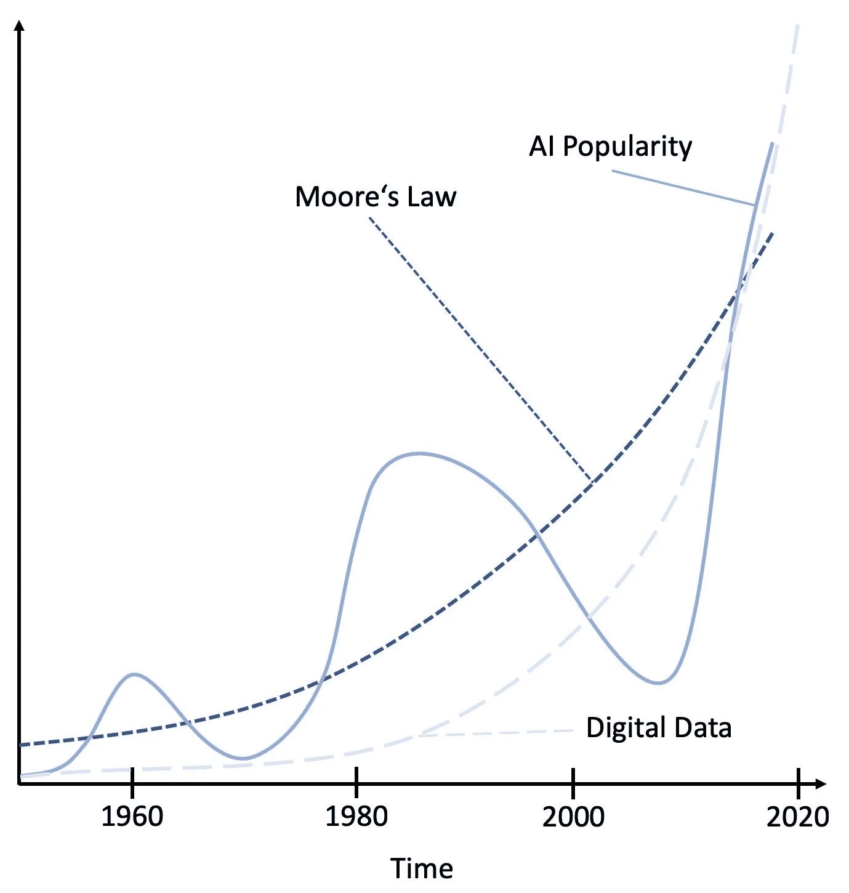

# 人工智能——建模中苦乐参半的交响乐

> 原文：<https://towardsdatascience.com/artificial-intelligence-a-bitter-sweet-symphony-in-modelling-bc7107225b44?source=collection_archive---------27----------------------->

## 每个模型都是错的，但有些模型是有用的

在过去的几十年里，我们已经看到了人工智能(AI)的巨大进步。然而，这一进展并不是稳步实现的。一路上经历了重大的起伏。在其中一些阶段，人们甚至害怕公开承认人工智能这个术语，因为这个领域的声誉受到了严重损害。在那个时候，任何从事人工智能的人都被认为是梦想家。这也导致了该领域的不同名称和细分，被称为机器学习、数据挖掘或模式识别。

*图 1:人工智能炒作周期、摩尔定律和数字数据量不断增长的对比。*

理查德·萨顿在[最近的一篇博客文章](http://www.incompleteideas.net/IncIdeas/BitterLesson.html)中指出，计算能力的缺乏被认为是迄今为止遭遇起伏的一个重要原因。在他的透彻分析中，观察到一般模型总是胜过那些主要由专家知识驱动的模型。随着计算能力的提高，通用模型能够超越手工制作的、基于专家知识的方法。然而，当通用模型在计算上变得过于昂贵时，摩尔定律就出现了，使用通用方法的进一步发展变得不可能。图 1 示意性地展示了这一发展。基于这种分析，得出的结论是，专家知识的结合是一种资源浪费，因为人们只需要等到有足够的计算能力来解决机器智能的下一个里程碑。这个结论相当激进，值得再分析一下。因此，我们将有一个简短的历史观点，这实际上是最近在 KDnuggets 上发表的三篇文章的简短总结。

感知器的灵感来自左边显示的生物神经元。所得的计算神经元计算其输入的加权和，然后由激活函数 h(x)处理，以确定输出值。这样做，我们能够模拟线性决策边界，因为加权和可以被解释为到决策边界的有符号距离，而激活确定实际的类成员。在右侧，示出了不能由单个线性分类器解决的 XOR 问题。它通常需要弯曲的边界或多条线。图片:[来源](https://www.sciencedirect.com/science/article/pii/S093938891830120X)

第一次人工智能炒作开始于 20 世纪 50 年代，并导致了该领域的重要发展。明斯基开发了第一台被称为随机神经类比强化计算机(SNARC)的神经网络机器，该机器受生物设计的启发，将神经元映射为一台电机。更重要的发展是感知器，它使得受生物启发的神经元可以在计算机程序中训练。那个时代的另一个重要发展是基于规则的语法模型的发明，它被用来解决第一个简单的自然语言处理任务。同样，图灵测试的概念也属于人工智能的这个时期。随着这些巨大的发展，对人工智能的高期望逐渐越来越快。然而，这些概念不能满足他们的期望，在许多日常生活应用中失败了。这些怀疑进一步得到理论观察的支持，例如，感知器不能学习逻辑异或函数，因为它不是线性可分的。结果，人工智能的资金被大幅削减，这也被称为今天的人工智能冬天。

使用层导数的反向传播的图形概述。在正向传递期间，网络被评估一次，并使用损失函数与期望输出进行比较。反向传播算法沿着不同的路径通过层图，以便有效地计算矩阵导数。图片:[来源](https://www.sciencedirect.com/science/article/pii/S093938891830120X)

在 80 年代，人工智能的魅力又回来了。第二次繁荣是由更重要技术的发展促成的，如使多层感知器可训练的反向传播算法，以及具有单个隐藏层的神经网络已经是通用函数逼近器的理论观察。循环网络被开发出来，强化学习也使得博弈论变得可训练。当时的另一个突破是统计语言模型的发展，逐渐开始取代基于规则的系统。甚至深度和卷积网络在那时已经被探索。然而，不断增长的计算需求——由数值不稳定性支持——导致了长时间的训练。与此同时，出现了其他基于模型、不太复杂的技术，如支持向量机和集成，这些技术逐渐降低了神经网络的重要性，因为可以在更短的时间内获得相同或更好的结果。特别是凸优化和变分方法成为重要的概念，有效地结束了这第二次人工智能炒作。当时，神经网络被认为是低效和数值不稳定的。许多研究人员不再在这个方向投入时间，因为其他方法更有效，可以更有效地处理数据。

深度学习擅长检测和分割等感知任务。在这里，我们强调一些医疗应用:左手边显示的是[基于人工智能体的地标检测](https://link.springer.com/chapter/10.1007/978-3-319-46726-9_27)和 [X 射线变换不变地标检测](https://link.springer.com/chapter/10.1007/978-3-030-00937-3_7)(投影图像由 Unberath 博士提供)。右侧显示了基于 [U 形网的支架分割](https://dx.doi.org/10.1007/s11548-018-1779-6)。图片:[来源](https://www.sciencedirect.com/science/article/pii/S093938891830120X)

第三个炒作期，我们目前正在经历的这个时期再次受到许多重要突破的推动。我们已经看到计算机打败了世界级的围棋选手，创造了艺术，并解决了以前几乎不可能完成的任务，如图像字幕。在这个时期，一个主要的重复出现的主题是不再需要手工制作和特征工程，深度学习算法解决了所有开箱即用的问题。事实上，已经发现了一些重要的概念，这些概念能够概括许多最先进的方法。深度卷积网络已经取代了 SIFT 和小波理论等多尺度方法。此外，可训练的卷积神经网络已经证明在语音处理中胜过所谓的梅尔频率倒谱系数(MFCCs ),其中这些特征已经主导该领域近 50 年。看来[过去发展起来的许多理论已经过时了。然而，人们必须记住，深层网络设计实际上经常受到经典特征提取模型的启发，并且图像处理特征与小波变换有明显的相似性，并且音频处理网络仍然形成隐式滤波器组。同样，知识仍然存在，但是](https://www.marktechpost.com/2018/11/28/do-we-still-need-traditional-pattern-recognition-and-signal-processing-in-the-age-of-deep-learning/)[它以不同的形式编码](https://www.marktechpost.com/2019/01/04/does-deep-learning-always-have-to-reinvent-the-wheel/)。人们仍然不得不承认，以前算法的可训练版本明显优于它们的前辈。

我们目前的分析缺少第三个组成部分，这是今天人工智能成功的另一个驱动因素:用于训练机器学习算法的数字数据的可用性(参见图 1)。在最近的一篇文章中，Helbing 和他的同事观察到数据每 12 个月翻一番，而即使是 GPU 的处理能力也只在 18 个月内翻一番。因此，我们很快将不再能够像今天这样详尽地处理数据。我们要么选择只处理有限数量的数据，要么必须限制我们用来处理它们的方法的复杂性。因此，基于模型的方法可能很快会再次占据主导地位，我们可能会经历另一个时期，在这个时期，非通用和专用模型将推动研究。

这种研究似乎是徒劳的，因为它可能会在某个时候被更普遍的方法所取代。然而，我们必须记住模型的另一个重要优势:它们可以被理解和相应地操作。以一个物理公式为例，它可以求解一个或另一个变量。我们可以对所有模型执行此操作，并使用它们的属性来重新安排它们的用途。这是我们目前的深度学习模型无法做到的。他们必须从头开始接受培训，而且他们的重用能力有限。因为这样的模型也有很多目前深度学习无法做到的。

时间像箭一样飞逝。AI 的未来会给我们带来什么？图片: [Pixabay](https://www.pexels.com/de-de/@pixabay?utm_content=attributionCopyText&utm_medium=referral&utm_source=pexels) / [Pexels](https://www.pexels.com/de-de/foto/856199/?utm_content=attributionCopyText&utm_medium=referral&utm_source=pexels)

对于遥远的未来，我们已经可以推测，这种知识驱动的人工智能将在未来几年被真正的通用人工智能所取代，正如萨顿预测的那样[，通用人工智能能够自己创建、维护和重用这种模型。然而，在这篇文章的作者看来，将领域知识与深度学习相结合的方法并不是徒劳的，因为下一级的推广将通过从模型驱动的人工智能中吸取的经验教训来实现，而这些经验教训仍将到来。在开发模型驱动的人工智能时，我们将了解如何构建良好的可训练模型人工智能解决方案，并最终创建自动化方法来实现相同的目标。](http://www.incompleteideas.net/IncIdeas/BitterLesson.html)

当然，很难做出预测，尤其是对未来的预测。无论哪种方式，无论是一般的无模型方法还是模型驱动的科学，我们都期待着机器学习、模式识别和数据挖掘的激动人心的未来！

这篇博文最早出现在 http://www.marktechpost.com 的[网站上。如果你喜欢这篇博文，我推荐你阅读 MarkTechPost.com 上的其他帖子，或者看看我们免费的深度学习资源。](http://www.marktechpost.com)

本文的文本和图像根据知识共享许可 4.0 署名进行许可。请随意重用和分享这项工作的任何部分。