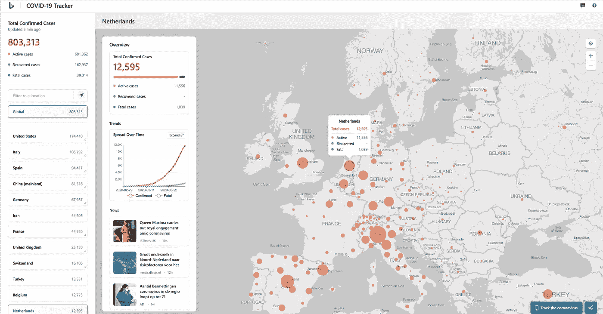
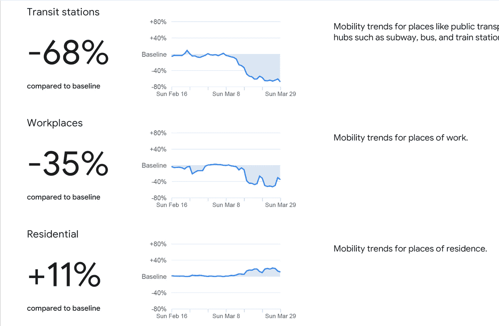
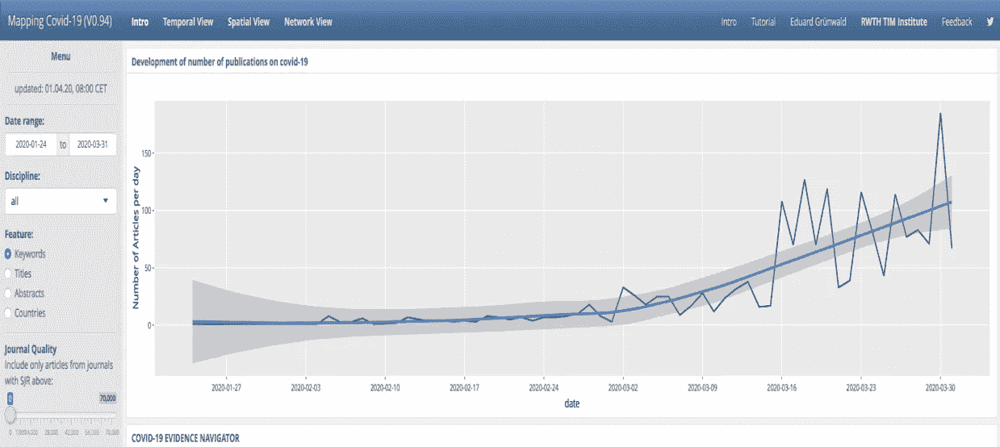

# 人工智能对抗新冠肺炎:早期评论

> 原文：<https://towardsdatascience.com/artificial-intelligence-against-covid-19-an-early-review-92a8360edaba?source=collection_archive---------1----------------------->

## *人工智能尚未产生影响，但数据科学家已经接受了挑战*

来源:Pixabay

**简介**

由新型冠状病毒病毒引起的新冠肺炎病于 2019 年 12 月在中国被发现，并于 2020 年 3 月 11 日被世卫组织宣布为全球疫情。人工智能(AI)是对抗[新冠肺炎疫情](https://en.wikipedia.org/wiki/2019%E2%80%9320_coronavirus_pandemic)的潜在强大工具。就目前的目的而言，人工智能可以定义为[机器学习](https://www.nature.com/articles/nature14539)(ML)[自然语言处理](https://en.wikipedia.org/wiki/Natural_language_processing) (NLP)和[计算机视觉](https://en.wikipedia.org/wiki/Computer_vision)应用程序，以教会计算机使用基于大数据的模型进行模式识别、解释和预测。这些功能可用于识别(诊断)、预测和解释(治疗)新冠肺炎感染，并帮助管理社会经济影响。自从疫情爆发以来，为了这些目的，出现了使用和探索人工智能和其他数据分析工具的热潮。

在这篇文章中，我提供了一个早期的回顾，讨论了人工智能对抗击新冠肺炎的实际和潜在的贡献，以及这些贡献目前的制约因素。它旨在从快速扩展的讨论和不断增加的工作中快速获取信息，以便为研究、政策和医学分析中的快速响应提供投入。疫情在生命和经济损失方面的代价将是可怕的；在撰写本文时，对于非药物和药物反应究竟有多糟糕以及有多成功的估计存在很大的不确定性。改进人工智能是过去十年左右开发的最有前途的数据分析工具之一，以帮助减少这些不确定性，是一项值得追求的目标。令人鼓舞的是，数据科学家已经接受了挑战(这意味着这篇论文的保质期可能很短)。

关键要点如下。我发现人工智能还没有对新冠肺炎产生影响。它对人工智能的使用受到缺乏数据和太多噪音和离群数据的阻碍。克服这些限制将需要在数据隐私和公共健康问题之间保持谨慎的平衡，以及更严格的人机交互。在目前的疫情时期，这些问题不太可能得到及时解决，也不会有多大帮助。相反，AI [可能](https://www.technologyreview.com/s/615351/ai-could-help-with-the-next-pandemicbut-not-with-this-one/)“帮助下一个疫情”。与此同时，收集关于谁具有传染性的诊断数据对于拯救生命和限制围堵造成的经济浩劫至关重要。

**AI 对新冠肺炎的实际和潜在贡献**

人工智能可以在六个领域为抗击新冠肺炎做出贡献:I)早期预警和警报，ii)跟踪和预测，iii)数据仪表板，iv)诊断和预后，v)治疗和治愈，以及 vi)社会控制。

*预警和警报*

加拿大人工智能模型[蓝点](https://bluedot.global/)的案例已经成为传奇。它说明了一个相对低成本的人工智能工具( *BlueDot* 由大约 900 万美元的启动投资资助)可以在发现传染病爆发方面超越人类。根据[账户](https://ars.electronica.art/aeblog/en/2020/03/19/ki-corona-part1/) , *蓝点*在 2019 年底预测到了感染的爆发，并在 2019 年 12 月 31 日向其客户发出了警告，早于世界卫生组织在 2020 年 1 月 9 日发出的警告。与蓝点合作的研究人员还在 2020 年 1 月 14 日的[旅行医学杂志](https://academic.oup.com/jtm/advance-article/doi/10.1093/jtm/taaa008/5704418)上发布了一份通知，其中列出了武汉乘客将到达的前 20 个目的地城市。它警告说，这些城市可能处于疾病全球传播的最前沿。

虽然蓝点毫无疑问是一个强大的工具，但它受到的许多宣传都有些夸大和低估了人类科学家的作用。首先，当*蓝点*在 2019 年 12 月 31 日发出警报时，美国波士顿儿童医院的另一个基于人工智能的模型 [HealthMap](http://www.diseasedaily.org/about) 甚至更早，在 2019 年 12 月 30 日发出警报。此外，仅在此之后 30 分钟，一名科学家在监测新出现疾病的项目中发出了警告。虽然基于人工智能的模型只快了 30 分钟，但它对疫情爆发的重要性非常低。本质上，它需要人的解释和提供环境来识别威胁。此外，正如蓝点*的创始人卡姆兰·可汗在本期[播客](https://youtu.be/V6BpKSGquRw)中解释的那样，即使在蓝点*的案例中，人类仍然是评估其产出的核心。因此，强调人工智能的最佳应用需要来自不同学科的人工输入是正确的。**

*跟踪预测*

人工智能可以用来跟踪(包括临近预报)和预测新冠肺炎病将如何在时间和空间上传播。例如，在 2015 年寨卡病毒的疫情之后，开发了一个动态神经网络来预测 T21 的传播。然而，像这样的模型需要使用来自新冠肺炎疫情的数据进行重新训练。这似乎正在发生。在卡耐基梅隆大学，训练来预测季节性流感的算法现在正根据来自新冠肺炎的新数据进行重新训练。

各种各样的问题困扰着对疫情将如何传播的准确预测。这些包括缺乏训练人工智能的历史和无偏见的数据；导致社交媒体上“噪音”的恐慌行为；以及新冠肺炎感染的特征不同于以往大流行的事实。不仅缺乏历史数据，而且使用“大数据”(如从社交媒体收集的数据)也存在问题。

在这里，传染病背景下大数据和人工智能的陷阱仍然存在，正如臭名昭著的[谷歌流感趋势](https://www.wired.com/2015/10/can-learn-epic-failure-google-flu-trends/)的失败所表明的那样。大卫·雷泽、瑞恩·肯尼迪和亚历山德罗·维斯皮亚尼在 2014 年发表在[科学](https://science.sciencemag.org/content/343/6176/1203/tab-pdf)上的一篇论文中将这些称为“*大数据狂妄和算法动力学*”例如，随着感染的继续传播和周围社交媒体流量的积累，噪音的数量也在积累，必须经过过滤才能看出有意义的趋势。对于依赖于过去行为的预测工具来说，像新冠肺炎这样拥有大量新的和前所未有的数据的全球异常事件被 [Ian Rowan](/what-happens-to-ai-when-the-world-stops-covid-19-cf905a331b2f) 描述为“*现代人工智能方法的氪石*”，这不仅会影响传染病的预测，还会影响所有的预测模型，包括金融、经济中的预测模型。正如他解释的那样，“许多行业将会把人类拉回到被模型从他们手中夺走的预测椅子上”。

应对大数据傲慢和算法动态的一种方式是通过社交媒体上的内容节制。由于封锁措施导致人员减少，谷歌(YouTube)和脸书(T1)等大型社交媒体平台已经开始更密集地使用人工智能来进行内容审核，包括检查 T2 的假新闻。更多地依赖人工智能进行内容审核暴露了一个事实，即人工智能在这方面仍然做得很差。YouTube [承认](https://www.theverge.com/interface/2020/3/18/21183549/coronavirus-content-moderators-facebook-google-twitter)在内容审核中更广泛地使用人工智能是“容易出错的”这再次说明了人工智能需要人类的投入和指导。

由于缺乏数据，太多的离群数据和嘈杂的社交媒体，大数据傲慢和算法动力学，人工智能对新冠肺炎传播的预测还不是非常准确或可靠。因此，到目前为止，大多数用于跟踪和预测的模型都**而不是**使用人工智能方法。相反，大多数预测者更喜欢已建立的流行病学模型，即所谓的 SIR 模型，SIR 模型是一个缩写，代表一个地区的人口是可接受的、可感染的和可移动的。

例如，牛津大学人类未来研究所根据流行病学模型提供了病毒传播的预测。总部位于三藩市的 Metabiota 公司提供一种流行病跟踪器和一种疾病传播的短期预测模型，他们用这种模型来预测 T21。牛津大学数学家汤姆·克劳福德在最近的 YouTube 视频中对这些 SIR 模型做了简短的解释。

柏林的罗伯特·科赫研究所使用了一个流行病 SIR 模型，该模型考虑了政府的遏制措施，如封锁、隔离和社会距离处方。他们的模型在这里被解释为，在这里被解释为。一个类似的[扩展 SIR 模型](https://www.medrxiv.org/content/10.1101/2020.02.29.20029421v1)，考虑了针对疫情的公共卫生措施，并使用了来自中国的数据，最近已经预先发布并以 *R* 格式提供。罗伯特·科克研究所的模型早些时候被用于中国的案例，以说明遏制措施可以成功地将传播速度降低到低于指数速度。

跟踪和预测新冠肺炎的传播是公共卫生当局规划、准备和管理疫情的宝贵数据输入。并评估他们在流行病学曲线上的位置，以及他们是否成功地拉平了这条曲线。它还可以粗略反映为减少或减缓传播而采取的措施可能产生的影响。例如，罗伯特·科赫研究所预测，到 2020 年 3 月 28 日，荷兰的感染人数将达到 10，922 人。根据约翰霍普金斯大学 CSSE 的数据，在这个时候，荷兰的感染患者总数低于预期，为 8647 人。这可能会加强政府的做法有助于减少感染增长的论点。

*数据仪表盘*

对新冠肺炎的跟踪和预测导致了一个可视化疫情的数据仪表板行业的出现。《麻省理工技术评论》对这些跟踪和预测仪表板进行了排名。他们将最上面的仪表盘排列为 [UpCode](https://www.againstcovid19.com/singapore/dashboard) 、 [NextStrain](https://nextstrain.org/ncov) 、约翰霍普金斯[、JHU CSSE](https://www.arcgis.com/apps/opsdashboard/index.html#/bda7594740fd40299423467b48e9ecf6) 、 [Thebaselab](https://coronavirus.thebaselab.com/) 、英国广播公司[、纽约时报](https://www.bbc.com/news/world-51235105)[、健康地图](https://www.nytimes.com/interactive/2020/world/coronavirus-maps.html)[。其他值得注意的仪表盘包括](https://www.healthmap.org/covid-19/?mod=article_inline)[微软必应的人工智能跟踪器](https://www.bing.com/covid)。

必应的新冠肺炎追踪器截图，2020 年 3 月 31 日

虽然这些仪表板提供了全球概况，但越来越多的国家已经有了自己的仪表板；例如，南非建立了由比勒陀利亚大学数据科学促进社会影响研究小组维护的 [COVID 19 ZA 南非仪表板](https://datastudio.google.com/reporting/1b60bdc7-bec7-44c9-ba29-be0e043d8534/page/hrUIB)。

为了促进疫情的数据可视化和仪表盘的制作，Tableau 已经创建了一个[新冠肺炎数据中心](https://www.tableau.com/covid-19-coronavirus-data-resources)和一个新冠肺炎初级工作簿。Tirthajyoti Sarkar 发表了一个 Python 脚本来说明如何从《纽约时报》的新冠肺炎数据集中提取数据，以创建感染进展的数据可视化。 [Amanda Makulec](https://medium.com/nightingale/ten-considerations-before-you-create-another-chart-about-covid-19-27d3bd691be8) 呼吁对新冠肺炎数据进行负责任的可视化，并列举了“可视化新冠肺炎数据时的十大考虑因素”。

*诊断和预后*

快速准确地诊断新冠肺炎病毒可以挽救生命，限制疾病的传播，并生成用于训练人工智能模型的数据。人工智能可以在这方面提供有用的输入，特别是基于图像的医疗诊断。根据联合国全球脉动的研究人员最近对新冠肺炎的人工智能应用的审查，研究表明，人工智能可以像人类一样准确，可以节省放射科医生的时间，并且比新冠肺炎的标准测试更快，更便宜。X 射线和计算机断层扫描(CT)都可以使用。 [Adrian Rosebrock](https://www.pyimagesearch.com/2020/03/16/detecting-covid-19-in-x-ray-images-with-keras-tensorflow-and-deep-learning/) 提供了一个关于如何使用深度学习通过 X 射线图像诊断新冠肺炎的教程。他指出，新冠肺炎的检查“*供应不足且价格昂贵，但所有医院都有 x 光(或 CT)机*”。 [Maghdid 等人](https://arxiv.org/pdf/2003.07434.pdf)。(2020)提出了一种使用手机扫描 CT 图像的技术。

这方面的几项举措正在进行中。一个名为 [COVID-Net](https://arxiv.org/abs/2003.09871) 的人工智能已经被开发出来，可以利用来自包括新冠肺炎在内的各种肺部疾病患者的数据，在胸部 x 射线中诊断新冠肺炎。在中国，武汉人民大学的研究人员[发表了](https://www.medrxiv.org/content/10.1101/2020.02.25.20021568v2)一个人工智能模型(尚未经过同行评审),用于从 CT 扫描中诊断新冠肺炎，结论是“*深度学习模型显示出与专家放射科医生相当的性能，并大大提高了放射科医生在临床实践中的效率。它具有极大的潜力来缓解一线放射科医生的压力，改善早期诊断、隔离和治疗，从而有助于控制疫情*。

另一个正在进行的努力的例子包括荷兰代尔夫特大学的研究人员发布了一个通过 X 射线诊断新冠肺炎的人工智能模型。这个被标记为 CAD4COVID 的模型是“*一个人工智能软件，它在胸部 x 光图像上对新冠肺炎嫌疑人进行分类*”。它依赖于之前由结核病诊断大学开发的人工智能模型。

人工智能在诊断方面的潜力尚未付诸实践，尽管有[报道称](https://tinyurl.com/qtclguo)一些中国医院已经部署了“人工智能辅助”放射技术。然而，放射科医生表达了他们的[担忧](https://www.statnews.com/2020/03/30/debate-over-artificial-intelligence-to-detect-covid-19-in-lung-scans/)，即没有足够的数据可用于训练人工智能模型，大多数可用的新冠肺炎图像来自中国医院，可能存在选择偏差，使用 CT 扫描和 X 射线可能会污染设备并进一步传播疾病。事实上，在疫情崩溃后，CT 扫描在欧洲医院的使用[已经下降](https://www.statnews.com/2020/03/30/debate-over-artificial-intelligence-to-detect-covid-19-in-lung-scans/)，也许反映了这种担忧。

最后，一旦在一个人身上诊断出这种疾病，问题是这个人是否会被感染以及感染的程度如何。并非所有被诊断患有新冠肺炎的人都需要重症监护。能够预测谁将受到更严重的影响，有助于确定援助目标，规划医疗资源的分配和利用。中国华中科技大学的研究人员已经使用 ML 开发了一种[预后预测](https://www.ttopstart.com/news/how-ai-can-help-fight-covid-19)算法来预测某人感染后存活的可能性。来自温州和纽约的一组研究人员准备了一个人工智能，它可以以 80%的准确率预测哪些新冠肺炎患者将会患上急性呼吸窘迫综合征(ARDS)。然而，他们用来训练人工智能系统的样本很小(只有 53 名患者)，并且仅限于两家中国医院。

总之，应用人工智能来诊断新冠肺炎，并对患者的病情发展做出预测，已经激发了许多研究工作，但尚未广泛应用。正如 [Devan Coldeway](https://techcrunch.com/2020/03/26/ai-and-big-data-wont-work-miracles-in-the-fight-against-coronavirus/) 总结的那样，“今年春天没有人会被人工智能医生诊断为冠状病毒”在将人工智能用于非常早期的诊断目的方面，似乎也付出了相对较少的努力，例如，在 x 光或 CT 扫描显示之前识别某人是否被感染，或者寻找污染风险较小的数据驱动的诊断方法。

*治疗和治愈*

甚至在新冠肺炎病毒爆发之前很久，人工智能就因其对新药发现的潜在贡献而受到称赞。在新冠肺炎的案例中，许多研究实验室和数据中心已经表示，他们正在招募人工智能来寻找新冠肺炎的治疗方法和疫苗。希望人工智能可以加速发现新药的过程以及重新利用现有药物的过程。

例如，谷歌的 [DeepMind](https://deepmind.com/research/open-source/computational-predictions-of-protein-structures-associated-with-COVID-19) 预测了病毒蛋白质的结构——这一信息可能有助于开发新药。然而，正如 DeepMind 在其网站上明确表示的那样，“*我们强调，这些结构预测尚未得到实验验证……我们无法确定我们提供的结构的准确性*。”

来自韩国和美国的研究人员[发表了](https://www.biorxiv.org/content/10.1101/2020.01.31.929547v1.full)使用 ML 鉴定现有药物 *atazanavir* 的结果，该药物可能被重新用于治疗新冠肺炎。英国人工智能初创公司 Benevolent AI 和帝国理工学院的研究人员在 [The Lancet](https://www.thelancet.com/journals/laninf/article/PIIS1473-3099(20)30132-8/fulltext) 上发表了一篇论文，将用于类风湿性关节炎和骨髓纤维化的药物 *Baricitinib* 确定为新冠肺炎的一种潜在疗法。[隶属于新加坡公司 *Gero* 的研究人员](https://www.researchgate.net/publication/339998830_AI_for_the_repurposing_of_approved_or_investigational_drugs_against_COVID-19?fbclid=IwAR0UPrNSiYmPSuCkgQiSDl30GufWvKVPa0qhbJG0fPQKY4Zi95z2YIzBxBg)利用深度神经网络，确定了许多现有的实验性和批准的药物，包括 *Afatinib* ，一种肺癌治疗药物，可能用于治疗新冠肺炎。–然而，他们的论文还没有经过同行评议。

在不久的将来，这些治疗方法(或许还有治愈方法)不太可能出现，至少在当前的疫情期间不会有太大用处。原因是，一旦这些药物被识别和筛选，在这些药物被批准之前需要进行的医学和科学检查、试验和控制将需要花费 T2 时间，根据估计，一种疫苗需要 18 个月。

*社会控制*

人工智能已经并可以进一步用于管理疫情，通过扫描公共空间寻找潜在的感染者，并通过[实施](/drones-and-artificial-intelligence-to-enforce-social-isolation-during-covid-19-outbreak-783434b7dfa7)社交距离和封锁措施。例如，正如《南华早报》所描述的那样，在中国各地的机场和火车站，红外摄像机被用来扫描人群的高温。它们有时与面部识别系统一起使用，该系统可以确定发烧的人以及他或她是否戴着外科口罩。

中国公司百度是这种使用计算机视觉扫描人群的红外摄像机的生产商之一。据[报道](https://thenextweb.com/neural/2020/03/21/why-ai-might-be-the-most-effective-weapon-we-have-to-fight-covid-19/)，这些摄像机每分钟可以扫描 200 个人，并且可以识别出那些体温超过 37.3 度的人。然而，热成像被[批评](https://www.vision-systems.com/home/article/14170078/coronavirus-outbreak-can-machine-vision-and-imaging-play-a-part)不足以从远处识别戴眼镜的人是否发烧(因为扫描内泪管给出了最可靠的指示)，并且因为它不能识别一个人的体温升高是因为新冠肺炎还是其他原因。

更令人担忧的是，正如[南华早报](https://www.scmp.com/comment/opinion/article/3075553/time-coronavirus-chinas-investment-ai-paying-big-way)进一步报道的那样，“*这个系统也被用来确保公民服从自我检疫命令。据报道，无视命令离家出走的人会接到当局的电话，大概是在被面部识别系统跟踪之后。*

这种用法不仅限于中国。一个基于人工智能的扫描公共区域的计算机视觉摄像系统被用来监测英国牛津市的人们是否遵守政府的社交距离措施。美国一家基于计算机视觉的初创公司已经在提供“[社交距离检测](https://mc.ai/social-distancing-detection-for-covid-19/)”软件，该软件使用相机图像来检测社交距离规范何时被违反，之后它会发出警告。在更极端的情况下，[以色列政府](https://www.bbc.com/news/technology-51930681)已经批准其安全部门进行网络监控，以识别和隔离可能受感染的人，而[俄罗斯](https://www.reuters.com/article/us-health-coronavirus-russia-idUSKBN21J4W8)正在推出我们的应用程序和 QR 系统的组合，以跟踪受感染的人并控制行动。

尽管由于缺乏历史训练数据，使用人工智能预测和诊断新冠肺炎受到阻碍，但计算机视觉和机器人等人工智能工具并没有受到阻碍。因此，在短期内，我们更有可能看到这种类型的人工智能被用于社会控制。相关技术也更有可能被采用，比如装有人工智能驱动的[应用](https://www.nature.com/articles/s41591-020-0832-5.pdf)或[可穿戴设备](https://www.statnews.com/2020/03/26/wearables-health-workers-coronavirus/)的手机，这些设备可以收集用户的位置、使用和健康数据。Bruegel 的圣乔治·彼得罗保罗斯表示，这种应用程序“*使患者能够从医疗服务提供者那里获得实时的等待时间信息，为人们提供关于他们医疗状况的建议和更新，而不必亲自去医院，并实时通知个人潜在的感染热点，以便可以避开这些区域*

基于来自移动设备的数据，谷歌提供了“新冠肺炎社区流动性报告”，可供 131 个国家使用，这使人们能够观察遏制措施对人们流动性的影响。

谷歌荷兰新冠肺炎社区移动性报告的屏幕截图

尽管这些都很有用，但令人担忧的是，一旦疫情结束，数据隐私的侵蚀将无法逆转，各国政府将继续利用其提高的能力调查其人口，并将在抗击新冠肺炎的斗争中获得的数据用于其他目的。Yuval Noah [Harari](https://www.ft.com/content/19d90308-6858-11ea-a3c9-1fe6fedcca75) (2020)警告说"*即使冠状病毒的感染下降到零，一些渴求数据的政府可能会辩称，他们需要保留生物识别监测系统，因为他们担心第二波冠状病毒，或者因为中非出现了新的埃博拉病毒株，或者因为。。。你明白了*。”

**约束:数据太多，又太少**

人工智能有潜力成为对抗新冠肺炎和类似流行病的工具。然而，正如布鲁格尔的圣乔治·彼得罗保罗斯得出的结论:“*人工智能系统仍处于初级阶段，这种人工智能措施的结果可见还需要一段时间。”这里已经表明，目前人工智能的使用实际上受到限制，一方面是由于缺乏数据，另一方面是由于数据太多。缺乏训练人工智能模型的历史数据，没有足够的开放数据集和模型，但也存在大数据自大、算法不调整以及大量科学发现和异常数据的潜在问题，这些数据需要在最终投入临床试验之前进行转换和评估。*

相比之下，在人工智能更容易使用的领域，如监控领域，我们可能会看到更多的努力——但可能会对隐私和相关人权问题产生潜在的长期不利[后果](https://www.nature.com/articles/s41591-020-0832-5)。在下文中，我将更详细地讨论这些问题。

首先，就对更多数据的需求而言，新冠肺炎显然需要更多新的训练数据；需要更多的信息开放和共享，需要更多的合作和多学科研究来提高人工智能的能力。此外，还需要进行更多的诊断测试。在所有这些方面，人类在与人工智能互动和指导人工智能方面的作用是必要的。

到目前为止，已经取得了令人鼓舞的进展，开展了一些引人注目的活动，认识到建立和分享关于这一流行病的现有数据集和信息的重要性。第一个是世界卫生组织(世卫组织)的冠状病毒疾病全球研究数据库(T7 ),并链接到其他类似的倡议。

其中最雄心勃勃的专注于人工智能的项目之一，可能是语义学者、艾伦人工智能研究所、微软、脸书和其他人的联合倡议，公开提供新冠肺炎开放研究数据集，其中包含大约 44，000 篇学术文章，现在可用于数据挖掘。

与之相关的是，数据科学竞赛平台 Kaggle 基于这些数据举办了一场数据竞赛，名为“[新冠肺炎公开研究数据集挑战赛](https://www.kaggle.com/allen-institute-for-ai/CORD-19-research-challenge)”。[非洲最大的数据竞赛平台 Zindi](https://zindi.africa/competitions/predict-the-global-spread-of-covid-19) 也发起了类似的竞赛，旨在“准确预测未来几个月新冠肺炎在全球的传播”。

*爱思唯尔*在其[新型冠状病毒信息中心](https://www.elsevier.com/connect/coronavirus-information-center) 公开了关于新冠肺炎的早期和同行评审的研究，以及 ScienceDirect 上约 20，000 篇相关文章，以及数据挖掘的全文。类似地，Lens 也在它所谓的人类冠状病毒创新景观专利和研究工作开放数据集中提供了所有的专利数据，以支持对新药物和再利用药物的研究。 [*谷歌*](https://console.cloud.google.com/marketplace/details/bigquery-public-datasets/covid19-dataset-list?pli=1) 已经在其云平台上提供了(直到 2020 年 9 月 15 日)新冠肺炎公共数据集，而*亚马逊*已经推出了一个公共的 [AWS 新冠肺炎数据湖](https://go.aws/covid-19-data-lake)，它将其描述为“一个关于或涉及新型冠状病毒(新型冠状病毒)及其相关疾病新冠肺炎的传播和特征的最新和精选数据集的集中存储库”。

其他数据收集和开放创新计划包括加州大学伯克利分校、伊利诺伊大学厄巴纳-香槟分校和 C3.ai，他们建立了 [C3.ai 数字转换研究所](https://c3.ai/c3-ai-microsoft-and-leading-universities-launch-c3-ai-digital-transformation-institute/)。该研究所已经发起了“*减轻疫情*的人工智能技术”的提案征集除其他外，这些应该涉及“应用机器学习和其他人工智能方法来减缓新冠肺炎疫情的传播”，以及“新冠肺炎研究利用私人和敏感数据的数据分析”。开放存取数据也由 [GISAID Initiative](https://www.gisaid.org/) (以前的共享所有流感数据全球倡议)收集和提供。

不仅仅是大型科技公司、出版商和大学在推动新冠肺炎数据和科学文献的开放获取，小型创业公司和非政府组织也是如此。例如， [Newspeak House](https://newspeak.house/) **—** 一所总部位于英国的独立住宿学院——已经启动了一项众包计划，这是一本[冠状病毒技术手册](https://coronavirustechhandbook.com/home)，它已经邀请公众为之做出贡献。陈彦宏和他的同事发布了第一个公开的新冠肺炎推特数据集。

限制人工智能应用的不仅仅是数据的缺乏，或许有些矛盾的是，还有太多的数据。正如所指出的，随着疫情的进展，这个问题主导了新闻和社交媒体，产生了太多的大数据噪音和离群数据，算法将不堪重负——这是从*谷歌流感趋势*失败的倡议中吸取的教训。内容监管和算法调整都涉及到人类的常识，因此变得特别有价值。此外，科学家将需要处理大量的科学论文和新产生的数据，并在它们之间进行转换。

现在每天都有超过 100 篇关于疫情的科学文章出现。然而，这种潜在的信息过载正是数据分析工具可以发挥重要作用的地方。这方面的一个例子是[新冠肺炎证据导航](https://gruenwald.shinyapps.io/covid19-evi/)，它提供了计算机生成的疫情科学出版物的证据地图，每天从[PubMed](https://www.ncbi.nlm.nih.gov/pubmed/) 更新。

2020 年 4 月 1 日 Gruenwald 等人的新冠肺炎证据导航器截图

**结论**

至少从流行病学、诊断学和药学的角度来看，AI 还没有在对抗新冠肺炎的斗争中发挥重要作用。它的使用受到缺乏数据和太多噪音和离群数据的限制。为人工智能训练创建无偏的时间序列数据是必要的。这方面越来越多的国际倡议令人鼓舞；然而，有必要进行更多的诊断测试。不仅是为了提供训练数据以使人工智能模型运行，而且是为了更有效地管理疫情并降低其在人类生命和经济损失方面的成本。

在撰写本文时，所有受影响的国家都在努力通过封锁、加强社交距离和取消活动来关闭经济。目前，这些措施似乎成功地减缓了传播速度。然而，这些措施是否能持续几周以上仍值得怀疑。据帝国理工学院[新冠肺炎反应小组](https://www.imperial.ac.uk/media/imperial-college/medicine/sph/ide/gida-fellowships/Imperial-College-COVID19-NPI-modelling-16-03-2020.pdf)，“抑制的主要挑战是，这种类型的密集干预……将需要维持到疫苗可用，因为我们预测如果干预放松，传播将迅速反弹”

更多的诊断测试将有助于最终停止疫情，限制封锁带来的经济损失，并避免限制放松后的反弹。Mathias Dewatripont 和他的同事们提出了一个对人群进行广泛诊断测试的案例，以允许人们只有在没有传染性的情况下才能返回工作岗位，并隔离那些有传染性的人。他们还呼吁进行更多的随机抽样检测，以提高我们对无症状病毒携带者比例的估计。目前，我们只是[不知道](https://medium.com/@robertroybritt/nobody-has-a-clue-how-many-people-have-covid-19-4190f32dbe77)有多少人被感染。本质上，正如《T4 科学》杂志的一项研究表明的那样，86%的感染病例可能没有记录在案。如果是这样的话，那么疫情反弹的危险是非常可能的。因此，克服关于谁具有传染性的有限数据至关重要。

最后，数据是人工智能是否将成为对抗未来流行病和大流行的有效工具的核心。正如我已经提到的，人们担心公共健康问题会压倒数据隐私问题。在疫情战争结束后，各国政府可能希望继续对其公民进行非同寻常的监控。因此，对数据隐私受到侵蚀的担忧是有道理的。

对数据管理的法律和道德层面的全面讨论超出了本文的范围。然而，最近有两篇优秀的评论发表在《布鲁盖尔》和《T2》【自然】杂志上。简而言之，鉴于疫情造成的公共健康威胁，欧洲 GDPR(第 9 条)允许收集和分析个人数据，只要它有一个明确和具体的公共健康目标。及时收集和分析大数据的灵活性对于抗击疫情至关重要，即使这可能需要当局收集比许多人感到舒服的更多的个人数据。因此，至关重要的是，当局在处理此类数据及其理由和向公众传播时要特别小心。危险在于人们可能会失去对政府的信任，正如[恩卡和瓦耶纳](https://www.nature.com/articles/s41591-020-0832-5.pdf)指出的那样，“这使得人们不太可能遵循公共卫生建议或推荐，更有可能健康状况不佳”