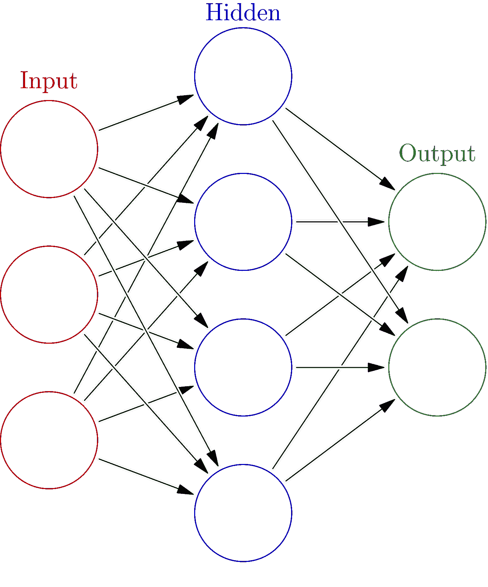
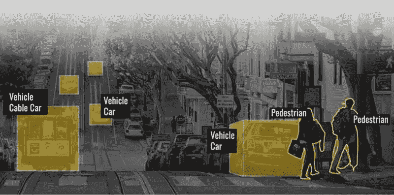
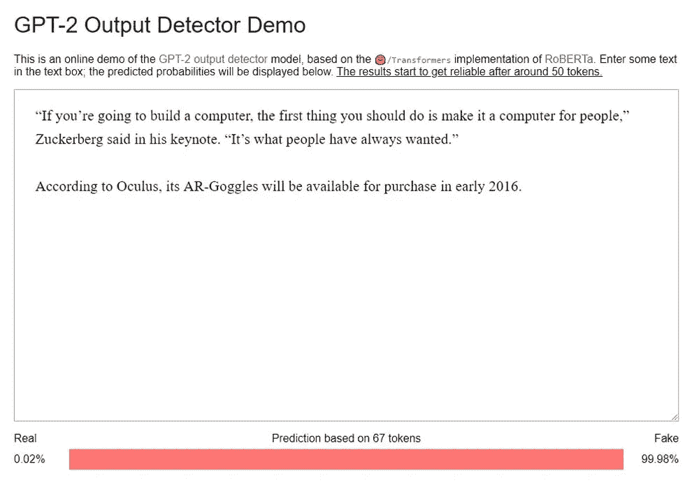
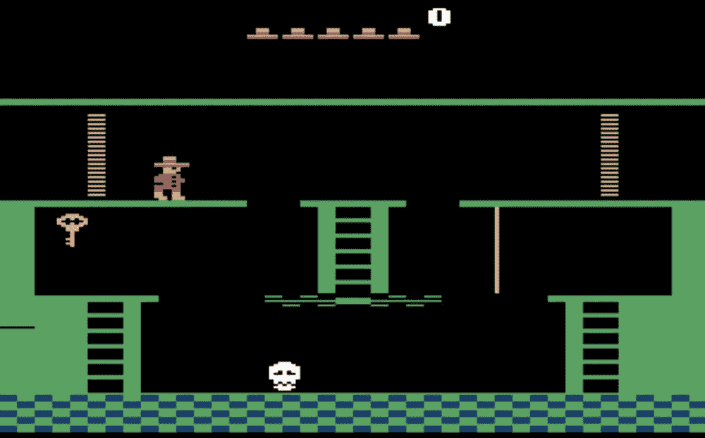

# 人工智能:人工智能术语简单解释

> 原文：<https://towardsdatascience.com/artificial-intelligence-ai-terms-simply-explained-745c4734dc6c?source=collection_archive---------18----------------------->

## 什么是人工智能？机器学习是什么意思？甘一家怎么样了？在这里你可以找到常用技术术语的清晰定义。

在 [Unsplash](https://unsplash.com?utm_source=medium&utm_medium=referral) 上由 [Hitesh Choudhary](https://unsplash.com/@hiteshchoudhary?utm_source=medium&utm_medium=referral) 拍摄的照片

如果你考虑计算机的未来，你不能回避人工智能。而谁想到计算机的过去，其实都不是——思维机器的梦想在古希腊人身上就已经可以找到了。

但传奇的时代似乎已经结束:人工智能如今无处不在。但是我们今天称之为人工智能的是什么呢？它是如何工作的？

# 人工智能

人工智能的创始人之一约翰·麦卡锡将人工智能描述为“生产智能机器的科学和技术”，即研究人员和工程师的活动领域。

今天，这个术语主要指这些智能机器:人工智能代表**行为智能的计算机系统**。

智能在这里的意思是:它们解决通常需要智能的任务，如理解和表达语言、图像识别、决策或翻译。

# 弱/紧 AI

与人类不同，人工智能通常只学习和完成一项高级任务。这样的 AI 因此被称为弱 AI 或窄 AI。在他们的专业上，他们现在经常比人类优越。现在所有的 AI 系统都是弱 AI。

# 一般/强人工智能

具有类似人类智能、能够将其思维应用于许多不同任务的人工智能尚不存在。但这是人工智能研究的主要目标。这样的 AI 被称为通用人工智能。通常，但由于其哲学渊源，术语**强**或**真人工智能不太清楚。**

# 超级人工智能

如果通用人工智能发展到各方面都超过人类的程度，一个人工超级智能就产生了。对于许多人工智能警告者来说，KSI 的出现——被称为**奇点**——标志着人类可能的终结。另一方面，一些人工智能专家希望超级人工智能能够解决人类的大问题，如气候变化、贫困和疾病。

# 如何创造人工智能

创造人工智能有不同的方法。基本上，可以区分两种不同的方法:

所谓的**“好的，老式的 AI”**(go fai)确定 AI 研究一直到 80 年代末，争取强 AI。想法是:人类思维由包含我们对世界的知识的单个术语的逻辑组合组成。

[SHR dlu](http://hci.stanford.edu/winograd/shrdlu/)

[*SHRDLU*](http://hci.stanford.edu/winograd/shrdlu/) *是最早尝试理解自然语言的 AI 程序之一。1968 年至 1970 年间创造的人工智能可以移动几何物体，并在需要时提供有关它们的信息。*

根据这一想法，所谓的专家系统出现了，它们将关于世界的简单信息打包成符号类别，并以逻辑结论对它们进行操作。

GOFAI 无法满足 AI 的高期望——第一次 AI 寒冬爆发。科研经费取消，项目取消。例如，今天，这种人工智能被用于过程自动化。

# 机器学习

AI 研究目前最喜欢的是**机器学习**，尤其是**深度学习**。

机器学习创造了使用数据来学习如何执行任务的计算机系统。与开发人员以编程代码的形式逐行指定指令不同，该软件在第一次触发后独立更新其代码，并为获得更好的结果进行优化。

该研究学科目前最受欢迎的是所谓的深度学习:具有多层神经网络的机器学习，可以越来越准确地识别数据中的模式，从而学习人类的偏好，识别物体或理解语言。

机器学习驱动了大量当前的 AI 服务。不管是谷歌、网飞还是脸书:学习算法做推荐，改进搜索引擎，让语音助手给出答案。

# (人工)神经网络

人工神经网络的灵感来自人类大脑的一个基本图像:一种算法创建了不同层的连接神经元或节点，它们相互交换信息。神经网络的数学起源于 1943 年。

在最简单的情况下，该架构由输入层、中间隐藏层(隐藏层)和输出层组成。输入信号被中间神经元最初随机生成的值修改，并被传递到输出层。

一个简单的人工神经网络。一个圆圈对应一个人工神经元，一个箭头表示一个神经元的输出与另一个神经元的输入的连接。图片:[有色神经网络](https://commons.wikimedia.org/wiki/File:Colored_neural_network.svg)， [CC BY-SA 3.0](https://creativecommons.org/licenses/by-sa/3.0/legalcode) 。

现在可以将输出与输入进行比较——预测是否正确？基于该结果，中间神经元的值被修改，并且用新的输入重复该过程。经过多次重复，预测变得越来越精确。

简而言之:神经网络是自我优化的算法。

> 如果你想深入了解，推荐这部[优秀的英文视频系列](https://www.3blue1brown.com/neural-networks)。

# 深度学习

深度学习(Deep learning)或称深度学习，是具有不止一个隐层(hidden layer)的神经网络的机器学习。

这些复杂的神经网络最迟在 2012 年开始了他们的凯旋游行，当时这样一个网络赢得了 ImageNet 图像分析竞赛。

深度神经网络的每一层都可以分析自己的图像信息:边界、纹理和图案，直到对象。图片:[蒸馏](https://distill.pub/2017/feature-visualization/)

深度学习是近年来人工智能热潮的原因，特别是在图像识别、自动驾驶或 deepfakes 方面。

深度学习的突破是由越来越快的处理器和专用人工智能芯片(如谷歌的 TPU)以及用于训练机器的海量数据实现的。

# 生成对抗网络

GANs 由**两个相互促进的神经网络**(代理)组成。两者都用共同的数据集进行训练，比如照片。

然后，一个代理创建类似于数据记录的内容，另一个代理将其与原始数据记录进行比较。如果它识别出它是伪造的，它会迫使伪造者改进它的内容——直到它看起来像是属于原始的训练数据记录。

*在 4.5 年的时间里，甘-基人已经变得更擅长生成人类肖像。*

经过足够的重复，一个大师级的伪造者就诞生了:GANs 创造出看似真实的人、深刻的赝品、街道或假模型。他们作曲、播放音乐、创作昂贵的艺术品，将复古游戏变成高清版本。自 2014 年推出以来，它们一直在稳步改善。

# 训练，训练，还有更多训练

训练是人工智能的一部分，就像数学公式中的占位符一样。但是你如何学习和训练完全取决于人工智能。我提出一些在人工智能训练中使用的学习方法。

# 监督学习

通过**监督学习**，人工智能在训练数据准备就绪的情况下受到监控。一个例子:如果一个[人工智能应该识别照片中的物体](https://mixed.de/google-lens-bildanalyse-ki-erkennt-laut-google-ueber-eine-milliarde-objekte/)，所有的猫、汽车、树等等。训练前的[照片](https://mixed.de/google-lens-bildanalyse-ki-erkennt-laut-google-ueber-eine-milliarde-objekte/)上都有标注。

[https://www.samasource.com](https://www.samasource.com/blog)

这个**标记过程**(“**标记**”)非常耗时，但这是成功的监督训练的基础——多亏了密集的人类准备工作，AI 知道它应该寻找哪些模式。

监督学习是大多数目前广泛使用的人工智能的背后，例如自动驾驶、人脸识别或在线搜索。标签通常是由低工资工人制作的，近年来它已经成为一个全球性的行业。

# 无监督学习

无监督学习是 AI 研究的希望。与监督学习相反，数据不是以复杂的方式准备的:AI 接收大量没有标签的数据**并独立搜索数据中的模式。**

该方法有两个优点:第一，准备充分、广泛的数据集很少。其次，人工智能可以揭示数据中仍然对人们隐藏的相关性。

用 AI 研究员 [Yann LeCun，](https://syncedreview.com/2019/02/22/yann-lecun-cake-analogy-2-0/)的话说就是:“如果智能是一块蛋糕，那么这块蛋糕的大部分是无监督学习，蛋糕上的糖衣是监督学习，樱桃是强化学习。”

OpenAI 强大的文本 AI GPT-2 通过自我监督学习成为可能:通过人工智能生成文本的进展也带来了发现虚假文本的新工具。

与此同时，术语**自我监督学习也**传播开来。根据不同的观点，这是无监督学习的特殊变体或同义词。LeCun 已经宣布，从现在开始他将只谈论自我监督学习，而不是无监督学习。

自我监督学习通常会保留部分训练数据，人工智能必须预测这些数据，例如句子中的下一个单词。这迫使他们学习关于数据的重要细节，比如语义表示。

例如，自我监督学习被用于人工智能扩展，并在过去 1.5 年中实现了语言人工智能的巨大进步。OpenAI 使用强大的 GPT-2 算法的学习方法。

# 强化学习

鼓励学习依靠**胡萝卜加大棒**:每当人工智能成功完成任务，它就会得到奖励。如果她错过了她的目标，她要么什么也得不到，要么受到惩罚。

*OpenAI 教 AI 玩捉迷藏，强化学习。*

通过这种**试错法**，人工智能通过从初学者到专业人员的尝试，在许多领域得到了发展，例如在围棋和象棋、Dota 2、星际争霸 2 或扑克中。所有最近的成功都依赖于所谓的深度强化学习，即强化和深度学习的结合。

# 迁移学习

迁移学习是指将从人工智能学到的技能应用于一个新的但相关的问题的训练方法。一个例子是谷歌的图像识别 AI Inception，研究人员用它来检测肺癌。

从长远来看，转移学习人工智能可以**远离孤岛人才**到更大的灵活性。因此，对迁移学习的研究是对普通人工智能的一个重要贡献。

# 模仿学习

模仿学习使用**演示作为人工智能的培训材料**。例如，在视频游戏中，这可以是人类玩家在游戏中奋力拼搏的记录，也可以是机器人通过观察人类动作进行学习的记录。

ai 已经很久不能玩遍雅达利经典《蒙特苏马斯复仇》了。与此同时，人工智能已经通过模仿基于人类游戏策略的学习做到了这一点。

与授权学习相比，模仿学习的一个优势是更大的灵活性:在某些环境下，回报很难定义或实现。纯粹的试错法不会推进人工智能。这就是人类演示有所帮助的地方，人工智能可以从中学习方法。

# 少数镜头学习

在人工智能成功识别数据模式之前，通常需要无数的例子。所谓的一次性和少量学习方法有助于人工智能，类似于人们如何**仅通过**几个例子或者甚至**仅通过一个例子**来学习新的能力。

*英伟达的 AI 可以跳舞，可以转移面部表情，可以生成街拍。全才只需要几个例子，比如一个新闻主播的几张照片。视频:英伟达*

实际上，人工智能无需大量训练就能学习新任务。例如，三星的研究人员仅用几个例子就成功地交换了人的面部。一个以色列研究小组更进一步，开发了一种无需人脸训练的实时 deepfakes 方法。