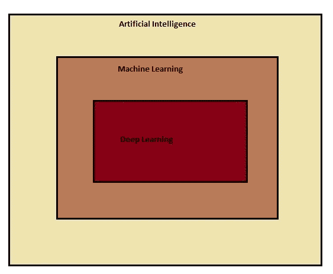
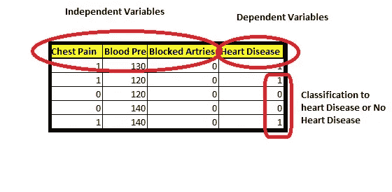
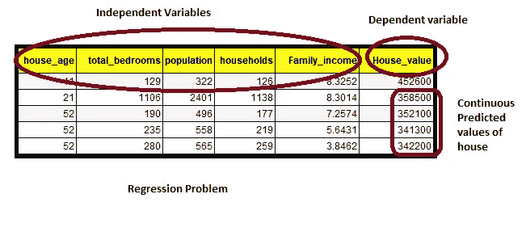
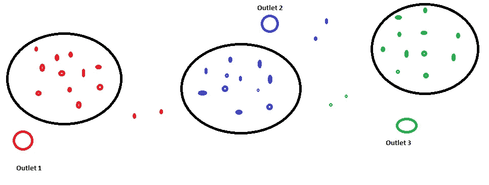
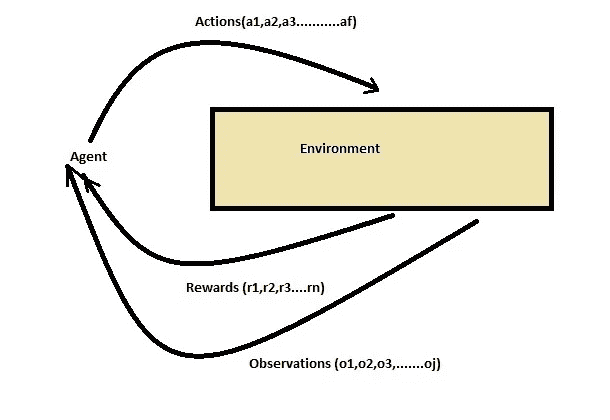
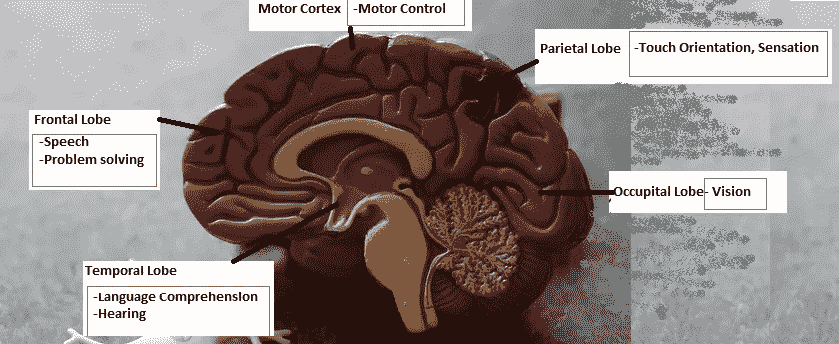
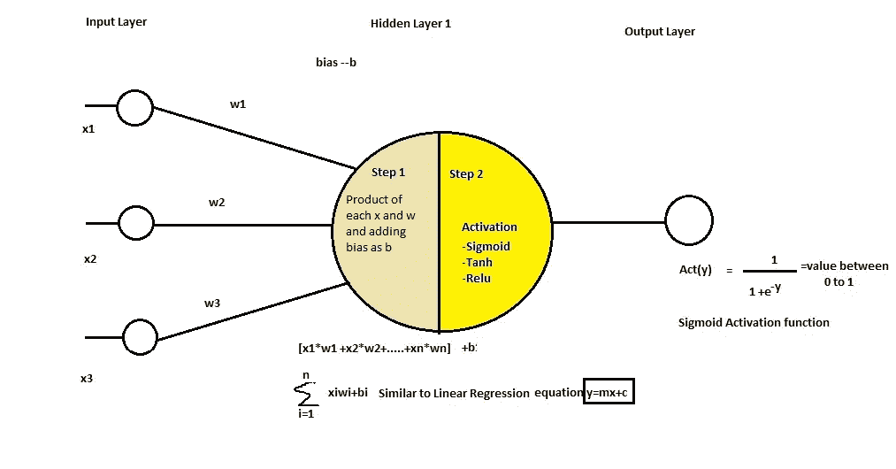

# 人工智能

> 原文：<https://towardsdatascience.com/artificial-intelligence-all-you-need-to-know-in-layman-terms-58c328f5acf7?source=collection_archive---------66----------------------->

## 用外行人的话来说，你需要知道的就是

作为人类，我们可能经常想知道人类的智能是否可以复制，机器是否可以像我们一样工作。

虽然这仍然是一个遥远的梦想，但我们并不遥远。在《通往人工智能之路》中，让我们概述一下它的真正含义以及数据科学如何帮助我们实现它。

AI Vs ML Vs DL 图片作者

人工智能(Artificial Intelligence):这是一门重要的科学，在当今的日常活动中确实有所帮助。任何机器学习或深度学习算法的最终目标都是实现人工智能。

人工智能是指机器的智能，它们可以像做决定、建议行动、解决问题和获取重要信息一样智能。

从自动驾驶汽车到手机中的 Siri，再到网飞推荐，一切都由人工智能驱动。

**B)机器学习**:机器学习是人工智能的一个子集，其主要目的是从作为输入的数据中学习，并预测连续值或将数据集分类到某个类别中。

这些问题分别称为回归问题和分类问题。

**机器学习**有 3 种类型:

**1)受监督的:**在受监督的学习中，我们标记了数据，因为我们有从中训练的具有预测值的数据。

有两种类型的监督学习:

***分类***

在这种监督学习中，一组独立的数据用输出类标记。

按作者对数据图像进行分类

在上面的例子中，你可以看到像胸痛、动脉阻塞和血压这样的独立特征可以确定一个人是否患有心脏病，这就是分类数据。

当一个模型在这种数据上被训练时，它可以被用来预测心脏病的类别或没有。

用于分类的算法的例子是逻辑、支持向量分类器、决策树分类器等等。

***回归***

在这种监督学习中，用输出连续预测值来标记一组独立数据。

回归问题图片作者

在上面的例子中，房龄、卧室总数、人口、家庭、家庭收入是决定房屋价值的独立特征，并且尽管可以对数据进行训练，但是该模型可以用于预测各种房屋的房价。

用于分类的算法的例子有线性、支持向量回归、决策树回归等等。

**2)无监督:**在这种学习中，没有带标签的数据，即不存在输出标签，我们需要确定给定数据之间的关系。像这样的问题大多通过聚类或分组来解决，即数据被分组以形成彼此相关的聚类。

***分组或聚类***

一个非常有用的例子是任何行业中的客户细分，其中公司试图根据其收入、关系状态、年龄和其他因素将其客户分类为其产品的未来客户。

另一个例子是房子更喜欢附近有名的食品连锁店。

无监督学习中的聚类，按作者分类的图像

离房屋最近的分支将是优选的，并且可以基于位置和离该分支的距离来聚集房屋。

**3)**强化学习

也称为半监督学习。这是一种在环境中发生的学习，通过采取一些行动，如果行动是正确的，就给予一些奖励，如果不正确，就向系统发送一些观察结果以从中学习，系统的整个想法是通过采取在每次迭代中学习到的和更好的行动来专注于越来越多的奖励。

作者的强化图像

强化学习的例子可以是机器人或人工智能应用驱动的汽车。通过反馈或观察进行学习，模型得到改进。

有两种强化学习

***积极:*** 在这种类型的学习中，给予奖励的行为得到改进和加强，每次都会产生奖励，从而使绩效最大化。

***否定:*** 在这种类型的学习中，观察结果为否定的行为会被避免或停止，每次都会提高绩效。

**C)深度学习**

深度学习现象是在人工智能必须深度到实际上可以像神经网络一样模仿人脑的时候发展起来的。

机器学习可以学习非常复杂的问题，就像人类通过在环境中反复看到或听到并分析事物来学习一样，这可以被称为深度学习。

人脑有多种功能，如下图所示:

人脑功能图像[来源](https://unsplash.com/photos/IHfOpAzzjHM)

对于每个功能和零件，人工智能程序正在开发中，如:

**枕叶** -用于视觉识别的卷积神经网络(CNN)或深度剩余学习(ResNet)

**颞叶**-用于语音识别的递归神经网络(RNN)或深度神经网络(DNN)，代表用于对话理解的学习(RL)。文本分析和 NLP(自然语言处理)目前正在扩展领域。

**运动皮层** -机器人学

一个**简单的神经网络**是一套算法，试图通过一个非常类似人脑运作方式的过程来识别一组数据中的关系。

它基本上指的是大脑的神经元，以及在给定的情况下它们如何行动。

单层神经网络来源:作者

上图有一个输入层，它类似于给定的一组数据或神经元必须发挥作用的情况。

隐含层有神经元，其内部工作可以分两步进行。

步骤 1)分析输入 x 并赋予它们权重 w。它将每个输入乘以权重并添加偏差 b。

Y =∑ xiwi +b，这非常类似于求解线性方程 y=mx+c

步骤 2)激活神经元-该功能确定神经元是否必须被激活以响应给定的情况。它可以使用任何函数，如 Sigmoid，Tanh，Relu。

它的值将在 0 到 1 之间。

值越接近 0 意味着神经元必须是不活跃的，越接近 1 意味着它必须是活跃的。

我将在我的下一篇博客中更详细地讨论神经网络中隐藏层的内部功能。

感谢阅读！

*原载于 2020 年 10 月 19 日*[*https://www.numpyninja.com*](https://www.numpyninja.com/post/artificial-intelligence-all-you-need-to-know-in-layman-terms)*。*