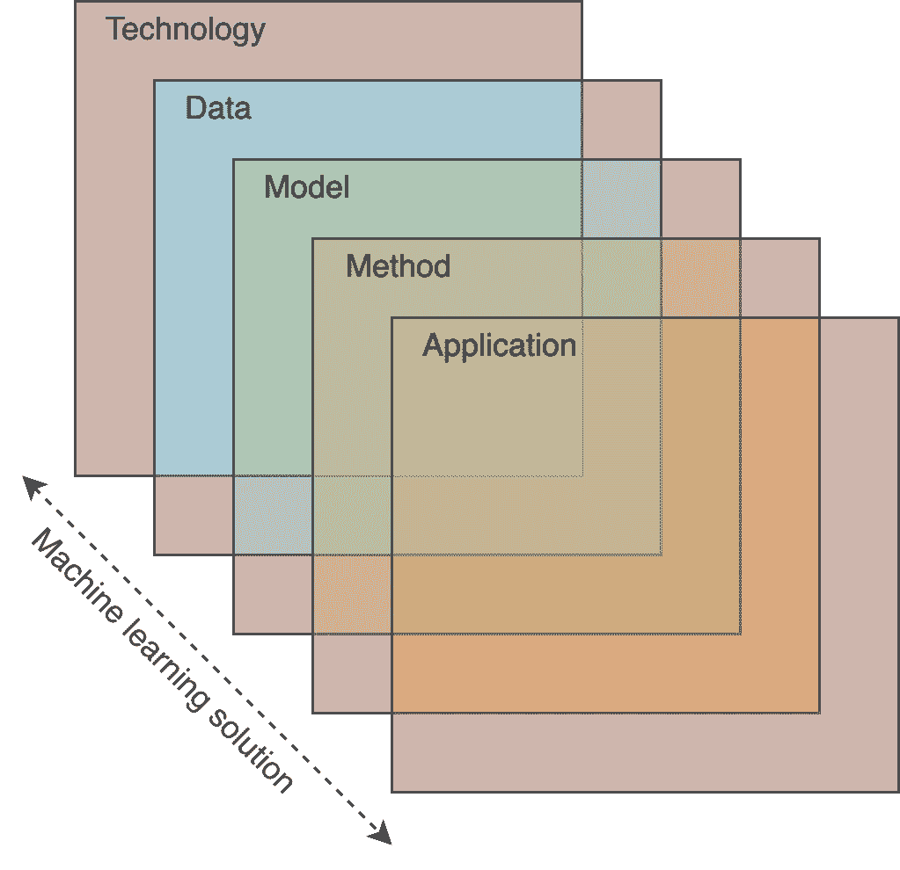
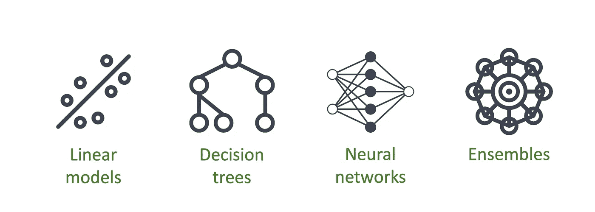
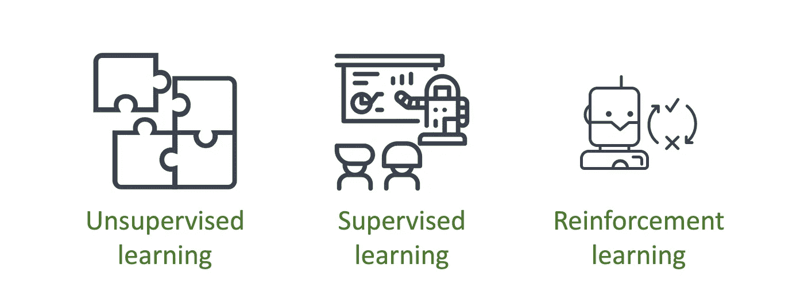
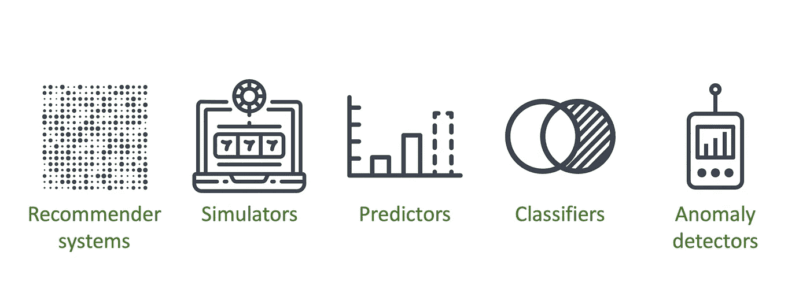

# 人工智能

> 原文：<https://towardsdatascience.com/artificial-intelligence-d1e45efc99b4?source=collection_archive---------65----------------------->

## 简明的概念介绍

在 [Unsplash](https://unsplash.com/s/photos/fractal?utm_source=unsplash&utm_medium=referral&utm_content=creditCopyText) 上由[托马斯 M](https://unsplash.com/@tfrm2003?utm_source=unsplash&utm_medium=referral&utm_content=creditCopyText) 拍摄的照片。

要谈人工智能，首先要对智能有一个合理的定义。在他最近的论文《 [*关于智力的衡量》*](https://arxiv.org/abs/1911.01547) *》中 Chollet 描述了主导文献的两种不同的智力定义:*

*   **智力是特定任务技能的集合**:强调实现目标的能力。
*   **作为一般学习能力的智力**:强调一般性和适应性。

无论采用哪种定义，智力在许多自然系统中都是一种属性。生命形式以各种方式呈现智能，描述和解释这一现象的挑战性任务是所谓认知科学的核心。除此之外，自 1956 年的创立大会以来，人类建造智能机器的长期努力一直被贴上人工智能(AI)的标签。从一开始，关于如何制造智能人工系统的主要想法就围绕着两种方法:

*   **向专家学习**:专注于将知识提炼为规则集或其他显式表示的方法，并将这些描述加载到机器中。通常把这个传统上的方法称为符号 AI。
*   **从数据中学习**:通过例子来关注教学机器。允许计算机直接从数据中学习的核心思想由命名这种范式的总括术语来表达:[机器学习](https://en.wikipedia.org/wiki/Machine_learning)。

由于技术上的挑战和在符号方面的有限成功，许多这样的方法被废弃不用，导致这种范式通常被称为优秀的老式人工智能(GOFAI)。此外，在过去几十年中，计算能力和数据的可用性不断增长，这将机器学习推向了人工智能研究的前沿。如果今天有人在谈论 AI，那很可能是在谈论机器学习。

重要的是要注意到，当机器学习作为一个研究领域出现时，“从数据中学习”的方法已经是另一个学科的主题:统计学。多年来，统计和机器学习之间的这种重叠已经引起了一些争论，Breiman 的论文'[*Statistical modeling:the two culture*](https://projecteuclid.org/euclid.ss/1009213726)*'是开始讨论这个问题的一个很好的参考*。简而言之，论点如下:

*   **统计**:通过假设一个随机模型并估计其参数来对数据建模。拟合优度测试和残差检验评估模型质量。
*   **机器学习**:通过假设模型复杂且未知来对数据进行建模。它对保留数据集的预测能力评估模型的质量，例如交叉验证。

由于这两种传统提出的各种解决方案在技术上的细微差别，很难将每种技术归类为属于一种或另一种方法。也许更有用的是承认这两种“文化”是一个谱系中的两个对立的极端，其中每种传统提出的工具都处于以推理为中心的方法和以预测为中心的方法之间的连续体中。

现在，记住这个背景，让我们继续机器学习解决方案的复杂性。即使我们将关于人工智能的讨论集中在机器学习上，要涉猎围绕该领域的丰富术语仍然不是一件容易的事情。当谈到这样一个系统时，我发现将每个机器学习解决方案想象成由五个有点独立的抽象层组成是很有用的。

# 机器学习解决方案的五个层次

机器学习解决方案的五个重叠抽象层。

## 技术

每个解决方案都依赖于计算基础设施。

*   **存储**:取决于数据集大小、数据类型、所需延迟等。
*   **计算**:取决于所需的处理单元，如 CPU 和 GPU，以及处理是集中式还是分布式。
*   **开发**:依赖于团队专业知识、工具集成熟度等。

此外，像任何其他计算系统一样，对每个主题的决策都必须考虑其他问题，如预算限制、可伸缩性和可维护性。这一层有许多选项，从将数据存储在硬盘中并在本地 Jupyter 笔记本上处理的小型系统，到多云环境中的大规模管道。

## 数据

表格、文本或图像构成了最常见的数据集。

这似乎是显而易见的，但值得一提的是:所有机器学习解决方案都依赖于数据。知道哪种类型的数据将被系统处理，将允许系统设计者作出关于适当建模技术的明智决定，以实现期望的结果。当谈到数据时，关注点通常是:

*   **数据类型**:信息呈现给系统的方式。它可能在桌子上，文本上，图像上，声音上，等等。每种数据类型都有独特的挑战，需要特定的工具和方法来应对。
*   **数据集大小**:可用数据的数量会影响技术和模型层的决策。一些模型依赖于大量数据，而另一些则适用于小数据集。
*   **相关性**:了解数据集中的每个数据点是否独立，或者是否存在某种相关性结构，例如时间序列和图表，在选择适当的建模技术时会产生很大的影响。

## 模型

在选择模型时有许多选择。

选择模型就是选择函数空间或假设集，我们将在其中搜索最佳拟合模型。之前各层的特征已经在某些方面影响了这一决策，例如，深度学习模型可能需要更大的数据集和专门的硬件来训练。此外，这一层还有一个特别的核心特征:

*   **可解释性**:解释预测或模型中变量关系的需求是模型选择的一个关键方面。

对线性模型上的系数或决策树上的阈值的直接评估可以给我们关于数据集上变量之间关系的信息。其他模型，如随机森林或深度神经网络，很难直接评估，可能需要额外的[工具](https://github.com/slundberg/shap)来深入了解其内部工作。

## 方法

机器学习的三种主要方法。

方法，或学习方法，是我们定义如何使用数据来寻找一个好的模型。这在很大程度上取决于我们正在解决的问题的类型:聚类、分类、回归、控制等。大多数关于机器学习这方面的论述倾向于强调三种主要方法:

*   **无监督学习**:我们没有特定的目标变量。处理分割和关联任务的常用方法。
*   **监督学习**:我们有一个特定的目标变量。处理分类和回归问题的常用方法。
*   **强化学习**:智能体学习如何通过与环境的直接交互来实现目标。

虽然学习方法表征看起来可能只是一种形式，但它是机器学习系统设计的一个关键定义。针对给定问题的适当学习方法的规范将指导所有模型训练设置，包括其评估方法、学习度量和预期结果。

值得记住的是，这三种方法并不是唯一可用的方法。尽管如此，一旦你清楚地了解了它们的特点，就会更容易理解其他的学习变体，比如[半监督学习](https://en.wikipedia.org/wiki/Semi-supervised_learning)、[在线学习](https://en.wikipedia.org/wiki/Online_machine_learning)、[对抗学习](https://en.wikipedia.org/wiki/Adversarial_machine_learning)等。

## 应用

每个应用程序解决一个特定的问题。

应用程序是为解决问题而设计的，与底层技术无关。应用程序是机器学习系统设计的最终产品。如今依赖机器学习的一些[众所周知的应用](https://deepindex.org/)是推荐系统、贷款分类器、异常检测器和自动驾驶汽车。

重要的是要记住，实际上，任何这些应用程序都可以使用硬编码的规则来构建。记住这一点可以作为对在给定解决方案中使用机器学习技术的真正必要性的现实检查。软件工程本身就有很多复杂性，依靠机器学习来构建应用程序增加了另一层复杂性，这可能导致技术债务积压的显著增加。

# 结论

人工智能是一个复杂的研究领域，对于处理这项技术的人来说，拥有一个清晰的整体图景非常有用，如果不是必需的话。下次你面对一个使用机器学习构建的应用程序时，尝试解开它的每个抽象层，以理解设计师在每个抽象层中的选择，这可能会提高你对它的理解。最后，我希望这个概念性的介绍可以作为一个简单的地图，帮助你在这个广阔的领域导航。对于那些想知道如何更深入地挖掘这个主题的人，当有疑问时，我总是会回到罗素和诺维格的优秀著作《人工智能:一种现代方法》。’。