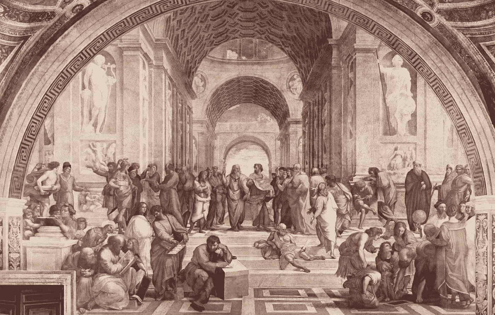
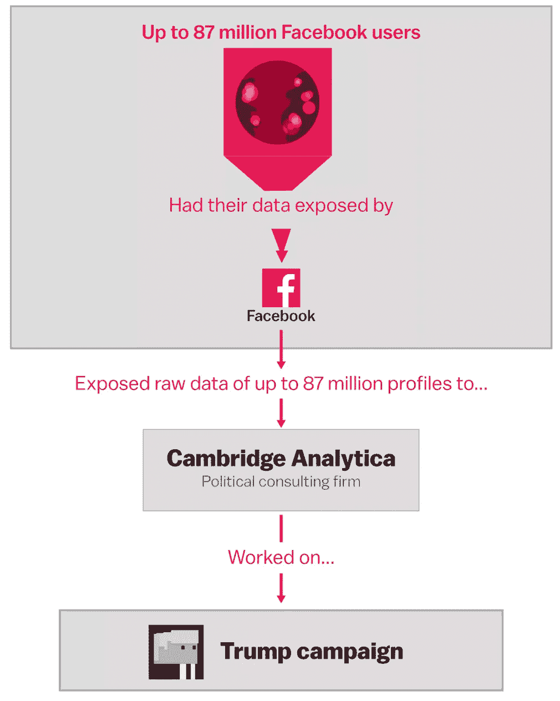

# 人工智能伦理和十诫？

> 原文：<https://towardsdatascience.com/artificial-intelligence-ethics-and-the-10-commandments-620a1d90c29e?source=collection_archive---------46----------------------->

## 将人工智能伦理问题映射到 10 条戒律

[雅典学校](https://en.wikipedia.org/wiki/The_School_of_Athens)

这篇文章探讨了我们可以将不同背景的想法汇集在一起的方法，以帮助减少我们在当今行业中看到的偏见。所以，在这篇文章的最后，我将把一些人工智能伦理问题映射到 10 条戒律上，看看它们是如何叠加的。

> 也许在认识到我们的偏见并向机器传授我们的共同价值观的过程中，我们可能会比人工智能提高更多。我们可以提高自己。— [IBM](https://www.research.ibm.com/5-in-5/ai-and-bias/)

一段时间以来，我一直在思考如何将圣经中的十诫作为构建人工智能原则伦理框架的良好起点。我对此不予理会，因为我觉得这有点奇怪。然而，在看到 2020 年 2 月微软、IBM 和罗马天主教会关于人工智能伦理的的[**不寻常的合作关系**](https://www.bbc.com/news/technology-51673296) **后，我意识到我的想法终究不是那么疯狂！**

首先，让我们定义什么是伦理:

> 伦理被定义为一套管理一个人的行为或一项活动的进行的道德原则。— [维基百科](https://en.wikipedia.org/wiki/Ethics)

今天，伦理在社会和文化中发挥着重要作用。它有助于确定在一个社会中什么是合法的或非法的，并且通常作为一个国家的法律和秩序的基础。例如，当探索西方的伦理和道德时，你会发现宗教，尤其是基督教，在提供指导方针方面发挥了重要作用。尽管西方文明已经在很大程度上摆脱了它的宗教根源，但是基督教在西方文明形成中的重要性是不可否认的。然而，本文的重点不在这方面。

## 为什么是 AI 伦理？

人工智能可以提供非凡的好处，但它也可能产生负面影响，除非它得到负责任的构建和使用。深度学习(机器学习的子集)模型在不同的应用中有时会超过[人类水平的性能](https://www.mathworks.com/discovery/deep-learning.html)。

[来源](https://www.sciencealert.com/artificial-intelligence-officially-just-beat-the-world-s-1-go-player)

以 **AlphaGo** 为例，一个由 DeepMind 开发、后来被谷歌收购的深度学习计算机程序，学习如何下[围棋](https://en.wikipedia.org/wiki/Go_(game))。AlphaGo 没有像典型的程序一样将围棋规则输入其中，相反，开发人员让 AlphaGo 通过与业余和职业选手进行数千场比赛来学习游戏，使用一种 [**奖励系统**](https://en.wikipedia.org/wiki/Reinforcement_learning) **，**有点像人类的学习方式。这最终导致它成为第一个打败职业围棋手的计算机程序。这非常令人印象深刻，因为围棋被认为是人工智能领域最具挑战性的经典游戏，因为它在单个游戏中有大量的变化，从而使游戏中的策略非常复杂！

显而易见，这种技术可以用来为更大的利益建立人类知识的独创性。然而，为了防止臭名昭著的反乌托邦所谓的 [**技术奇点**](https://en.m.wikipedia.org/wiki/Technological_singularity)**——**运行[人工通用智能](https://www.youtube.com/watch?v=BByWWTdNI0Y)的计算机程序自我改进成为超越人类智能的超级智能代理——我们必须建立一个道德框架来防止不必要和不可预见的情况。

一、机器人电影— [来源](https://www.sondakika.com/fotogaleri/will-smith-severleri-buraya-alalim-iste-mutlaka/)

## 十诫是什么？

> 十诫，也被称为十诫，是一套关于伦理和崇拜的圣经原则，在亚伯拉罕宗教中扮演着重要的角色——维基百科

下面你会发现写出来的十诫，我们现在将尝试把它们映射到我们今天面临的一些常见的人工智能伦理问题。(A *还要注意，这不是一个详尽的列表，而是一个在你的系统中构建人工智能道德原则的建议。显然，任何 AI 系统的伦理都将在很大程度上取决于其创造者的伦理*。

[来源](https://lifehopeandtruth.com/bible/10-commandments/the-ten-commandments/10-commandments-list/)

# 弥合差距

1.  **在我之前，你不会有其他神(又名:责任/可追溯性):**今天，人工智能系统面临的一个问题是责任和透明度。任何特定的人工智能系统都需要对一个权威——系统的创造者——负责，这个权威可以是个人也可以是组织。 例如，亚马逊开发了一个 [**招聘算法**](https://www.reuters.com/article/us-amazon-com-jobs-automation-insight/amazon-scraps-secret-ai-recruiting-tool-that-showed-bias-against-women-idUSKCN1MK08G) ，意在从世界各地招聘顶尖候选人。该程序有效，但算法已经学会将女性排除在候选人名单之外，因此对简历中有“女性”的人进行降分。由于问责制，亚马逊承担了责任，并最终在推广到更大的群体之前取消了该计划。这里还有一个场景，如果一辆自动驾驶汽车(AV)撞死了人，谁应该负责？人工智能驱动的 AV 还是系统的创造者？我喜欢工程和物理科学研究委员会(EPSRC)在“机器人的 5 条伦理规则”中的表述。第五条规则规定“*应该可以找出谁对任何机器人负责*(在我们的例子中是 AI)”。人工智能不应该在法律上对它的决定负责，它是一个工具，创造者应该承担唯一的责任。因此，对创造者的可追溯性是可信的人工智能系统的关键。
2.  **你不应该制造偶像**:这和第一点非常相似，所以我们现在可以跳过这一点。
3.  **不可妄称耶和华你神的名(又名:滥用权力)**:这个命令是为了防止滥用/误用神的名。所以本质上，人工智能系统不应该滥用它被赋予的权力。这可能是一个很难检测的问题，因为大多数人工智能系统并不为它们的决定提供解释。 我来举个例子。ToTok 是一款已经被下载了数百万次的阿联酋消息应用程序，据称被政府用来跟踪该应用程序用户的对话、位置和其他数据。虽然 ToTok 在他们的[网站](https://totok.ai/download-android)上否认了这一点，但希望这不是真的。然而，人工智能(机构)不应该滥用或利用用户赋予他们的权力和信任。

Google Playstore 上的 ToTok 警告消息([来源](https://totok.ai/download-android))

4.**记住安息日并保持它的神圣(又名:维护/可靠性)**:安息日的目的在信奉亚伯拉罕宗教的人们中一直有争论，但它通常被认为是[休息日](https://en.wikipedia.org/wiki/Biblical_Sabbath)。有鉴于此，重要的是抽出时间定期维护一个人工智能系统，以确保它没有偏见、错误、故障和安全漏洞，并确保最佳性能。该系统应在其整个生命周期内进行持续测试，以保证其可靠性。

5 **。尊重你的父母(又名:如果需要，允许人类干预并强制遵守人类法律)**:人工智能系统应该遵守现有法律&基本权利&自由，包括隐私。这些系统还应该允许人类在需要时接管它们。回到自动驾驶汽车(AV)的例子，在一个事故不可避免的场景中，一组科学家设计了一种将决定权交给人类乘客的方法，并将其称为“[伦理旋钮](https://link.springer.com/article/10.1007/s10506-017-9211-z)”。这允许乘客决定在这种情况下 AV 应该做出什么样的道德选择。像这样的灵活性可以为您的系统增加另一层信任。

6 **。你不应该杀人(又名:AI 不应该杀人)**:这是一条被全世界普遍一致认为在道德上是错误的规则，除了自卫的情况。一般来说，如果[人类有生存](https://www.un.org/en/universal-declaration-human-rights/index.html)的权利，那么道德会说，“你不能杀死一个人”。可以说，让一台机器在没有人类干预的情况下判断是否要夺走一个人的生命，对社会是有害的。例如，在 2007 年，一个军用火炮机器人[发生故障，开火，造成 9 名士兵死亡，14 人受伤](https://www.wired.com/2007/10/robot-cannon-ki/)。这是一个悲剧，但值得庆幸的是，许多国家和组织已经签署了一项承诺，禁止在致命的自主武器中使用人工智能。取人性命的决定在任何情况下都不应该交给人工智能系统，这个决定应该总是委托给人类。

7 **。你不应该通奸(又名:忠诚/安全):**这是一个有趣的地图，但随着人工智能系统变得越来越强大，确保它们(特别是像武装无人机或甚至州级能源管理系统这样的关键任务系统)不会落入坏人手中，然后被用于恶意目的是很重要的。 ***这意味着系统应具备强大的访问控制措施，以防止未经授权的访问。*** 网络安全已经并将继续在人工智能解决方案的可靠性中发挥关键作用，因此请确保从第一天起就将这种安全性构建到您的程序中。

8 **。不得窃取(又名:数据保护)**:再次引用[世界人权宣言](https://www.un.org/en/universal-declaration-human-rights/index.html)、 ***任何人的财产***’都不得被任意剥夺，这包括他/她的数据。因此，人工智能系统不应在未经用户明确同意的情况下窃取或欺骗性地收集用户数据。像 GDPR 这样的法规已经在这方面有所帮助。剑桥分析公司和脸书丑闻是脸书允许第三方开发者仅仅为了收集数据而设计应用程序的一个例子。开发者能够利用一个漏洞，不仅收集使用该应用的人的信息，而且在他们不知情的情况下收集他们所有朋友的信息。应该不惜一切代价避免这种做法。因此，我们将确保您的系统符合 GDPR 政策或您的系统将运行的任何地区的任何类似法规。

来源: [Vox](https://www.vox.com/policy-and-politics/2018/3/23/17151916/facebook-cambridge-analytica-trump-diagram)

9 **。你不应该对你的邻居做伪证(又名:真实性/欺骗例如:深度假证)**:深度假证[的缺点](https://artificialintelligence-news.com/2019/08/05/dont-believe-your-eyes-exploring-the-positives-and-negatives-of-deepfakes/)令人困扰。在 Deepfakes 中很难看到“好”的一面，但是在特效行业中，这是非常有益的。看看这个大卫·贝克汉姆说 9 种语言的视频，感谢 Deepfakes 合成的力量。

也就是说，确保人工智能不被用来通过提供真实的幻觉来剥削用户是至关重要的。你的人工智能应该为用户提供一种方式来了解系统所呈现的信息的真实性。

10.**你不应贪图(又名:失业和财富不平等)**:据[麦肯锡全球研究所报告](https://www.mckinsey.com/featured-insights/future-of-work/jobs-lost-jobs-gained-what-the-future-of-work-will-mean-for-jobs-skills-and-wages#)，到 2030 年，大约 8 亿人将因人工智能驱动的机器人而失业。这些数字令人担忧，距离 2030 年只有 10 年了！为此，这里可以考虑“T4”的概念，即每砍伐一棵树，就种植更多的树。本质上，人们应该考虑作为人工智能系统开发的结果而创造的创造性的新工作/技能。例如，机器学习工程师可以开始教放射科医生如何重新训练癌症检测 AI 程序。这将赋予放射科医生新的技能，并确保人工智能系统将只是一个增加他们工作的工具，而不是一个夺走工作的工具。

就是这样！我希望这些要点对你的下一个人工智能项目有所帮助和实用。

**其他资源:**

*   [阿联酋应用追踪用户](https://www.theguardian.com/world/2019/dec/23/totok-popular-chat-app-spying-tool-uae-government)
*   [埃隆·马斯克和摩尔联名上书禁止杀手机器人](https://www.businessinsider.com/stephen-hawking-elon-musk-sign-open-letter-to-ban-killer-robots-2015-7?r=DE&IR=T)
*   [艾萨克·阿西莫夫的机器人三定律](http://webhome.auburn.edu/~vestmon/robotics.html)
*   [十诫](https://www.biblegateway.com/passage/?search=Exodus+20&version=NIV)