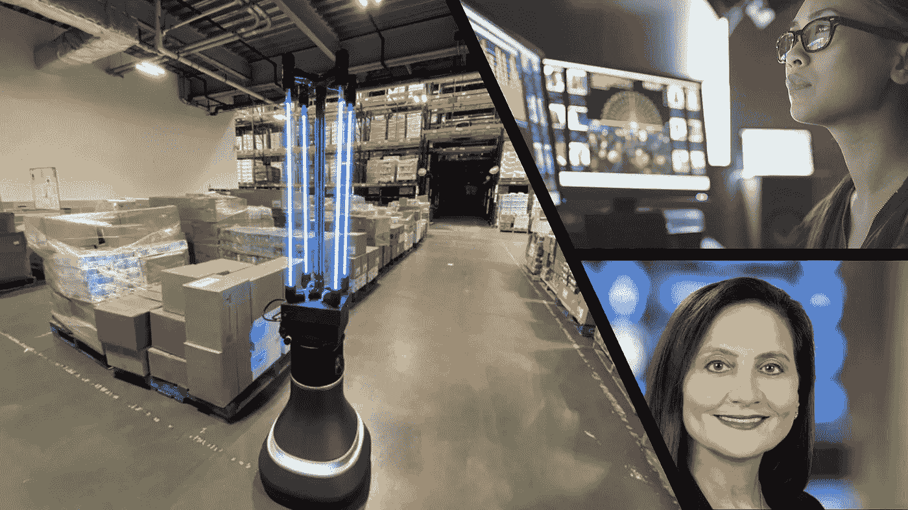
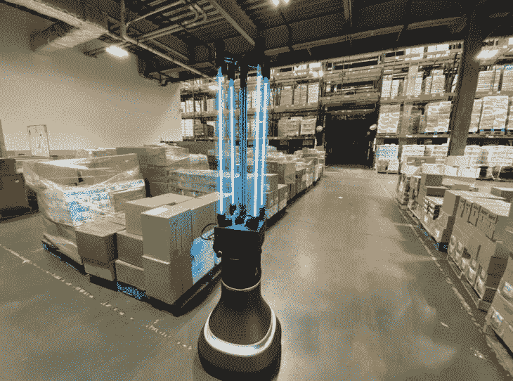

# 人工智能:世界各地的事件(7 月 4 日)

> 原文：<https://towardsdatascience.com/artificial-intelligence-events-around-the-world-jul-4-93ac52154dee?source=collection_archive---------50----------------------->

## 本周，我们已经看到一个受欢迎的图像数据集被下线，更多与数据相关的职位空缺，以及机器人在食物银行抗击新冠肺炎病毒的传播

在人工智能的世界里，每天都有很多事情发生。事件发生的频率使得跟上事件的发展相当具有挑战性。我读过一些标题和文章，把人工智能描绘成一幅不太正面的画面。

一个机器学习相关项目和研究中的管道和过程受到监控和监管的世界正在成为可能的现实。

## 本周报道的文章:

*   更多与数据相关的职位空缺，即使是在当前的疫情
*   由于种族和性别偏见，麻省理工学院撤销了数据集
*   数据科学角色的未来
*   负责给食物银行消毒的机器人。

包括文章的封面图片

# 未来的数据科学工作会是什么样子？5 职业趋势。[西雅图时报]

当前技术和人工智能的出现催生了对数据的不可满足的需求，因此，理解数据的个人需要确保人工智能系统正常运行。

《西雅图时报》的这篇文章探讨了围绕数据相关角色的趋势:数据科学家和数据分析师。

数据科学和分析是一个独特的工作角色，跨越各种行业和部门。凭借你的数据科学技能，你可以在医疗行业和石油行业工作，实际上你的职业发展和潜力是无限的。本文探讨了基于数据的角色的一个基本事实，即每个行业都需要理解数据的个人。

除了工业领域的趋势之外，这篇文章还提到了学术趋势。许多拥有技术技能的人很可能会回到大学，专攻与数据相关的高级学位。这句话非常正确，因为我在做了几年 Web 开发人员后，又回去获得了机器学习的硕士学位。我相信在未来的几年里会有更多的专业人士效仿。

本文包含的一个趋势是将数据素养规范化为每个专业人员的必备技能。这篇文章关注的是数据科学工作，但这一趋势适用于每一个现代工作角色；每个人只需要理解系统产生的数据。被视为正常的数据理解或读写水平并不复杂，但对数据的基本理解和解释对每个人来说都有很大帮助。

文章探讨并详述了更多的趋势；下面是原文的链接。

 [## 未来的数据科学工作会是什么样子？5 个职业趋势|由东北大学提供…

### 回想一下您上次登录流媒体服务或音乐订阅服务的时间。仪表板是否有…

www.seattletimes.com](https://www.seattletimes.com/sponsored/what-will-data-science-jobs-look-like-in-the-future-5-career-trends/) 

# 旅行者雇佣了 500 名技术专家来支持现代化工作。【华尔街日报】

在当前的全球气候下，对许多人来说，工作保障是最重要的议题。但看起来机器学习和软件开发角色可能不会受到当前失业浪潮的影响。

保险公司 Travelers 希望在一段时间内雇佣一批软件和机器学习专业人员。这一招聘热潮旨在帮助该公司实现数字化转型。

新员工将参与与机器学习领域相关的项目，如计算机视觉、自然处理、语音识别和数据科学。

更具体地说，该公司正在寻求开发一种可以从语音中进行情绪分析的系统，甚至可以从图像中检查财产损失的系统。

Travelers 总部位于纽约，因此对于该地区的机器学习从业者来说，这是一个进入人工智能领域或改变职业生涯的绝佳机会。

以下链接提供了更多信息:

 [## 旅行者雇佣 500 名技术专家支持现代化工作

### 旅行者 Cos。正在竞相填补 500 个技术岗位，包括许多人工智能相关的职位，由…

www.wsj.com](https://www.wsj.com/articles/travelers-hiring-500-tech-specialists-to-support-modernization-effort-11593600230?mod=djemAIPro&ns=prod/accounts-wsj) 

# 麻省理工学院道歉，永久下线了教导人工智能系统使用种族主义、厌恶女性的诽谤的庞大数据集。[登记册]

这篇文章的许多读者可能已经用公开可用的数据集训练了机器学习模型。你使用的数据集之一可能是广泛使用的“微小图像”，一个由麻省理工学院创建和发布的数据集。微小的图像数据集包含 8000 万张图像，这些图像都标有定义图像内容的描述。

原来数据集包含了一些相当不恰当的描述。麻省理工学院已经关闭了数据集，甚至发布了一份声明，可以在这里找到。

该数据集创建于 2006 年，主要通过使用互联网搜索引擎进行填充，对数据集的内容没有任何监督。由于数据集规模庞大，无法识别数据集中的所有图像，麻省理工学院已将其离线，该数据集无法再利用。

微小的图像数据集很受欢迎，我敢肯定许多计算机视觉系统会在数据集上进行训练，甚至可能在互联网上散布着副本。

当前的事件揭示了人工智能系统因其训练数据而产生的偏见，我相信未来我们可能会在几个机器学习项目和研究中看到更受监控和更严格的数据收集过程。

 [## 麻省理工学院道歉，永久下线教人工智能系统使用种族歧视的大量数据…

### 特别报道麻省理工学院已经使其被高度引用的数据集离线，该数据集训练人工智能系统来潜在地描述人…

www.theregister.com](https://www.theregister.com/2020/07/01/mit_dataset_removed/?mod=djemAIPro) 

# 麻省理工学院机器人开始为大波士顿食物银行消毒。[TechCrunch]

你如何在食物银行减缓新冠肺炎病毒的传播？你拿一个智能移动机器人，在它头上放四把光剑。

**图片来源:**艾丽莎·皮尔森——麻省理工学院 CSAIL

艾娃机器人公司与麻省理工学院的计算机科学和人工智能实验室(CSIL)合作，创建了一个机器人系统，可以对大波士顿食品银行(GBFB)内的表面进行消毒。机器人系统的另一个组成部分旨在根除新冠肺炎气溶胶。这个机器人看起来和听起来一样令人印象深刻。

该机器人可以在其环境中导航，由内部绘图系统引导，该系统包含待消毒区域的标记。

Techcrunch 提供了更多信息:

 [## 为了抗击新冠肺炎，麻省理工学院的机器人开始为大波斯顿食物银行消毒

### 麻省理工学院的计算机科学和人工智能实验室(CSAIL)已经将其研究项目之一投入工作，提供…

techcrunch.com](https://techcrunch.com/2020/06/29/in-effort-to-fight-covid-19-mit-robot-gets-to-work-disinfecting-the-greater-boston-food-bank/?mod=djemAIPro&guccounter=1) 

# 我希望这篇文章对你有用。

要联系我或找到更多类似本文的内容，请执行以下操作:

1.  订阅我的 [**YouTube 频道**](https://www.youtube.com/channel/UCNNYpuGCrihz_YsEpZjo8TA) 视频内容即将上线 [**这里**](https://www.youtube.com/channel/UCNNYpuGCrihz_YsEpZjo8TA)
2.  跟着我上 [**中**](https://medium.com/@richmond.alake)
3.  通过 [**LinkedIn**](https://www.linkedin.com/in/richmondalake/) 联系我