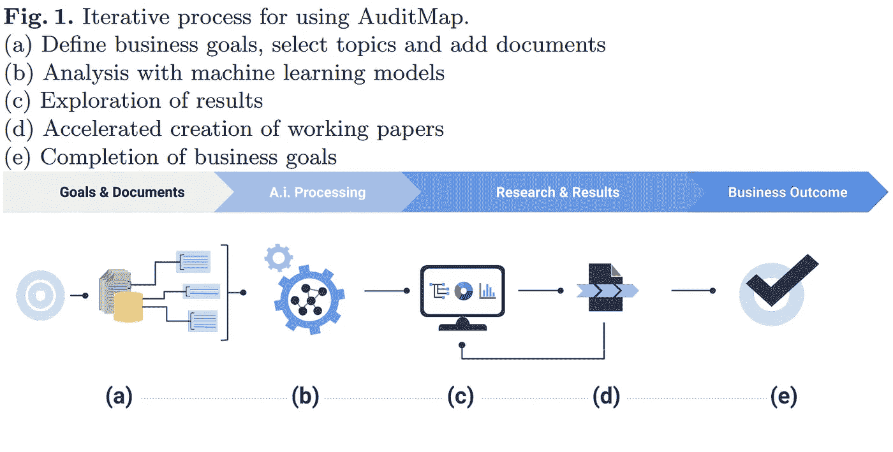
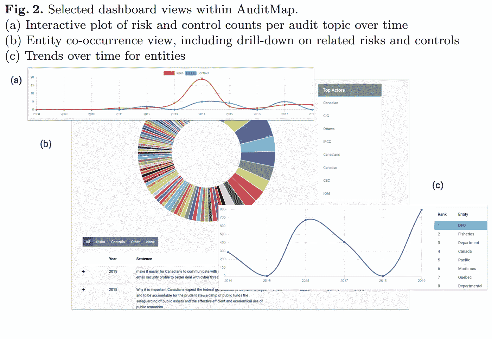

# 用于内部审计和风险管理的人工智能

> 原文：<https://towardsdatascience.com/artificial-intelligence-for-internal-audit-and-risk-management-94e509129d49?source=collection_archive---------11----------------------->

## 审计图。人工智能文本分析平台

## 将评估拖进现代

照片由[像素](https://pixabay.com/users/pexels-2286921/)通过[像素](https://pixabay.com/photos/books-college-cover-document-1845614/) (CC0)拍摄

**目录**
1。[摘要:为什么人工智能适用于内部审计和风险管理？](#0548)
2。[简介](#a46a)
3。[当代内部审计挑战](#aef5)
4。 [AuditMap.ai:审计增强的平台](#23ab)
5。[局限与前进的道路](#3fc1)
6。[参考文献](#2402)

## **1。摘要:为什么人工智能用于内部审计和风险管理？**

大型组织内的内部审计任务会因为大量的文档而变慢。缓慢的审核响应时间、基于抽样的审核计划以及对关键字搜索的依赖都表明需要自动化来加速内部审核任务。当相关差距或**风险没有及时向利益相关者披露时，审计质量也会受到影响**。这项工作概述了一个名为 [AuditMap.ai](http://AuditMap.ai) 的工作流自动化解决方案。该解决方案包含几个人工智能模型，可以读入数以千计的各种语言的审计报告，以持续识别和组织其中的相关文本。 [AuditMap.ai](http://auditmap.ai) 不是取代审计员，而是协助以人为中心的审计规划和执行过程。

## **2。简介**

**组织的内部审计职能**面临着交付结果以满足利益相关方的保证需求以及**保护组织免受新出现的威胁**的压力。考虑到组织中存在的大量报告，保持全局观点是困难的。这项工作概述了一个解决方案，它读取数千个审计报告，对报告中的相关文本进行分类和组织。

内部审计师提供了一道防线，防止可预防的错误和遗漏，这些错误和遗漏可能会降低质量，损害公司的声誉和可信度，错过机会，或导致直接的财务损失。内部审计的主要作用是发现低效率、不合规和防止损失。这些活动通过**基于风险的评估**和与董事会委员会沟通的方式进行，而财务审计则侧重于发现交易记录中的潜在重大问题，并不时进行纠正。换句话说，在财务审计中发现的损失已经发生，而内部审计的工作结果突出了合规、质量和其他方面的**差距**。为了确定这些差距，内部审计操作需要跟踪组织的计划所面临的每个风险领域的结果。这种跟踪需要上下文和快速的结果，而不是向审计委员会提交年度总结报告。

内部审计在公司结构中具有独特的保证地位。它在财务审计中有着历史渊源，并已发展到提供更大范围的保证。内部审计在实践中与财务审计有很大不同。而现代财务审计评估交易及其记录以支持财务报表的准确性(有时使用复式记账软件)；内部审计的**基于绩效的评估**旨在向审计委员会和高级管理层报告其组织的治理、流程、程序、风险、控制、案例报告等状况。此外，在上市公司以及医疗保健和金融等特定部门，法律要求进行内部审计活动和**风险披露**[【2】](#2402)。

## 3.当代内部审计挑战

内部报告已经进入大数据时代，这将导致整个企业的信息过载。由于大量的报告数据，一种**数据丰富信息贫乏**的情况正在审计领域蔓延[【3】](#2402)。这种情况的特点是，一个组织在假设许多指标保证质量的情况下跟踪这些指标，但遗漏了新出现的风险，因为手头的信息没有用任何被跟踪的指标来衡量。答案必然是将数据转化为可操作信息的更好技术。**技术是内部审计职能**[【4】](#2402)中效率和生产力的关键驱动力。引用 2017 年《内部审计专业实务国际标准》:“内部审计人员必须对关键信息技术风险和控制以及可用的基于技术的审计技术有足够的了解，以执行其分配的工作”[【5】](#2402)。正如 2019 年布里登报告[【6】](#2402)中所概述的那样，审计领域的格局也正在朝着加强审计师与客户分离的方向转变，这促使公司以更高的比率轮换其担保提供商。此外，该报告还指出，“人们似乎普遍认为，自动化现有数据相关的审计任务正在进行中，其扩展不可避免。”

照片由 [geralt (Gerd Altmann)](https://pixabay.com/users/geralt-9301/) 通过 [pixabay](https://pixabay.com/illustrations/large-data-keyboard-computer-895567/) (CC0)拍摄

内部报告的大量私人文本数据集已经压倒了审计师的传统角色。比如说。在高度管控的领域(例如，飞机制造业)拥有 100，000 名员工的组织在 10 年内可能会生成数百万份文档。将这些仔细记录的报告数据形成理论和评估计划非常耗时，然而这些评估的**结果可能对时间极其敏感**。管理层迫切需要知道周二的风险在哪里，但审计部门倾向于每季度和每年发布报告 [[7]](#2402) 。此外，风险管理面临越来越大的压力，需要向外寻找新出现的风险。除了快速交付的压力，报告中讨论的评估**通常基于样本，导致缺乏全面覆盖**。使用关键字选择要采样的报告是很常见的，这可能会导致遗漏陈述相似概念但没有使用指定关键字的关键文档。错过跨时间的报告之间的联系也是常见的，例如重复的风险、不断增加的控制和其他基于时间的现象。

除了在评估大型数据集时需要自动化之外，**人为因素**也要求额外的审计流程自动化。人类审计员承受着低估实质性弱点的压力[【8】](#2402)。将算法集成到分析过程中可以在一定程度上使审计人员免受这些压力。此外，人类聚集和理解大型数据集的能力有限。不幸的是，使用电子表格和文字处理程序作为基于团队的工作产品的引擎受到人类理解大量数据集的能力的限制。基于文本的工作产品和报告阻碍了治理度量的创建和计划活动的交付。从根本上来说，规划现代内部审计是**管理信息过载**。审查大型企业控制环境既昂贵又耗时。尽管报告大部分是数字化的，但对于任何人类团队来说，完整地阅读和理解报告仍然是一项艰巨的任务。在与感知的财务风险联系不那么紧密的审计领域，项目覆盖面往往会变薄。此外，主题之间不明显的联系可以忽略，因为低风险领域获得的审计资源较少。内部审计和风险管理职能部门发现自己高估了一些业务领域，而忽略了其他很少审计的领域。为了应对这些挑战，近年来，主要审计组织已经采取了重大的人工智能和数据分析采用计划[【9】](#2402)[【10】](#2402)[【11】](#2402)。对于大多数企业来说，获得核心治理计划的可量化概览的目标仍然遥不可及，因为人工智能技术尚未在审计公司中得到广泛采用。文献中提出了人工智能在审计流程中的一些应用，但很少被主要的审计公司应用[【12】](#2402)[【13】](#2402)。

财务审计学术文献中已经提出了[【14】](#2402)等预测模型，这项工作自然会导致审计工作流程中类似的预测和自动化创新。**人工智能正在进入内部审计和风险管理职能**，并将为公司治理转型带来新的机遇。

**公开披露**是**正确和及时识别风险至关重要的一个领域**，并且通常是法律强制要求的。在公共关系危机中，确定报告中的相关信息以便随后公开披露非常重要，而且具有时效性。这些信息通常不会在风险登记簿或质量管理系统中进行跟踪，因为所讨论的风险可能是新的或意想不到的。监管风险披露也可能是时间紧迫的，因为申报日期有时可能不灵活。公司文件中的风险披露增加了投资者的风险认知[【15】](#2402)，因此，或许不足为奇的是，公司文件中有用的风险披露很少。披露风险的法律要求是主观的，因此使用一般声明[【15】](#2402)[【16】](#2402)[【17】](#2402)并不难规避。然而，研究揭示了年度备案和 SEC 意见函[【18】](#2402)之间的关系，即如果(1)公司认为不披露可能导致 SEC 的调查结果，或(2)在 SEC 向公司发布 SEC 调查结果后，公司更有可能披露风险。鉴于季度和年度申报中风险披露的重要性，显然**非常需要一种能够及时检测风险的解决方案**来促进披露流程，尤其是在时间紧迫的情况下。更一般地说，评估质量管理的强弱是内审员必须具备的重要能力[【19】](#2402)[【20】](#2402)。

在 [AuditMap.ai](http://AuditMap.ai) 发布之前，机器学习已经应用于风险披露文件的各种应用，如年报分析评估相似性[【21】](#2402)、内部财务控制[【22】](#2402)、IT 安全[【23】](#2402)[【24】](#2402)。审计领域中机器学习的这些和类似应用代表了向**数字化转型和预测审计**的更大目标迈进的举措。相对于法律和会计等其他领域，内部审计在采用自然语言处理和机器学习方面的滞后可以解释为**制度惰性、缺乏培训数据集、顾问的报销模式、理解多语言文档的要求以及不同的报告标准**。这些阻碍这一领域发展的各种因素现在正在发生变化，这为利用机器学习实现审计自动化带来了重大机遇[【11】](#2402)。更详细地评估这些因素，专业服务公司的时薪结构可能会阻碍减少计费时数的创新。此外，对审计过程进行建模所需的数据也是严格保密的公司机密，因此标记的报告数据必须由主题专家精心收集和标记。报告中的文本数据类型在一个组织内的不同团队之间有很大的不同。国家风险等评估可以完全侧重于外部文件，而内部控制可以完全侧重于内部文件。阻碍人工智能在审计中采用的另一个因素是缺乏多种语言的数据，如英语、法语、德语和阿拉伯语。此外，与新闻报道和书籍等标准文本语料库相比，审计报告的特征是不同寻常的。具体来说，审计报告表达了比典型文档更高的语言水平，因为它们需要抽象复杂的问题模式。此外，还有许多内部审计标准和风险管理框架，它们的采用因地区而异。例如，ISO 31000 病毒在欧洲更流行，而 COSO 病毒在美国更流行。其他重要的框架包括 COBIT[【27】](#2402)、TSC[【28】](#2402)、NIST[【29】](#2402)。内部审计员使用这些框架来确保最佳实践，并且这些**框架是高质量审计再现性的关键**。

审计质量、速度和效率竞争是人工智能采用的驱动因素。例如，及时发现差距或风险并将其披露给利益相关者的需要与公司业绩密切相关。采用还将涉及审计人员教育和监测人工智能性能的科学测试制度。利用公开披露的公司报告，应该在今后的工作中以多种语言制定这种业绩评估的基准。应该用这些基准测试每个模型的召回率、精确度和偏差。

关于**即将到来的变化**的性质，在保险行业或学术文献中没有广泛的共识。一些评估得出结论，人工智能创新将取代审计师[【10】](#fb2e)。这可能是不正确的。相反，未来很可能是审计师与人工智能合作，就像他们采用电子表格和文字处理来通过数字自动化增强工作流程一样。这项工作的立场是**通过应用许多专门模型**的增量改进将为审计团队提供自动化的初始推动。从长远来看，用技术广泛取代审计是不太可能的。

审计人员可能会保持现有的流程，同时更频繁地执行这些流程，并通过人工智能解决方案实现更高的覆盖率。**未来是辅助性的，而不是规定性的**。在这种观点下，人工智能不会取代审计师的决策、判断或评估面试。相反，创新加速了与纠正和预防措施相关的计划和执行活动。关键成果应该是提高审计质量和速度，朝着**持续审计**的方向发展。

## 4.AuditMap.ai:审计增强平台

AuditMap.ai 是审计团队的解决方案，可以帮助他们理解大量的文档。风险经理也可以用它来发现新出现的风险。该解决方案使审计团队能够快速检索和处理上传文档中的文本。使用 AuditMap.ai 执行的活动是内部审计职能的战略和战术规划活动的一部分。该解决方案自动执行活动，以支持内部审计师的信息密集型任务。下面的图 1 总结了审计人员利用该解决方案的过程。

审计团队通过定义业务目标开始使用该平台。然后，他们开始定义组织的首选审计主题。团队还通过手动上传或提取、转换和加载(ETL)任务将他们的审计报告和其他文档上传到平台(图 1 (a))。该平台包括一个数据集概念，用于跨客户端管理文档集。在摄取期间，平台内的机器学习模型根据定义的审计主题对上传的文档进行分类。模型架构基于最先进的机器学习模型[【30】](#2402)[【31】](#2402)[【32】](#2402)，在专有训练数据集上训练。其他机器学习模型执行语言实体的自动提取，提取实体关系，语句相似性的跨文档分析，以及关键语句的分类-那些指示企业风险、缓解措施以及那些指示关键见解的语句。执行进一步的处理，以便评估文档片段与普遍接受的企业风险管理框架的相关性(图 1 (b))。通过系统的用户门户提供从文档摄取和自动化分析中得出的结果，这是一个 web 应用程序，允许审计人员通过基于角色的访问控制对内容执行技术辅助审查。当探索机器学习过程的结果时，审计人员可以观察程序或主题内随时间推移的趋势，并可以标记特定的风险或控制，以进行更深入的分析和段落或文档级上下文，或进行重新标记(图 1 (c))。最后，该解决方案包括一个交互式工作台，用于快速创建和导出工作底稿。

该平台为审计员和风险经理提供了一种简化的、自我导向的能力，通过减少在文档数据集中识别信息和将其添加到工作工件之间的步骤，来手动包括研究期间发现的信息(图 1 (d))。向涉众交付工作项目是通过导出来完成的(图 1 (e))。

图 2 显示了审计人员使用的一些用户界面组件。该平台能够缩小关注范围。例如，在一个包含 35 份报告中的 17，571 个句子的选定数据集中，只有 418 个句子被突出显示为指示风险。有些不是“真正的”句子，因为它们可能是句子片段，如目录条目或表格数据。考虑到这一点，AuditMap 能够减少 97.6%的待分析数据。确定了 9800 个实体。以下是在公开报告中发现的表明存在风险的有趣句子的一些例子(圆括号中的数字表示分类置信度):

*   **(98.4%)** “我们注意到，没有记录优先化工作以确定首先进行哪些工作危害分析，我们也没有看到根据最近的事件或操作风险优先进行工作危害分析的证据。”[【33】](#2402)
*   **(52.8%)** “鉴于在过去的审计中发现了类似的结果，我们建议[实体]要求所有区域 SCC 使用打印机代码从共享网络打印机中检索打印的[身份数据]信函。”[【34】](#2402)
*   **(99.3%)** “根据所进行的访谈，发现【部门 1】过去使用备份来选择性地修复三个应用系统的问题；但是，它不必执行完整的数据库恢复。”[【35】](#2402)
*   **(86.1%)** “与安装和审批管理有关的档案，不包括与审计统一文件相关的附件”[【36】](#2402)
*   **(73.7%)**“EFK 的寄生虫在德国的传播”[【37】](#2402)

## 5.局限性和前进的道路

审计和风险管理行业采用 AuditMap.ai 人工智能可能会改变结果。这很可能会改变保险本身的性质。然而，在审计中采用人工智能必须伴随着对技术局限性的定量评估，以及强调技术局限性的员工培训。如果人工智能失败，盲目采用可能会导致声誉风险。因此，谨慎的做法是意识到机器学习在保证方面的功能限制，并评估这些限制的可接受性。

AuditMap.ai 中应用的两种类型的机器学习是用于分类的监督学习和用于上下文表示和相似性评估的非监督学习。应用于专有客户数据的监督学习模型不太可能具有完美的召回率和精确度。这意味着**一些风险和控制会被算法遗漏，一些语句会被错误分类**。对于审计人员来说，理解这些限制，并在工作流中轻松地获得能够动态地重新标记语句的纠正功能是至关重要的。AuditMap.ai 确实有这个能力。

**监督学习**也容易受到来自数据的**学习偏差的影响，如果它在任意客户端数据上被训练，因此 AuditMap.ai 模型在部署到审计员的环境之前，在解决这个问题的专有主数据集上被训练。尽管偏见可能会在初始部署中得到解决，但这是一个需要**衡量和评估的问题**，尤其是在进行模型再培训时。**

**无监督学习**同样受限于它所接触到的环境。当面对全新的环境时，技术容易出错。在某些情况下，监督模型依赖于使用非监督学习创建的表示，而更改非监督模型的训练分布可能会破坏监督模型的预测能力。例如，AuditMap.ai 中的模型经过训练，可以对审计报告中的文本进行分类，并且从未接触过电子邮件或短信。将此类数据输入模型会导致相似性理解不佳，因为它们的写作风格和词汇与训练数据完全不同。因此，**在部署之前考虑技术采用中包含的数据范围**非常重要。

**缺失信息**是另一个需要考虑的关键问题。审计报告和工作底稿数据集之外的信息经常存在，这些信息只能通过进入现实世界并通过内部审计过程收集数据来获得。假设从内部审计数据集中提取的信息(例如，关系图、风险、缓解措施、见解)完全涵盖了组织的状态，这肯定是错误的。审计人员需要保持好奇，并就遗漏的风险、遗漏的程序提出尖锐的问题，并大体了解内部审计在内部评估方面的薄弱环节。AuditMap.ai 有助于审计团队识别信息可能缺失的地方。然而，填补空白的主动权仍然属于内部审计团队。能够访问大图视图使审计团队能够考虑按主题或按时间可能遗漏了什么信息。

审计员必须问**采用这种不完善的近似技术是否比现状**更好，是否**提高了审计的质量和速度**。当审计人员考虑采用 AuditMap.ai 技术时，他们应该定量地、冷静地评估该技术的采用情况。我们正在举办一系列网络研讨会，与审计和风险管理专业人员交流，展示平台，并安排试点。

[网站将很快发布一个链接](https://auditmap.ai/webinar/)指向即将到来的网络研讨会。如果你喜欢这篇文章，那么看看我过去在 AI for internal audit 上的一些文章吧，“[Audit map . AI 如何改善内部审计](https://medium.com/toronto-machine-learning/how-auditmap-ai-improves-internal-audit-87bb7ceccebf)”和“[用人工智能改善内部审计](/better-internal-audits-with-artificial-intelligence-53b6a2ec7878)”我也要感谢渥太华大学的米奥德拉·博利奇教授对这项工作的反馈。有没有注意到 [AuditMap.ai](http://AuditMap.ai) 有了新网站？嘿，通过网站加入时事通讯！

下次见！

丹尼尔

## 6.参考

**[1]** United States Public Law: Quality System Regulation. 21 CFR part 820 (1996)
**[2]** United States Public Law: Prospectus summary, risk factors, and ratio of earnings to fixed charges (Item 503). 17 CFR part 229.503 (2011)
**[3]** Goodwin, S.: Data rich, information poor (drip) syndrome: is there a treatment? Radiology management 18(3) (1996) 45–49
**[4]** Eulerich, M., Masli, A.: The use of technology based audit techniques in the internal audit function–is there an improvement in efficiency and effectiveness? Available at SSRN 3444119 (2019)
**[5]** Institute of Internal Auditors: International standards for the professional practice of internal auditing. Institute of Internal Auditors (2017)
**[6]** Sir Donald Brydon, CBE: Assess, Assure And Inform: Improving Audit Quality And Effectiveness; Report Of The Independent Review Into The Quality And Effectiveness Of Audit. The Crown (2019) Accessed on Jan 2, 2020 [https://assets.publishing.service.gov.uk/government/uploads/system/uploads/attachment%5Fdata/file/852960/brydon-review-final-report.pdf](https://assets.publishing.service.gov.uk/government/uploads/system/uploads/attachment%5Fdata/file/852960/brydon-review-final-report.pdf).
**[7]** Chan, D.Y., Vasarhelyi, M.A.: Innovation and practice of continuous auditing. International Journal of Accounting Information Systems 12(2) (2011) 152–160
**[8]** Cowle, E., Rowe, S.P.: Don’t make me look bad: How the audit market penalizes auditors for doing their job. (September 2019) Available at SSRN: [https://ssrn.com/abstract=3228321](https://ssrn.com/abstract=3228321).
**[9]** Kokina, J., Davenport, T.H.: The emergence of artificial intelligence: How automation is changing auditing. Journal of Emerging Technologies in Accounting 14(1)(2017) 115–122
**[10]** Alina, C.M., Cerasela, S.E., Gabriela, G., et al.: Internal audit role in artificial intelligence. Ovidius University Annals, Economic Sciences Series 18(1) (2018) 441–445
**[11]** Sun, T., Vasarhelyi, M.A., et al.: Embracing textual data analytics in auditing with deep learning. (2018) Universidad de Huelva.
**[12]** Sun, T., Vasarhelyi, M.A.: Deep learning and the future of auditing: How an evolving technology could transform analysis and improve judgment. CPA Journal 87(6) (2017)
**[13]** Appelbaum, D.A., Kogan, A., Vasarhelyi, M.A.: Analytical procedures in external auditing: A comprehensive literature survey and framework for external audit analytics. Journal of Accounting Literature 40 (2018) 83–101
**[14]** Kuenkaikaew, S., Vasarhelyi, M.A.: The predictive audit framework. The International Journal of Digital Accounting Research 13(19) (2013) 37–71
**[15]** Kravet, T., Muslu, V.: Textual risk disclosures and investors’ risk perceptions. Review of Accounting Studies 18(4) (2013) 1088–1122
**[16]** Schrand, C.M., Elliott, J.A.: Risk and financial reporting: A summary of the discussion at the 1997 aaa/fasb conference. Accounting Horizons 12(3) (1998) 271
**[17]** Jorgensen, B.N., Kirschenheiter, M.T.: Discretionary risk disclosures. The Accounting Review 78(2) (2003) 449–469
**[18]** Brown, S.V., Tian, X., Wu Tucker, J.: The spillover effect of sec comment letters on qualitative corporate disclosure: Evidence from the risk factor disclosure. Contemporary Accounting Research 35(2) (2018) 622–656
**[19]** Bhattacharya, U., Rahut, A., De, S.: Audit maturity model. Computer Science Information Technology 4 (12 2013)
**[20]** Thabit, T.: Determining the effectiveness of internal controls in enterprise risk management based on COSO recommendations. In: International Conference on Accounting, Business Economics and Politics. (2019)
**[21]** Fan, J., Cohen, K., Shekhtman, L.M., Liu, S., Meng, J., Louzoun, Y., Havlin, S.: A combined network and machine learning approaches for product market forecasting. arXiv preprint arXiv:1811.10273 (2018)
**[22]** Boskou, G., Kirkos, E., Spathis, C.: Assessing internal audit with text mining. Journal of Information & Knowledge Management 17(02) (2018) 1850020
**[23]** Boxwala, A.A., Kim, J., Grillo, J.M., Ohno-Machado, L.: Using statistical and machine learning to help institutions detect suspicious access to electronic health records. Journal of the American Medical Informatics Association 18(4) (2011) 498–505
**[24]** Endler, D.: Intrusion detection. applying machine learning to Solaris audit data. In: Proceedings 14th Annual Computer Security Applications Conference (Cat. №98EX217), IEEE (1998) 268–279
**[25]** International Organization for Standardization: Risk management — Guidelines. Standard, ISO 31000:2018, Geneva, CH (February 2018)
**[26]** Committee of Sponsoring Organizations of the Treadway Commission and others: Internal Control — Integrated Framework. (2013)
**[27]** Information Systems Audit and Control Association: Cobit 5: Implementation. ISACA (2012)
**[28]** American Institute of Certified Public Accountants: Trust Services Criteria. AICPA (2017) Accessed on Jan 15, 2020https://[www.aicpa.org/content/dam/aicpa/interestareas/frc/assuranceadvisoryservices/downloadabledocuments/trust-services-criteria.pdf](http://www.aicpa.org/content/dam/aicpa/interestareas/frc/assuranceadvisoryservices/downloadabledocuments/trust-services-criteria.pdf).
**[29]** Bowen, P., Hash, J., Wilson, M.: Information security handbook: a guide for managers. In: NIST Special Publication 800–100, National Institute of Standards and Technology. (2007)
**[30]** Devlin, J., Chang, M., Lee, K., Toutanova, K.: BERT: pre-training of deep bidirectional transformers for language understanding. CoRR abs/1810.04805 (2018)
**[31]** Yang, Z., Dai, Z., Yang, Y., Carbonell, J., Salakhutdinov, R., Le, Q.V.: Xlnet: Generalized autoregressive pretraining for language understanding. arXiv preprint arXiv:1906.08237 (2019)
**[32]** Kim, Y.: Convolutional neural networks for sentence classification. arXiv preprint arXiv:1408.5882 (2014)
**[33]** Internal Audit and Program Evaluation Directorate: Audit of Occupational Health and Safety, March 2019\. Technical report, Canada Border Services Agency, Ottawa, CA (March 2019)
**[34]** Internal Audit Services Branch: Audit of the Management and Delivery of the Social Insurance Number Program, December 2015\. Technical report, Employment and Social Development Canada, Ottawa, CA (December 2015)
**[35]** Internal Audit Services Branch: Audit of the Departmental Information System and Technology Controls — Phase 1– Application Controls, 2014\. Technical report, Employment and Social Development Canada, Ottawa, CA (November 2014)
**[36]** Audit interne: Achats et marchés, Novembre 2018 Rapport d’audit interne. Technical report, Bureau du surintendant des institutions financieres, Ottawa, CA (November 2018)
**[37]** Swiss Federal Audit Office: Prüfung der IT-Plattform NOVA für den öffentlichen Verkehr — Schweizerische Bundesbahnen. Technical report, Switzerland, Bern, Switzerland (July 2019)