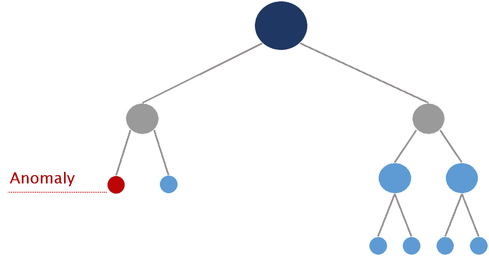

# 降低银行业风险的人工智能:当前用途

> 原文：<https://towardsdatascience.com/artificial-intelligence-for-risk-reduction-in-banking-current-uses-799445a4a152?source=collection_archive---------14----------------------->

## 银行如何使用人工智能进行欺诈检测、合规性和网络安全

克里斯汀·罗伊在 [Unsplash](https://unsplash.com/s/photos/anti-money-laundering?utm_source=unsplash&utm_medium=referral&utm_content=creditCopyText) 上的照片

银行正在大力投资人工智能以降低风险，即欺诈检测、合规性和网络安全。用机器学习的术语来说，这些是**异常检测**技术的应用。

我们将了解三家银行——汇丰银行、摩根大通银行和丹斯克银行如何使用人工智能来打击欺诈、遵守反洗钱(AML)法规以及抵御网络威胁。然后，我们看看用于异常检测的特定机器学习技术。最后，我们考虑负责实施基于人工智能的风险降低工具的银行高管的关键要点。

# 银行优先考虑降低风险

聊天机器人和面向客户的人工智能项目受到了大量的炒作。银行经常发布新闻稿，宣传他们最新最棒的聊天机器人。然而，新闻稿是品牌建设练习，并不一定表明实际的人工智能投资或开发。

银行在异常检测方面至关重要的人工智能投资很少受到关注，即使这是资金的去向。[研究表明](https://emerj.com/emerj-team-updates/emerj-launched-ai-in-banking-report/)在银行领域人工智能供应商筹集的 30 亿美元中，超过 50%是由专门从事欺诈、网络安全、合规性和风险管理的供应商筹集的。

作者图片

优先考虑人工智能降低风险有三个原因。首先，未能发现欺诈和洗钱成本高昂。2019 年，美国和英国监管机构对反洗钱违规行为开出了总计 81.4 亿美元的罚单。

其次，良好的风险检测系统让银行客户放心，并提高银行的声誉。例如，客户更有可能选择那些在防范网络攻击方面有良好记录的银行。

第三，通过使用人工智能来自动化某些合规性、欺诈检测和网络安全活动，银行将实现显著的时间和成本节约。如今，这需要大量的人工努力，而当前基于规则的异常检测系统还有许多不足之处(稍后将详细介绍)。

虽然银行拥有内部数据科学团队，并且不总是公布内部人工智能计划，但他们也与第三方人工智能供应商合作，开发量身定制的异常检测解决方案。我们可以看看银行如何与这些供应商合作，以了解他们如何使用人工智能来对抗风险。

# 合规:汇丰利用人工智能打击洗钱

汇丰银行与机器学习软件公司 Ayasdi 合作，开发人工智能反洗钱(AML)解决方案。

该软件由汇丰内部 IT 团队和 Ayasdi 的数据科学家合作开发，用于识别历史数据中可能存在洗钱的模式。当输入当前支付数据时，它可以识别欺诈模式，并提醒员工阻止这些支付。该软件分析支付的来源和目的地以及其他因素，以识别与正常行为的偏差。

汇丰的 IT 人员帮助 Ayasdi 了解内部反洗钱数据，汇丰的建模团队帮助 Ayasdi 创建准确的客户行为模型。这种合作意味着汇丰可以轻松地使用 Ayasdi 的模型并将其集成到自己的业务实践中，从而克服插入供应商产品的常见挑战。

传统的基于规则的检测系统通常会产生误报警报，将无辜的交易错误地标记为可疑交易。对工作人员来说，调查这些警报非常耗时。Ayasdi 声称他们的软件已经帮助汇丰[减少了 20%的假阳性调查](https://www.ayasdi.com/blog/financial-services/anti-moneylaunderinghsbc/)，而没有放松合规标准。

# 网络安全:摩根大通开发网络钓鱼和恶意软件预警系统

摩根大通的研究人员利用深度学习和其他人工智能技术[开发了](https://www.bankinfosecurity.com/jpmorgan-chase-develops-early-warning-system-a-12855)一个检测恶意软件、特洛伊木马和网络钓鱼活动的“早期预警”系统。据称，这种检测系统在网络钓鱼邮件实际发送给员工之前很久就能识别出可疑行为。

用于异常检测的深度学习技术可以学习什么构成了正常行为，并识别以前没有见过的异常活动。研究人员表示，通常情况下，一个特洛伊木马入侵公司网络需要大约 101 天的时间。早期检测系统将在实际攻击发生之前提供充分的警告。

据报道，该系统可以识别通过[域生成算法](https://en.wikipedia.org/wiki/Domain_generation_algorithm)创建的大规模网络钓鱼活动。它还可以通过将恶意 URL 与已知的可疑流量模式、混乱的 URL 和网络钓鱼活动特有的拼写错误进行比较，来识别恶意 URL。

虽然该系统是使用钓鱼网址的公共数据集进行训练的，但研究人员在[的一篇论文](https://arxiv.org/pdf/1907.08276.pdf)中声称，其深度学习算法使其能够比传统安全系统更好地检测威胁。它还可以提醒银行的网络安全团队，因为黑客准备向员工发送带有恶意软件的钓鱼电子邮件来感染网络。

# 欺诈检测:丹斯克银行使用深度学习来打击欺诈

丹麦最大的银行 Danske Bank 与分析公司 Teradata 合作，实施了一个基于深度学习的欺诈检测系统。

根据 Teradata 的[案例研究](https://www.teradata.com/Resources/Case-Studies/Danske-Bank-Fight-Fraud-With-Deep-Learning-and-AI)，Danske 银行旧的基于规则的欺诈检测系统只有 40%的成功率，并且每天产生 1200 个误报。此外，该银行调查的 99.5%的可疑案件证明不是欺诈。这些没有结果的调查需要时间和资源，而这些时间和资源本可以用来打击实际的欺诈行为。

Danske Bank 与 Teradata 合作实施了一个深度学习工具，该工具将欺诈检测能力提高了 50%，将误报率降低了 60%。该系统还自动化了许多决策，同时将一些案例发送给人类分析师进行进一步检查。

案例研究提到，该系统使用“冠军/挑战者”方法来检测异常。每个模型(挑战者)学习指示欺诈的交易特征，并被馈送客户位置等附加数据以提高准确性。当一个模型击败其他模型时，它就成为“冠军”，并帮助训练其他模型。这种改善过程可能会重复。

# 用于异常检测的机器学习技术

银行及其首选供应商很少宣传其异常检测工具背后的特定机器学习技术。然而，我们可以推断他们使用了以下技术的组合。这并不意味着详尽的分析，而是一些相关技术的概述。

## 分类

分类算法将记录标记为属于特定类别。例如，当应用于异常检测时，算法可以将交易标记为“可疑”或“合法”。

[**【KNN】**](/machine-learning-basics-with-the-k-nearest-neighbors-algorithm-6a6e71d01761)是一种流行的异常检测分类技术。它使用数据集中最相似的记录(即最近邻)对交易记录进行分类。如果新交易与先前已知的可疑交易具有相同的特征，则该交易也被归类为可疑交易。相似性由图表上两个数据点之间的距离决定，相似的记录靠得更近。

KNN 易于实现，并且在给定大量训练数据的情况下表现良好。然而，随着更多数据的引入，它变得更慢且计算量更大。这个缺点使得单独使用 KNN 进行快速分类不切实际，例如需要在成千上万的输入交易中检测欺诈。因此，银行可能会将 KNN 与其他算法结合起来。

**逻辑回归**是另一种流行的分类技术。它是一个二元分类器，将观察结果标记为属于具有一定概率的两个组之一(例如欺诈/合法)。例如，它可以用来检测可疑的网络流量和恶意软件。

## 使聚集

聚类技术将记录分组到“簇”中，使得一个簇中的记录彼此之间比其他簇中的记录更相似。[**k-Means**](https://www.mailman.columbia.edu/research/population-health-methods/cluster-analysis-using-k-means)**是一种流行的聚类技术，将记录聚类成“k”个组。不属于这些组的记录被标记为可疑。**

**其他用于异常检测的聚类技术包括 [**DBSCAN** 和**高斯混合模型**](/best-clustering-algorithms-for-anomaly-detection-d5b7412537c8) 。**

**聚类技术特别强大，因为它们是无监督的学习方法。与分类技术不同，在分类技术中，人们必须将训练数据标记为属于一个类别或另一个类别，而聚类技术则根据相似性自动将数据点分组。这允许聚类算法识别人类分析师可能看不到的关系。**

## **神经网络**

**神经网络试图模仿人脑对物体进行分类和检测模式的方法。当用于异常检测时，神经网络可以将金融交易或网络流量模式分类为“正常”或“可疑”。**

**神经网络的基本结构包含一个输入层、一个或多个处理层和一个输出层。深度学习指的是具有许多处理层的神经网络，因为更多的层能够解决更复杂的问题。**

****

**基本自动编码器结构(图片由作者提供)**

**[**自动编码器**](/how-to-use-machine-learning-for-anomaly-detection-and-condition-monitoring-6742f82900d7) 是一种人工神经网络。他们获取输入数据，解构它，学习构成数据的关键维度，然后使用这种简化的理解来重构它。**

**当输入常规(非欺诈性)交易数据时，自动编码器会准确地重建初始交易数据，因为它了解常规交易的结构和组成部分。当美联储进行不规则(欺诈性)交易时，重建将会有缺陷，从而提醒分析师调查可疑交易。**

**其他神经网络和深度学习技术，如卷积神经网络[也可以用于欺诈检测](https://journals.plos.org/plosone/article?id=10.1371/journal.pone.0220631)。**

## **决策树**

**决策树使用一系列 IF-ELSE 语句对记录进行分类或预测结果。**

****

**用于异常检测的决策树结构(图片由作者提供)**

**在众多决策树技术中，我们将研究用于异常检测的隔离森林和 XGBoost 树算法。**

**[**隔离森林**](/outlier-detection-with-isolation-forest-3d190448d45e) 类似于随机森林，构建很多决策树，取单个树中最常出现的分类。然而，隔离森林是使用二元决策树的集合来识别异常而不是剖析常规观察来构建的。它们可以处理包含许多变量的大型数据集，这使它们有助于识别金融交易中的异常情况。**

**[**XGBoost**](https://xgboost.ai/)**是一种强大的决策树技术，旨在提高速度、效率和性能。它允许使用所有 CPU 内核构建并行树，同时优化硬件使用。它还处理缺失值，避免过度拟合，并在不牺牲分类能力的情况下减少树长度。****

****最终结果是强大的预测能力加上相对较短的训练时间，这使得 XGBoost 成为在非常大的交易数据集中检测欺诈或异常的良好选择。****

## ****机器学习库****

****[**Luminol**](https://github.com/linkedin/luminol) 是一个用于时间序列分析的 Python 库。它查找异常原因，确定异常发生的时间窗口，并随着时间的推移跟踪异常。例如，这对于分析交易流和网络数据流非常有用。****

******Apache Spark** 机器学习库( [MLlib](https://spark.apache.org/mllib/) )包含可用于异常检测的算法，如决策树和聚类算法。Spark 可以很好地处理大型数据集，可以在 Scala、Java、Python 和 R 中使用，这使得它成为大公司的热门选择。****

# ****给银行高管的建议****

****银行不能在欺诈检测、合规性和网络安全方面走捷径。未能发现洗钱行为的处罚很高，而且被黑客攻击造成的声誉损失也很大。****

****随着不良行为者使用越来越复杂的技术，主要银行正在采用人工智能来提高其异常检测能力。目标是在最大限度减少人工干预的同时实现高精度。然后，可以将人力投入到更有利可图或非常规的活动中。****

## ****建还是买？****

****银行应该建立自己的人工智能工具，还是从供应商那里购买一个平台？虽然内部构建需要时间和专门的数据科学人才，但最终产品是根据银行的需求量身定制的。从供应商处购买可能更快更便宜，但是产品可能与银行的流程和数据不完全兼容。创建新的流程和映射数据以适应系统也是一项繁重的工作。****

****混合方法更有意义。银行可以与供应商合作构建定制的解决方案，就像上面例子中汇丰银行与 Ayasdi 的合作一样。这将加快实施速度，同时仍能创造出符合银行需求的产品。最终，银行可能会选择使用自己的数据科学家、开发人员和研究团队在内部开发产品。****

****无论银行选择哪条道路，它们都有充分的理由投资人工智能，以更好地应对合规、欺诈和网络风险。****