# 机械工程中的人工智能

> 原文：<https://towardsdatascience.com/artificial-intelligence-in-mechanical-engineering-a9dd94adc492?source=collection_archive---------7----------------------->

## 一个深度学习实现的示例，为数据科学和人工智能领域的初学者或爱好者的机械工程师提供了非常基本的解释。这个项目是在尼泊尔的 Pro-mech Minds 进行的。


图片来自 123rf.com[的](https://www.123rf.com/photo_110161039_stock-vector-concept-industry-4-0-artificial-intelligence-automation-of-product-manufacturing-on-smart-factory-ai.html)[安德烈·苏斯洛夫](https://www.123rf.com/profile_andreysuslov)

人工智能和机器学习似乎是当前的流行语，因为每个人似乎都在进入这个主题。人工智能似乎在所有科学领域都有作用。根据《大英百科全书》**，“人工智能(AI)** ，被广泛定义为数字[计算机](https://www.britannica.com/technology/computer)或计算机控制的[机器人](https://www.britannica.com/technology/robot-technology)执行通常与智能生物相关的任务的能力。”智慧生物基本上是指人类…但也许不是所有的人类…所以无论如何，
它通常被分为如下所示的三个子集。


人工智能及其子集([来源:Edureka](/www.edureka.co)

人工智能是配合机器学习的一个更广泛的术语。机器学习使用统计方法来让机器随着经验而改进。

深度学习也是机器学习的子集，它使用模拟人脑的多层神经网络，可以利用足够的数据学习难以置信的困难任务。

我们要讲的是深度学习方法及其在机械工程领域可能发挥的作用。一些常见的例子有*异常检测(机器学习)*和*基于图像的零件分类(深度学习)*。重点将放在基于图像的零件分类器以及我们为什么需要它们。

首先，什么是图像分类器？应该会想到曾经著名的识别猫狗图片的人工智能。这里有一个[链接](https://machinelearningmastery.com/how-to-develop-a-convolutional-neural-network-to-classify-photos-of-dogs-and-cats/)到这样一个程序的代码。使用的数据集包含猫和狗的图像，算法从中学习，然后能够以 97%的准确率猜测随机显示的图像是猫还是狗。

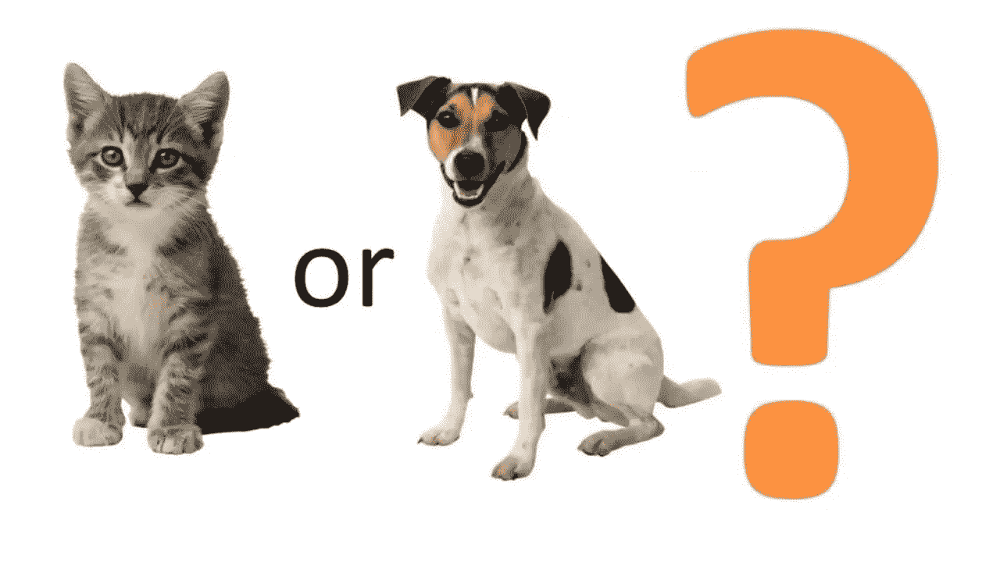

猫还是狗？(来源:[中条](https://medium.com/anubhav-shrimal/dogs-vs-cats-image-classification-using-resnet-d2ed7e6db2bb))

我们将尝试类似的代码，但使用螺母，螺栓，垫圈和定位销作为我们的猫和狗…..因为机械工程。


螺栓还是螺母还是定位销还是垫圈？人工智能能够辨别吗？

那么它是如何工作的呢？一种算法能够通过使用称为卷积神经网络(CNN)的机器学习算法(一种用于深度学习的方法)来(有效地)对图像进行分类。我们将使用这个模型的一个简单版本，称为序列，让我们的模型区分图像为四类螺母，螺栓，垫圈和定位销。该模型将通过“观察”一组训练图像来学习。在学习之后，我们将会看到它能多准确地预测一幅图像(它还没有见过的)是什么。

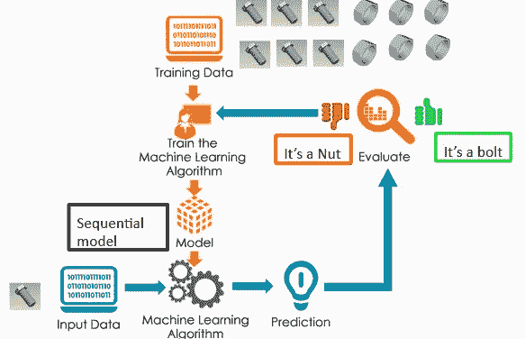

使用神经网络模型对螺母和螺栓的图像进行训练的机器学习算法的流程图。(原图: [pngfind](https://www.pngfind.com/mpng/hooRJmb_7wdata-machine-learning-training-algorithm-hd-png-download/) )

[直接转到 github 中的代码](https://github.com/Promech2020/Mech-parts-classification-seq-model)

# 数据集

我们从互联网上的各种零件库中下载了 4 类共 238 个零件(总共 238 x 4 = 952)。然后我们给每个部分拍了 8 张不同的等轴图像。这样做是为了增加可用的数据，因为每个部分只有 238 个图像不足以训练一个好的神经网络。一个类现在有 1904 个图像(238 个部分的 8 个等轴图像),总共 7616 个图像。每幅图像都是 224 x 224 像素。

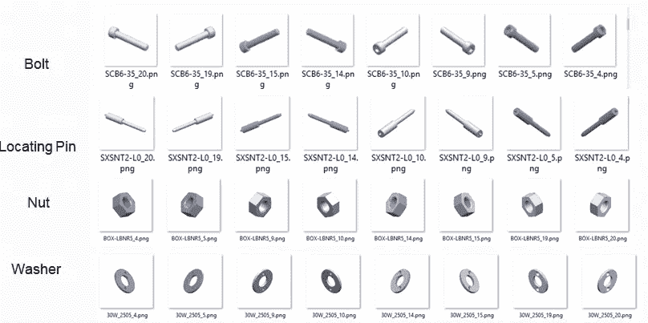

4 个类的图像。1 部分有 8 个图像。每个图像都被视为单个数据。

然后我们用数字 0，1，2，3 来标记，每个数字对应一个特定的图像，意味着它属于某个类别

```
#Integers and their corresponding classes
{0: 'locatingpin', 1: 'washer', 2: 'bolt', 3: 'nut'}
```

在对上面的图像进行训练之后，我们将会看到我们的模型预测一个它没有见过的随机图像的效果。

# **方法论**

这个过程分 7 步进行。我们稍后将讨论细节。简要总结是

1.  **数据收集**:从互联网上的各种标准件库中收集各类数据。
2.  **数据准备:**从每幅图像中截取 8 张等轴视图截图，并缩小至 224 x 224 像素。
3.  **模型选择:**选择顺序 CNN 模型，因为它简单且适合于图像分类
4.  **训练模型:**在我们的 7616 幅图像的数据上用 80/20 训练测试分割来训练模型
5.  **评估模型:**评估模型的结果。它对班级的预测有多好？
6.  **超参数调整:**该过程用于调整超参数，以获得更好的结果。在这种情况下，我们已经调整了我们的模型
7.  **做预测:**检查它对真实世界数据的预测有多好

## **数据收集**

我们从互联网上的不同零件库中下载了各种螺母和螺栓的零件数据。这些网站有来自不同制造商的不同文件格式的标准零件的大量 3D 模型。因为我们将使用 FreeCAD API 来提取图像，所以我们下载了中性格式的文件(步骤)。

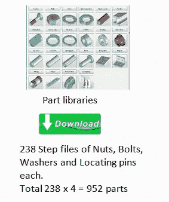

CAD 模型下载流程图

如前所述，4 个类中的每个类有 238 个部分被下载，总共有 952 个部分。

## 数据准备

然后，我们使用 FreeCAD API 运行了一个程序，该程序自动拍摄了每个部分 224 x 224 像素的 8 个等距截图。FreeCAD 是一个免费开源的通用参数化 3D 计算机辅助设计建模器，它是用 Python 编写的。

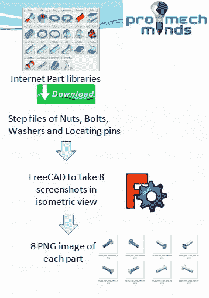

数据是如何创建的流程图

如上所述，每个数据创建 8 个 224 x 224 像素的图像。所以我们现在从 4 个类中的每一个类总共有 1904 个图像，因此总共有 7616 个图像。即使 8 幅图像来自同一个零件，每幅图像也被视为单独的数据。


8 个 a 2 螺栓的等距图像。每一行代表不同的部分。

这些图像按照它们的类别被保存在不同的文件夹中。即我们有四个文件夹螺母、螺栓、垫圈和定位销。

接下来，这些图像中的每一个都被转换成一个数组，其像素值为灰度。像素值的范围从 0(黑色)到 255(白色)。所以实际上有 255 种灰度。

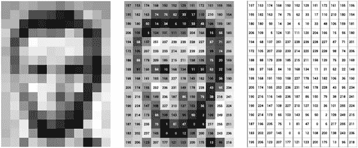

转换为像素值数组的图像示例。(来源: [openframeworks.cc](https://openframeworks.cc/ofBook/chapters/image_processing_computer_vision.html) )

现在我们的每个图像都变成了一个 224 x 224 的数组。因此，我们的整个数据集是一个 7616 x 224 x 224 维的 3D 数组。
7616 ( *图像数量* ) x 224 x 224 ( *每个图像的像素值*)

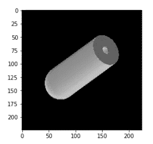

使用 matplot.lib 可视化我们的像素阵列

类似地，我们创建一个标签数据集，将下面所示类的整数值赋给数据集中相应的索引。如果数据集(X)中的第 5 个(*索引*)数据是一个定位销，标签集(Y)中的第 5 个数据将具有值 0。

```
#integers and the corresponding classes as already mentioned above
{0: 'locatingpin', 1: 'washer', 2: 'bolt', 3: 'nut'}
```

## 型号选择

由于这是一个图像识别问题，我们将使用卷积神经网络(CNN)。CNN 是一种处理图像数据特别好的神经网络。神经网络是一种机器学习算法，其学习方式类似于人脑。


基本的神经网络。(来源:[媒体文章](/machine-learning-fundamentals-ii-neural-networks-f1e7b2cb3eef)作者[康纳·麦克唐纳](https://towardsdatascience.com/@conrmcdonald)


卷积神经网络。我们的算法将如何工作的基本可视化(原始图像来源:[文章](https://adeshpande3.github.io/A-Beginner%27s-Guide-To-Understanding-Convolutional-Neural-Networks/)由[阿迪特·德什潘德](https://adeshpande3.github.io/adeshpande3.github.io/)

下面的代码是我们 CNN 的样子。不懂也不用担心。这个想法是来自我们每个数据的 224 x 224 特征将通过这些网络并给出一个答案。该模型将相应地调整其权重，并在多次迭代后能够预测随机图像的类别。

```
#Model description
Model: "sequential_1"
_________________________________________________________________
Layer (type)                 Output Shape              Param #   
=================================================================
conv2d_1 (Conv2D)            (None, 222, 222, 128)     1280      
_________________________________________________________________
activation_1 (Activation)    (None, 222, 222, 128)     0         
_________________________________________________________________
max_pooling2d_1 (MaxPooling2 (None, 111, 111, 128)     0         
_________________________________________________________________
conv2d_2 (Conv2D)            (None, 109, 109, 128)     147584    
_________________________________________________________________
activation_2 (Activation)    (None, 109, 109, 128)     0         
_________________________________________________________________
max_pooling2d_2 (MaxPooling2 (None, 54, 54, 128)       0         
_________________________________________________________________
flatten_1 (Flatten)          (None, 373248)            0         
_________________________________________________________________
dense_1 (Dense)              (None, 64)                23887936  
_________________________________________________________________
dense_2 (Dense)              (None, 4)                 260       
_________________________________________________________________
activation_3 (Activation)    (None, 4)                 0         
=================================================================
Total params: 24,037,060
Trainable params: 24,037,060
Non-trainable params: 0
```

这里是 Mark Rober(美国宇航局机械工程师)在 YouTube 上的一段视频，他解释了神经网络如何在很少编码的情况下工作。

## 模特培训

现在终于到了使用我们的 7616 张图像的数据集来训练模型的时候了。因此，我们的[X]是一个 7616 x 224 x224 的 3D 数组，而[y]标签集是一个 7616 x 1 的数组。为了所有的训练目的，数据必须被分成至少两部分:训练和验证(测试)集(当只涉及 2 个集时，测试和验证可以互换使用)。


数据被分成训练集和测试集。(来源:[researchgate.net](https://www.researchgate.net/figure/Train-Test-Data-Split_fig6_325870973))

训练集是模型看到并训练的数据。这是它调整权重和学习的数据。我们的模型在这个集合上的精度就是训练精度。一般高于验证精度。

验证数据通常来自与定型集相同的分布，并且是模型尚未看到的数据。模型根据训练集进行训练后，它将尝试预测验证集的数据。它预测的准确程度，就是我们验证的准确性。这比训练精度更重要。它显示了模型的泛化能力。

在实际应用中，通常将其分成三部分。培训、验证和测试。

对于我们的例子，我们将只把它分成训练集和测试集。这将是一个 80-20 的分裂。80 %的图像将用于训练，20%将用于测试。即在 6092 个样本上训练，在总共 7616 个样本中的 1524 个样本上测试。

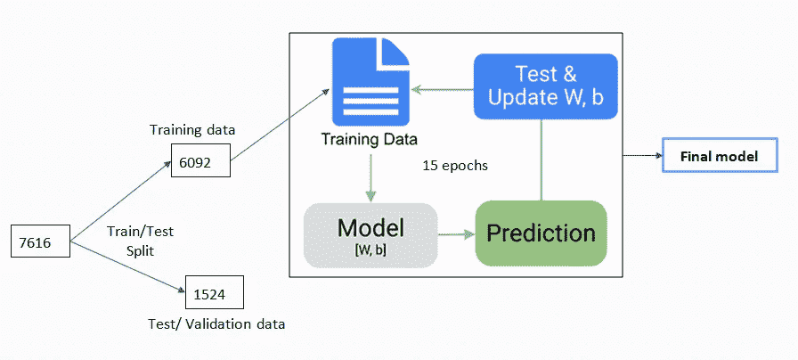

模型训练的可视化。(原图片来源:[媒体文章](/the-7-steps-of-machine-learning-2877d7e5548e)作者[虞凤峰](https://towardsdatascience.com/@yufengg)

对于我们的模型，我们训练了 15 个时期，批次大小为 64。

历元数是一个超参数，它定义了学习算法在整个训练数据集中工作的次数。

一个时期意味着训练数据集中的每个样本都有机会更新内部模型参数。一个时期由一个或多个批次组成。

您可以将 for 循环想象为遍历多个历元，其中每个循环遍历训练数据集。在这个 for 循环中是另一个嵌套的 for 循环，它迭代每批样本，其中一批具有指定的“批量大小”数量的样本。[2]

也就是说，我们的模型将总共 15 次(历元)遍历我们的全部 7616 个样本，并且每次都调整其权重，因此每次预测都更加准确。在每个历元中，它将遍历 7616 个样本，一次 64 个样本(批量大小)。

## 评估模型

该模型不断更新其权重，以使成本(损失)最小化，从而为我们提供最佳精度。成本是模型在预测图像类别时的不准确性的度量。成本函数用于估计模型的表现有多差。简而言之，成本函数是衡量模型在估计 X 和 y 之间关系的能力方面有多差的一种方法

如果算法预测错误，则成本增加，如果预测正确，则成本降低。

经过 15 个时期的训练，我们可以看到下面的损失和准确性的图表。(在我们的案例中，成本和损失可以互换使用)

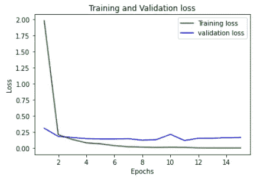

从 matplot.lib 生成的图表显示了我们模型的训练和验证损失

模型训练次数越多，损失越小。它可以更好地对每个时期的图像进行分类。该模型不能在验证集上提高太多的性能。


从 matplot.lib 生成的图表显示了我们模型的训练和验证准确性

随着模型在每个时期的训练，精确度增加了。它在图像分类方面变得更好。验证集的准确性低于训练集，因为它没有直接在其上训练。最终值为 97.64%，还不错。

## 超参数调谐

下一步将是改变超参数、学习率、时期数、数据大小等。来改进我们的模型。在[机器学习](https://en.wikipedia.org/wiki/Machine_learning)中，**超参数**是一个[参数](https://en.wikipedia.org/wiki/Parameter)，其值用于控制学习过程。相比之下，其他参数(通常是节点权重)的值是通过训练获得的。[3]

出于我们的目的，在撰写本文之前，我们已经修改了这些参数，以获得在本文上显示的最佳性能。我们增加了数据集的大小和历元的数量，以提高精确度。

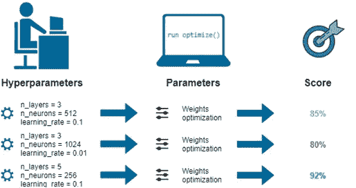

超参数影响参数并最终影响最终得分(准确性)。(来源:[deepai.org](https://deepai.org/machine-learning-glossary-and-terms/hyperparameter))

## 做预测

对模型进行调整后的最后一步是使用将用于该模型的实际数据进行预测。如果模型在这方面表现不佳，可以开始进一步的超参数调整。

机器学习是一个相当迭代和经验性的过程，因此超参数的调整经常被比作艺术而不是科学，因为尽管我们知道通过改变某些超参数会发生什么变化，但我们不能确定这一点。

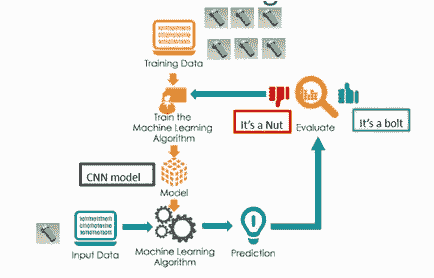

机器学习算法流程图(原图: [pngfind](https://www.pngfind.com/mpng/hooRJmb_7wdata-machine-learning-training-algorithm-hd-png-download/) )

# 应用程序

这种对机械零件进行分类的能力使我们能够仅根据客户提供的图像或 CAD 模型从标准库中推荐零件。目前，要从标准库中搜索所需的零件，您必须浏览目录，并能够根据可用选项和您对目录的了解来判断您想要哪个零件。需要记住序列号，因为单个数字或字母的变化可能意味着不同类型的零件。

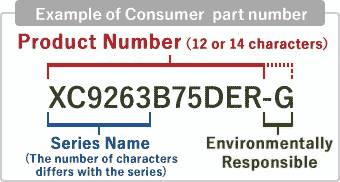

来自 [TOREX](https://www.torexsemi.com/products/part-numbers/) 网站的零件号示例。

如果一幅图像可以用来从标准库中获得所需的零件，我们需要做的只是制作一个粗略的 CAD 模型，然后通过我们的算法发送出去。该算法将决定哪些部分是最好的，并帮助缩小我们的搜索范围。


推荐算法如何工作的可视化

如果分类方法足够详细和精细，它应该能够详细分类您想要的零件类型。缩小搜索范围可以节省大量时间。这在有数千个相似零件的库中特别有用。

# 结论

深度学习(人工智能)是一个具有巨大可能性的研究领域，因为它使我们能够从原始数据中提取大量知识。其核心仅仅是数据分析。在这个互联网时代，数据无处不在，如果我们能够有效地提取数据，就可以完成很多事情。

这个领域在机械工程领域也有很多可能的应用。由于几乎所有深度学习的研究都需要领域专家，因此建议所有对数据分析感兴趣的工程师，即使他们没有主修计算机科学，也要学习数据科学、机器学习并研究其可能性。该领域的知识加上数据分析的技能将真正帮助我们在自己的领域中脱颖而出。

# 承认

我很感谢亲械甲怪的头脑让我这样做，特别是它的数据科学团队，包括 Gopal Kisi，Bishesh Shakya 和系列 Chikanbanjar，他们对这个项目的巨大帮助。pro-Mech Minds & Engineering Services 是尼泊尔一家在工程领域同时提供机械和 IT 解决方案的公司。这个想法是结合设计工程和数据科学的一次尝试。最后但同样重要的是，我要特别感谢 Saugat K.C .担任我们数据科学团队的导师。

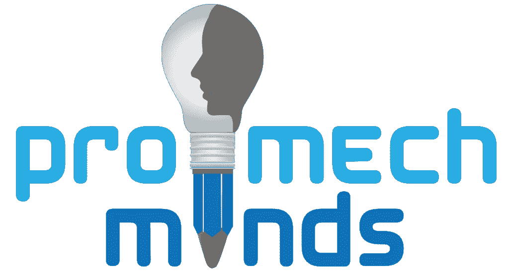

[来源](http://www.promechminds.com)

[链接到 github 中的代码](https://github.com/Promech2020/Mech-parts-classification-seq-model)

参考

[1] [康纳·麦克唐纳](https://towardsdatascience.com/@conrmcdonald)，[机器学习基础(一):成本函数与梯度下降(2017)](/machine-learning-fundamentals-via-linear-regression-41a5d11f5220) ，走向数据科学

[2] [杰森·布朗利，](https://machinelearningmastery.com/author/jasonb/) [神经网络中批次与历元的区别(](https://machinelearningmastery.com/difference-between-a-batch-and-an-epoch/) 2018)，machinelearningmastery.com

[3] [超参数 _(机器学习)，](https://en.wikipedia.org/wiki/Hyperparameter_(machine_learning))维基百科

[4]吴恩达，深度学习的卷积神经网络，deeplearning.ai(未注明)。检索自 [Coursera](https://www.coursera.org/specializations/deep-learning)