# 人工智能是一个超级计算问题

> 原文：<https://towardsdatascience.com/artificial-intelligence-is-a-supercomputing-problem-4b0edbc2888d?source=collection_archive---------29----------------------->

## [人工智能超级计算— 01](https://towardsdatascience.com/tagged/supercomputing-for-a-i)

## 人工智能从业者不能回避我们的责任

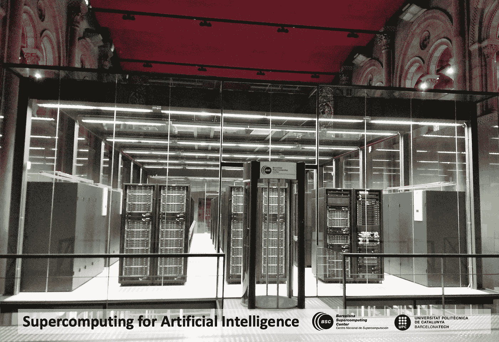

Marenostrum 超级计算机—巴塞罗纳超级计算中心(图片来自 [BSC](https://bsc.es/)

**【本帖将在大师课程** [***超级计算机体系结构***](https://www.fib.upc.edu/en/studies/masters/master-innovation-and-research-informatics/curriculum/syllabus/SA-MIRI)**at**[**UPC 巴塞罗那理工**](https://www.upc.edu/en?set_language=en) **的支持下**[**BSC**](https://bsc.es)

> **下一代人工智能应用提出了新的要求苛刻的计算基础设施。支持人工智能的计算机系统怎么样？我们是怎么到这里的？谁有权访问这些系统？我们作为人工智能从业者的责任是什么？**

**对于人工智能来说，这是一个激动人心的时刻。我们在[巴塞罗那超级计算中心](https://bsc.es)拥有令人印象深刻的科学数据分析系统，涉及基因组学、生物信息学、天文学以及其他许多领域。这些系统可以做出几年前我们认为不可能的惊人之举。**

**此外，对于通用应用程序，我们进展非常快。例如，在视频分析中，[我们在 UPC & BSC](https://www.bsc.es/discover-bsc/organisation/scientific-structure/emerging-technologies-artificial-intelligence/team-people) 的研究小组通过引用表达式获得了有价值的视频对象分割结果。给定一个视频和一个语言短语，我们展示如何为短语所指的对象生成二进制掩码。**

**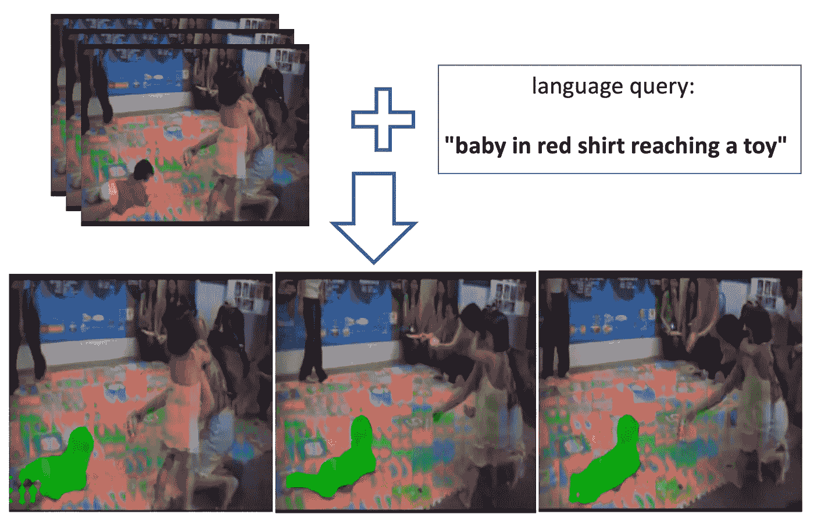**

**图片由作者根据来自 [RefVOS 的图片制作:参考 VOS、M. Bellver 等人的表述。](https://arxiv.org/pdf/2010.00263.pdf)**

# ****触发人工智能爆炸****

**问题是，**为什么是现在？**人工智能从上世纪中叶就有了。[约翰·麦卡锡](https://en.wikipedia.org/wiki/John_McCarthy_(computer_scientist))在 20 世纪 50 年代创造了人工智能一词，与[马文·明斯基](https://en.wikipedia.org/wiki/Marvin_Minsky)一起成为人工智能的创始人之一。此外，在 1958 年，弗兰克·罗森布拉特建立了一个原型神经元网络，他称之为感知器。此外，用于计算机视觉的深度学习神经网络的关键思想在 1989 年就已经为人所知；此外，对于时间序列的深度学习的基本算法，例如 LSTM，在 1997 年就已经开发出来了。那么，为什么现在会出现这种人工智能热潮呢？**

**让我们试着找出一个引发 AI 大爆发**的导火索。** [Oriol Vinyals](https://scholar.google.com/citations?hl=en&user=NkzyCvUAAAAJ&view_op=list_works&sortby=pubdate) 表示，根据他最近的一条推文，数据集发挥了重要作用:**

**[https://Twitter . com/OriolVinyalsML/status/1253053130411032576](https://twitter.com/OriolVinyalsML/status/1253053130411032576)**

**显然，大数据集的可用性有助于深度学习的算法效率，[在 7 年的时间里，每 16 个月翻一番](https://openai.com/blog/ai-and-efficiency/):**

**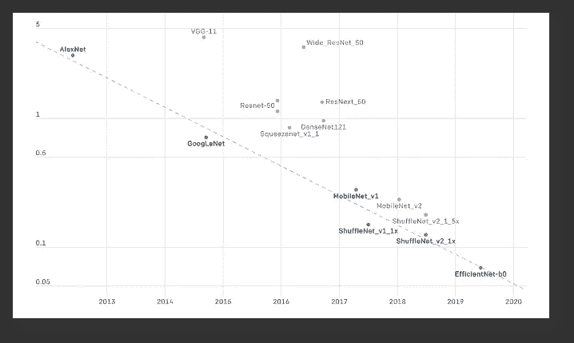**

**图片来源:[https://openai.com/blog/ai-and-efficiency/](https://openai.com/blog/ai-and-efficiency/)**

**这意味着，在 2012 年至 2019 年期间，训练分类器在 [ImageNet](https://en.wikipedia.org/wiki/ImageNet#ImageNet_Challenge) 上达到 [AlexNet](https://en.wikipedia.org/wiki/AlexNet) 级别性能所需的操作减少了 44 倍。**

**在麻省理工学院的这个[精彩演讲中，Oriol Vinyals 还补充了大公司和大学在这个方向上的重要贡献，如 TensorFlow、Pytorch、MXNet 等开源项目。这些 DL 框架允许我们现在访问大量基本上最先进的组件，帮助研究人员专注于核心算法组件，我们认为这些组件可能过于关注实现的细节，这有助于加快算法的进展。](https://www.youtube.com/watch?v=-fdexQBpRas&t=721s)**

**大数据集和开源 DL 框架在创建“大”算法中扮演着重要角色。但目前的兴奋是由于另一个关键因素，这在 2012 年 AlexNet 赢得 ImageNet 之前并不存在。除了数据和算法，现在还有哪些东西是可用的？**

> **我不想拒绝奥里奥尔·维尼亚的肯定；他是这个领域的老大！！！还有我们课题组的好朋友！；-)**

**答案是**大型计算机。**“计算能力是人工智能进步的关键组成部分。如今，深度学习或强化学习是混合这三个组件的结果:**

**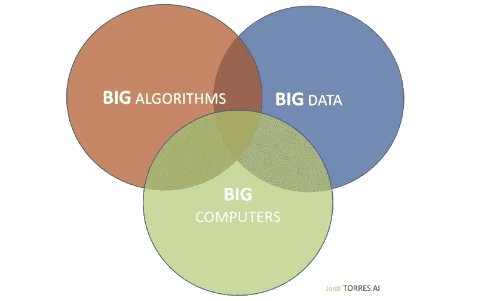**

**作者图片**

**计算如何进化以满足人工智能的需求？**

**看看这张来自 OpenAI 的[图，它已经变得非常流行:](https://blog.openai.com/ai-and-compute)**

**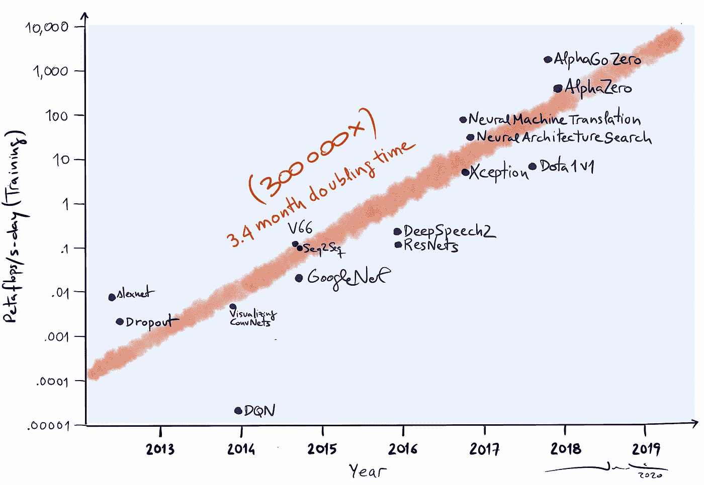**

**图片作者([数据源](https://blog.openai.com/ai-and-compute))**

**自 2012 年以来，生成人工智能模型所需(或可用)的计算量呈指数增长(Y 轴是对数轴)。**

> **一个[petaflop](https://en.wikipedia.org/wiki/FLOPS)/s-day(PFS-day)由一天内每秒执行 10 到 15 次运算组成，即总共约 10 到 20 次运算。**

**此外，在此期间，这些用于训练模型的计算需求增长了 300，000 多倍。在最大的人工智能训练中使用的计算量以 3.4 倍的月倍增时间呈指数增长。**

## **摩尔定律的终结**

**让我们回顾一下，看看计算是如何发展的。计算机性能的大部分改进来自几十年来计算机部件的小型化。你们都听说过摩尔定律。对吗？**

**1975 年，英特尔创始人[戈登·摩尔](https://en.wikipedia.org/wiki/Gordon_Moore)预测了这种小型化趋势的规律性，现在被称为摩尔定律，直到最近，计算机芯片上的晶体管数量每两年翻一倍。**

> **原创论文:[摩尔，g。数字集成电子学的进展。在*国际电子设备会议的记录中*(华盛顿特区，12 月)。IEEE，纽约， **1975** ，1113。](http://ai.eecs.umich.edu/people/conway/VLSI/BackgroundContext/SMErpt/AppB.pdf)**

**虽然摩尔定律持续了几十年，但它在 2000 年左右开始放缓，到 2018 年，摩尔的预测和当前能力(英特尔等公司制造的[处理器)之间出现了大约 15 倍的差距。](https://cacm.acm.org/magazines/2019/2/234352-a-new-golden-age-for-computer-architecture/fulltext#R26)[目前的预期是，随着 CMOS 技术接近基本极限，这一差距将继续扩大！](https://cacm.acm.org/magazines/2019/2/234352-a-new-golden-age-for-computer-architecture/fulltext)**

**可悲的是，就在我们需要快得多的机器进行深度学习的时候，摩尔定律开始变慢了！**

**事实上，在计算机架构社区中还出现了其他重要的观察结果，这些观察结果伴随着摩尔定律: [Dennard Scaling](https://ieeexplore.ieee.org/document/1050511) 是 Robert Dennard 的一项预测，指出随着晶体管密度的增加，每个晶体管的功耗将会下降，因此每平方毫米硅的功耗将接近恒定。根据摩尔定律，每平方毫米硅片的计算能力随着每一代新技术的发展而提高，计算机将变得更加节能。然而，Dennard 缩放预测在 2007 年开始明显放缓，其好处在 2010 年左右消失。**

**随着 Dennard 扩展的结束，增加芯片上的内核数量可以使功率以大约相同的速度增加。但是进入处理器的能量也必须以热量的形式带走。所以多核处理器受限于散热能力。**

**简而言之，应用所有这些观察的结果可以总结在下图中，该图基于最初的图[“计算机性能的增长”，由 Hennessy 和 Patterson](https://cacm.acm.org/magazines/2019/2/234352-a-new-golden-age-for-computer-architecture/fulltext) 创建:**

**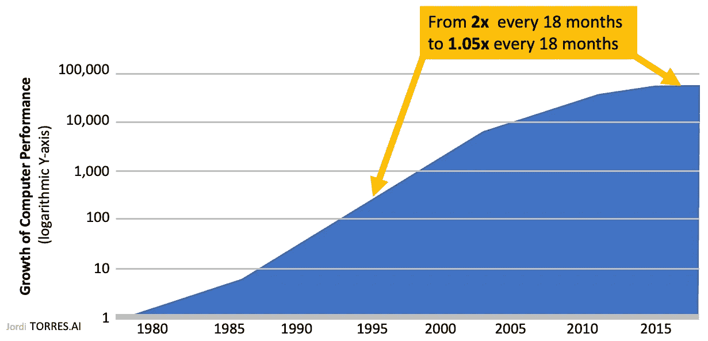**

**图片作者([数据源](https://cacm.acm.org/magazines/2019/2/234352-a-new-golden-age-for-computer-architecture/fulltext))**

**在这张图中，我们可以看到，在 20 世纪 80 年代和 90 年代，当所有这些定律和观察结果都存在时，我们正在将晶体管变成快速计算机，因此当时大约每 18 个月性能就翻一番。**

**多好的时光啊！多么渴望啊！。现在，我们大约每 20 年才有同样的进步。综上所述，从每 18 个月因子 2 到每 18 个月因子 1.05。**

**从一个非常普遍的角度来看，从来自伯克利的[扬·斯托伊察](https://people.eecs.berkeley.edu/~istoica/)教授在[射线峰会](https://events.linuxfoundation.org/ray-summit/)上的演讲中得到的想法，我们可以在前面的图表中直观地表示计算性能增长的影响(大约)。可以看出，考虑到我们正在对数 Y 轴上移动，在任何情况下，都不允许我们响应 AI 算法的需求。**

**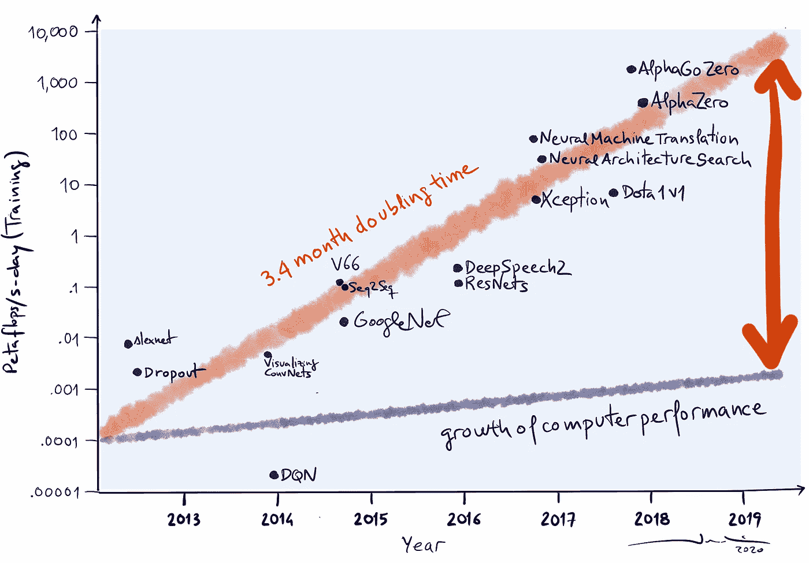**

**作者图片**

**嗯，虽然摩尔定律可能已经终结，但对计算能力增长的需求并没有终结。所以，一个问题出现了，没有摩尔定律怎么得到更快的机器？**

## **专门的硬件呢？**

**为了应对这一挑战，计算机架构师们将注意力集中在构建特定领域的处理器上，以通用性换取性能。背后的理念是，“不要试图做所有的事，只是例外地做几件事”。各公司竞相打造专门的处理器，如 Nvidia 的 GPU 和谷歌的 TPUs**

**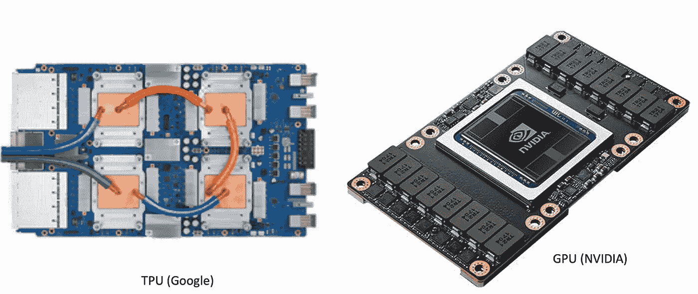**

**图片来源:谷歌和英伟达**

**我们说的“破例做几件事”是什么意思？例如，GPU 包含数百个在 4x4 矩阵上操作的[张量核](https://www.nvidia.com/en-us/data-center/tensor-cores/)，这大大加速了深度学习中基本操作的计算，例如数据矩阵乘以权重矩阵，然后是偏差的和。**

**但是最终，专门的硬件是不够的。与此同时，像 GPU 和 TPU 这样的加速器为桌面带来了更多的计算能力，它们本质上有助于将摩尔定律进一步延长到未来，而不是从根本上提高改进的速度。**

**一般来说，使用同一个 [OpenAI 图](https://blog.openai.com/ai-and-compute/)，我们可以直观地表示与 CPU 相关的专用架构的性能改进的影响。但是，可以看出，在任何情况下，都不允许响应深度学习和强化学习应用的需求:**

**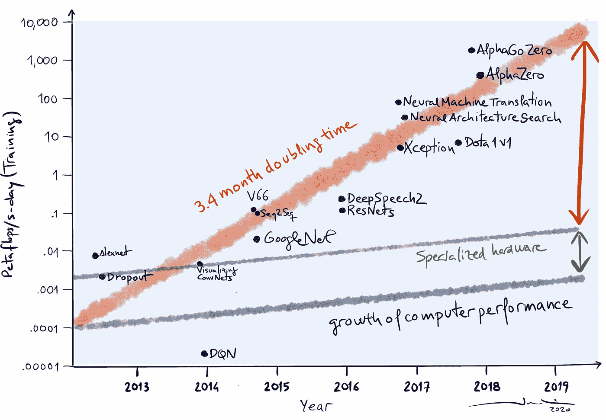**

**作者图片**

## **并行性:不止一个特定于域的处理器**

**也许我们可以让多个特定领域的处理器协同工作？。让我们来看一个具体的例子，我们在 [BSC 中使用了 4 个能够并行工作的 GPU](https://www.bsc.es/user-support/power.php#systemoverview):**

**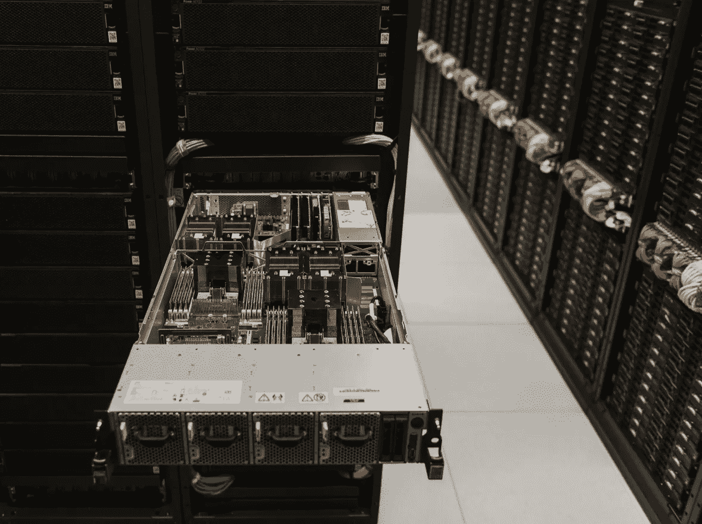**

**图片来源: [https://bsc.es](https://bsc.es)**

**[这台服务器由 IBM 提供，有两个 CPU，power 9，和 4 个 NVIDIA V100 GPU](https://www.redbooks.ibm.com/redpapers/pdfs/redp5472.pdf)。现在，我们如何利用这些资源来提高计算速度呢？在深度学习的情况下，我们通常有两种并行方法可以用来实现这一目的:**

*   **模型并行性**
*   **数据并行性**

**在第一种方法中，我们将网络的不同层分布在不同的设备上；同时，在第二种方法中，我们在每一个 GPU 中都有相同的模型，但它们都在处理独立的数据片段，即小批量的独立部分。**

**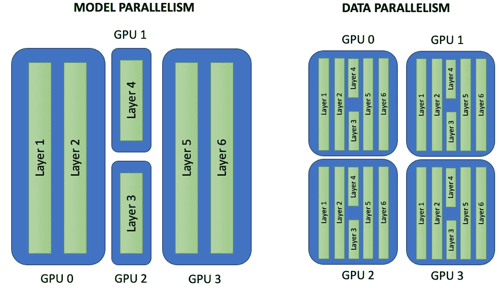**

**作者图片**

**当我们有一个可能不适合单个 GPU 内存的大型模型时，模型并行性非常有用。**

**然而，数据并行性是大多数从业者通常用来扩大深度学习模型的训练过程的，因为他们有一个如此庞大的数据集，以至于在单个 GPU 上完成一个时期可能需要非常长的时间，可能是几个小时、几天甚至几周。**

**因此，当有可能共享数据集以加速训练时，我们会这样做，只要模型可以容忍更大的批量。**

**我们可以使用框架作为 Pytorch 的 [TensorFlow 来编写多 GPU 训练。要并行化模型的训练，只需要在 PyTorch 中用](/tensorflow-vs-pytorch-the-battle-continues-9dcd34bb47d4)`[torch.nn.parallel.DistributedDataParallel](https://pytorch.org/docs/stable/generated/torch.nn.parallel.DistributedDataParallel.html)`包装模型，在 TensorFlow 中用`[tf.distribute.MirroredStrategy](https://www.tensorflow.org/api_docs/python/tf/distribute/MirroredStrategy)`包装模型。非常容易！**

**TensorFlow 和 PyTorch 需要一个软件堆栈，其中包括作为 Python 包安装在执行环境中的不同软件层。此外，NVIDIA 的`[cuDNN](https://developer.nvidia.com/cudnn)`库帮助我们挤压所有加速器的能力，例如使用我提到的[张量核](https://www.nvidia.com/en-us/data-center/tensor-cores/)。**

**例如，当我在[我们的超级计算机](https://www.bsc.es/user-support/power.php)中执行深度学习代码时，我需要用`module load` 命令加载这里列出的所有模块:**

```
**$ module load** python/3.7.4_ML cudnn/7.6.4 cuda/10.2 nccl/2.4.8tensorrt/6.0.1 openmpi/4.0.1 atlas/3.10.3 scalapack/2.0.2fftw/3.3.8 szip/2.1.1 ffmpeg/4.2.1 opencv/4.1.1 gcc/8.3.0
```

**一个巨大的世界，我部分致力于此，并且非常重要，对于像你这样的深度学习用户来说通常是透明的。**

**但最终，4 个 GPU 无法满足深度学习或强化学习中出现的挑战的需求:**

**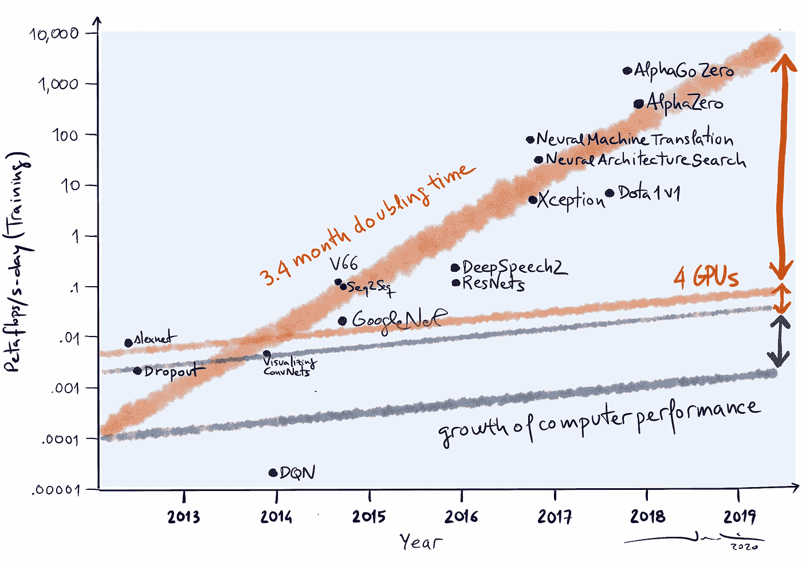**

**作者图片**

**我们在服务器中可以放置的 GPU 数量非常有限；[在我们讨论的 Power 9 服务器的情况下，我们最多可以达到 6 个 GPU](https://www.ibm.com/products/power-systems-ac922/details)。**

## **多服务器:分布式计算**

**公司必须解决这个问题的方法是将许多这样的服务器放在一起！这就是我们在 BSC 所做的，利用这个研究平台[，54 台服务器通过光纤上的 InfiniBand 网络连接在一起](https://www.bsc.es/user-support/power.php)。**

****

**作者图片**

**这些服务器运行 Linux 作为它们的操作系统，并且每一个都由[两个 Power 9 处理器和四个 512 GB 主内存的 NVIDIA GPU](https://www.redbooks.ibm.com/redpapers/pdfs/redp5472.pdf)组成，这意味着我们用两百多个 GPU 来计数。**

**[InfiniBand](https://www.mellanox.com/pdf/whitepapers/IB_Intro_WP_190.pdf) 是互连服务器的行业标准，允许从远程服务器快速访问一台服务器的本地内存。**

**在这个新的场景中，我们需要软件堆栈的扩展来处理神经网络训练过程中的多个分布式 GPU。还有其他选择，但是在我们 BSC 的研究小组中，我们决定使用来自优步的 [Horovod](/distributed-deep-learning-with-horovod-2d1eea004c b2) 。Horovod 插入 [TensorFlow](https://www.tensorflow.org/) 、 [PyTorch](https://pytorch.org/) 和 [MXNet](https://mxnet.apache.org/versions/1.7.0/) 。**

**[Horovod](/distributed-deep-learning-with-horovod-2d1eea004c b2) 使用[消息传递接口(MPI)](https://en.wikipedia.org/wiki/Message_Passing_Interface) 与以分布式方式执行的进程进行通信。MPI 是一种普遍存在于任何超级计算机中的编程模型，用于通信在不同服务器中执行的进程。它还使用 [NVIDIA NCCL2 库](https://developer.nvidia.com/nccl)来管理服务器中 GPU 之间的数据通信。**

**为了加速训练，Horovod 使用了之前介绍的*数据并行*训练模型。也就是说，所有工人都在不同的数据上训练，所有工人都有相同的模型副本，神经网络梯度也是交换的。**

**这些年来，并行性和分布策略的总和使得人工智能社区对计算的需求不断增长。**

# ****新的大型计算机:超级计算的怪物****

**这种硬件和软件技术的结合创造了真正的超级计算怪兽。例如，谷歌拥有数百个 TPU 的计算基础设施，这些 TPU 可以放在一起合作解决深度学习和强化学习社区中出现的挑战。**

**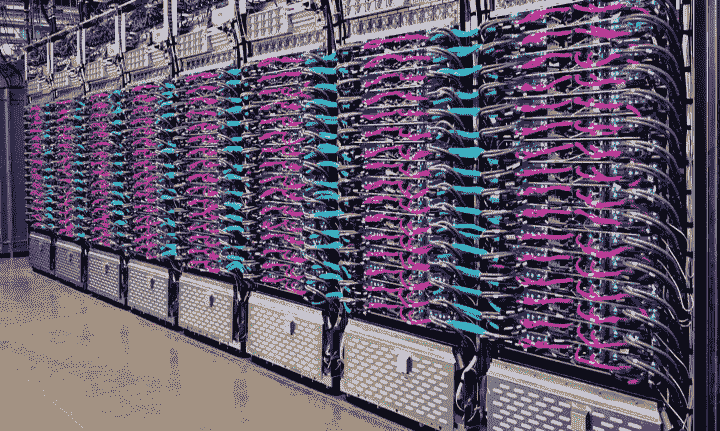**

**图片来源:[https://cloud . Google . com/blog/products/ai-machine-learning/Google-breaks-ai-performance-records-in-worlds-fast-training-super computer](https://cloud.google.com/blog/products/ai-machine-learning/google-breaks-ai-performance-records-in-mlperf-with-worlds-fastest-training-supercomputer)**

**谷歌最近的一篇论文提出了一个多语言翻译质量模型，有 6000 亿个参数。为了了解这个问题的严重性，我们可以将其与著名的 [GTP-3](https://en.wikipedia.org/wiki/GPT-3) 进行比较，这是 OpenAI 创建的第三代语言预测模型。它“只有”1750 亿个参数。**

**在这种情况下，我们谈论的计算需求相当于 22 年 1 TPU。在这篇论文中，作者用 TPU 年来衡量业绩。一个有趣的度量！。这意味着，如果我们只有一个可用的 TPU，我们将需要 22 年来做培训。**

**在这种情况下，Google 将培训分布在 2048 个 TPU 上，仅用了 4 天就取得了成效。**

> **关于谷歌 TPU 基础设施系统架构的详细信息可以在[这里](https://cloud.google.com/tpu/docs/system-architecture)找到。**
> 
> **更新 15/04/2021-来自微软、英伟达和斯坦福大学的研究:他们研究如何缩放一万亿参数模型的模型。参见论文[GPU 集群上的高效大规模语言模型训练](https://arxiv.org/pdf/2104.04473.pdf)。**

# **新的大算法:深度强化学习**

**在上一节中，我们考虑了一个深度学习问题，作为当今人工智能应用程序急切而快速地吞噬计算的一个例子。但实际上，人工智能领域的前沿应用是基于需要大量计算的深度强化学习模型。**

> **如果你想通过介绍性的[系列文章](https://towardsdatascience.com/tagged/deep-r-l-explained)了解强化学习，这些文章涵盖了强化学习和深度学习的基本概念，从深度强化学习领域开始，你可以在这里找到它[。](https://torres.ai/deep-reinforcement-learning-explained-series/)**

**几年前，像 [DQN](/deep-q-network-dqn-i-bce08bdf2af) 这样的基础算法是为了消耗一些硬件资源而构思的；例如，1CPU+1GPU 就足够了。如果我们按照时间线，分布式强化学习(RL)算法的初始版本只需要多几个 CPUs 例如[异步演员-评论家方法](https://arxiv.org/pdf/1602.01783.pdf) (A3C)，它在几个 CPU 和单个 GPU 上工作得非常好。**

**然而，如果我们仔细看看强化学习算法的最新发展，我们会发现它们越来越需要更多的计算资源。例如，两年前，一个名为[黑斑羚](https://arxiv.org/pdf/1802.01561.pdf)的大规模分布式 RL 被设计成利用数百个 CPU。**

**当前分布式强化学习代理的架构通常分为*参与者*和*学习者*。这是黑斑羚的例子:**

**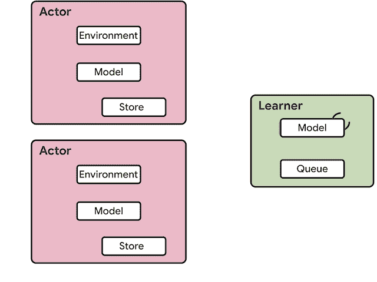**

**[https://ai . Google blog . com/2020/03/massively-scaling-reinforcement . html](https://ai.googleblog.com/2020/03/massively-scaling-reinforcement.html)**

**通常在 CPU 上执行的参与者在环境中采取步骤和在模型上运行推理之间迭代，以预测下一个动作。在收集了足够数量的观察数据后，参与者将向学习者发送观察数据和行动的轨迹。然后学习者优化模型，将模型的参数发送给行动者，每个行动者更新其推理模型的参数。在这种算法中，学习者使用来自数百台 CPU 机器上的分布式推理的输入在 GPU 上训练模型。**

**分布式强化学习方法的最新版本，来自 DeepMind 的[种子方法](https://arxiv.org/pdf/1910.06591.pdf)，允许使用超过 200 个 TPU，太神奇了，对吧！！允许我们认为真正的*大规模强化学习*。**

**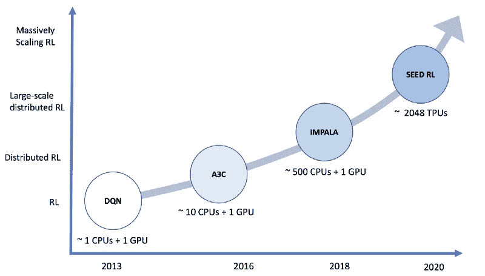**

**照片由 Jordi Torres 拍摄**

**好吧，不进入细节，假设种子强化学习架构被设计来解决[IMPALA 方法](https://ai.googleblog.com/2020/03/massively-scaling-reinforcement.html)中存在的一些缺点。在这种情况下，神经网络推理由学习者在 TPUs 上集中进行(而不是像 IMPALA 那样在 actor 中)，从而通过确保模型参数和状态保持在本地来实现加速推理和避免数据传输瓶颈。**

**虽然 actor 在每个环境步骤都向学习者发送观察结果，但由于非常高效的网络库 [gRPC](https://grpc.io/) (在功能上等同于我之前提到的 MPI)，延迟保持得很低。这使得在一台机器上每秒可以完成多达一百万次查询。**

**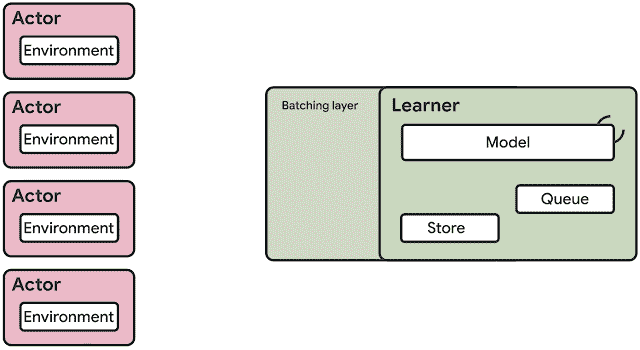**

**图片来源:[https://ai . Google blog . com/2020/03/massively-scaling-reinforcement . html](https://ai.googleblog.com/2020/03/massively-scaling-reinforcement.html)**

**总之，学习器可以扩展到数千个核(例如，高达 2048 个 TPU)，并且演员的数量可以扩展到数千个机器以充分利用学习器，使得以每秒数百万帧的速度训练成为可能。印象深刻吧。**

# **人工智能:超级计算能力是真正的推动者！**

**我们可以得出结论，计算正在响应人工智能社区的需求，允许我们解决所提出的模型。我在这份出版物中的论点是，*计算能力是真正的推动者*，或者，如果你喜欢，是人工智能进步的关键组成部分，当我们混合这三个组成部分时:大数据、大算法和大计算机。**

**在此期间，是什么推动了有效计算的变化？OpenAI 将人工智能和计算趋势分为摩尔定律和增加的支出/并行化，以及算法效率的进步:**

**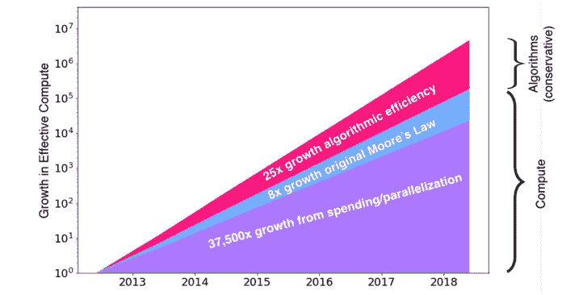**

**图片来源:[测量神经网络的算法效率 Danny Hernandez，Tom B. Brown OpenAI。](https://arxiv.org/pdf/2005.04305.pdf)**

**作者估计，2012 年至 2018 年间，最大规模的人工智能实验可用的有效训练计算将增加 750 万倍。**

**看起来计算将继续响应深度学习和强化学习社区的需求，允许他们解决所需的模型。**

**想象一下，谷歌需要更多的计算能力来实现一个新的强化学习算法，那么，谷歌唯一会做的就是聚合更多的并行和分布式服务器！仅此而已！**

**例如，几个月前，[谷歌在行业标准基准 MLPerf](https://cloud.google.com/blog/products/ai-machine-learning/google-breaks-ai-performance-records-in-mlperf-with-worlds-fastest-training-supercomputer) 中打破 AI 性能记录。 [MLPerf 基准测试](https://mlperf.org)模型被选为尖端机器学习工作负载的代表。**

**在这种情况下，Google 唯一需要做的就是聚合更多的服务器。最终的系统包括 4096 个 TPU 和数百台 CPU 主机，它们通过超高速互连连接在一起。总的来说，该系统提供了超过 430 PFLOPs 的峰值性能。**

**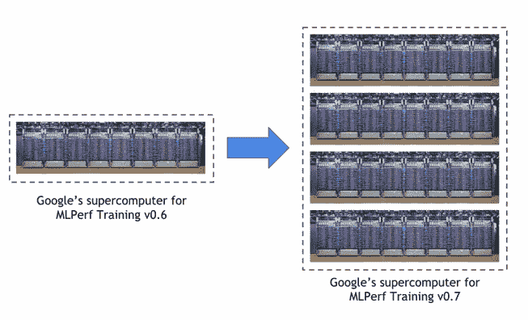**

**图片来源:[https://cloud . Google . com/blog/products/ai-machine-learning/Google-breaks-ai-performance-records-in-worlds-fast-training-super computer](https://cloud.google.com/blog/products/ai-machine-learning/google-breaks-ai-performance-records-in-mlperf-with-worlds-fastest-training-supercomputer)**

****现在看来，增加服务器可以让我们对人工智能模型的需求做出反应。很简单，对吧？嗯，不是这样的！****

# ****需要思考的事情****

**在完成我的文章之前，让我给你布置一些“家庭作业”让你自己做。你承诺去做吗？希望如此！**

## **谁能拥有并支付这些超级计算机？**

**在阅读了上一节之后，一个重要的问题出现了:解决这些挑战需要多少计算成本？你想过吗？**

**例如，根据下面的推文中的[，我之前提到的训练使用深度学习产生类似人类文本的 transformer GPT-3 语言模型的估计成本在公共云上接近 1200 万美元。](https://twitter.com/eturner303/status/1266264358771757057)**

**图片来源:[https://twitter.com/eturner303/status/1266264358771757057](https://twitter.com/eturner303/status/1266264358771757057)**

> **2020 年 11 月 29 日更新:[腾讯](https://arxiv.org/abs/2011.12692)的一篇新论文再次展示了规模的力量，他们使用了一个包含 **250，000 个 CPU 内核**和 **2，000 个 NVIDIA V100 GPU**的集群进行培训。**

**也许你已经听说过 [top500 榜单](https://www.top500.org)，这个榜单记录了世界上最快的计算机，每年发布两次，分别在 6 月和 11 月世界两大超级计算大会期间( [SC](https://sc20.supercomputing.org) 、 [ISC](https://www.isc-hpc.com) )。**

**一般情况下，公共机构中托管有超级计算机，峰值性能以万亿次浮点运算(每秒 10 到 12 次运算)为单位，如下表所示。例如，Top1 的峰值性能为 500，000 万亿次。**

> ****TFlop/s =每秒 1 000 000 000 000 次数值运算。****

**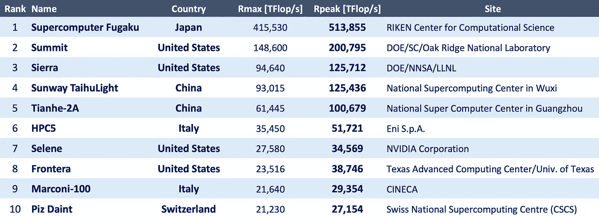**

**2020 年 6 月 500 强榜单前十名(图片由 Jordi Torres 提供)**

> **现在，Marenostrum 4，这台位于巴塞罗那的超级计算机，位于 UPC 大学校园的 Torre Girona 的[教堂，在这个列表中占据了第 38 位，对我们来说不错！(](https://www.bsc.es/sites/default/files/public/gallery/2017_bsc_superordenador_marenostrum-4_barcelona-supercomputing-center.jpg)[虚访](https://www.bsc.es/discover-bsc/visit-our-supercomputer#virtual-visit-title))。**

**之前提到的谷歌系统，包括 4096 个 TPU 和数百个通过超高速互连连接的 CPU 主机，提供超过 430，000 TFLOPs 的峰值性能。接近世界第一(根据 2020 年 6 月榜单)，和第二以及其他人相差甚远！**

****为了创造人工智能，我们需要超级计算机。谁能拥有并支付这些超级计算机？仅民族国家和跨国公司？****

## **人工智能碳足迹**

**上周，西班牙报纸《先锋报》刊登了这篇文章:数字世界是这个星球上的第三个污染者。**

****

**照片由 Jordi Torres 和 Júlia Torres 拍摄**

**此外，麻省大学的研究对人工智能不可持续的成本提出了建议。他们声称，训练一个通用 NLP 模型的估计碳成本相当于从纽约到北京的 125 次往返航班产生的碳量。**

**这些数字可能是相对的，因为组织可以使用可再生能源为他们的计算设施供电。然后他们可以减少碳足迹。例如，[冰岛的能源 100%来自可再生的地热和水力发电，其国家电网现代化且可靠](https://www.scientific-computing.com/analysis-opinion/true-cost-ai-innov)；这意味着那里的人工智能系统运行更有效，提供更清洁的能源。**

**但是，即使这些数字是夸大的，人工智能计算需求的指数增长也很难想象我们可以在短期内只用绿色能源来驱动超级计算。**

****目前，绝大多数人工智能算法研究都集中于实现最高水平的准确性，而不太关注计算或能源效率。但随着世界的注意力转移到气候变化上，人工智能领域是否应该开始注意它的碳足迹？****

## **我们不能逃避我们的责任**

**人工智能肯定正在渗透社会，就像电一样，我们会期待什么？我们将“发明”的未来是我们共同做出的选择，而不是偶然发生的事情。**

**这很好！例如，遗传学和基因组学从 DNA 和[的信息中寻找突变和疾病的联系。在人工智能](https://link.springer.com/article/10.1186/s13073-019-0689-8)的帮助下，人体扫描可以早期发现疾病，并根据他们的遗传基因预测人们可能面临的健康问题。**

**但是就像生活中的大多数事情一样，哪里有光，哪里就有阴影。人工智能算法传播[性别偏见](https://theconversation.com/artificial-intelligence-has-a-gender-bias-problem-just-ask-siri-123937)，人工智能系统[在未经公民知情同意的情况下对其进行监控](https://carnegieendowment.org/2019/09/17/global-expansion-of-ai-surveillance-pub-79847)。在许多其他的坏事中！**

**我们必须仔细考虑即将采用的人工智能及其影响。如果我们继续建设人工智能，而不考虑我们防止其滥用的责任，我们永远也不能指望看到人工智能帮助人类繁荣。**

**我们所有人，无论是正在研究还是想要研究这些课题的人，都不能回避我们的责任，否则，我们将来会后悔的。**

**感谢您阅读本出版物！**

****鸣谢:**非常感谢[胡安·路易斯·多明格斯](https://www.bsc.es/dominguez-bermudez-juan-luis)、[阿尔瓦罗·约弗·阿尔瓦雷斯](https://www.bsc.es/jover-alvarez-alvaro)、[米克尔·埃斯科瓦尔·卡斯特尔斯](https://www.bsc.es/escobar-castells-miquel)和[劳尔·加西亚·富恩特斯](https://www.bsc.es/garcia-fuentes-raul)对本文件校对工作的贡献。**

# **BSC-CNS 人工智能研究组的新兴技术**

**我们在**巴塞罗那超级计算中心** 和 [**UPC 巴塞罗那理工**](https://www.upc.edu/en) 的研究小组正在做这个课题的研究。**

## **动机**

**现实世界的挑战，例如卫生或银行等部门的图像处理，正在推动基础研究，以创建新的大型深度和强化学习模型。然而，创建这些新模式只是解决这些挑战的一部分。这些模型的训练过程需要大量的计算和执行时间。但是，在今天的并行和分布式基础设施中扩大大型深度和强化学习模型已经成为一个重大挑战，因为它需要机器学习和超级计算方面的大量多学科专业知识。总的来说，这两个领域的研究到目前为止还没有走到一起；现在需要努力在这些算法的并行化中提供联合解决方案，不仅需要对它们重新编程，还需要知道如何有效地使用并行和分布式资源。因为正如强化学习的主要研究者之一 Rich Sutton 最近所说的那样，“通过大规模计算增强的一般方法是最有效的”。**我们的研究小组旨在引入将这两个研究领域相结合的解决方案。人工智能革命不仅仅是关于新的数学模型；这是关于如何利用 HPC 为下一代深度和强化学习方法提供的前所未有的机会。****

## **我们在这方面的最新论文**

**[探索、发现和学习:状态覆盖技能的无监督发现](https://arxiv.org/pdf/2002.03647.pdf)，发表于[第 37 届国际机器学习会议(ICML2020)](https://icml.cc/) 。提出了一种新的强化学习无监督技能发现范式。是我们和 [@DocXavi](https://twitter.com/DocXavi) 共同指导的博士生之一 [@vcampos7](https://twitter.com/vcampos7) 最后的贡献。本文由来自 [Salesforce Research](https://einstein.ai/) 的 [@alexrtrott](https://twitter.com/alexrtrott) 、 [@CaimingXiong](https://twitter.com/CaimingXiong) 、 [@RichardSocher](https://twitter.com/RichardSocher) 共同撰写。**

## **关于 BSC 和 UPC**

**[**巴塞罗那超级计算中心**](https://www.bsc.es/) (BSC)是位于[巴塞罗那](https://en.wikipedia.org/wiki/Barcelona)的公共研究中心。它拥有一台 13.7 千万亿次的超级计算机，其中也包括新兴技术集群。2017 年 6 月世界排名[第 13 位](https://en.wikipedia.org/wiki/TOP500)。**

**[**加泰罗尼亚理工大学**](https://www.upc.edu/en)(*Universitat politècnica de Catalunya*)，目前简称 **BarcelonaTech** ，俗称 **UPC** ，是西班牙加泰罗尼亚地区最大的工科大学。它还提供其他学科的课程，如数学和建筑。**

## **本系列内容:**

## **人工智能的超级计算**

1.  **[**人工智能是超级计算问题**](/artificial-intelligence-is-a-supercomputing-problem-4b0edbc2888d)**
2.  **[**利用超级计算机进行深度学习训练**](/using-supercomputers-for-deep-learning-training-3f9cc3f51d3)**
3.  **[**并行和分布式基础设施上的可扩展深度学习**](/scalable-deep-learning-on-parallel-and-distributed-infrastructures-e5fb4a956bef)**
4.  **[**用 TensorFlow**](/train-a-neural-network-on-multi-gpu-with-tensorflow-42fa5f51b8af) 在多 GPU 上训练一个神经网络**
5.  **[**分布式深度学习与 Horovod**](/distributed-deep-learning-with-horovod-2d1eea004cb2)**

**[](https://torres.ai/deep-reinforcement-learning-explained-series/) [## 深度强化学习解释-乔迪托雷斯。人工智能](https://torres.ai/deep-reinforcement-learning-explained-series/)**