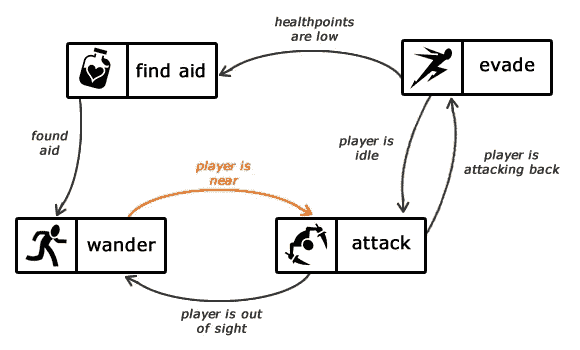

# 人工智能正在重演视频游戏行业

> 原文：<https://towardsdatascience.com/artificial-intelligence-is-replaying-the-video-game-industry-842c440fca08?source=collection_archive---------30----------------------->

**图片:博尔哈·洛佩兹**

## AI 会跟上电子游戏吗？

在过去的几年里，人工智能已经给许多行业带来了巨大的变化。其中包括卫生、法律、零售和音乐行业。今天我将带你了解人工智能是如何改变视频游戏行业的，以及我认为人工智能在未来会把视频游戏带到哪里。

你可能已经意识到了游戏行业目前正在应对的热门平台变化。以前，视频游戏是通过光盘和盒式磁带购买的，然后用来安装游戏或在设备上玩游戏。如今，数字下载是发行的主要形式，在新的转变中，我们看到了通过平台向流媒体游戏转移的显著趋势，如 *Steam* 或谷歌最近推出的自己的视频游戏流媒体平台 *Stadia* 。除了这一发展，我们还看到了从常规流媒体到云流媒体的转变。这就带来了一个问题:“云流媒体会取代游戏机吗？”

**图片:Stas Knop**

## 为什么要在电子游戏中使用 AI？🎮

人工智能在视频游戏中的应用比大多数人意识到的要多得多。最早记录的人工智能在视频游戏中的使用可以追溯到 1978 年，当时流行的街机游戏如 Pong、太空入侵者、吃豆人、大金刚和大金刚都集成了某种形式的人工智能。人工智能主要对游戏中编码的某些动作以及一些随机移动做出反应。尽管游戏中的角色并没有边玩边学习，但这是在电子游戏中首次引入人工智能。

《吃豆人》于 1980 年**首次发布，里面有一些类似 AI 的元素。有四个幽灵出现在这个名为。Inky，Blinky，Pinky 和 Clyde，每个人都有自己的个性，目的是游戏永远不会无聊。反过来，它会有玩家可以学习的行为。比如 Blinky 喜欢追吃豆人，Pinky 喜欢伏击吃豆人。**

在视频游戏中用于模拟人工智能的一种广泛使用的算法是有限状态算法或 [*有限状态机*](https://gamedevelopment.tutsplus.com/tutorials/finite-state-machines-theory-and-implementation--gamedev-11867) 。有限状态算法表示并控制视频游戏的执行流程。它由一个或多个状态组成，但一次只能有一个状态处于活动状态。作为实现人工智能的一种方式，它工作得很好，因为它对视频游戏中的不同场景做出了很好的响应。

**图片:费尔南多·贝维拉克瓦**

目前大多数游戏中人工智能最常见的用途是在非玩家角色(通常指 NPC)中。NPC 只是一个不受用户控制的角色，然而，它是用来增强游戏体验的。NPC 使用人工智能来控制他们对游戏中用户行为的反应。

***图片:*凯文·彼德维尔**

## 目前使用人工智能的视频游戏🎮

“视频游戏”中的人工智能*实际上*可以追溯到 **1948 年**，当时艾伦·图灵(通常被称为计算机科学之父)和大卫·尚珀诺恩为流行的棋盘游戏国际象棋开发了一种算法。这种算法是在计算机甚至可以执行简单查询之前开发出来的。这个项目被称为“涡轮增压”。

如今，《侠盗猎车手 5》(gt a5)已经将人工智能编入其中。虽然自动驾驶汽车还不允许在现实世界中的全球道路上漫游，但《侠盗猎车手 5》却不是这样。游戏中实施了一定数量的人工智能，以允许汽车学习如何自动驾驶。这个概念是由一个狂热的程序员和成功的商人 Harrison“sendex”Kinsley 提出的。多年来，GTA 5 一直被用于大学的人工智能研究。虽然 *Rockstar Games* 不赞成他们的代码未经他们允许就发表，但这并不能改变这些年来对人工智能研究有益的事实。

《红色死亡救赎 2》背后的团队希望为玩家创造一种身临其境的体验。这包括一个动态的环境，它会随着你的行动而真实地变化。还有一个人工智能奖杯，一旦完成三部分任务就可以领取。任务包括通过在特定时间(白天或晚上)完成一系列任务来定位 Marco Dragic。

最令人印象深刻的是《使命召唤 2》中使用的开创性 AI。玩家周围有许多盟军士兵，他们完全意识到周围环境的变化。他们还可以使用一个新的上下文敏感的战斗聊天系统来警告玩家。他们可以吸引敌人的火力，并移动坦克到盾牌作为掩护。他们也可以警告你即将到来的军队和激进分子的火力。

**图片:苏米尔·库马尔**

## 人工智能在电子游戏中的未来🎮

人工智能在不断进步。我们训练人工智能越多，给它的数据越多，它就变得越好。这是真的，尤其是在电子游戏中。人工智能从玩家的输赢中学习。在识别这些成功和失败时，人工智能可以用来识别这些在哪里发生以及它们是如何发生的。

2021 年**，中国游戏市场将达到 350 亿美元。中国游戏市场巨大，据说还会变得更大，仅中国就有超过 **6 亿**“游戏玩家”。这是一个巨大的数字，这些统计数据对中国市场来说非常有希望。**

****

**图片:杰西卡·刘易斯**

**正如你所看到的，视频游戏行业目前正在经历一些大的变化，这对于游戏爱好者来说是非常令人兴奋的。然而，他们可能还需要一段时间才能赶上现有的高水平人工智能，并将其应用到游戏中。**

****所有观点和意见仅代表我个人，不代表甲骨文****