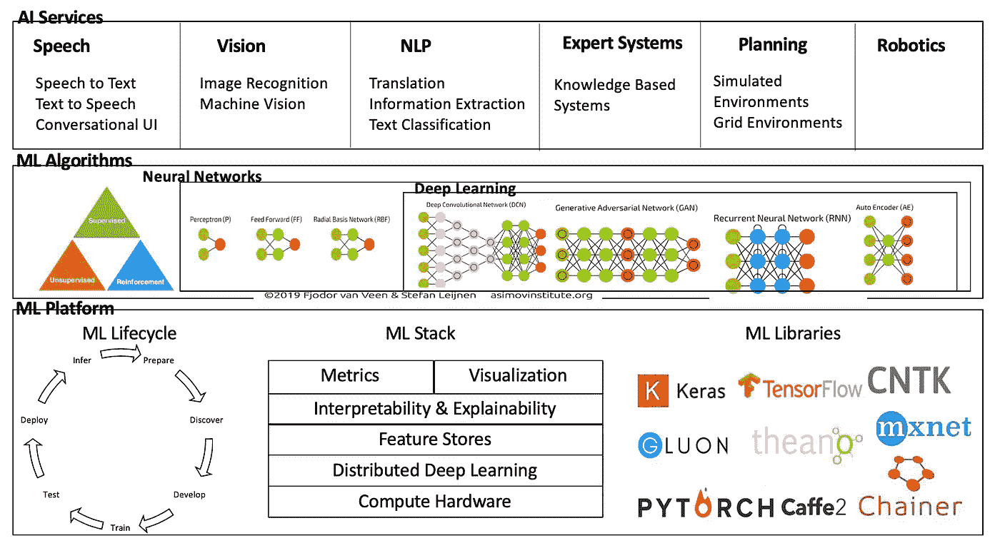
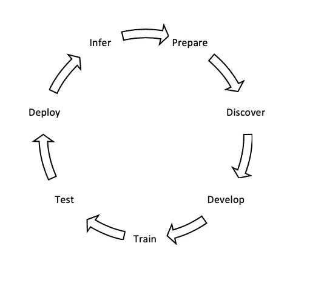
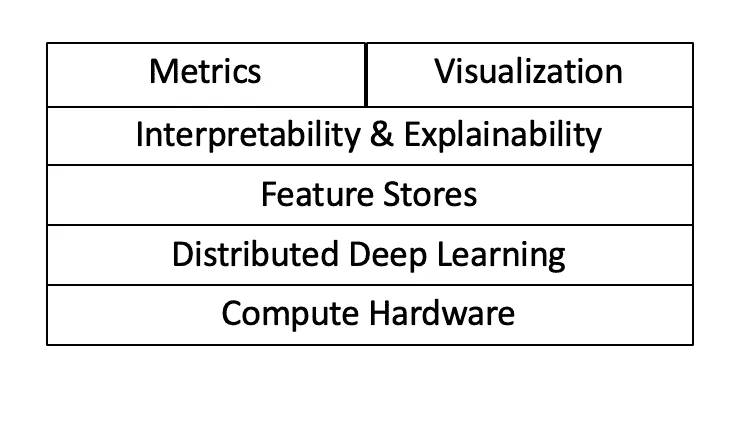

# 人工智能领域——100 篇优秀文章和研究论文

> 原文：<https://towardsdatascience.com/artificial-intelligence-landscape-100-great-articles-and-research-papers-6ccd07237587?source=collection_archive---------51----------------------->

AI/ML 景观

早在 2015 年，我就写过一篇关于 [100 篇大数据论文](https://www.linkedin.com/pulse/100-open-source-big-data-architecture-papers-anil-madan/)的文章，以帮助揭开景观的神秘面纱。同样的，我认为为 AI 做一个也不错。最初的部分是关于基础的，并提供了一些很好的链接来巩固你的基础。后半部分有一些很棒的研究论文的链接，是为想了解理论和细节的高级从业者准备的。

人工智能是一场革命，正在改变人类的生活和工作方式。机器能够以人类认为“智能”的方式执行任务是一个广泛的概念——这个术语可以追溯到 70 年前(见历史[此处](https://medium.com/future-today/understanding-artificial-intelligence-f800b51c767f))艾伦·图灵，他定义了一个测试[图灵测试](https://en.wikipedia.org/wiki/Turing_test)，来测量机器表现出与人类同等或不可区分的智能行为的能力。这场革命有许多复杂的运动部件。我的目标是简化这些复杂的部分，并提供一个三层蛋糕的视角。顶层是人工智能服务，即解决实际问题的实际应用，中间层由基本的 ML 算法组成，而底层是实现前两者的 ML 平台。

首先是基本定义，**人工智能** ( **AI** )是由[机器](https://en.wikipedia.org/wiki/Machine)展示的[智能](https://en.wikipedia.org/wiki/Intelligence)，与人类展示的**自然智能**形成对比。机器学习(ML)是人工智能的一个子集，它基于这样一个想法，即我们应该真正能够让机器访问数据，并让它们自己学习。神经网络(NN)进一步是 ML 的子集，其中计算机系统被设计成通过以与人脑相同的方式对信息进行分类来工作。深度学习(DL)进一步是 ML 的子集，它使用多层人工神经网络来解决复杂的问题，如对象检测、语音识别和语言翻译。

关于人工智能、人工智能和人工智能之间的区别，可以在[这里](/notes-on-artificial-intelligence-ai-machine-learning-ml-and-deep-learning-dl-for-56e51a2071c2)和[这里](/ai-machine-learning-deep-learning-explained-simply-7b553da5b960)找到一些很棒的读物。神经网络的基础知识很好的解释了[这里](https://gadictos.com/neural-network-pt1/)和通过代码[这里](/first-neural-network-for-beginners-explained-with-code-4cfd37e06eaf)和[这里](/machine-learning-for-beginners-an-introduction-to-neural-networks-d49f22d238f9)。人工智能可以根据*类型*进行分类，如这里所解释的[狭窄、一般或强大](https://www.javatpoint.com/types-of-artificial-intelligence)或者反应机器、有限记忆、心理理论和自我意识的级别，如这里所解释的[和](https://www.aware.co.th/three-tiers-ai-automating-tomorrow-agi-asi-ani/)

# ML 算法

ML 算法可以分解为有监督的、无监督的和强化学习(这里解释[这里解释](https://www.newtechdojo.com/list-machine-learning-algorithms/)，这里解释[这里解释](/types-of-machine-learning-algorithms-you-should-know-953a08248861)，这里解释[这里解释](https://machinelearningmastery.com/a-tour-of-machine-learning-algorithms/))。ML 和 DL 在如何提取特征方面有所不同。传统的 ML 方法要求数据工作者通过应用学习算法来明确地提取特征。另一方面，在 DL 的情况下，特征由算法自动学习，并且不需要特征工程-例如，来自谷歌的 [Meena](/meena-googles-new-chatbot-657241cf5595) 新聊天机器人具有 2.6B 特征。这是 DL 相对于传统 ML 方法的优势。

神经网络受我们大脑中神经元的启发，旨在识别复杂数据中的模式。我们大脑中的神经元被组织成一个数十亿的巨大网络，每个神经元通常与成千上万的其他神经元相连，这些神经元通常位于连续的层中，尤其是在大脑皮层(即大脑的外层)。神经网络有输入层、输出层和隐藏层。具有两个或更多隐藏层的神经网络被称为深度神经网络。

人工神经网络(ANN)模拟生物神经系统。一层的输出通过使用*激活函数*进行转换，成为下一层的输入。激活函数是附属于网络中每个神经元的数学方程，并基于每个神经元的输入是否与模型的预测相关来确定是否应该激活(“激发”)它。激活函数可以是线性的或非线性的。TanH、Sigmoid、ReLU、Leaky ReLU 的按键激活功能在[这里](/activation-functions-neural-networks-1cbd9f8d91d6)和[这里](/deep-study-of-a-not-very-deep-neural-network-part-2-activation-functions-fd9bd8d406fc)都有解释。

有不同种类的人工神经网络，如这里的[和这里的](/types-of-neural-network-and-what-each-one-does-explained-d9b4c0ed63a1)和所述。一个完整的神经网络图是[这里是](/the-mostly-complete-chart-of-neural-networks-explained-3fb6f2367464)。

*   [感知器](/what-the-hell-is-perceptron-626217814f53)是单层神经网络。感知器是最古老和最简单的神经网络，创建于 1958 年。它有一个输入层和一个输出层(没有隐藏层)。感知器无法学习复杂的模式，特别是，它们无法解决一些琐碎的问题，例如*异或* (XOR)分类问题。
*   多层感知器(MLP)又名“香草”网络——感知器的局限性可以通过堆叠多个感知器来消除。MLP 是深度学习的基础。*全连接层或密集层*是一个层，其中一层中的所有神经元都连接到前一层中的所有其他神经元。
*   卷积神经网络引入了卷积层和子采样层。与 MLPs 中的全连接层不同，卷积层仅连接到其各自前一层的子区域，追求受生物学启发的局部感受域的概念。CNN 基本上是一个深度神经网络，由隐藏层组成——卷积层、池层、全连接层和归一化层。CNN 适用于图像和视频识别。一些补充阅读[这里](/illustrated-10-cnn-architectures-95d78ace614d)，这里[这里](/introduction-to-convolutional-neural-networks-cnn-with-tensorflow-57e2f4837e18)，这里[这里](/image-classification-in-10-minutes-with-mnist-dataset-54c35b77a38d)。
*   递归神经网络(RNN)是一种特殊的网络，它沿着时间序列而不是空间序列工作，这使得它们对于手写和语音识别等关键问题非常有用。递归神经网络(RNN)在这里[和这里](/illustrated-guide-to-recurrent-neural-networks-79e5eb8049c9)和[有很好的解释。他们患有短期记忆。长短期记忆网络——通常简称为“lstm”——是一种特殊的 RNN，能够学习长期依赖性(长时间记忆信息)，通过维持时间状态来解决 RNN 限制，如本文](http://karpathy.github.io/2015/05/21/rnn-effectiveness/)[所述](http://colah.github.io/posts/2015-08-Understanding-LSTMs/)。门控循环单元是一种更新更简单的 LSTM。LSTM 氏症和 GRU 氏症都有称为“门”的内部机制来调节信息的流动。这里很好的解释了 LSTM 和 GRU 的区别[。](/illustrated-guide-to-lstms-and-gru-s-a-step-by-step-explanation-44e9eb85bf21)
*   生成对抗网络(GAN)(原[论文](https://arxiv.org/pdf/1710.07035.pdf))——是一个特殊的网络，它实际上有两个子网络*生成器*和*鉴别器*不断相互竞争。生成器尝试生成一些数据，鉴别器尝试将生成的数据与真实的样本数据区分开来。基础知识[在这里](/understanding-generative-adversarial-networks-gans-cd6e4651a29)，高级话题[在这里](/comprehensive-introduction-to-turing-learning-and-gans-part-2-fd8e4a70775)。
*   自动编码器([纸](https://arxiv.org/pdf/1606.05908.pdf))和[变分自动编码器](/understanding-variational-autoencoders-vaes-f70510919f73)是实现压缩和解压缩功能的特殊种类的人工神经网络。它们将输入复制到输出，首先将输入压缩成一个潜在空间表示，然后从这个表示中解压缩输出。自动编码器的两个应用是数据去噪和降维。更多[这里](/deep-inside-autoencoders-7e41f319999f)和[这里](/generating-images-with-autoencoders-77fd3a8dd368)。
*   图形神经网络(GNN) ( [论文](http://citeseerx.ist.psu.edu/viewdoc/download?doi=10.1.1.1015.7227&rep=rep1&type=pdf) & [论文](https://arxiv.org/pdf/1812.08434.pdf))是基于深度学习的方法，对图形进行操作。现有机器学习算法的一个关键假设是，每个数据实例都是相互独立的。这种假设不再适用于社交网络、地理地图、分子结构等图形数据，因为每个实例(节点)都通过链接和交互与其他实例相关。gnn 自然有助于对图形数据结构建模。像 CNN 和 RNNs 这样的标准神经网络不能处理图形输入，因为它们在从一层到下一层的处理中是顺序的。这里的基础[这里的](/https-medium-com-aishwaryajadhav-applications-of-graph-neural-networks-1420576be574)和[这里的](/a-gentle-introduction-to-graph-neural-network-basics-deepwalk-and-graphsage-db5d540d50b3)。GNN(这里的基础知识[)和 CNN 的混合被称为图形卷积网络(GCN)，RNN 被称为图形时空网络，自动编码器被称为图形自动编码器。卷积网络(GCN)是更有趣的网络(基础知识](/beyond-graph-convolution-networks-8f22c403955a)[这里](/beyond-graph-convolution-networks-8f22c403955a))。这些还有两种口味。光谱 gcn 或空间 gcn。谱 gcn 使用类似于常规卷积神经网络处理方式的滤波器。另一方面，空间 GCN 通过聚集邻居节点进行卷积。
*   脉冲神经网络(SNN) ) ( [论文](https://arxiv.org/pdf/1804.08150.pdf))是下一代人工神经网络，它希望通过使用类似于我们大脑中神经元功能的模型来弥合神经科学和机器学习之间的差距。顾名思义，SNNs 使用离散的激活阈值或峰值，而不是常用网络中的连续值。更多[此处](/spiking-neural-networks-the-next-generation-of-machine-learning-84e167f4eb2b)。

鉴于神经网络模型的复杂性和爆炸式增长，有相当多的努力来自动化架构工程，以找到针对给定业务问题的最佳机器学习模型的设计[神经架构搜索](/neural-architecture-search-nas-the-future-of-deep-learning-c99356351136)。这是 AutoML 和超参数优化的一个子领域。更多[这里](/neural-architecture-search-nas-the-future-of-deep-learning-c99356351136)和[这里](/everything-you-need-to-know-about-automl-and-neural-architecture-search-8db1863682bf)。

# ML 平台

重要的努力不是花费在创新新的学习算法或模型上，而是花费在使 ML 工具和基础设施更好上。ML 平台为机器学习开发人员、数据科学家和数据工程师提供了基础，使他们的 ML 项目从构思到生产和部署，快速且经济高效。

## ML 生命周期

典型的 **ML 生命周期**始于数据准备，随后是(特征)发现、开发和训练模型、测试、部署，最后使用模型进行推理或预测。数据准备通常与获取、导出和清理足够的训练数据以馈入 ML 算法相关联。特征发现和提取识别对业务领域最重要的关键数据属性。部署包括可观察性、可调试性、监控和生产化。Auto ML [框架](https://medium.com/georgian-impact-blog/choosing-the-best-automl-framework-4f2a90cb1826)的云特定基准可以在[这里](https://arxiv.org/pdf/1808.06492.pdf)找到。

在现代 ML 生命周期中有几个挑战(见[技术债务](https://papers.nips.cc/paper/5656-hidden-technical-debt-in-machine-learning-systems.pdf))。

*   多个算法和库——ML 开发人员通常希望尝试每一个可用的算法来构建最精确的模型，一个正在进行项目的团队可能会尝试多个处理库——例如 [MxNet](https://www.cs.cmu.edu/~muli/file/mxnet-learning-sys.pdf) 、 [TensorFlow](http://download.tensorflow.org/paper/whitepaper2015.pdf) 、 [Clipper](https://www.usenix.org/system/files/conference/nsdi17/nsdi17-crankshaw.pdf) 、 [Caffe](https://arxiv.org/pdf/1408.5093.pdf) 、 [PyTorch](https://papers.nips.cc/paper/9015-pytorch-an-imperative-style-high-performance-deep-learning-library.pdf) 、 [Theano](https://arxiv.org/pdf/1605.02688.pdf) 、 [Chainer](https://arxiv.org/pdf/1908.00213.pdf) 。
*   实验-从输入数据到超参数，模型预测可能会受到数百个配置参数的影响。
*   精度——从训练到部署的模型可能会从数据科学家易手到数据工程师，后者可能最终会使用不同版本的库，导致模型性能不佳。
*   部署-由于多种推理环境，如 REST 服务、批处理和在线评分，因此存在挑战。像 [Kubeflow](https://medium.com/de-bijenkorf-techblog/deploying-machine-learning-models-with-kubeflow-b2cb45cf22f5) 这样的框架使得部署更加简单

斯坦福大学的 MLFlow 开源项目(Databricks)和 [DAWN](https://arxiv.org/pdf/1705.07538.pdf) (面向下一步的数据分析)Stack 是试图解决这些挑战的两项努力。MLflow 的关键原则是一个*开放接口*设计，与现有的 ML 平台如脸书 [FbLearner](https://engineering.fb.com/core-data/introducing-fblearner-flow-facebook-s-ai-backbone/) 、[优步](/uber-has-been-quietly-assembling-one-of-the-most-impressive-open-source-deep-learning-stacks-in-b645656ddddb) [米开朗基罗](https://eng.uber.com/michelangelo/)、[网飞](https://blog.valohai.com/machine-learning-infrastructure-lessons-from-netflix)、谷歌 [TFX](http://stevenwhang.com/tfx_paper.pdf) 、Airbnb [大头](https://conferences.oreilly.com/strata/strata-ny-2018/public/schedule/detail/69383)和[腾讯](http://www.vldb.org/pvldb/vol7/p1772-tencent.pdf)(见此处的对比[)相比，这种开放接口设计在保留生命周期管理优势的同时给予用户灵活性和控制权。除了解决 ML 生命周期的挑战之外，DAWN Stack 还解决了从新接口到新硬件的抽象问题。](/five-open-source-reference-architectures-designed-to-build-machine-learning-at-scale-5090c3733f09)

## ML 堆栈

1)计算硬件——对计算硬件——CPU、GPU 和 TPU——的一个很好的观察可以在来自[脸书](https://research.fb.com/wp-content/uploads/2017/12/hpca-2018-facebook.pdf)和[谷歌](https://arxiv.org/pdf/1704.04760.pdf)的这些论文中找到。量子物理学和 ML 的交叉产生了[量子机器学习](/exploring-tensorflow-quantum-googles-new-framework-for-creating-quantum-machine-learning-models-3af27ba916e9)。谷歌最近开源了 [Tensorflow Quantum](https://www.tensorflow.org/quantum) ，使用[谷歌 Cirq](https://github.com/quantumlib/Cirq) 等框架进行混合经典量子模型的快速原型制作。

2)分布式深度学习——运行高度并行的模型需要[并发(见分析](https://arxiv.org/pdf/1802.09941.pdf))和调度器( [DL2](https://arxiv.org/pdf/1909.06040.pdf) 、 [Optimus](https://i.cs.hku.hk/~cwu/papers/yhpeng-eurosys18.pdf) 和[忒瑞西阿斯](https://www.usenix.org/system/files/nsdi19-gu.pdf))。在构建分布式深度学习框架方面有很多进展，在这里可以找到很好的介绍其中比较流行的有 Google [GPIPE](https://arxiv.org/pdf/1811.06965.pdf) 、优步 [Horovard](https://arxiv.org/pdf/1802.05799.pdf) 、DeepMind 的 [TF-Replicator](https://arxiv.org/pdf/1902.00465.pdf) 和微软的[pipe dream](https://arxiv.org/pdf/1806.03377.pdf)[Zero&deep speed](https://www.microsoft.com/en-us/research/blog/zero-deepspeed-new-system-optimizations-enable-training-models-with-over-100-billion-parameters/)。

3)特征存储允许不同的团队管理、存储和发现用于机器学习项目的特征。它充当数据工程和数据科学之间的 API，实现改进的协作。一个很棒的介绍可以在[这里](/what-are-feature-stores-and-why-are-they-critical-for-scaling-data-science-3f9156f7ab4)找到，这里列出了[的特色店列表。几个受欢迎的是来自谷歌的](http://featurestore.org/)[盛宴](https://cloud.google.com/blog/products/ai-machine-learning/introducing-feast-an-open-source-feature-store-for-machine-learning)和一些背景[这里](/using-feast-to-centralize-feature-storage-in-your-machine-learning-applications-dfa84b35a1a0)，来自 Logicalclocks 的 [HopsWorks](https://uploads-ssl.webflow.com/5e6f7cd3ee7f51d539a4da0b/5e6f7cd3ee7f519fdfa4dadb_feature%20store%20whitepaper%201-0.pdf) ，来自 LinkedIn 的 [Frame](https://www.slideshare.net/DavidStein1/frame-feature-management-for-productive-machine-learning) 和来自 Airbnb 的 [ZipLine](https://youtu.be/iUnO4MLAGDU) 。 [ML Ops](/mlops-with-a-feature-store-816cfa5966e9) 可以与一个特性库相结合，实现模型的训练、测试和部署的自动化。

4)可解释性和可解释性——AI 系统中信任的 4 个特征是 i) *公平性*其中模型和数据没有偏见 ii) *健壮性*其中不容易篡改或损害他们被训练的数据 iii) *可解释性*其中决策可以被他们的消费者理解 iv) *沿袭*允许审计模型生命周期的开发、部署和维护的能力。这些技术中最突出的是莱姆[和 SHAP](/idea-behind-lime-and-shap-b603d35d34eb) ，它们基于模型不可知的方法，专注于解释给定黑盒分类器的单个预测。局部可解释模型不可知解释(LIME)提供了一种快速的方法，通过随机地反复扰动模型特征来获得预测，然后使用预测来计算近似的线性“解释模型”。SHAP (SHapley 附加解释)通过计算每个特征对预测的贡献来工作。它源于联盟博弈论，其中数据实例的每个特征值充当联盟中的参与者，并计算每个特征的边际贡献或支出(参见 Chris Molnar 的可解释机器学习[书](https://christophm.github.io/interpretable-ml-book/))。这两种技术之间的进一步区别在[这里](https://medium.com/ibm-garage/explaining-black-box-models-ensemble-and-deep-learning-using-lime-and-shap-53c59d9f09b3)有详细描述。Google 的可扩展性白皮书[论文](https://storage.googleapis.com/cloud-ai-whitepapers/AI%20Explainability%20Whitepaper.pdf)也是很好的参考。

为了消除[偏见](/how-to-detect-bias-in-ai-872d04ce4efd)，谷歌最近引入了几个新方法，用概念激活向量( [TCAV](/tcav-interpretability-beyond-feature-attribution-79b4d3610b4d) )和联合学习进行测试。TCAV 从实例数据中学习概念。例如，TCAV 需要实例数据中的几个女性实例，以学习“性别”概念。人类使用概念来思考和交流，而不是使用每个特征的权重。TCAV 解释了人类相互交流的方式。[联合学习](https://ai.googleblog.com/2017/04/federated-learning-collaborative.html)将模型训练推到边缘(以防移动计算到设备)。

5)可视化——与模型可解释性和可解释性相关的是模型可视化。[白盒](https://medium.com/sciforce/introduction-to-the-white-box-ai-the-concept-of-interpretability-5a31e1058611) AI 查看模型复杂性和模型意识，以得出不同的可视化[技术](https://medium.com/sciforce/white-box-ai-interpretability-techniques-93ef257dd0bd)。谷歌开源了 [Facets](https://ai.googleblog.com/2017/07/facets-open-source-visualization-tool.html) 来帮助可视化训练数据，优步内部使用 [Manifold](https://arxiv.org/pdf/1808.00196.pdf) ，而脸书有 [HiPlot](https://ai.facebook.com/blog/hiplot-high-dimensional-interactive-plots-made-easy/) 。

6)指标-指标用于衡量模型的质量和性能。有许多不同类型的评估指标可用于测试模型。这些包括混淆矩阵、分类准确度、精确度、召回率、ROC、AUC、F1 分数、灵敏度、特异性、对数损失、均方误差和平均绝对误差。三部曲[系列](http://mkhalusova.github.io/blog/2019/04/11/ml-model-evaluation-metrics-p1)是很好的参考。另一个介绍性的参考是[这里的](/20-popular-machine-learning-metrics-part-1-classification-regression-evaluation-metrics-1ca3e282a2ce)。就模型预测而言，偏差和方差之间有一个[权衡](/understanding-the-bias-variance-tradeoff-165e6942b229)，这可能由于欠拟合或过拟合而发生。为了建立一个好的模型，你需要通过在偏差和方差之间找到一个好的平衡来最小化总误差。另一个需要测量的重要事情是[概念漂移和模型衰减](/concept-drift-and-model-decay-in-machine-learning-a98a809ea8d4)。[概念漂移](https://machinelearningmastery.com/gentle-introduction-concept-drift-machine-learning/)发生在输入和输出数据之间的关系会随着时间而改变时，这意味着根据旧数据训练的模型不再像根据最近数据训练的模型那样准确。防止[模型衰变](/why-machine-learning-models-degrade-in-production-d0f2108e9214)的一个好方法就是持续监控和维护它。

最后，接下来的部分是给对构建和扩展 ML 算法和平台感兴趣的 AI 技术专家的。

*   [深度学习的架构、算法和应用的调查](https://www.cambridge.org/core/services/aop-cambridge-core/content/view/S2048770313000097)
*   [深度学习调查](https://eclass.uop.gr/modules/document/file.php/DIT209/%CF%80%CF%81%CE%BF%CF%84%CE%B5%CE%B9%CE%BD%CF%8C%CE%BC%CE%B5%CE%BD%CE%B7%20%CE%B8%CE%B5%CE%BC%CE%B1%CF%84%CE%BF%CE%BB%CE%BF%CE%B3%CE%AF%CE%B1%202019-2020/A%20Survey%20on%20Deep%20Learning%20Algorithms%2C%20Techniques%2C.pdf):算法、技术和应用
*   [机器学习框架和库的调查](https://www.researchgate.net/publication/329990977_Machine_Learning_and_Deep_Learning_frameworks_and_libraries_for_large-scale_data_mining_a_survey)
*   [调查](https://arxiv.org/pdf/1903.11314.pdf)分布式基础设施上的可扩展深度学习:挑战、技术和工具
*   [大规模图网络的调查](https://arxiv.org/pdf/1901.00596.pdf)。