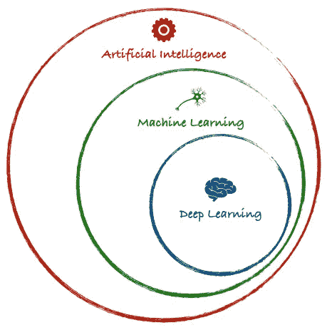
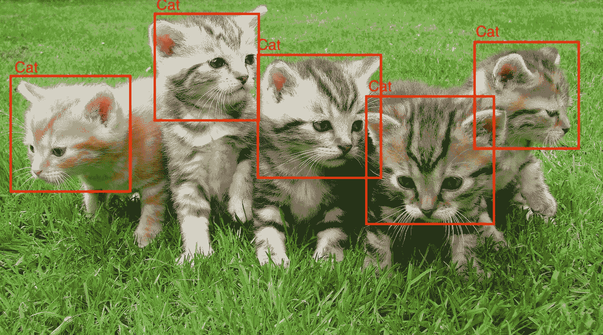
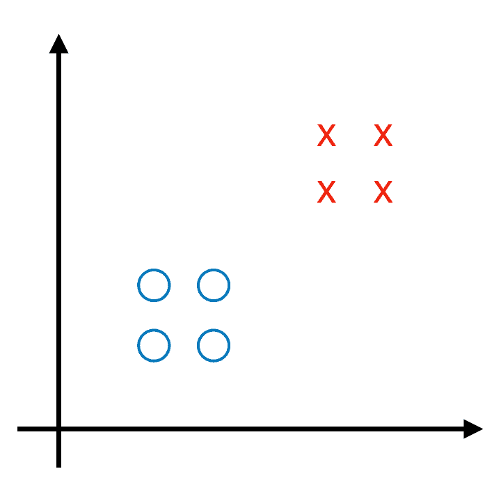
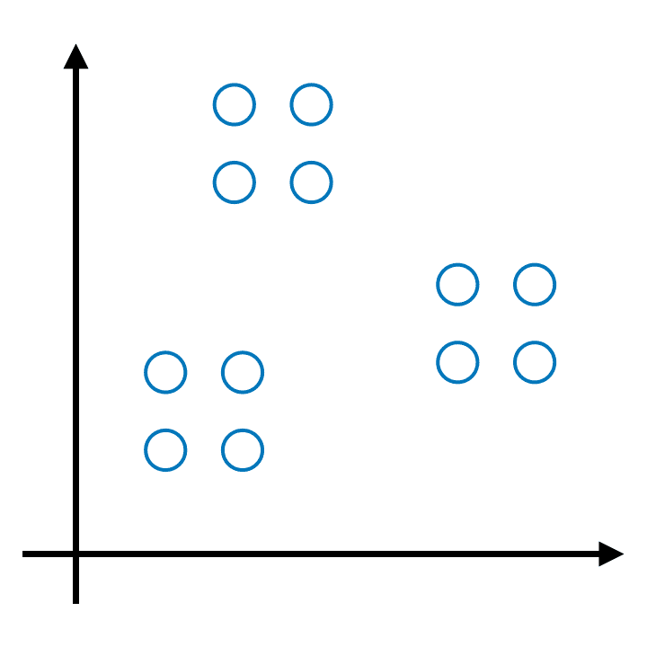
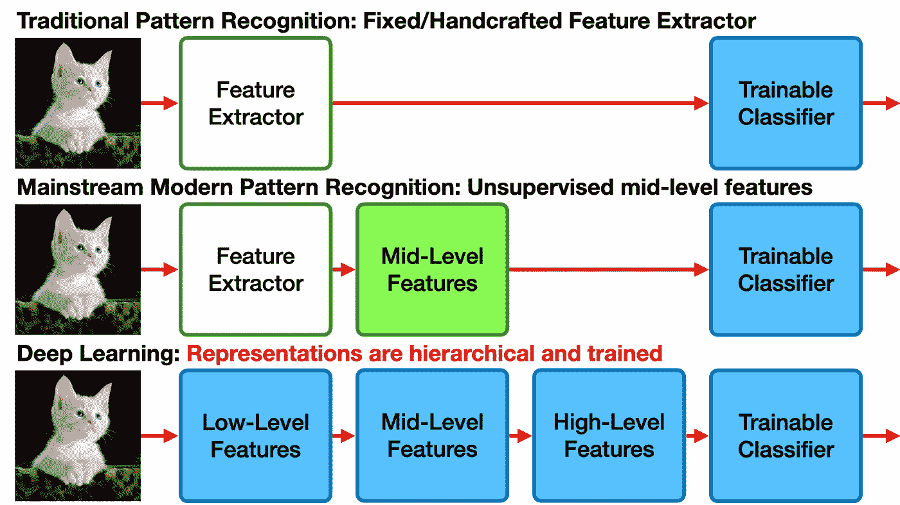

# 人工智能、机器学习和深度学习——有什么区别？

> 原文：<https://towardsdatascience.com/artificial-intelligence-machine-learning-and-deep-learning-what-the-difference-8b6367dad790?source=collection_archive---------18----------------------->

## 人工智能、机器学习和深度学习的简单解释以及它们之间的区别

在 [Unsplash](https://unsplash.com?utm_source=medium&utm_medium=referral) 上 [NeONBRAND](https://unsplash.com/@neonbrand?utm_source=medium&utm_medium=referral) 拍摄的照片

> 人工智能是新的电力— [吴恩达](https://en.wikipedia.org/wiki/Andrew_Ng)

电力改变了世界的运作方式。它改变了运输、制造、农业，甚至医疗保健。比如电灯发明之前，人类仅限于白天活动，因为晚上很黑，只有[买得起煤气灯](https://www.reference.com/history/did-electricity-change-people-s-lives-c8345e8866d3343)的人才能做活动。相比现在，我们仍然可以在晚上进行活动，因为它是由电灯照明的。

人工智能(AI)也是如此。 [AI 预计也有类似效果](https://www.gsb.stanford.edu/insights/andrew-ng-why-ai-new-electricity)。我们今天可以举的一个具体例子是广告问题。此前，出现的广告是由人类手动确定的。现在，出现的广告是由人工智能根据用户档案数据确定的。例如，如果用户喜欢时尚，那么可能出现的是服装广告。

随着技术的进步，人工智能领域的研究也在增长，因此以前定义人工智能(AI)的基准现在变得过时了。

从这一发展中产生了机器学习和深度学习等新术语。但有时，AI、机器学习和深度学习之间存在切片，因此它们之间的区别可能非常不清楚。所以在这篇文章中，我将快速解释一下人工智能，机器学习和深度学习的含义以及它们之间的区别。

让我们从这张图片开始。

人工智能、机器学习和深度学习

从图片中我们可以看出，机器学习是人工智能的一部分，深度学习是机器学习的一部分。然而，有些人认为人工智能和机器学习是分开的。然而，在这篇文章中，我将讨论机器学习是人工智能的一部分。更多细节，让我们更明确什么是 AI。

# 人工智能

在 [Unsplash](https://unsplash.com?utm_source=medium&utm_medium=referral) 上由 [Franck V.](https://unsplash.com/@franckinjapan?utm_source=medium&utm_medium=referral) 拍摄的照片

人工智能已经研究了几十年，仍然是计算机科学中最难理解的学科之一。这部分是因为这个主题是多么的庞大和模糊。这在我们在社会中使用计算机的几乎每一个方面都有应用。人工智能是指在机器中对人类智能的[模拟，这些机器被编程为像人类一样思考并模仿他们的行为。](https://rifqimulyawan.com/blog/pengertian-kecerdasan-buatan)

人工智能这个术语是由约翰·麦卡锡在 1956 年首次提出的，当时他就这个主题召开了第一次学术会议。尽管，理解机器是否真的能思考的旅程在那之前很久就开始了。

人工智能通常会分析其环境，并采取行动来最大化其成功的机会。在早期，人工智能的方法是形式逻辑和专家系统。这些方法在当时统治了 AI。

然而，随着计算能力的发展，更加强调解决具体问题，人工智能与其他领域之间也有了新的联系。由此产生的一种方法就是学习，或者我们称之为机器学习。

# 机器学习

马里奥·高在 [Unsplash](https://unsplash.com?utm_source=medium&utm_medium=referral) 上拍摄的照片

按照字面意思，机器学习就是从数据中学习的机器。机器学习模仿了人类从童年到成年的学习概念。例如，如果教婴儿区分狗和猫，他们会得到狗和猫的图片，以及机器，如果你想让机器学习，我们必须向机器提供关于狗和猫的知识。给出的图片越多，机器区分猫和狗的能力就越强。

图像检测—来源:pix abay([https://www . pexels . com/photo/kitten-cat-rush-lucky-cat-45170/](https://www.pexels.com/photo/kitten-cat-rush-lucky-cat-45170/))

机器学习与计算统计学密切相关，计算统计学侧重于做出预测。数据挖掘也与这项研究有关，这项研究侧重于通过无监督学习进行探索性数据分析。

在机器学习中，使用了几种类型的算法，并根据算法的预期输入和输出进行分组。

## 监督学习

监督学习创建将输入映射到期望输出的函数，例如在分类中。它观察数据的模式，并将它们转换成模型来预测未来的数据。更多细节，我们看这个例子。

分类示例

从上图可以看出，起初我们只有 cross 和 round 类的数据。然后我们有了新的数据，三角形。然后，根据之前训练的模型预测新数据。因为新数据与交叉类具有相似性，所以这些数据被分类到交叉类中。

包括在监督学习中的方法的一个例子是神经网络、kNN、决策树、朴素贝叶斯、SVM 等。

## 无监督学习

无监督学习对输入集进行建模，例如聚类。不同于每个数据都有一个类的分类。聚类的工作原理是将相似的数据分组。

聚类示例

从上图可以看出，首先，我们有一组数据，然后根据数据与其他数据的相似性将数据分组到特定的组中。

包括在监督学习中的方法的一个例子是 k-means、DBSCAN 等。

## 强化学习

强化学习是一种应用于智能代理的学习算法，使它们能够适应其环境中的条件，这是通过最大化可实现的“奖励”奖赏的值来实现的。这种类型教导如何采取行动来处理问题，一个有影响的行动。

最常见的例子是自动驾驶汽车，机器被要求避免碰撞或违规。如果发生事故或违规，那么机器将获得负奖励，如果机器做得对，将获得正价值。从那里，机器将学习驾驶汽车。

从上面的一些解释，也许我们已经明白了什么是机器学习。其中机器学习侧重于根据过去的现有数据预测未来事件。

如今，几乎所有 AI 领域的行业都专注于开发机器学习，如情感分析、图像识别等。这是基于今天机器学习的快速发展。

然而，上面提到的方法仍然有弱点，其中之一对于复杂数据不是最佳的。因此，在下一节中，我将讨论机器学习的下一个级别，即深度学习。

# 深度学习

乔希·里默尔在 [Unsplash](https://unsplash.com?utm_source=medium&utm_medium=referral) 上的照片

深度学习是基于学习多层(即深度)表示/抽象的机器学习算法，受大脑结构和功能的启发，称为人工神经网络**。**基本上深度学习就是一个大型的神经网络。

你可能会问，需要多少层才算深度？这个问题没有明确的答案，但通常有两个或两个以上的隐藏层算作深度。“深度”这个术语本身是由 Geoffrey Hinton 在他题为“ [*深度信念网的快速学习算法*](http://www.mitpressjournals.org/doi/pdf/10.1162/neco.2006.18.7.1527) ”的论文中引入的，用来解释大型人工神经网络的发展。

现在新的深度学习正在出现的一个原因是，已经有更快的机器和多核 CPU/GPU，以及更快和开放的分布式系统(Hadoop、Spark 等)。

与传统的机器学习方法相比，深度学习的优势在于能够处理大量的数据集，并减少建模中的人工干预。

脸书人工智能研究总监 [Yann LeCun](https://en.wikipedia.org/wiki/Yann_LeCun) 发表了题为“[卷积网络:释放机器学习对于强感知系统的潜力](http://www.embedded-vision.com/platinum-members/embedded-vision-alliance/embedded-vision-training/videos/pages/may-2014-embedded-vision-summit-facebook-keynote)的演讲，深度学习之所以被称为 deep，是因为它有几个阶段来识别一个对象，所有这些都是训练的一部分。深度学习和传统机器学习的区别可以从下图看出来。

学习分层表示法——受[https://www . slide share . net/embedded vision/01-am-keynotelecun](https://www.slideshare.net/embeddedvision/01-am-keynotelecun)启发——pix abay([https://www.pexels.com/photo/animal-pet-cute-kitten-45201/](https://www.pexels.com/photo/animal-pet-cute-kitten-45201/)创作的猫图像

当使用传统的机器学习时，特征提取往往是不够的，我们经常添加中级特征。但这不足以表示数据，通常这部分是通过无监督学习来训练的。基本上，它只是捕捉统计数据，没有做太多。随着深度学习，它被模块流水线所取代，并且是可训练的。但是这是要付出代价的，就是大量的计算，需要大量的数据。

深度学习的方法有很多，比如卷积神经网络(CNN)，长短期记忆(LSTM)等。如果你有兴趣了解神经网络架构，可以访问下面的链接。

 [## 人工智能、神经网络、机器学习、深度学习和大数据的备忘单

### 最佳人工智能备忘单的最完整列表

becominghuman.ai](https://becominghuman.ai/cheat-sheets-for-ai-neural-networks-machine-learning-deep-learning-big-data-678c51b4b463) 

以下是深度学习的应用实例。

*   自动驾驶汽车
*   机器翻译
*   图像彩色化

如果你有兴趣更好地理解神经网络，你可以尝试使用 Tensorflow 游乐场。

 [## 张量流-神经网络游乐场

### 这是一种构建从数据中学习的计算机程序的技术。它非常松散地基于我们如何思考…

playground.tensorflow.org](https://playground.tensorflow.org/) 

如果你喜欢这个帖子，你可以看看我的其他故事。

 [## 如何开始一个机器学习项目

### 做机器学习项目的分步指南

towardsdatascience.com](/how-to-start-a-machine-learning-project-5654832cb1ed)