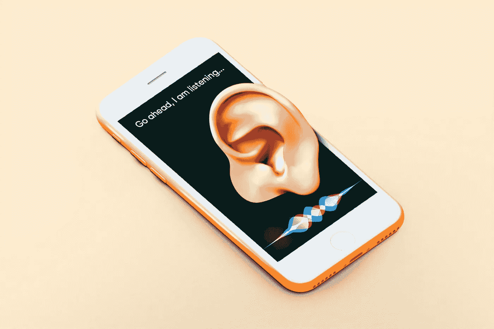

# 人工智能可能会让你获得重身幽灵奖

> 原文：<https://towardsdatascience.com/artificial-intelligence-might-just-get-you-your-doppelganger-6511be7a405b?source=collection_archive---------66----------------------->

## 如果你曾经想过在世界的某个地方拥有你的分身，人工智能可能很快就会实现。

在 [Unsplash](https://unsplash.com/s/photos/artificial-intelligence?utm_source=unsplash&utm_medium=referral&utm_content=creditCopyText) 上由 [Franck V.](https://unsplash.com/@franckinjapan?utm_source=unsplash&utm_medium=referral&utm_content=creditCopyText) 拍摄的照片

人类的大脑远远超出了目前任何机器的能力。虽然计算机执行数百万次计算的速度确实比人脑快得多，但人类可以执行更复杂的活动，如表达情感、在高难度地形中保持身体平衡以及适应不断变化的环境和时间。人工智能(AI)试图弥合人脑和计算机之间的差距。

其中最成功的成果之一，是由汉森机器人公司创造的人形机器人——索菲亚[【1】](https://www.hansonrobotics.com/sophia/)。该公司接着说，

> Hanson Robotics 最先进的类人机器人 Sophia 体现了我们对人工智能未来的梦想。作为科学、工程和艺术的独特结合，Sophia 同时也是一个描绘人工智能和机器人未来的人类科幻小说角色，以及一个高级机器人和人工智能研究的平台。

虽然这可能看起来是一个虚构的角色和一个很酷的概念，但如果有机会与你长期互动，Sophia 甚至可能会像你一样，这可能不是不合理的。有没有想过，*如果你有一个跟你一模一样的二重身 AI 怎么办？这听起来可能既有趣又怪异，但人工智能研究肯定会在不久的将来实现它。*

# 人工智能的艰难旅程

人工智能是一个非常困难的话题，但它看起来很有前途。到 20 世纪上半叶，科幻电影引入了智能类人机器人和计算机的概念。然而，爱好者们并不仅仅把这当成一部小说。到 20 世纪 50 年代初，科学家和研究人员开始对人工智能产生兴趣。艾伦·图灵就是这样一个人，他在理论计算机科学和著名的“图灵机”的发展中具有很高的影响力。在他 1950 年在[发表的论文“计算机械和智能”](https://watermark.silverchair.com/lix-236-433.pdf?token=AQECAHi208BE49Ooan9kkhW_Ercy7Dm3ZL_9Cf3qfKAc485ysgAAArMwggKvBgkqhkiG9w0BBwagggKgMIICnAIBADCCApUGCSqGSIb3DQEHATAeBglghkgBZQMEAS4wEQQM5MX3wMoQwLAgCIOKAgEQgIICZj9_bHWtuaMK3DSUYu5Kvqm91p4268PbdOoZX8g2tphq6Lbegr3ow5tAeNZwMA7zlEWFY2CGdx4oPTIzAW3hq2TrFPfV4e9Ge1mInSHRZjS3kHj8liBvF2aBS7k6dGZT2DjF2z9DZL0fNuQb0o1FmdzcrceiDltsbBQ7m_sOzsyf8_Fvmdk0SFs-GzZYi2U3MNzX1bAXn8YuZfKteht1CQJv2-GWAodxa7TirzJptCxNYkB70a5Ajm_iiw19MwnRYgno6FP60dib62PtNpuXxR1xeVpul1pnRLfOvLrbXdDWIj9lj9C3X7e0UG_W-R99zuSCck_LHm7E0lp6RtljjW1klcx9GnoPXE-0Uwc8cptK3O4Edm8G4Zkmu7we_1NYb_VYtXsNPCEckJ3e2E3npjcOHWUM9O2HoFCFP0EXiVWrP_L5RIvzfQY9e2XU7hQvY8yyZqU-bVKW4RYzJ-vvPczKp5dQhv-UyTX18TEyoZlUOgDG-WCr0iK5li-DgVxj1zi-8-m0Iq0MMtTxdENx1uag8WCyrYibF9enUH9geD8DYjA-o5IGW-_w3g1tqvA6LZITQAN5yFQAjDOZqyE411R0ohlt_nrDs0EfOl7rQNRVJgwddU4b5R7WLw7uluhQt4XxfQM7Y25olkCEOJdSyYjjDY6bhJ7Rz5GLLR7d9wXYfMlhzslBNC6qTaa0FLQVaPD6K_qMPNPWPj9z96jECv_yanyjnG5VTEKlxtO_wa2uJJqZFiAKU_mP6dXkvqZa1EK4sfCleWLGaSAqY0-7AfLbp0RIvfA-vNew7SXlGAUK03cBoBVb)中，艾伦·图灵提出了一个问题——

> 机器会思考吗？

图灵很好奇的发现,*如果人类可以吸收周围的信息来学习和做决定，为什么计算机不能做同样的事情？*从那时起，人工智能研究吸引了大量研究人员，并在世界各地获得了大量资金。根据国际数据公司(IDC)的数据，2019 年全球人工智能支出为 375 亿美元，预计到 2023 年**将达到 979 亿美元**[【3】](https://www.idc.com/getdoc.jsp?containerId=prUS45481219)。

[晨酿](https://unsplash.com/@morningbrew?utm_source=unsplash&utm_medium=referral&utm_content=creditCopyText)在 [Unsplash](https://unsplash.com/s/photos/siri?utm_source=unsplash&utm_medium=referral&utm_content=creditCopyText) 上拍摄的照片

如今，人工智能与人类互动的主要实现之一是通过智能手机、笔记本电脑和数字助理，如 Siri 和 Cortana。它们不仅可以帮助你完成日常任务和设置提醒，还可以了解你的习惯、喜好和厌恶，甚至可以从你的声音和电话使用中检测你的情绪。在 2018 年的谷歌 IO 活动中，谷歌展示了他们的助理如何聪明到可以给一家沙龙打电话，与电话另一端的人互动，并毫无差错地安排约会。

 [## 谷歌刚刚展示了一个令人惊叹的助手打电话的演示

### 在 I/O 2018 的舞台上，谷歌展示了谷歌助手令人瞠目结舌的新功能:在不太遥远的…

www.theverge.com](https://www.theverge.com/2018/5/8/17332070/google-assistant-makes-phone-call-demo-duplex-io-2018) 

# 计算技术的进步

虽然人工智能不仅仅包括神经网络方法，但是神经网络和深度学习对于人工智能的有效性变得越来越重要[【4】](https://www.pnas.org/content/early/2020/01/23/1907373117)。随着硅技术的进步，处理器变得极其**节能、快速和可靠**。此外，存储技术在过去十年中有了很大的发展，在速度惊人的口袋大小的固态硬盘中存储万亿字节的数据已经成为可能，而这在几年前还是不可能的。

这使得研究人员能够建立和训练人工智能所需的大型复杂神经网络[【5】](https://static.googleusercontent.com/media/research.google.com/en//pubs/archive/37631.pdf)，以模拟类似人类的特征，如感情，以及**【合理决策】**[【6】](https://link.springer.com/chapter/10.1007/11893004_69)的重要行为。此外，大量的计算可以在这些不那么耗电的处理器上进行，这使得这种远程应用程序的电池寿命更长。在**更快更准确的传感器及其与机载嵌入式系统的可靠集成方面也正在进行大量的研究**[【7】](https://www.mdpi.com/journal/sensors/special_issues/vision_sens)，这将使这样的人工智能比以往任何时候都更加了解周围的环境——*甚至可能不仅仅是一个活生生的人！*

在更小的外形中更快更大的存储意味着大量的信息可以存储在 AI 硬件中。这可以是由人工智能的设计者存储的信息，但更重要的是，它将使人工智能能够**实时存储信息**——它在与环境交互时经历的信息。这些信息可以被 AI 实时用来学习新的东西——这就是所谓的**【自我意识 AI】**[【8】](https://doi.org/10.3389/frobt.2018.00088)，也就是说，它知道该学什么，不该学什么。这将使这样的人工智能能够适应变化，并更真实地与环境互动。

## 值得一提的是新兴的 5G 技术

5G 正开始成为一种超高速网络，不仅用于数据消费，还用于近乎实时的远程控制——这要归功于其低延迟。这意味着许多人工智能决策可以在云端做出，而不需要本地存储。由于“几乎无限”的可用知识[【9】](https://www.forbes.com/sites/tomtaulli/2020/05/08/how-5g-will-unleash-ai/#5502088c48c3)，在云中存储和计算决策不仅有助于人工智能做出更加**恰当的决策**，还将有助于跟踪和控制人工智能不执行非法或令人反感的任务。值得看看爱立信发布的使用 5G 的远程控制设备的潜在用例。

 [## 5g 远程控制设备- 5g 用例

### 5G 引入了远程控制设备和重型机械的能力，从而释放了改进的潜力…

www.ericsson.com](https://www.ericsson.com/en/5g/use-cases/critical-control-of-remote-devices) 

# 他们知道我们的一切

马库斯·斯皮斯克在 [Unsplash](https://unsplash.com/s/photos/data?utm_source=unsplash&utm_medium=referral&utm_content=creditCopyText) 上拍摄的照片

> 但是二重身是怎么回事？
> 
> 人工智能怎么能像我一样思考和决策？

*你有没有和朋友聊过买 iPhone 的事情，下一刻就看到一个关于最新款 iPhone 的谷歌广告？或者你是否曾经想要点菜，而你最喜欢的菜却自动上来了？或者甚至 LinkedIn 建议你一个完整的信息，你可以用它来回复一个连接？你肯定经历过这个！*

像谷歌和脸书这样的大型科技公司不断收集你的数据——你搜索了什么，你和谁聊天，你喜欢谁的帖子，甚至你喜欢什么音乐。这些数据用于个性化您对他们产品的体验，让他们的产品像您一样思考！但是这些信息的范围远远超出了内容个性化。

这些数据可以专门用来训练 AI 像你一样行为和决策。随着联网设备(智能手机和可穿戴设备)的出现，**关于你睡眠模式的数据，直到对你重要的人**，一切都存储在云中。IEEE[【10】](https://ieeexplore.ieee.org/document/6236985)上的一篇论文也研究了微软 Kinect 在机器人应用中的应用，这是一种检测你姿势的传感器。该论文研究了如何通过逆向工程，使用从人类受试者收集的数据，教会机器人室内导航。

这样的 AI，如果在机器人身上实现，绝对可以在办公会议上替你骗过同事。它不仅看起来像你，行为也像你，而且在某些方面还可能**在决策方面比你更聪明**——这要归功于 5G 和联网设备范式的出现，这将使人工智能能够跟上最新发生的事情。不，我并不是说我们的技术已经为这样的转变做好了准备，但是我们可能已经很接近了。人工智能发展的速度和吸引研究人员的速度，不难想象人工智能在我们周围的未来。但是，这将导致下一个大问题，这是本世纪最大的辩论之一！

# 会危及我们吗？

照片由 [Mikael Seegen](https://unsplash.com/@mikael_seegen?utm_source=unsplash&utm_medium=referral&utm_content=creditCopyText) 在 [Unsplash](https://unsplash.com/s/photos/danger?utm_source=unsplash&utm_medium=referral&utm_content=creditCopyText) 上拍摄

所有这些可能看起来很酷，对人类执行任务和做决策很有帮助。但是，研究人员和非科学界也担心它可能对我们有潜在的危险。

1.  **决策** —许多人担心这种智能决策会让人类过于依赖人工智能工具来为他们做决定。随着这种影响的加深，人们将被迫相信人工智能，而不知道它是如何工作的，这也将妨碍他们独立决策的能力。[【11】](https://ea-foundation.org/files/ai-opportunities-and-risks.pdf)
2.  **网络威胁** —网络安全已经成为现代社会的一个主要问题。随着人和设备的联系越来越紧密，网络攻击者的脆弱性及其可能带来的潜在影响已经是一个令人震惊的问题。随着人工智能的突然涌入及其指数级增长，网络攻击对这种技术的**影响尚未完全知晓**，它可能对社会产生的后果不应被低估。随着越来越多的个人信息被人工智能使用，**数据隐私**等问题也是一个主要问题。
3.  自主人工智能的危险 —随着人工智能变得越来越复杂和智能，人们相信很快它将不再需要人类输入(或所谓的监督学习)来执行任务。它将被编程为自动从环境中学习并决定其行动来执行特定的任务。然而，许多人担心这种自主行为需要在人工智能设计中考虑严格的道德规范，因为它不应该在完成其目标时造成任何伤害或破坏。斯坦福大学的一篇文章很好地说明了人工智能的这个潜在问题。

 [## 人工智能和机器人伦理

### 人工智能(AI)和机器人是将对发展产生重大影响的数字技术…

plato.stanford.edu](https://plato.stanford.edu/entries/ethics-ai/) 

> 人工智能要么是发生在人类身上最好的事情，要么是最坏的事情。~斯蒂芬·霍金

我想以问一个问题来结束这篇文章— *你会给你的二重身取什么名字？请在评论区告诉我。我希望你喜欢这篇文章，它让你了解人工智能如何变得越来越聪明，越来越了解周围的环境，以及数据爆炸如何导致个性化达到这样的水平，以至于你的办公室同事可能会把你的分身误认为你！关于这个问题的更多讨论，请发邮件给我，地址是***【jishnudeep.kar@gmail.com】***或者在 [**Instagram**](https://www.instagram.com/jishnudeepkar/?hl=en) 上给我发 DM。*

## 参考

[1][https://www.hansonrobotics.com/sophia/](https://www.hansonrobotics.com/sophia/)

[2][http://sitn . HMS . Harvard . edu/flash/2017/history-artificial-intelligence/](http://sitn.hms.harvard.edu/flash/2017/history-artificial-intelligence/)

[https://www.idc.com/getdoc.jsp?containerId=prUS45481219](https://www.idc.com/getdoc.jsp?containerId=prUS45481219)

[4][https://www.pnas.org/content/early/2020/01/23/1907373117](https://www.pnas.org/content/early/2020/01/23/1907373117)

[5][https://static . Google user content . com/media/research . Google . com](https://static.googleusercontent.com/media/research.google.com/en//pubs/archive/37631.pdf)

[6]https://link.springer.com/chapter/10.1007/11893004_69

[7][https://www . mdpi . com/journal/sensors/special _ issues/vision _ sens](https://www.mdpi.com/journal/sensors/special_issues/vision_sens)

[https://doi.org/10.3389/frobt.2018.00088](https://doi.org/10.3389/frobt.2018.00088)

[9][https://www . Forbes . com/sites/tomtaulli/2020/05/08/how-5g-will-unleash-ai/](https://www.forbes.com/sites/tomtaulli/2020/05/08/how-5g-will-unleash-ai/#5502088c48c3)

[https://ieeexplore.ieee.org/document/6236985](https://ieeexplore.ieee.org/document/6236985)

[11][https://ea-foundation . org/files/ai-opportunities-and-risks . pdf](https://ea-foundation.org/files/ai-opportunities-and-risks.pdf)

[https://plato.stanford.edu/entries/ethics-ai/](https://plato.stanford.edu/entries/ethics-ai/)

如果你喜欢这篇文章，你可能也会喜欢这些。

 [## 机器学习对于保持家庭照明变得越来越重要

### 机器学习超越了图像分类和语音识别。了解为我们的产品提供动力变得多么重要…

towardsdatascience.com](/machine-learning-is-becoming-increasingly-important-to-keep-your-homes-lit-7bd2e62ca2b)  [## 从印度到美国的文化冲击——一个学生的视角

### 如果你计划去美国，并且对那里的文化太过好奇，这可能是你最好的剧透！

medium.com](https://medium.com/illumination/cultural-shock-visiting-the-usa-from-india-a-students-perspective-1f901df99984)  [## 使用这些技巧让你的 Matlab 代码更快更真实

### 我在 Matlab 上工作和编码的 4 年多的旅程中学到的技巧。

towardsdatascience.com](/make-your-matlab-codes-faster-and-more-realistic-with-these-tips-281389b9d376)