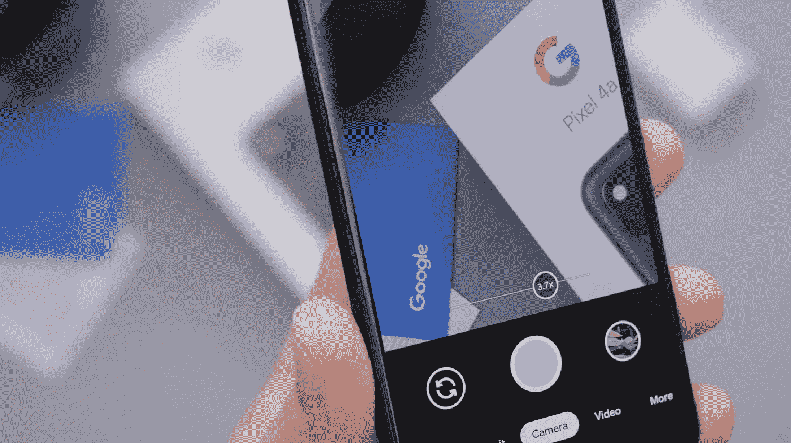
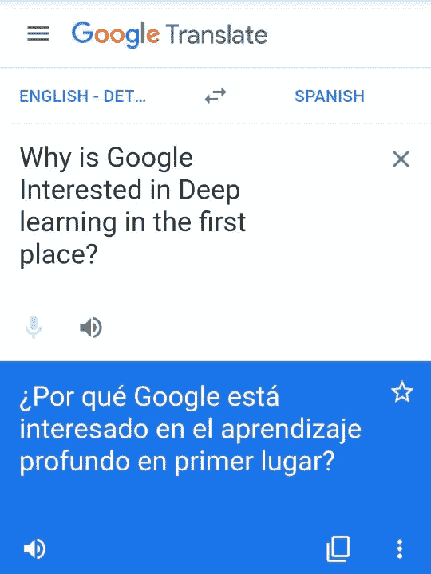
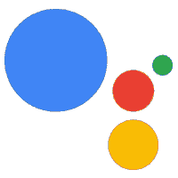
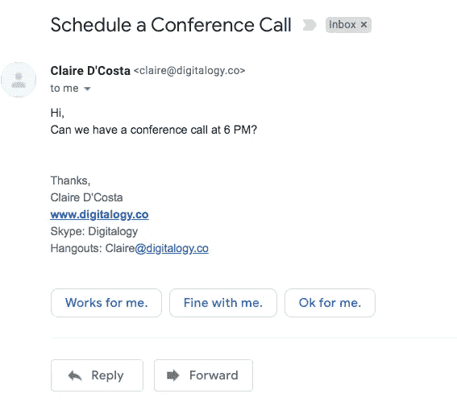
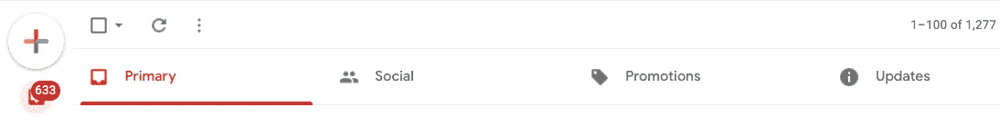
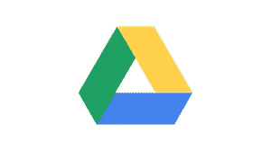
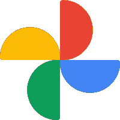

# 人工智能为谷歌产品提供动力

> 原文：<https://towardsdatascience.com/artificial-intelligence-powering-google-products-18e191da88d0?source=collection_archive---------25----------------------->

## 人工智能如何深度融入谷歌产品

丹尼尔·罗梅罗在 [Unsplash](https://unsplash.com/?utm_source=unsplash&utm_medium=referral&utm_content=creditCopyText) 上的照片

> “我们希望使用人工智能来增强人们的能力，使我们能够完成更多的工作，并让我们花更多的时间进行创造性的努力。”
> 
> **—杰夫·迪恩，**谷歌高级研究员

我们都很熟悉谷歌以及它的搜索引擎如何为每个人带来互联网革命。谷歌声称，如果公司没有**投入大量时间、金钱和努力来发展技术**，如**人工智能、深度学习和** [**机器学习**](/a-tour-of-machine-learning-algorithms-466b8bf75c0a?source=---------19------------------) **，他们的搜索引擎和其他产品系列就不可能取得进步。**

作为一家涉及多个领域的软件和硬件的多元化公司，谷歌现在明白创造人工智能产品以帮助其用户进入智能技术的新时代是多么重要。

 [## 日常生活中人工智能的 10 个最佳例子

### 在过去的几十年里，人工智能一直在发展，它积极地使人们和…

blog.digitalogy.co](https://blog.digitalogy.co/best-examples-of-artificial-intelligence-in-everyday-life/) 

# 谷歌当初为什么对深度学习感兴趣？

> 谷歌人工智能专注于将人工智能的好处带给每个人。

过去几年清楚地表明了谷歌对为其用户构建更智能的技术有多么感兴趣。证据包括其大量使用的搜索引擎以及许多其他产品，这些产品严重依赖于诸如[人工智能](/top-artificial-intelligence-platforms-for-2020-80570c65c1b4)、[机器学习](/machine-learning-books-you-must-read-in-2020-d6e0620b34d7?source=---------17------------------)和深度学习等技术。谷歌的主要目标一直是了解其用户实际上是如何使用其服务的，这里的想法可能包括何时、何地以及如何使用其服务。

**谷歌进军开发、采用和/或收购更好的技术**将被证明对理解其产品背后的使用模式至关重要。谷歌还依赖于其基础设施和一系列算法，这些算法不断分析和寻找改进其产品的方法，以便最新的改进使其用户能够用更少的点击和点击完成更多的事情。

**在这里了解更多—**

*   【https://ai.google/ 
*   [https://twitter.com/Google](https://twitter.com/Google)
*   [https://www.youtube.com/user/Google](https://www.youtube.com/user/Google)

 [## 面向所有人的顶级谷歌人工智能工具

### 使用谷歌人工智能中心将想法变为现实

towardsdatascience.com](/top-google-ai-tools-for-everyone-60346ab7e08) 

# 人工智能为谷歌产品提供动力

现在我们知道了为什么谷歌一直致力于将人工智能融入其各种服务中，让我们看看我们常用的谷歌的一些**流行应用程序、服务和硬件。**

# 1.**谷歌搜索引擎**

*   **类型:**网络搜索引擎
*   **投放:** 1997 年
*   **提供:** 149 种语言
*   **写于:** Python，C，C++

谷歌的搜索引擎自发布以来发生了巨大的变化，人工智能在其中发挥了重要作用。算法是任何搜索引擎的关键部分。随着时间的推移，谷歌调整了其搜索引擎算法，以支持该行业的各种趋势，但真正使谷歌能够建立如此高效的算法，以至于它们可以自主学习的是深度学习的突破。

如果没有人工智能，谷歌就不可能改进其搜索模式识别算法，以过滤和避免垃圾邮件，以及对搜索图像进行分类和编目。

**谷歌搜索的工作原理—**

# 2.谷歌翻译

*   **类型:**神经机器翻译
*   **上线:**2006 年 4 月 28 日(作为统计机器翻译)
    2016 年 11 月 15 日(作为神经机器翻译)
*   **创建者:**弗朗茨·约瑟夫·奥奇
*   **提供:** 109 种语言，见下文
*   **网址:**[translate.google.com](http://translate.google.com)

谷歌翻译是一个简单的在线工具，允许用户将任何文本从一种语言翻译成另一种语言。与 2006 年**推出**统计机器翻译**时相比，谷歌翻译在提供即时翻译方面取得了长足的进步。**

但最近人工智能的进步，特别是神经机器翻译，真正提高了翻译的质量和可靠性，包括超过 109 种语言来提供相关翻译。此外，[自然语言处理](/python-libraries-for-natural-language-processing-be0e5a35dd64?source=---------21------------------)的改进也优化了几个谷歌服务的语音输入功能。

作者图片

# 3.谷歌助手

图片来源— [谷歌助手](http://assistant.google.com)

*   **类型:**虚拟助手
*   **发布日期:**2016 年 5 月 18 日
*   **操作系统:**安卓、Chrome OS、iOS、iPadOS、KaiOS、Linux
*   **写于:** C++
*   **提供:**多语种
*   配音者:琪琪·贝塞尔
*   **网址:**assistant.google.com

你不能只谈论谷歌的人工智能创新，而把谷歌助手排除在讨论之外。你可以把谷歌助手看作是你手机的智能扩展，它可以帮助你在不接触它的情况下最大限度地完成你的数字任务，比如打电话、发短信、记笔记、设置提醒等等。

但这还不是清单的结尾，谷歌助手还支持语音搜索的自然对话，它可以从你的使用模式中学习并建议行动，甚至可以通过一个简单的命令一次自动完成几项任务。

# 4.谷歌广告

图片来源— [谷歌广告](http://ads.google.com)

*   **类型:**网络广告
*   2000 年 10 月 23 日
*   **网址:**[ads.google.com](http://ads.google.com)

**AdWords** ，现在叫做 **Google Ads** 是**T5**Google 营销套件工具的一部分。**谷歌广告是一个让企业和用户在网上为他们的产品做广告的工具，让用户完全控制他们广告的制作、管理和投放。随着谷歌继续分析和描述其用户的搜索行为，它可以利用这些数据有效地将正确的广告瞄准正确的个人，这是谷歌广告背后的核心理念。**

**谷歌使用几个 [**ML 算法**](/a-tour-of-machine-learning-algorithms-466b8bf75c0a?source=---------19------------------) ，这些算法根据几个指标对数千个关键词进行排序，然后用来挑选合适的广告展示给用户。此外，人工智能还可以为用户提供有价值的纠正性见解。**

****在这里了解更多—****

*   **[https://twitter.com/GoogleAds](https://twitter.com/GoogleAds)**
*   **[https://www.youtube.com/user/learnwithgoogle](https://www.youtube.com/user/learnwithgoogle)**

# **5.谷歌地图**

****

**照片由[亨利·珀克斯](https://unsplash.com/@hjkp?utm_source=unsplash&utm_medium=referral&utm_content=creditCopyText)在 [Unsplash](https://unsplash.com/?utm_source=unsplash&utm_medium=referral&utm_content=creditCopyText) 上拍摄**

*   ****类型:**网络制图**
*   **2005 年 2 月 8 日**
*   ****创建者:**拉斯·拉斯穆森延斯·艾尔斯特鲁普·拉斯姆森**
*   ****提供:**多语言版本**
*   ****用:** C++(后端)，JavaScript，XML，Ajax 编写**
*   ****网址:**[https://www.google.com/maps](https://www.google.com/maps)**

****谷歌地图**是来自谷歌的**便捷导航系统**，可以在**安卓、iOS 和网络**上使用。它被评为顶级导航和地图应用程序，在用户中非常受欢迎。**卫星图像、360 度地图、室内地图**和**实时交通状况**只是谷歌地图提供的部分功能。**

**谷歌已经在谷歌地图中实现了几个人工智能和人工智能驱动的功能，例如与谷歌助手的**集成，该助手分析用户的通勤路线，并根据实时数据建议交通流量和延迟较少的路线。另一个这样的功能是推荐附近的兴趣点，如加油站、吃饭的地方、自动取款机等等。****

****在这里了解更多—****

*   **【https://twitter.com/googlemaps **
*   **[https://www.youtube.com/user/googlemaps](https://www.youtube.com/user/googlemaps)**

# **6.谷歌邮箱**

****

**图片来源— [Gmail](http://mail.google.com)**

*   ****类型:**网络邮件**
*   ****2004 年 4 月 1 日****
*   ****创建者:**保罗·布赫海特**
*   ****提供:** 105 种语言**
*   ****编写于:** Java，JavaScript，C++(后端)，JavaScript (UI)，Ajax**
*   ****网址:【mail.google.com】T22****

**我们确信大多数用户主要使用 Gmail 作为他们首选的电子邮件服务，但是你知道谷歌已经为 Gmail 实现了许多智能功能吗？其中一个功能被称为**智能回复，**它分析整个电子邮件并建议一个合适的简短回复，甚至无需键入确认。**

**Gmail 还有垃圾邮件保护功能，可以过滤任何潜在的垃圾邮件，防止它们进入你的收件箱。此外，Gmail 中的人工智能可以智能地将你的电子邮件分类，如促销、社交、更新、主要和优先。当你试图撰写电子邮件时，Gmail 还可以预测文本，从而加快工作速度。**

****智能回复—****

****

**作者图片**

****智能邮件分类—****

****

**作者图片**

****Gmail 中的 Google Meet 选项卡—****

# **7. **YouTube****

****

**照片由[freestocks.org](https://www.pexels.com/@freestocks?utm_content=attributionCopyText&utm_medium=referral&utm_source=pexels)从[派克斯](https://www.pexels.com/photo/mokup-smartphone-technology-phone-34407/?utm_content=attributionCopyText&utm_medium=referral&utm_source=pexels)拍摄**

*   ****类型:**视频分享平台**
*   **2005 年 2 月 14 日**
*   **创始人:贾韦德·卡里姆，查德·赫利陈士骏**
*   ****写成:** Python，C，C++，Java，Go，JavaScript**
*   **【https://www.youtube.com/】网址:**

**自 2005 年以来，著名的在线视频分享平台 YouTube 的功能和规模都呈指数级增长。大量品牌使用 YouTube 进行营销，而数百万其他人使用它来消费他们感兴趣的最新视频内容。**

**为了给品牌和消费者提供安全无缝的体验，YouTube 部署了几个依赖于人工智能和人工智能的机制。这些人工智能驱动的机制包括自动识别和删除不良内容，自动推荐内容，以及根据用户的兴趣和观看历史播放下一个相关视频。**

****了解更多这里的事情—****

*   **[https://twitter.com/YouTube](https://twitter.com/YouTube)**

# **8.谷歌浏览器**

****

**图片来源— [Chrome](http://www.google.com/chrome/)**

*   ****类型:**网络浏览器、手机浏览器**
*   **2008 年 9 月 2 日**
*   ****引擎:**Blink(iOS 上的 WebKit)，V8 JavaScript 引擎**
*   ****操作系统:**微软 Windows，安卓，Windows 7，等等**
*   ****用:** C、C++、Java(仅限安卓 app)、JavaScript、Python 编写**
*   ****提供:** 47 种语言**
*   ****网址:**www.google.com/chrome/**

**谷歌 Chrome 可能是最常用的浏览器之一，自 2008 年冬天首次推出以来，它已经经历了许多变化。在众多变化中，最近有几个变化是**利用人工智能的力量让每个人都可以访问互联网。****

**其中包括最近为视觉障碍者引入的辅助功能，该功能分析网站上的图像并播放音频描述或替代文本(如果可用)。谷歌 Chrome 获得的另一个便利技巧是，在谷歌搜索中搜索某些内容时，可以呈现视频中简短且高度相关的部分。**

****了解更多这里的事情—****

*   **[https://www.youtube.com/c/Chrome/videos](https://www.youtube.com/c/Chrome/videos)**

# **9.Google Drive**

****

**图片来源— [Google Drive](https://www.google.com/drive/)**

*   ****类型:**文件托管服务**
*   ****发布日期:**2012 年 4 月 24 日**
*   ****编程语言:** Python，Objective-C**
*   **【https://www.google.com/drive/】网址:**

**Google Drive 是个人和职业任务的顶级在线文件存储和协作选项之一。多年来，谷歌对 Google Drive 进行了多项改进，不仅节省了时间，还提高了生产率。其中一个功能称为**快速访问**，它使用 ML 来分析几个最常用的文件，并预测您最常访问的文件，从而让您可以在 Drive 中即时访问它，无需手动导航到该文件。**

****在此了解更多信息—****

*   **[https://twitter.com/googledrive?s=20](https://twitter.com/googledrive?s=20)**

# **10.**谷歌照片****

****

**图片来源— [谷歌照片](http://photos.google.com)**

*   ****类型:**照片存储和分享**
*   ****投放:**2015 年 5 月 28 日**
*   ****操作系统:**安卓、iOS、web**
*   ****网址:**photos.google.com**

**把 **Google Photos** 想象成一个**在线相册**，可以让用户无缝管理自己拍摄的照片。他们所有的照片都被备份到云端进行保管，但这并不是谷歌照片的唯一目的。**

**Google Photos 利用一些漂亮的人工智能和人工智能技术为您提供智能功能，例如基于里面的主题对照片进行自动分组的**、**自动分析和增强照片以获得最佳效果的智能过滤器**、**与谷歌镜头的集成**以识别对象和文本，等等。****

****在这里了解更多东西—****

*   **【https://twitter.com/googlephotos **
*   **[https://www.youtube.com/user/GooglePlusPhotos](https://www.youtube.com/user/GooglePlusPhotos)**

# **11.**谷歌日历****

****

**图片来源— [谷歌日历](http://www.google.com/calendar/about)**

*   ****类型:**电子日历**
*   ****发布日期:**测试版—2006 年 4 月 13 日，常规版—2009 年 7 月**
*   ****平台:**网络应用，安卓，iOS**
*   ****编程语言:** Java，JavaScript**
*   **网址:[www.google.com/calendar/about](http://www.google.com/calendar/about)**

**日历在我们的日常生活中起着决定性的作用，是管理它的一个重要工具。**谷歌的日历应用**提供了广泛的日常管理选项，但为了使其更加强大，谷歌增加了一个**目标功能**，旨在帮助用户实现他们的个人目标，无论是学习新的爱好，完成任何未完成的项目，还是去散步。**

**根据谷歌的说法，这种人工智能功能可以智能地分析你在繁忙时段的日常安排，如果需要，可以在你方便的时候自动重新安排你的目标。**

****在此了解更多信息—****

*   **[https://twitter.com/googlecalendar](https://twitter.com/googlecalendar)**

# **12.**巢凸轮室外****

**Nest Cam Outdoor 是一款户外安全摄像头，可以将实时视频传输到您的手机上，以提醒您房子周围的任何可疑活动。Nest Cam 可以像许多其他安全摄像头一样完美地检测运动，但它与其他摄像头的区别在于底层的人工智能算法，该算法使用计算机视觉来检测外部情况。**

**除了智能地提醒你有人来了，也不是因为你的宠物在镜头前缩放，室外的摄像头总是在记录。捕捉的视频可以使用 **Nest 应用**来观看，它通过应用智能人工智能算法，可以让你快速筛选活动时段，而不是快速回放一整天。**

# **更多人工智能驱动谷歌产品—**

*   **谷歌镜头**
*   **谷歌双工**
*   **谷歌新闻**
*   **谷歌金融**
*   **面向消费者的云存储**
*   **所有谷歌产品列表—[https://developers.google.com/products](https://developers.google.com/products)**

# **下一步是什么**

**我们浏览了谷歌的大量服务，讨论了[人工智能和相关技术](https://blog.digitalogy.co/artificial-intelligence-technologies/)不仅在改善服务和体验方面发挥了关键作用，还让谷歌带来了新功能。如果谷歌继续以同样的热情朝着人工智能、深度学习和[机器学习](https://blog.digitalogy.co/best-and-free-online-machine-learning-courses/)的方向前进，我们很有可能在接下来的几年里见证几个领域的巨大飞跃。**

****如果你有更多的建议或想法，我们很乐意倾听。****

# **更多有趣的阅读—**

**我希望这篇文章对你有用！以下是一些有趣的读物，希望你也喜欢**

** [## 给 Python 开发者的 10 个很酷的 Python 项目想法

### 您可以使用 Python 构建的有趣想法和项目列表

towardsdatascience.com](/10-cool-python-project-ideas-for-python-developers-7953047e203)  [## 2020 年你必须使用的最好的 Python IDEs 和代码编辑器

### 具有显著特性的顶级 Python IDEs 和代码编辑器

towardsdatascience.com](/best-python-ides-and-code-editors-you-must-use-in-2020-2303a53db24)  [## 2020 年人工智能工程师的顶级编程语言

### 从几种编程语言中，人工智能工程师和科学家可以挑选出适合他们需要的语言

towardsdatascience.com](/top-programming-languages-for-ai-engineers-in-2020-33a9f16a80b0)  [## 机器学习和深度学习的最佳 Python 库

### 现代机器学习模型和项目的 Python 库

towardsdatascience.com](/best-python-libraries-for-machine-learning-and-deep-learning-b0bd40c7e8c)  [## 选择 PyTorch 进行深度学习的理由

### PyTorch 可以为深度学习程序员提供很多东西

towardsdatascience.com](/reasons-to-choose-pytorch-for-deep-learning-c087e031eaca) 

> ***关于作者***
> 
> ***克莱尔 D*** *。在*[***Digitalogy***](https://www.digitalogy.co/)***—****是一个内容制作者和营销人员，这是一个技术采购和定制匹配市场，根据全球各地的特定需求，将人们与预先筛选的&顶尖开发人员和设计师联系起来。在*[***Linkedin***](https://www.linkedin.com/company/digitalogy)*，*[***Twitter***](https://twitter.com/DigitalogyCorp)*，*[***insta gram***](https://www.instagram.com/digitalogycorp)**。****