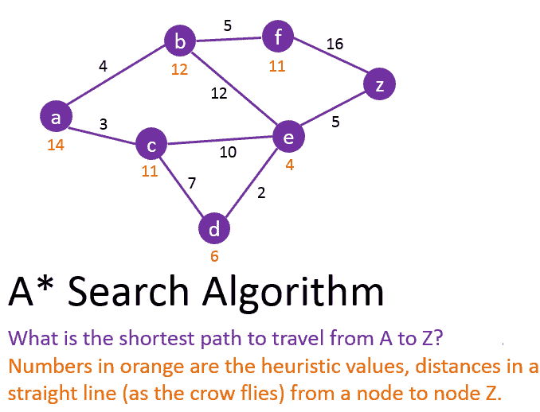
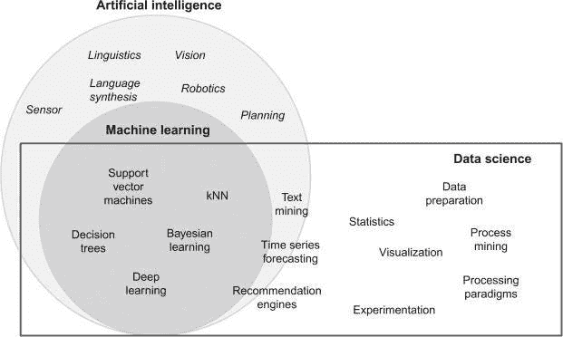

# 人工智能 vs 机器学习 vs 数据科学

> 原文：<https://towardsdatascience.com/artificial-intelligence-vs-machine-learning-vs-data-science-2d5b57cb025b?source=collection_archive---------16----------------------->

[图像信用](http://Unsplash.com)

人工智能、机器学习和数据科学是在几乎所有领域的专业人士中变得非常流行的几个术语之一。如果任何专业人士从未听说过这些术语中的任何一个，那将是一件令人惊讶的事情。

随着第四次工业革命的开始，一场正在模糊物理、数字和生物领域之间界限的技术革命，现在有必要更好地理解快速变化的技术术语。

# 完全理解这些术语容易吗？

我们假设您事先不了解这些术语。我们的目标是深入研究每一个概念，并强调使每一个概念与众不同的特征。

# 什么是人工智能(AI)？

“人造的”可以是任何由人类制造的非天然的东西。你对“智力”这个词的理解是什么？它是理解、思考和学习的能力。因此，人工智能是计算机科学的一个广阔领域，它使机器看起来像具有人类智能。

人工智能的目标是模仿人脑，创造能够智能和独立运行的系统。人工智能可以以许多不同的方式表现出来。

如果你曾经要求 Alexa 为你点餐或浏览网飞电影的建议，你正在与 AI 互动，而没有意识到这一点。

人工智能的设计让你意识不到有一台机器在发号施令。在不久的将来，人工智能有望变得不那么人工，而更加智能。

“智力”这个词的定义在这里很重要。让我们用另外两种方式来定义智力。“智能”是在给定一组输入和各种可能的行动的情况下做出正确决定的能力，或者它是一组思维属性——计划、解决问题和推理的能力。

# 智能行为表现出什么？

*   解决问题——为复杂问题寻找解决方案的过程。
*   推理——以逻辑方式思考问题的行为。
*   规划——为某事制定计划的过程。
*   决策——做出重要决策的过程。
*   做出推论——根据证据做出结论或判断。
*   学习——通过学习、体验或接受教育获得知识。

# 什么是机器学习(ML)？

我们将从最不正式和最简单的定义开始。机器学习是一种事物标签，你可以用例子而不是指令来解释你的任务。

机器学习背后的概念是，你把数据喂给机器，让它们在没有任何人工干预的情况下(在学习的过程中)自主学习。考虑一个小场景。比方说，你报名参加了一些游泳课程，但你以前没有游泳经验。

不用说，最初，你的表现不会很好，因为你不知道如何游泳，但随着你观察和收集更多的信息，你的表现会越来越好。

纪念活动只是另一种收集数据的方式。就像我们人类如何从我们的观察和经验中学习一样，当机器获得大量数据时，它们也能够自主学习。

这正是我们如何运用机器学习的概念。它是让机器从经验中学习和改进的过程，而不是显式地自动编程。

# 那么，如何让机器从经验中学习呢？

要理解这部分，我们需要理解什么是算法。一个简单的谷歌定义指出，算法是“在计算或其他解决问题的操作中，特别是由计算机遵循的一个过程或一组规则。”

换句话说，算法可以是定义明确的计算机可执行指令的有限序列，通常用于解决一类问题或执行计算。现在我们知道了什么是算法，让我们来探索是什么让机器学习。

机器学习算法本质上是一个过程或一组程序，帮助模型适应给定目标的数据。ML 算法通常指定数据从输入到输出的转换方式，以及模型如何学习从输入到输出的适当映射。

更简单地说，机器学习算法是程序(数学和逻辑)，当它们接触到更多数据时，会自我调整以表现更好。

机器学习的“学习”部分意味着这些程序随着时间的推移改变他们处理数据的方式，就像人类通过学习改变他们处理数据的方式一样。

它们以这样一种方式改变，即任何特定输入值被映射到其正确输出值的概率在每次通过改变算法内的一组变量(或结构)而暴露给新数据时增加，该算法用于对输入值执行计算并得出最终输出值。

从术语“机器学习”中使用的“学习”一词可以明显看出，它与人工智能有关，人工智能包括人脑的学习能力。

机器学习是关于机器一起体验相关数据并获取模式，就像人类可以在任何数据集中找出模式一样。

# 机器学习是人工智能的一个子集

机器学习算法有不同的类型。一些算法被输入标记的数据，如果后来暴露于任何未标记的数据，这些算法会自我调整以吐出正确的标签(监督学习)。

一些算法给出了未标记的数据，以找出数据集中隐藏的模式(无监督学习)。

# 如果机器学习是人工智能的子集，那么什么人工智能不是机器学习？

机器还可以通过许多其他方式来展示它们的智能。机器学习算法依靠数据来智能地执行。

有没有不依赖数据但仍能显示智能的人工智能算法？

***好吧，我们来探索一种人工智能的搜索算法。***

# 人工智能中的“搜索”是什么意思？

人工智能中的搜索是通过中间状态的转换从起始状态导航到目标状态的过程。搜索算法对数据科学家来说非常有用。

[**形象功劳**](https://www.101computing.net/a-star-search-algorithm/)

红色的值是每个节点的试探法，黑色的值是在两个节点之间移动的成本。任何节点的启发式值表示从该特定节点到达目标节点所需的成本。从 a 到 e 的成本是 3 + 10 = 13。

A*算法利用成本和启发式值，通过计算最便宜的解决方案的估计成本，即 f(n) = g(n) + h(n)，找到从初始状态到目标状态的最短路径。g(n)是从初始节点移动到节点 n 的代价，h(n)是从节点 n 到达目标状态的估计代价(启发式值)。

*这个算法是否智能执行？*

该算法在每一步进行计算，保留以前计算的知识，并在每一步做出决定。这确实是一种人工智能。

但这是否需要数据集像任何机器学习算法一样智能地学习和执行呢？不。这是人工智能吗？是啊！这是机器学习的例子吗？不要！

# 人工智能是一个比机器学习更广泛的概念

人工智能是一种技术，其目标是创造能够模拟人类智能的智能系统。相比之下，机器学习是让系统获得特定形式的人类智能的方法之一。为了更好地区分这两者，我们将使用一个表格。

人工智能机器学习领域。人工智能的子集。目标是模拟人类智能来解决复杂问题。

目标是从数据中学习，并能够在出现新数据时预测结果，或者只是找出未标记数据中隐藏的模式。导致智力或智慧。通向知识。

寻找最佳解决方案的尝试。试图找到唯一的解决方案，无论它是否是最优的。

现在已经很清楚如何区分机器学习和人工智能的其他应用了。

尽管存在差异，但这些术语经常互换使用。因此，了解关键差异非常重要。人工智能经常使用 ML 及其其他子集，例如，自然语言处理(NLP)来解决文本分类等问题。

# 数据科学

> “在未来 10 年，数据科学和软件对医学的贡献将超过所有生物科学的总和。”—维诺德·科斯拉

你知道什么是推荐引擎吗？你可能用过亚马逊网上购物。你有没有注意到，当你在亚马逊上搜索一个特定的商品时，你会得到类似的商品推荐？

亚马逊在这一切背后是如何运作的？它是如何向你展示你感兴趣的项目的？亚马逊、沃尔玛和网飞等公司表现出色的原因是他们如何利用用户生成的数据。

这些是数据驱动的公司。这些公司的关键一直是数据。

推荐系统根据用户的浏览历史、评级、个人资料详细信息、交易详细信息、购物车详细信息等过滤出每个用户的选择列表。这种系统用于获得对顾客购物模式的有用洞察。

它为每个用户提供了基于他们个人资料的电子商务网站的特定(独特)视图。

例如，如果你在亚马逊上搜索一台笔记本电脑，你可能也需要买一个电脑包。亚马逊将类似的交易映射在一起，然后向用户推荐相关的商品。

在我们深入探讨这个主题之前，有必要了解一些通常与数据科学相关的术语的含义。

# 什么是数据科学？

数据科学是一个多学科领域，专注于从大量原始(非结构化)和结构化数据中发现可行的见解。

数据科学家使用不同的技术来获得答案，结合计算机科学、预测分析、统计学和机器学习来解析海量数据集，以建立尚未想到的问题的解决方案。

数据科学专家的主要目标是提出问题并找到潜在的研究途径，而不太关心具体的答案，更重视搜索要问的正确问题。

# 你听说过大数据吗？

大数据是指难以实时存储和处理的海量数据。这些数据可用于分析洞察力，从而做出更好的决策。

# 什么是数据分析？

数据分析是对数据进行检查、清理、转换和建模的过程，其目标是发现有用的信息、提供结论和支持决策。它和数据科学不一样。

# 数据科学项目的工作步骤是什么？

*   理解业务问题——询问相关问题，理解并定义问题的目标。
*   数据采集—从多个来源收集数据。
*   数据准备—数据清理和转换。
*   探索性数据分析——定义和细化将在模型开发中使用的特征变量的选择。
*   数据建模——这是数据科学项目的核心活动。这包括对数据重复应用不同的机器学习技术，如 KNN、决策树、朴素贝叶斯，以确定最适合业务需求的模型。
*   可视化和交流——会见客户和交流商业发现。这一步创建了强大的报告和仪表板。
*   部署和维护—在生产环境中部署之前，在生产前环境中测试模型。

在探索数据科学时，我们已经弄清楚了机器学习在其多样化环境中的确切应用位置(在数据建模步骤中)。让我们问自己一些重要的问题。

数据科学与机器学习有什么样的关系？机器学习是数据科学和人工智能的交叉吗？下图可视化了数据科学、人工智能和机器学习之间的关系。

[**形象功劳**](https://www.sciencedirect.com/topics/physics-and-astronomy/artificial-intelligence)

显然，你可以看到 ML 和 AI 都不是数据科学的子集，而数据科学也不是这两者的子集。数据科学不仅仅是人工智能和人工智能。

人工智能和人工智能不仅仅是数据科学。数据科学中使用了 ML 技术来执行特定的任务和解决特定的问题。

数据科学领域采用了人工智能概念，而不是人工智能技术。

文本挖掘(人工智能和数据科学的交叉，但不是 ML)是一种人工智能技术，它使用自然语言处理将文档和数据库中的原始(非结构化)文本转换为适合分析或驱动机器学习算法的标准化结构化数据。

# 了解差异的重要性

数据科学领域提供了大量有前途的职业。为了给自己选择正确的专业，了解这些经常被错误地互换使用的不同术语之间的区别是至关重要的。

我们希望现在你对什么是数据科学，什么是机器学习，什么是人工智能的概念有了更好的了解。然而，关于人工智能和数据科学，你还有很多可以探索的。