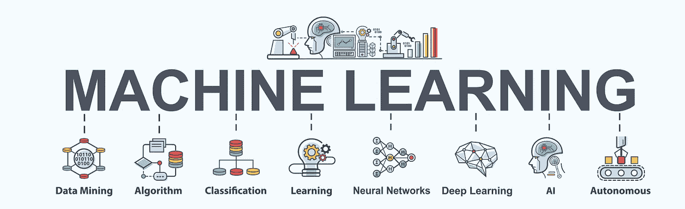
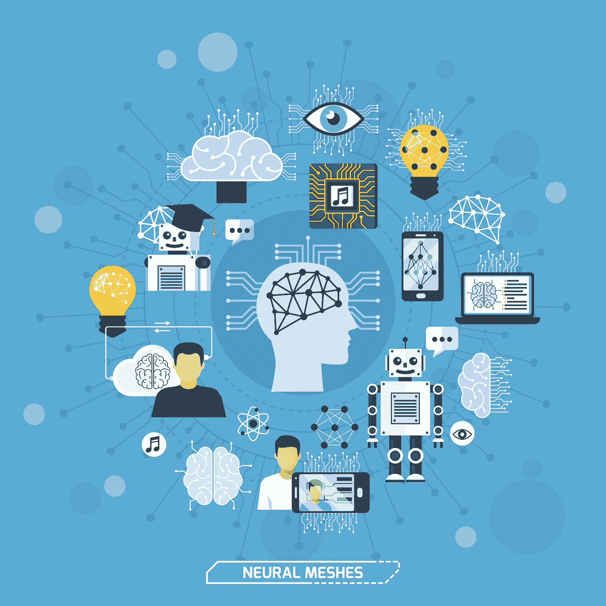

# 人工神经网络

> 原文：<https://towardsdatascience.com/artificial-neural-networks-ann-21637869b306?source=collection_archive---------64----------------------->

## 神经网络是执行由人脑中的神经元执行的任务的系统。神经网络包括作为人工智能(AI)一部分的机器学习，是我们开发神经元和大脑功能以复制人类学习方式的系统。

这是系统发展的第一步，该系统复制我们大脑中神经元的功能，帮助我们像人类一样学习。

神经网络(NN)形成一个隐藏层，其中包含将输入从输出更改为输出的单元，以便输出层可以使用该值。这种转化称为神经层，称为神经单元。下一级的输入由一系列称为功能的功能使用，这些功能又在一系列变换中用作下一级的输入，每一级的每一个都有不同的值。

通过重复这些转换，神经网络学习边缘形状等非线性特征，然后与最终层结合，对更复杂的对象进行预测。本文的主题将是神经网络的扩展版本，即深度学习。网络权重参数会发生变化，以最小化输入值与特定属性或边形状的期望值之间的差异。

人类大脑是已知的最强大的计算机器之一，其内部工作通常以已知的生物神经网络为模型。根据美国国立卫生研究院(NIH)的数据，它包含大约 1000 亿个通过路径和网络连接的神经元。

人工神经网络是受生物启发的计算机模型，以人脑中的神经元网络为模型。它们也可以被视为模拟输入输出关系的学习算法。人工神经网络的应用包括模式识别和预测。

人工神经网络(ann)被描述为机器学习算法，旨在通过从数据中提取有用的模式来获取自己的知识。他们将非线性函数应用于输入的加权和，并对它们之间的关系进行建模。

人工神经网络由许多互连的计算单元组成，称为神经元，是将输入映射到输出的函数逼近。人工神经网络是将输入映射到输出的函数或近似器，反之亦然。

单个神经元几乎没有内在收敛，但当许多神经元一起工作时，它们的组合效应可以表现出显著的学习性能。由神经元及其突触形成的神经网络是人类认知的关键组成部分，负责许多认知功能，如记忆、思维和决策。然而，今天，生物神经元被认为是人脑中最强大的计算单元之一，能够学习和记忆。

鉴于此，一个自然的假设是，为了复制大脑的功能和能力，包括智能的能力，并因此能够进行认知功能，如学习和决策，必须实现神经网络的计算机化版本。关系网络和图灵神经机器提供了证据，证明连接主义和计算主义的认知模型不需要相互矛盾，可以共存。

人工神经网络(ann)是直接受生物神经网络启发或部分模仿生物神经网络的统计模型。存在被称为人工神经网络的高级统计技术和概念，并且它们最重要的特征之一是并行模拟输入和输出之间的非线性关系的能力。

已经出现了几种类型的神经网络，但最基本的类型，神经网络，是所谓的“迁移信息网络”最常见的网络类型是神经网络，其中数据从网络的一部分线性地流向另一部分。

人工神经网络(ANN)与之类似，但它是科学中的一种计算网络，类似于人脑的属性。ANN 可以模拟人脑的原始神经元，所以它的处理部分被称为“人工神经元”。

术语“神经元”和“人工神经元”是等价的单位，并且暗示与生物神经元的密切联系。人工神经网络由相互连接的神经元组成，这些神经元受大脑工作方式的启发，但具有不同的特征和特性。

在微观层面，术语“神经元”用于解释深度学习是对人脑的模仿。然而，“深度学习”与人脑的神经生物学关系不大，而是与神经网络有关。

神经网络是一种机器学习方法，其中计算机通过分析训练样本来学习执行任务。在宏观层面上，神经网络可以被认为是人类智能使用的机器。

神经网络是对人脑的松散模拟，由紧密连接的简单处理节点组成。今天，大多数神经网络都是由节点层组成的，每个节点都在网络内外有意义地移动。例如，可以向物体识别系统提供一系列与特定标签一致相关的图像中的视觉图案。她会发现图像中的视觉图案与标签相匹配。

## **引用来源**

*   [http://news . MIT . edu/2017/explained-neural-networks-deep-learning-0414](http://news.mit.edu/2017/explained-neural-networks-deep-learning-0414)
*   【http://uc-r.github.io/ann_fundamentals 
*   [https://www . kdnugges . com/2016/10/人工智能-深度学习-神经网络-解释. html](https://www.kdnuggets.com/2016/10/artificial-intelligence-deep-learning-neural-networks-explained.html)
*   [https://www . digital trends . com/cool-tech/what-is-an-artificial-neural-network/](https://www.digitaltrends.com/cool-tech/what-is-an-artificial-neural-network/)
*   [https://developer . NVIDIA . com/discover/artificial-neural-network](https://developer.nvidia.com/discover/artificial-neural-network)
*   [https://mindmajix . com/人工智能中的神经网络](https://mindmajix.com/neural-network-in-artificial-intelligence)
*   [https://www . software testing help . com/人工神经网络/](https://www.softwaretestinghelp.com/artificial-neural-network/)