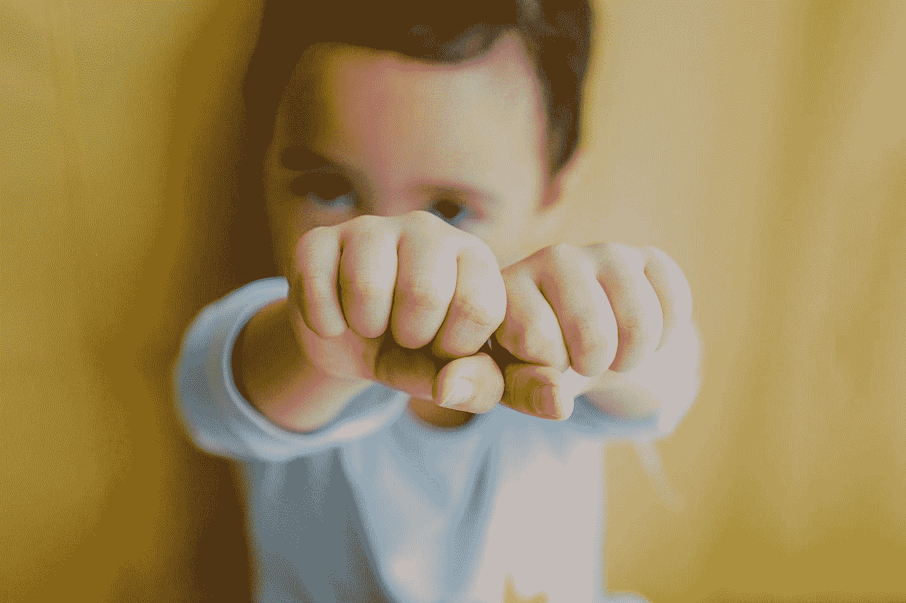
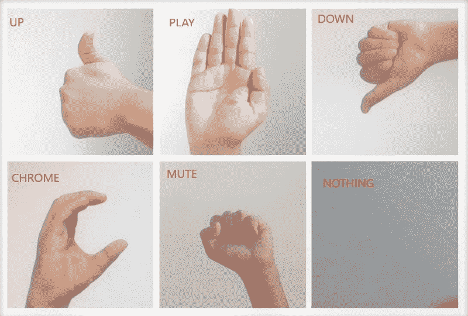
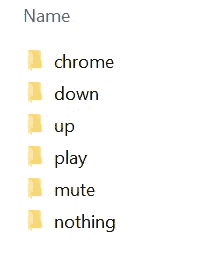
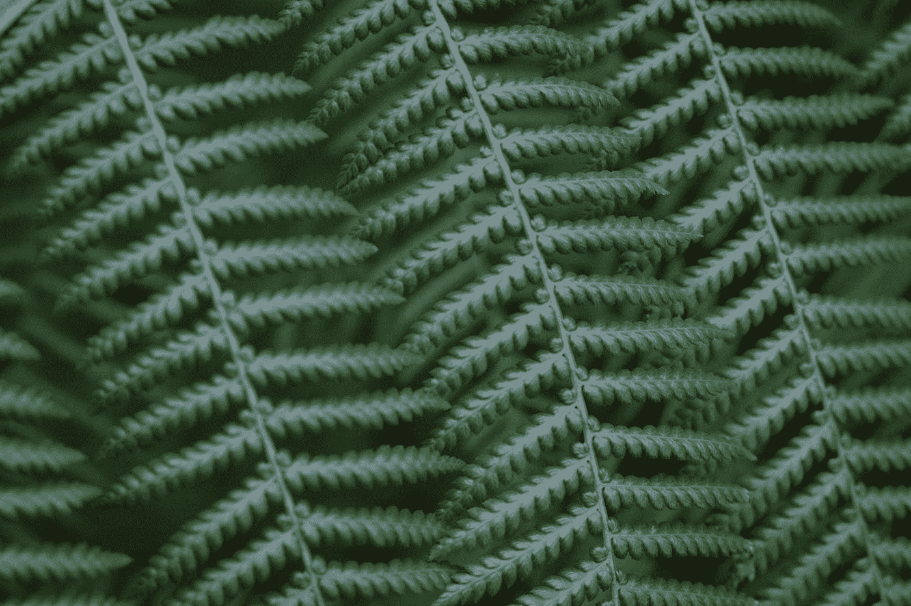
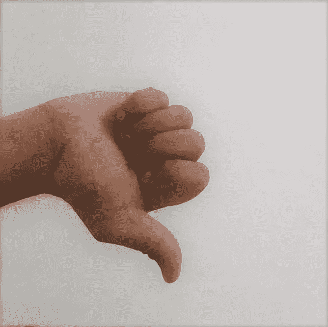
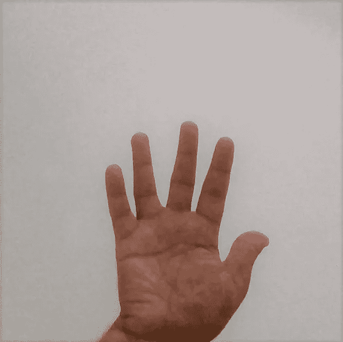
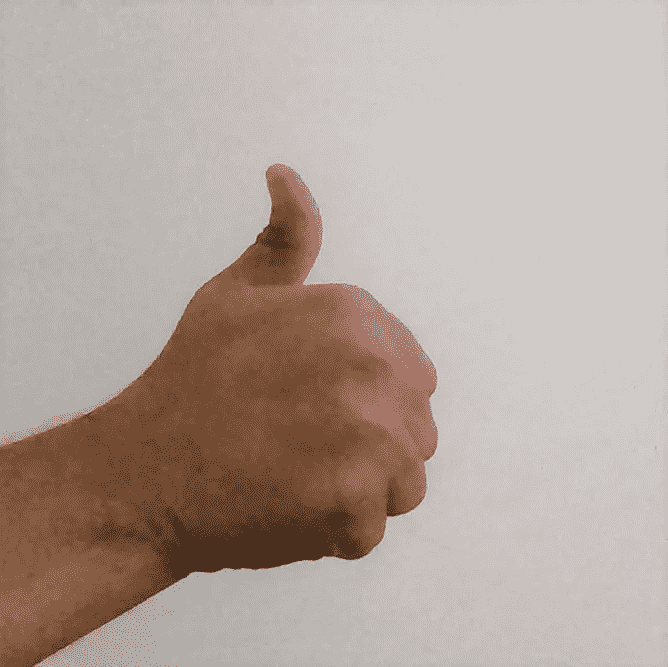

# CNN 新手手势识别

> 原文：<https://towardsdatascience.com/artificial-neural-networks-for-gesture-recognition-for-beginners-7066b7d771b5?source=collection_archive---------16----------------------->

## 使用 Python 和 SqueezeNet 的有趣实验


奥斯曼·拉纳在 [Unsplash](https://unsplash.com?utm_source=medium&utm_medium=referral) 上拍摄的照片

CNN 或卷积神经网络是图像分类问题中最常用的算法。图像分类器将照片或视频作为输入，并将其分类到它被训练识别的可能类别之一。它们在各个领域都有应用，如无人驾驶汽车、国防、医疗保健等。图像分类有许多算法，在这个实验中，我们将研究这种类型中最受欢迎的算法之一，DeepScale 称之为 ***SqueezeNet*** 。

# 目标是:

我们的目标是设计一个应用程序，它将使用网络摄像头(或外部摄像头)作为输入设备，然后它将识别手势并将其分类到我们将要定义的类别中。在本文中，我们将看到如何使用 SqueezeNet 算法来设计一个应用程序，它采用不同的手势，然后触发某些动作。简而言之，我们可以向我们的计算机发送一些命令(无需触摸键盘或鼠标)。让我们戴上魔术师的帽子吧！🧙‍♂️


照片由[阿列克谢·耶什金](https://unsplash.com/@alekssei199?utm_source=medium&utm_medium=referral)在 [Unsplash](https://unsplash.com?utm_source=medium&utm_medium=referral) 上拍摄

实验包括下列四个阶段:

# 概述:

1.  定义我们的分类类别
2.  收集训练图像
3.  训练模型
4.  测试我们的模型

# 1.定义我们的分类类别(手势)



[巴迪 qb](https://unsplash.com/@bady?utm_source=medium&utm_medium=referral) 在 [Unsplash](https://unsplash.com?utm_source=medium&utm_medium=referral) 上拍照

在我们最后的节目中，我们将表演一些动作。这是我决定要做的一些事情的清单。根据您的具体要求，此列表中的项目数量会有所不同。接下来，为了方便起见，我们将使用类别名称来映射这些操作，以便稍后在我们的程序中使用。

1.  增加扬声器音量(*类别=* ***向上*** )
2.  降低扬声器音量(*类别=* ***调低*** )
3.  静音/取消静音(*类别=* ***静音*** )
4.  播放/暂停(*类别=* ***播放*** )
5.  打开谷歌浏览器(*category =****Chrome***)

除了这五个类别，我们还应该有另一个类别(*category =****nothing****)*，当用户做出我们的模型无法识别的手势时，或者当用户没有输入手势时，我们将在最终的程序中使用这个类别。

现在我们已经决定了我们的六个类别，让我们看看我的手势看起来怎么样。

我在下面创建了一个所有手势和它们各自类别名称(红色)的拼贴画。



所有手势及其类别名称的拼贴画(使用网络摄像头拍摄)

# 2.收集用于训练的图像

下一组是为每个类别准备我们的训练图像。为了收集我们的训练数据集(图像)，我们将使用网络摄像头。为了让事情变得简单，我确保使用背景简单整洁的图片。下面的 python 程序将使用 OpenCV 库来执行这个动作，并将这些图像存储到一个名为“ ***training_images”的文件夹中。*** 程序需要两个输入参数:

```
python get_training_images.py 50 up
```

> ***a)*** 要拍摄的图像数量(例如:- 50)
> 
> ***b)*** 标签(或类别)名称(例如:-向上、向下、播放、铬等)

[*程序*](https://github.com/arindomjit/Gesture_Detection_CNN/blob/master/get_training_images.py) 在捕捉到那么多图像后停止。第二个参数指示这些图像所属类别的名称。该程序在我们的' **training_images** '文件夹中根据类别名称创建一个子文件夹，并将所有图像存储在那里。



“training_images”文件夹中所有子文件夹的屏幕截图

一旦你运行该程序，网络摄像头的饲料将打开。将手放在白色框的边界内，按下“ ***s*** ”键到 ***开始*** 给手拍照。在此过程中，尝试移动您的手，在训练数据集中添加一些变化。我从这里开始，对每个类别运行程序两次，右手 50 张图片，左手 50 张图片。一旦程序结束，你应该能够看到你的手势名称的子文件夹中的图像。一旦这个过程完成，你将在每个文件夹中得到 100 张图片。你可能想选择一个适合你的号码，越多越好。

# **3。训练模型**

在这个演示中，我们将使用 SqueezeNet。[***SqueezeNet***](https://arxiv.org/abs/1602.07360)是一个流行的用于图像分类问题的预训练模型，它非常轻量级，具有令人印象深刻的精确度。我们将在训练过程中使用 *Keras* 库。 *Keras* 是一个简单而强大的 python 库，广泛应用于深度学习。这使得训练神经网络模型变得非常容易。

让我们看一下用于我们培训的一些参数。

**顺序:**我们将使用顺序模型，这意味着各层以线性堆栈(顺序)排列。模型中的层作为参数添加到此构造函数中。



[霍尔格连杆](https://unsplash.com/@photoholgic?utm_source=medium&utm_medium=referral)在 [Unsplash](https://unsplash.com?utm_source=medium&utm_medium=referral) 上拍照

**退出率:**在较小数据集上训练的神经网络往往会过度拟合，因此在新数据上不太可能准确。从理论上讲，训练模型的最佳方法可能是尝试不同参数值的不同组合，然后取这些单独结果的平均值，以得出一个概括的结果。但是这将需要大量的时间和计算资源来用这些参数的多种组合多次训练模型。为了解决这个问题，引入了辍学率。这里，层中的一些单元/节点(来自输入层或隐藏层，但不来自输出层)被'*丢弃'*，这使得该节点的输入和输出连接消失。简而言之，当在训练期间多次这样做时，不同数量的节点从层中被丢弃，使得该层在节点数量及其与前一层的连接方面看起来不同(粗略地模拟具有不同层配置的多个模型)。一个图层的辍学率的较好值在 0.5–0.8 之间。就我而言，在尝试了几个不同的值之后，我发现 0.5 给了我最好的结果。请注意，脱扣是用来避免过度拟合。如果模型的精确度低，则可以避免该参数。

**节点:**我们输出层中神经元/节点的数量等于我们试图预测的类的数量。

**输入形状:**SqueezeNet 要求的输入形状至少是 224 X 224(RGB 有 3 个通道)。在这个程序中，我们使用了 225 X 225。

**选择优化器&损失:**这里我选择了 ***亚当*** 优化器。并且基于问题的类型选择损失函数。例如:-对于二元分类问题，*[loss = ' binary _ cross entropy ']*更适合，对于多类分类问题，选择*[loss = ' categorial _ cross entropy ']*。而对于回归问题，可以选择 *[loss='mse']* 。由于我们的问题是一个多类分类问题，我们将使用 ***分类 _ 交叉熵*。**

**历元数:**历元数是整个数据集在训练过程中通过神经网络的次数。对此没有一个理想的数字，它取决于数据。在这种情况下，我从 10 开始，我用了 15。数字越大表示训练时间越长。

**激活函数:**我们使用的是 ReLU 激活函数，这是神经网络中最常用的激活函数，因为它计算简单(还有其他优点)。该函数为负输入返回零，为正输入返回值本身。对于大多数现代神经网络，ReLU 是默认的激活函数。还使用的其他激活函数是 Sigmoid、Tanh 等。

**池化:**在 CNN 中，通常的做法是在卷积&激活层之后添加一个池化层。输入图像被下采样或转换成低分辨率版本，以便仅保留重要的细节并去除较精细的不太重要的细节。

**soft max:**soft max 层用在输出层之前的多类分类中。它给出了输入图像属于特定类别的可能性。

```
import numpy as np
from keras_squeezenet import SqueezeNet
from keras.optimizers import Adam
from keras.utils import np_utils
from keras.layers import Activation, Dropout, Convolution2D, GlobalAveragePooling2D
from keras.models import Sequential
import tensorflow as tfGESTURE_CATEGORIES=6
base_model = Sequential()
base_model.add(SqueezeNet(input_shape=(225, 225, 3), include_top=False))
base_model.add(Dropout(0.5))
base_model.add(Convolution2D(GESTURE_CATEGORIES, (1, 1), padding='valid'))
base_model.add(Activation('relu'))
base_model.add(GlobalAveragePooling2D())
base_model.add(Activation('softmax'))base_model.compile(
    optimizer=Adam(lr=0.0001),
    loss='categorical_crossentropy',
    metrics=['accuracy']
)
```

训练后，我们将把训练好的模型参数存储到一个文件(手势-模型 05_20.h5)中，我们将在稍后的模型测试中使用该文件。全部代码都在 github [库](https://github.com/arindomjit/Gesture_Detection_CNN)中。

```
model.save("gesture-model05_20.h5")
```

# **4。测试型号**

为了测试这个模型，我使用了我的网络摄像头再次捕捉到的一些手势图像。该程序加载模型文件“手势-模型 05_20.h5 ”,并将输入图像作为参数，并预测其所属的类别。在传递图像之前，我们需要确保我们使用的尺寸与我们在训练阶段使用的尺寸相同。

```
from keras.models import load_model
import cv2
import numpy as npimg = cv2.imread(<input image file path>)
img = cv2.cvtColor(img, cv2.COLOR_BGR2RGB)
img = cv2.resize(img, (225, 225))model = load_model("gesture-base-rmsprop-model05_20.h5")
prediction = model.predict(np.array([img]))
```

对于以下测试图像，模型预测正确。然而，如果图像在背景中包含太多其他项目，它并不总是准确的。



测试图像(使用网络摄像头拍摄)

最后，尽管这种模式可能无法每次都完美运行，并且我们可以做很多事情来改善其性能，但它为我们提供了一个起点，并从这里开始建立这些基础。感谢您抽出时间阅读这篇文章，我希望它能帮助您创建您的第一个 CNN 项目。我期待着看到这个项目你的版本。请与我分享您的想法:)

在我的下一篇 [***文章***](https://medium.com/@b.arindom/build-a-voice-controlled-mouse-keyboard-in-5-minutes-952bc8f101fc) 中，我们将看看如何使用 Python 基于已识别的类采取行动。

本文使用 Python OpenCV。如果您不熟悉 Python 中的 OpenCV 库，这里有一个链接，链接到我关于这个主题的介绍性文章。

[](/face-detection-in-10-lines-for-beginners-1787aa1d9127) [## 面向初学者的 10 行人脸检测

### 使用 Python OpenCV 在图像和视频中检测人脸的介绍。

towardsdatascience.com](/face-detection-in-10-lines-for-beginners-1787aa1d9127) [](https://medium.com/@b.arindom/build-a-voice-controlled-mouse-keyboard-in-5-minutes-952bc8f101fc) [## 在 5 分钟内制作一个声控鼠标

### Python 中语音识别和 GUI 自动化的初学者指南

medium.com](https://medium.com/@b.arindom/build-a-voice-controlled-mouse-keyboard-in-5-minutes-952bc8f101fc) 

**参考文献&延伸阅读:**

[1] SqueezeNet，[https://codelabs . developers . Google . com/codelabs/keras-flowers-SqueezeNet/](https://codelabs.developers.google.com/codelabs/keras-flowers-squeezenet/#4)

[2] Pooling，2019，[https://machine learning mastery . com/Pooling-layers-for-convolutionary-neural-networks/](https://machinelearningmastery.com/pooling-layers-for-convolutional-neural-networks/)

[3] SqueezeNet Paper，2016，[https://arxiv.org/abs/1602.07360](https://arxiv.org/abs/1602.07360)

[4]备选 OpenCV 方法，[https://www.youtube.com/watch?v=-_9WFzgI7ak](https://www.youtube.com/watch?v=-_9WFzgI7ak)

[5]辍学:防止神经网络过度拟合的简单方法，2014，[http://jmlr.org/papers/v15/srivastava14a.html](http://jmlr.org/papers/v15/srivastava14a.html)