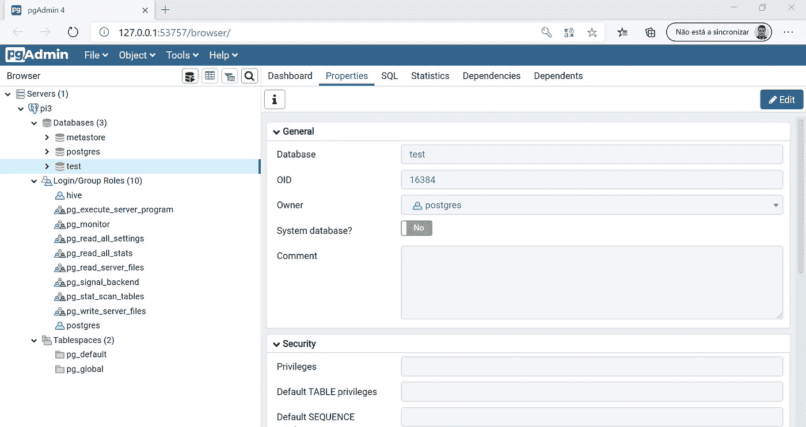
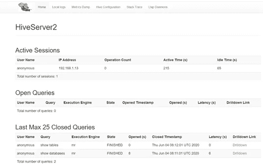

# 数据科学/大数据实验室——第 3 部分(共 4 部分): 3 节点集群中 Ubuntu 上的 Hive 和 Postgres

> 原文：<https://towardsdatascience.com/assembling-a-personal-data-science-big-data-laboratory-in-a-raspberry-pi-4-or-vms-cluster-8a1da8d49b48?source=collection_archive---------37----------------------->

## 实验室数据

## 使用 Hadoop、Spark、Hive、Kafka、Zookeeper 和 PostgreSQL 在 Raspberry Pi 4 或 VMs 集群中组建数据科学/大数据实验室

*这段文字可以用来支持在任何 Ubuntu 20.04 服务器集群中的安装，这就是设计良好的分层软件的妙处。此外，如果您有更多的节点，您可以随意分发软件。本文假设您知道 Linux 命令行，包括 ssh、vim 和 nano。*

*我不建议从少于三个树莓开始，因为你需要设置通信，并且 Zookeeper 和 Kafka 都需要奇数个节点。如果您尝试使用单个节点，可以使用本指南。尽管如此，性能可能会令人失望——对于单节点，我建议虚拟机具有合理数量的 RAM 和处理器。*

*由于篇幅原因，我不得不将教程分成四部分:*

*   [***第一部分:简介、操作系统和联网***](/assembling-a-personal-data-science-big-data-laboratory-in-a-raspberry-pi-4-or-vms-cluster-ff37759cb2ec?source=friends_link&sk=3a4b90e57dc0fc0ec44a39d1aee2145c)
*   [***第二部分:Hadoop 与 Spark***](/assembling-a-personal-data-science-big-data-laboratory-in-a-raspberry-pi-4-or-vms-cluster-e4c5a0473025?source=friends_link&sk=d9588dd1597ee9c0811e82666b002e43)
*   ***第三部分:PostgreSQL 和 Hive***
*   [***第四部分:卡夫卡与结论***](/kafka-and-zookeeper-over-ubuntu-in-a-3-node-cluster-a-data-science-big-data-laboratory-part-4-of-4-47631730d240?source=friends_link&sk=955731d942d6f83e7f00d731e830ba30)

*所有配置文件均可在【1】:*获得

[](https://github.com/ptaranti/RaspberryPiCluster) [## ptaranti/RaspberryPiCluster

### Hadoop+Spark+Hive+Kafka+Postgresql raspberry 集群(ubuntu 20.04)的配置文件

github.com](https://github.com/ptaranti/RaspberryPiCluster) 

*免责声明* : *此文免费提供给大家使用，风险自担。我小心地引用了我所有的资料来源，但是如果你觉得遗漏了什么，请给我发个短信。由于不同的软件版本可能会因其依赖性而表现出不同的行为，我建议使用我在第一次尝试中使用的相同版本。*


# 4.一种数据库系统

我决定在集群中安装一个成熟的关系数据库，如果你要处理数据，这是一个明智的决定。我选择 PostgreSQL 主要是因为它对 GIS 的成熟支持(我使用 GIS 数据)。我将它放在节点 3 中，因为节点 1 有 Spark —来分配工作负载。

我将安装 Hive，它可以很好地与 PostgreSQL 以及 MySQL 和其他语言耦合。

您将找到几个关于如何安装 PostgreSQL 的教程和大量文档。

我有使用 PostgreSQL 的经验，但是按照

[](https://linuxize.com/post/how-to-install-postgresql-on-ubuntu-18-04/) [## 如何在 Ubuntu 18.04 上安装 PostgreSQL

### PostgreSQL 或 Postgres 是一个开源的通用对象关系数据库管理系统。PostgreSQL 有…

linuxize.com](https://linuxize.com/post/how-to-install-postgresql-on-ubuntu-18-04/) 

您需要编辑以下文件

[*/etc/PostgreSQL/12/main/pg _ HBA . conf*](https://github.com/ptaranti/RaspberryPiCluster/blob/master/pi3/etc/postgresql/12/main/pg_hba.conf)

我知道我很懒，以一种准许可的方式配置了 PostgreSQL。请随意更新，但是我建议您只有在所有集群都正常运行后才实施安全性。

你可能想改变设置

[*/etc/PostgreSQL/12/main/*PostgreSQL . con](https://github.com/ptaranti/RaspberryPiCluster/blob/master/pi3/etc/postgresql/12/main/postgresql.conf)f

我编辑了以下属性:

```
listen_addresses = '*'
```

这通知 PostgreSQL 监听主机中的所有网络接口。

为了方便，我把 postgres 的密码改成了 postgres(我知道这很蠢..这是实验室，不是生产环境):

```
pi@pi2:~$ sudo su - postgres
postgres@pi2:~$ psql
psql (12.2 (Ubuntu 12.2-4))
Type "help" for help.postgres=# ALTER USER postgres  WITH PASSWORD 'postgres';
ALTER ROLE
postgres=# \q
postgres@pi2:~$ exit
logout
pi@pi2:~$
```

为了方便起见，我也把我的配置文件放在了 GitHub 中(参见 pi3)

我将数据库设置为由应用程序用户/密码访问。

我喜欢在 windows 机器上使用 visual pgadmin4 来管理数据库。该工具可安装在您的笔记本电脑上，并可远程使用:

 [## [计] 下载

### 用于 Windows，Mac，Linux 和网络的 PostgreSQL 工具

www.pgadmin.org](https://www.pgadmin.org/download/) 

注意—按照 PostgreSQL 的默认 Ubuntu 安装程序，数据库管理器服务将在每次重新启动时自动启动。

# 5.储备

我找到的树莓集群教程没有讨论配置单元安装。

为了更好地理解 Hive，我建议使用项目 wiki 页面:

[https://cwiki.apache.org](https://cwiki.apache.org/)/

注意:Hive 需要执行 Hadoop。在启动 Hive 之前，您需要运行:

```
start-dfs.sh
start-yarn.sh
```

我应该说安装 Hive 是痛苦的！我已经用 Derby 在本地安装了它，这或多或少很简单。但是我决定将环境作为一个产品来分发:

我在 PostgreSQL 服务器中实例化了一个 metastore 数据库。hive metastore 服务器连接到数据库并接收来自 hiveservers2 的连接。hiveserver2 通过 CLI、beeline 进行评估，并具有 webUI。

hive 架构升级得非常好，允许许多 hiveserver 和 metastore。用户可以通过网络连接并提交他们的查询。

在分布式环境中安装 Hive 最糟糕的地方是，我没有在文档或我查阅的书籍中找到任何更新的教程。但最后，一切都成功了。我将描述如何安装 Hive 分发安装。

从以下位置首次下载配置单元

 [## /hive 的索引

### 编辑描述

downloads.apache.org](https://downloads.apache.org/hive/) 

Hive 在一个完整的包中提供了所有的功能。请注意为您的 Hadoop 安装选择正确的 hive 版本。

在

*/home/pi/tmp*

```
wget  [https://downloads.apache.org/hive/hive-3.1.2/apache-hive-3.1.2-bin.tar.gz](https://downloads.apache.org/hive/hive-3.1.2/apache-hive-3.1.2-bin.tar.gz)tar -xvf apache-hive-3.1.2-bin.tar.gzmv apache-hive-3.1.2-bin hivesudo mv hive /opt/sudo chown -R pi:pi /opt/hive
```

# 5.1 设置环境

编辑

[*/home/pi/。巴沙尔*](https://github.com/ptaranti/RaspberryPiCluster/blob/master/pi1/home/pi/.bashrc)

在文件末尾添加:

```
# HIVE**export HIVE_HOME=/**opt**/**hive
**export PATH=$PATH:/**opt**/**hive**/**bin
```

比:

```
source /home/pi/.bashrc
```

# 5.2 Metastore

在 Hadoop 文件系统上创建数据仓库:

```
hdfs dfs -mkdir -p /user/hive/warehouse
hdfs dfs -chmod g+w /user/hive/warehouse
hdfs dfs -mkdir -p /tmp
hdfs dfs -chmod g+w /tmp
```

# 5.3 Lib guava -冲突问题

存在由库版本引起的冲突。从 hive 中删除番石榴，并复制 Hadoop 中可用的更新版本:

```
$ rm /opt/hive/lib/guava-19.0.jar
$ cp /opt/hadoop/share/hadoop/common/lib/guava-27.0-jre.jar /opt/hive/lib/cp /opt/hive/conf/hive-env.sh.template  /opt/hive/conf/hive-env.sh
```

# 5.4 配置文件

我只从 hive 中准备了一个安装，并通过节点 1 和 2 (pi1 和 pi2)分发它。hiveserver2 将在 pi1 中启动，hive-metastore 将在 pi2 中启动(但配置文件完全相同)。

配置文件必须在以下位置创建:

[*/opt/hive/conf/hive metastore-site . XML*](https://github.com/ptaranti/RaspberryPiCluster/blob/master/pi1/opt/hive/conf/hivemetastore-site.xml)

注意——**javax . jdo . option . connection URL**必须指向您的 PostgreSQL 数据库。我把它安装在 pi3 (192.168.1.13)

现在，编辑以下文件:

[*/opt/hive/conf/hive server 2-site . XML*](https://github.com/ptaranti/RaspberryPiCluster/blob/master/pi1/opt/hive/conf/hiveserver2-site.xml)

注意—**hive . metastore . uri**必须指向您的 hive metastore 服务器。我在 pi2 (192.168.1.12)安装了一个

现在，编辑该文件:

【T18*/opt/hive/conf/hive-env . sh*

从 PostgreSQL 站点下载 JDBC 驱动程序

[https://jdbc.postgresql.org/download.html](https://jdbc.postgresql.org/download.html)

并将其复制到:

*/opt/hive/lib/PostgreSQL-9 . 4 . 1208 . JRE 7 . jar*

注意—这是当前版本，您应该安装更多更新。

# 5.5 准备 Postgres

我已经在我的 windows 笔记本上安装了 pgAdmin4 并连接到 PostgreSQL。

我使用 pgAdmin4 GUI 来执行这些步骤:

首先，使用密码 **hive** 创建一个新的角色 **hive** (该信息在 *hivemetastore-site.xml* 配置中使用)。

之后，您需要创建一个名为“metastore”的新数据库，用户“hive”作为所有者。

# 5.5.1 启动 metastore 数据库模式

此过程将读取 hivemetastore-site.xml 以了解连接信息— IP、端口、用户、密码、数据库名称。

```
pi@pi1:/opt/hive/bin$ ./schematool -dbType postgres -initSchema
```

输出:

```
SLF4J: Class path contains multiple SLF4J bindings.
SLF4J: Found binding in [jar:file:/opt/hive/lib/log4j-slf4j-impl-2.10.0.jar!/org/slf4j/impl/StaticLoggerBinder.class]
SLF4J: Found binding in [jar:file:/opt/hadoop/share/hadoop/common/lib/slf4j-log4j12-1.7.25.jar!/org/slf4j/impl/StaticLoggerBinder.class]
SLF4J: See [http://www.slf4j.org/codes.html#multiple_bindings](http://www.slf4j.org/codes.html#multiple_bindings) for an explanation.
SLF4J: Actual binding is of type [org.apache.logging.slf4j.Log4jLoggerFactory]
Metastore connection URL:        jdbc:postgresql://pi3:5432/metastore
Metastore Connection Driver :    org.postgresql.Driver
Metastore connection User:       hive
Starting metastore schema initialization to 3.1.0
Initialization script hive-schema-3.1.0.postgres.sqlInitialization script completed
schemaTool completed
```

您可以在命令行中使用 pgsql 在 pgAdmin4 接口 ou 上检查新数据库。

编辑:

[/home/pi/。巴沙尔](https://github.com/ptaranti/RaspberryPiCluster/blob/master/pi1/home/pi/.bashrc)

添加:

```
**export HIVE_HOME=/**opt**/**hive
**export HIVE_CONF_DIR=/**opt**/**hive**/**conf**export PATH=$**PATH**:$**HIVE_HOME**/**bin**:$**HADOOP_HOME**/**bin**:$**HADOOP_HOME**/**sbin
```

请参考的最终版本。GitHub 中的 bashrc。

# 5.6 通过网络连接 hiveserver2 和 hive-metastore 时出现的问题

当我将 hiveserver2 连接到 hive-metastore 时，我面临了一场噩梦。最后，我成功地实现了在:

[](https://kontext.tech/column/hadoop/303/hiveserver2-cannot-connect-to-hive-metastore-resolutionsworkarounds) [## HiveServer2 无法连接到配置单元 Metastore 解决方案/变通办法

### 从 Hive 3.x 开始，增加了针对 HiveServer2 客户端的新身份验证功能。启动 HiveServer2 服务时(配置单元…

kontext .技术](https://kontext.tech/column/hadoop/303/hiveserver2-cannot-connect-to-hive-metastore-resolutionsworkarounds) 

此网页描述了由于在 Hive 3 中插入了新的身份验证功能而出现的错误。用于 HiveServer2 客户端的 x。启动 HiveServer2 服务时(Hive 版本 3.0.0)。

建议的解决方法需要在 Hadoop(所有节点中)修改文件 *core-site.xml* 中的 **proxyuser** 属性。

*/opt/Hadoop/etc/Hadoop/core-site . XML*

这在 GitHub 中有所体现。

注意:如果事情出错，您可能需要研究错误和服务。您应该考虑安装 *netstat* ，以便能够检查每个服务器中监听的端口。

Hiveserver 2 —端口 1000 和 10002 (10002 用于 webUI)

Metastore 端口 9083

```
sudo netstat -plnt | grep ‘1000’
```

# 5.7 分配蜂箱

现在，您必须将安装复制到要运行 hiveserver2、hivemetastore 的节点，以及要执行 CLI(直线)的位置。我复制到所有 3 个节点。

在我的安装中，如前所述，我在 pi1 中使用 hiveserver2，在 pi2 中使用 hivemetastore。请注意，hiveserver2 和 metastore 的配置文件是独立的。当启动这些服务时，您提供指示您打算启动哪个服务的参数。例如，在声明 hiveserver2 时，Hive 不会读取 hivemetastore-site.xml 文件。因此，对于我们来说，将两个配置保存在同一个文件夹中并分发安装是安全的。

要将配置单元安装复制到其他节点:

在 pi2 中:

```
sudo mkdir /opt/hive
sudo chown -R pi:pi /opt/hive
```

在 pi3 中:

```
sudo mkdir /opt/hive
sudo chown -R pi:pi /opt/hive
```

在 pi1 中:

```
rsync  -vaz /opt/hive/   pi2:/opt/hive
rsync  -vaz /opt/hive/   pi3:/opt/hive
```

# 5.8 启动配置单元

你需要先启动 Hadoop 和 yarn(*start-DFS . sh*和 *start-yarn.sh* )和 *postgres* ！！！

最初，我更喜欢用详细日志启动服务；这有助于了解一切是否顺利，以及了解 Hive 如何在后台工作。请注意， *hive-metastore* 和 *hiveserver2* 都需要单独的终端，而第三个终端对于*直线*来说是必要的。

您应该首先启动 hive-metastore。

在 pi2 中:

```
hive --service metastore --hiveconf hive.root.logger=INFO,console
```

初始化 hive-metastore 后，应该启动 hiveserver2。

在 pi1 中:

```
hive --service hiveserver2 --hiveconf hive.root.logger=INFO,console
```

您可以使用命令 **hiveserver2** 在没有详细日志的情况下启动

在初始化这个服务之后，你可以用 *jps* 和 *netstat* 命令来检查它。

# 5.9 直线

现在您可以运行 beeline 来检查是否一切顺利。我从 pi3 开始测试:

首先，启动 beeline 并连接到 *hiveserver*

```
pi@pi3:~$ beeline
WARNING: log4j.properties is not found. HADOOP_CONF_DIR may be incomplete.
WARNING: log4j.properties is not found. HADOOP_CONF_DIR may be incomplete.
SLF4J: Class path contains multiple SLF4J bindings.
SLF4J: Found binding in [jar:file:/opt/hive/lib/log4j-slf4j-impl-2.10.0.jar!/org/slf4j/impl/StaticLoggerBinder.class]
SLF4J: Found binding in [jar:file:/opt/hadoop/share/hadoop/common/lib/slf4j-log4j12-1.7.25.jar!/org/slf4j/impl/StaticLoggerBinder.class]
SLF4J: See [http://www.slf4j.org/codes.html#multiple_bindings](http://www.slf4j.org/codes.html#multiple_bindings) for an explanation.
SLF4J: Actual binding is of type [org.apache.logging.slf4j.Log4jLoggerFactory]
Beeline version 3.1.2 by Apache Hive
beeline> !connect jdbc:hive2://192.168.1.11:10000/default
Connecting to jdbc:hive2://192.168.1.11:10000/default
Enter username for jdbc:hive2://192.168.1.11:10000/default:
Enter password for jdbc:hive2://192.168.1.11:10000/default:
Connected to: Apache Hive (version 3.1.2)
Driver: Hive JDBC (version 3.1.2)
Transaction isolation: TRANSACTION_REPEATABLE_READ
```

现在，您可以访问 hive 中的数据库

```
0: jdbc:hive2://192.168.1.11:10000/default> show databases;
INFO  : Compiling command(queryId=pi_20200604081053_b4992aba-814a-40cd-a32e-12d5b33f0926): show databases
INFO  : Concurrency mode is disabled, not creating a lock manager
INFO  : Semantic Analysis Completed (retrial = false)
INFO  : Returning Hive schema: Schema(fieldSchemas:[FieldSchema(name:database_name, type:string, comment:from deserializer)], properties:null)
INFO  : Completed compiling command(queryId=pi_20200604081053_b4992aba-814a-40cd-a32e-12d5b33f0926); Time taken: 6.27 seconds
INFO  : Concurrency mode is disabled, not creating a lock manager
INFO  : Executing command(queryId=pi_20200604081053_b4992aba-814a-40cd-a32e-12d5b33f0926): show databases
INFO  : Starting task [Stage-0:DDL] in serial mode
INFO  : Completed executing command(queryId=pi_20200604081053_b4992aba-814a-40cd-a32e-12d5b33f0926); Time taken: 0.215 seconds
INFO  : OK
INFO  : Concurrency mode is disabled, not creating a lock manager
+----------------+
| database_name  |
+----------------+
| default        |
+----------------+
1 row selected (8.228 seconds)
0: jdbc:hive2://192.168.1.11:10000/default>
```

看看这些表格。Hive CLI 类似于 SQL。

```
0: jdbc:hive2://192.168.1.11:10000/default> show tables;
INFO  : Compiling command(queryId=pi_20200604081200_943e5495-23c4-4e35-8975-cedef4563d62): show tables
INFO  : Concurrency mode is disabled, not creating a lock manager
INFO  : Semantic Analysis Completed (retrial = false)
INFO  : Returning Hive schema: Schema(fieldSchemas:[FieldSchema(name:tab_name, type:string, comment:from deserializer)], properties:null)
INFO  : Completed compiling command(queryId=pi_20200604081200_943e5495-23c4-4e35-8975-cedef4563d62); Time taken: 0.157 seconds
INFO  : Concurrency mode is disabled, not creating a lock manager
INFO  : Executing command(queryId=pi_20200604081200_943e5495-23c4-4e35-8975-cedef4563d62): show tables
INFO  : Starting task [Stage-0:DDL] in serial mode
INFO  : Completed executing command(queryId=pi_20200604081200_943e5495-23c4-4e35-8975-cedef4563d62); Time taken: 0.193 seconds
INFO  : OK
INFO  : Concurrency mode is disabled, not creating a lock manager
+-----------+
| tab_name  |
+-----------+
+-----------+
No rows selected (0.463 seconds)
0: jdbc:hive2://192.168.1.11:10000/default>
```

# 5.10 配置单元服务器 2 WebUI

Hiveserver2 在端口 10002 上有一个默认的 webUI:

[http://pi1:10002/](http://pi1:10002/)



# 然后

[](/kafka-and-zookeeper-over-ubuntu-in-a-3-node-cluster-a-data-science-big-data-laboratory-part-4-of-4-47631730d240) [## 数据科学/大数据实验室——第 4 部分，共 4 部分:卡夫卡和 Zookeeper over Ubuntu in a 3-node…

### 使用 Hadoop、Spark、Hive、Kafka 在 Raspberry Pi 4 或 VMs 集群中组建数据科学/大数据实验室…

towardsdatascience.com](/kafka-and-zookeeper-over-ubuntu-in-a-3-node-cluster-a-data-science-big-data-laboratory-part-4-of-4-47631730d240) 

[1] P. G .塔兰蒂。[https://github.com/ptaranti/RaspberryPiCluster](https://github.com/ptaranti/RaspberryPiCluster)

[2] R .唐。 [HiveServer2 无法连接到 Hive Metastore 解决方案/变通办法](https://kontext.tech/column/hadoop/303/hiveserver2-cannot-connect-to-hive-metastore-resolutionsworkarounds) (2018)