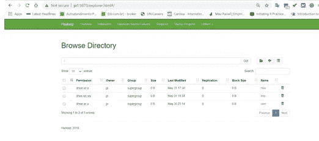
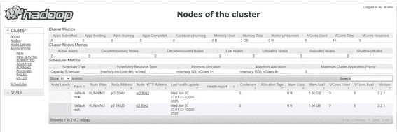

# 数据科学/大数据实验室—第 2 部分，共 4 部分:3 节点集群中基于 Ubuntu 20.04 的 Hadoop 3.2.1 和 Spark 3.0.0

> 原文：<https://towardsdatascience.com/assembling-a-personal-data-science-big-data-laboratory-in-a-raspberry-pi-4-or-vms-cluster-e4c5a0473025?source=collection_archive---------25----------------------->

## 实验室数据

## 使用 Hadoop、Spark、Hive、Kafka、Zookeeper 和 PostgreSQL 在 Raspberry Pi 4 或 VMs 集群中组建数据科学/大数据实验室

*这段文字可以用来支持在任何 Ubuntu 20.04 服务器集群中的安装，这就是设计良好的分层软件的妙处。此外，如果您有更多的节点，您可以随意分发软件。本文假设您知道 Linux 命令行，包括 ssh、vim 和 nano。*

*我不建议从少于三个树莓开始，因为你需要设置通信，并且 Zookeeper 和 Kafka 都需要奇数个节点。如果您尝试使用单个节点，可以使用本指南。尽管如此，性能可能会令人失望——对于单节点，我建议虚拟机具有合理数量的 RAM 和处理器。*

*由于篇幅原因，我不得不将教程分成四部分*

*   [***第一部分:简介、操作系统和联网***](/assembling-a-personal-data-science-big-data-laboratory-in-a-raspberry-pi-4-or-vms-cluster-ff37759cb2ec?source=friends_link&sk=3a4b90e57dc0fc0ec44a39d1aee2145c)
*   ***第二部分:Hadoop 和 Spark***
*   [***第三部分:PostgreSQL 和 Hive***](/assembling-a-personal-data-science-big-data-laboratory-in-a-raspberry-pi-4-or-vms-cluster-8a1da8d49b48?source=friends_link&sk=4a481ee4e3778d6c9d4e5a305a407bb6)
*   [***第四部分:卡夫卡与结论***](/kafka-and-zookeeper-over-ubuntu-in-a-3-node-cluster-a-data-science-big-data-laboratory-part-4-of-4-47631730d240?source=friends_link&sk=955731d942d6f83e7f00d731e830ba30)

*所有配置文件均可在【1】:*获得

[](https://github.com/ptaranti/RaspberryPiCluster) [## ptaranti/RaspberryPiCluster

### Hadoop+Spark+Hive+Kafka+Postgresql 集群(ubuntu 20.04)的配置文件

github.com](https://github.com/ptaranti/RaspberryPiCluster) 

*免责声明* : *此文免费提供给大家使用，风险自担。我小心地引用了我所有的资料来源，但是如果你觉得遗漏了什么，请给我发个短信。由于不同的软件版本可能会因其依赖性而表现出不同的行为，我建议使用我在第一次尝试中使用的相同版本。*


# 3.安装 Hadoop 和 Spark

Hadoop 和 Spark 安装考虑了来自[3，4]和其他来源的指令。

我使用了 Apache 网站上的更新版本:

*   *hadoop-3.2.1.tar.gz*
*   *spark-2 . 4 . 5-bin-Hadoop 2.7 . tgz*

# 3.1 设置您的环境

首先:下载，并将文件解压到/opt。授予 *pi* 用户访问权限。

```
sudo tar -xvf hadoop-3.2.1.tar.gz -C /opt/
sudo tar -xvf spark-2.4.5-bin-hadoop2.7.tgz  -C /opt/cd /opt/pi@pi1:/opt$ sudo mv hadoop-3.2.1 hadoop
pi@pi1:/opt$ sudo mv spark-2.4.5-bin-hadoop2.7 spark
pi@pi1:/opt$ sudo chown -R pi:pi /opt/spark
pi@pi1:/opt$ sudo chown -R pi:pi /opt/hadoop
```

添加到 [/home/pi/。巴沙尔](https://github.com/ptaranti/RaspberryPiCluster/blob/master/pi1/home/pi/.bashrc):

编辑后:

```
source /home/pi/.bashrc
```

# 3.2 将 Hadoop 和 Spark 配置为单个节点

现在您需要配置 Hadoop 和 Spark

为了清楚起见，我们首先将其配置为单个节点，然后针对群集进行修改。[我在 GitHub](https://github.com/ptaranti/RaspberryPiCluster) 中的存储库只包含最终的集群配置文件。

# Hadoop

转到文件夹

[*/opt/Hadoop/etc/Hadoop*/](https://github.com/ptaranti/RaspberryPiCluster/tree/master/pi1/opt/hadoop/etc/hadoop)

在这一点上，我遇到了很多麻烦:我不小心在文件头上插入了一行 blanc。这一空白行导致解析错误，Hadoop 一直失败，直到我意识到这个问题。

编辑文件

[*/opt/Hadoop/etc/Hadoop/Hadoop-env . sh*，](https://github.com/ptaranti/RaspberryPiCluster/blob/master/pi1/opt/hadoop/etc/hadoop/hadoop-env.sh)

在末尾增加以下一行:

```
**export JAVA_HOME=/**usr**/**lib**/**jvm**/**java-8-openjdk-arm64
```

编辑配置于

[/opt/Hadoop/etc/Hadoop/core-site . XML](https://github.com/ptaranti/RaspberryPiCluster/blob/master/pi1/opt/hadoop/etc/hadoop/core-site.xml)

编辑配置于

【T18*/opt/Hadoop/etc/Hadoop/HDFS-site . XML*

现在准备数据区:

```
$ sudo mkdir -p /opt/hadoop_tmp/hdfs/datanode
$ sudo mkdir -p /opt/hadoop_tmp/hdfs/namenodesudo chown -R pi:pi /opt/hadoop_tmp
```

编辑配置于

[*/opt/Hadoop/etc/Hadoop/map red-site . XML*](https://github.com/ptaranti/RaspberryPiCluster/blob/master/pi1/opt/hadoop/etc/hadoop/mapred-site.xml)

编辑配置于

[*/opt/Hadoop/etc/Hadoop/yarn-site . XML*](https://github.com/ptaranti/RaspberryPiCluster/blob/master/pi1/opt/hadoop/etc/hadoop/yarn-site.xml)

准备数据空间:

```
$ hdfs namenode -format -force$ start-dfs.sh
$ start-yarn.sh$ hadoop fs -mkdir /tmp$ hadoop fs -ls /
Found 1 items
drwzr-xr-x   - pi supergroup          0 2019-04-09 16:51 /tmp
```

使用 *jps* 检查所有服务是否开启(数字变化..) :

```
$ jps
2736 NameNode
2850 DataNode
3430 NodeManager
3318 ResourceManager
3020 SecondaryNameNode
```

你需要这五项服务！

# 测试

为了测试单个节点，我参考了教程[2]:

执行以下命令:

```
**pi@pi1:/opt$ hadoop fs -put $SPARK_HOME/README.md /**
2020-06-24 19:16:02,822 WARN util.NativeCodeLoader: Unable to load native-hadoop library for your platform... using builtin-java classes where applicable
2020-06-24 19:16:06,389 INFO sasl.SaslDataTransferClient: SASL encryption trust check: localHostTrusted = false, remoteHostTrusted = false
**pi@pi1:/opt$ spark-shell**
2020-06-24 19:16:23,814 WARN util.NativeCodeLoader: Unable to load native-hadoop library for your platform... using builtin-java classes where applicable
Setting default log level to "WARN".
To adjust logging level use sc.setLogLevel(newLevel). For SparkR, use setLogLevel(newLevel).
Spark context Web UI available at [http://pi1:4040](http://pi1:4040)
Spark context available as 'sc' (master = local[*], app id = local-1593026210941).
Spark session available as 'spark'.
Welcome to
      ____              __
     / __/__  ___ _____/ /__
    _\ \/ _ \/ _ `/ __/  '_/
   /___/ .__/\_,_/_/ /_/\_\   version 3.0.0
      /_/Using Scala version 2.12.10 (OpenJDK 64-Bit Server VM, Java 1.8.0_252)
Type in expressions to have them evaluated.
Type :help for more information.**scala> val textFile = sc.textFile("hdfs://pi1:9000/README.md")**
textFile: org.apache.spark.rdd.RDD[String] = hdfs://pi1:9000/README.md MapPartitionsRDD[1] at textFile at <console>:24**scala> textFile.first()**
res0: String = # Apache Sparkscala>
```

此时，我陷入了困境，出现了类似于以下内容的重复消息:

***INFO 纱。委托人:申请报告 _1434263747091_0023(状态:已受理)***

我遵循了[4]和其他来源的建议，更改了以下文件[*/opt/Hadoop/etc/Hadoop/capacity-scheduler . XML*](https://github.com/ptaranti/RaspberryPiCluster/blob/master/pi1/opt/hadoop/etc/hadoop/capacity-scheduler.xml)*。*

如果在资源较少的单台机器上运行集群，应该设置参数***yarn . scheduler . capacity . maximum-am-resource-percent***。此设置指示可分配给应用程序主机的资源比例，从而增加了可能的并发应用程序的数量。请注意，这取决于您的资源。它在我的 Pi 4 4GB 内存中工作。

编辑文件，添加属性:

[/opt/Hadoop/etc/Hadoop/capacity-scheduler . XML](https://github.com/ptaranti/RaspberryPiCluster/blob/master/pi1/opt/hadoop/etc/hadoop/capacity-scheduler.xml)

注意——教程通常提供命令**抑制警告**。我更喜欢在实验时看到这些警告。如果您想删除它，请参考第一个教程。

# 3.3 集群中的 Hadoop 与 Yarn

现在，您应该在单个节点中拥有一个完全可操作的安装。是 Hadoop 走向集群的时候了！

我完成了教程，但是遇到了一些问题。这是意料之中的—不同的环境，不同的软件版本。

经过一些尝试，我成功地拥有了一个稳定的环境。配置 Hadoop 以在集群中使用 Yarn 的下一步是将两者结合起来[2，4]。

注意—由于火花，除了节点 pi1 (pi1 ->主节点)之外，所有节点都具有相同的配置(p2、p3、… ->工作节点)。同样，我的 GitHub 存储库中有可用的配置。我已经提供了所有节点的配置。

为所有节点创建文件夹:

```
$ clustercmd-sudo mkdir -p /opt/hadoop_tmp/hdfs
$ clustercmd-sudo chown –R pi:pi /opt/hadoop_tmp
$ clustercmd-sudo mkdir -p /opt/hadoop
$ clustercmd-sudo chown -R pi:pi /opt/Hadoop
```

下一步将从 Hadoop 中删除所有数据。如果有重要的事情，先做好备份。

```
$ clustercmd rm –rf /opt/hadoop_tmp/hdfs/datanode/*
$ clustercmd rm –rf /opt/hadoop_tmp/hdfs/namenode/*
```

注意，火花只会存在于主人身上。

复制 Hadoop:

来自 pi1:

```
pi@pi1:~$  rsync -vaz  /opt/hadoop   pi2:/opt/ hadoop   
pi@pi1:~$  rsync -vaz  /opt/hadoop   pi3:/opt/ hadoop   
pi@pi1:~$  rsync -vaz  /opt/hadoop   pi4:/opt/ hadoop
```

对所有节点都这样做。

我更喜欢一个一个做，确认没有异常行为。

现在，需要编辑以下文件，更改配置:

[/opt/Hadoop/etc/Hadoop/core-site . XML](https://github.com/ptaranti/RaspberryPiCluster/blob/master/pi1/opt/hadoop/etc/hadoop/core-site.xml)

[/opt/Hadoop/etc/Hadoop/*HDFS-site . XML*](https://github.com/ptaranti/RaspberryPiCluster/blob/master/pi1/opt/hadoop/etc/hadoop/hdfs-site.xml)

注意—属性 ***dfs.replication*** 表示数据在集群中复制的次数。您可以设置在两个或更多节点上复制所有数据。不要输入高于实际工作节点数的值。我用 1 是因为我的一个笔记本用的是 16GB 的 micro SD。由于新冠肺炎病毒爆发，我的一些部分在邮件中延迟了。如果配置错误，由于缺乏资源，您的 spark 应用程序将陷入“已接受”状态。

注意—最后一个属性***DFS . permissions . enabled***被设置为 **false** 以禁用权限检查。我使用集群外部机器上的 spark，这方便了我的访问。显然，我建议不要在生产环境中使用这个设置。我还关闭了安全模式。为此，在完成安装运行后:

```
 hdfs dfsadmin -safemode leave
```

数据在集群中复制的次数。您可以设置在两个或更多节点上复制所有数据。不要输入高于实际工作节点数的值。我用 1 是因为我的一个笔记本用的是 16GB 的 micro SD。由于新冠肺炎病毒爆发，我的一些部分在邮件中延迟了。如果配置错误，由于缺乏资源，您的 spark 应用程序将陷入“已接受”状态。

[/opt/Hadoop/etc/Hadoop/*mapred-site . XML*](https://github.com/ptaranti/RaspberryPiCluster/blob/master/pi1/opt/hadoop/etc/hadoop/mapred-site.xml)

[/opt/Hadoop/etc/Hadoop/*yarn-site . XML*](https://github.com/ptaranti/RaspberryPiCluster/blob/master/pi1/opt/hadoop/etc/hadoop/yarn-site.xml)

创建两个文件:

[*/opt/Hadoop/etc/Hadoop/master*](https://github.com/ptaranti/RaspberryPiCluster/blob/master/pi1/opt/hadoop/etc/hadoop/master)

[*/opt/Hadoop/etc/Hadoop/workers*](https://github.com/ptaranti/RaspberryPiCluster/blob/master/pi1/opt/hadoop/etc/hadoop/workers)

更新所有节点上的配置文件后，需要格式化数据空间并启动集群(可以从任何节点启动):

```
$ hdfs namenode -format -force$ start-dfs.sh
$ start-yarn.sh
```

# 3.4 配置火花

基本上，您需要创建/编辑以下配置文件:

[*/opt/spark/conf/spark-defaults . conf*](https://github.com/ptaranti/RaspberryPiCluster/blob/master/pi1/opt/spark/conf/spark-defaults.conf)

这些值可以根据您的硬件进行调整，但它们将适用于 Raspberry Pi 4 4GB。

将环境变量设置为:

[*/opt/spark/conf/*spark-env . sh](https://github.com/ptaranti/RaspberryPiCluster/blob/master/pi1/opt/spark/conf/spark-env.sh)

在所有节点中安装以下软件包，以便允许节点处理用 python/pyspark 准备的作业:

```
sudo apt intall python3 python-is-python3
```

# 3.5 测试集群

重新启动所有节点，并重新启动服务:

```
$ start-dfs.sh
$ start-yarn.sh
```

您可以发送一个应用示例来测试 spark:

```
$ spark-submit --deploy-mode client --class org.apache.spark.examples.SparkPi /opt/spark/examples/jars/spark-examples_2.12-3.0.0.jar
```

在处理结束时，您应该会收到 PI 值的近似计算结果:

```
**Pi is roughly 3.140555702778514**
```

(这个圆周率计算需要改进！！！！)

# 3.6 面向 Hadoop 和 Yarn 的 Web 应用

# Hadoop webUi

h [ttp://pi1:9870/](http://pi1:9870/)



最初，我无法在线处理(上传/删除)文件。以下网址提供了一种解决方法:

[](https://community.cloudera.com/t5/Support-Questions/unable-to-upload-files-to-hdfs/td-p/33650) [## 无法将文件上传到 hdfs

### 当我试图上传文件到 HDFS，它显示“错误:未定义”。然而，从终端我可以成功上传文件…

community.cloudera.com](https://community.cloudera.com/t5/Support-Questions/unable-to-upload-files-to-hdfs/td-p/33650) 

该解决方法是通过向 Hadoop[*core-site . XML*](https://github.com/ptaranti/RaspberryPiCluster/blob/master/pi1/opt/hadoop/etc/hadoop/core-site.xml)添加以下属性来实现的:

# Yarn WebUi

[http://pi1:8088/](http://pi1:8088/)



# 然后

[](/assembling-a-personal-data-science-big-data-laboratory-in-a-raspberry-pi-4-or-vms-cluster-8a1da8d49b48) [## 数据科学/大数据实验室——第 3 部分(共 4 部分): 3 节点集群中 Ubuntu 上的 Hive 和 Postgres

### 使用 Hadoop、Spark、Hive、Kafka 在 Raspberry Pi 4 或 VMs 集群中组建数据科学/大数据实验室…

towardsdatascience.com](/assembling-a-personal-data-science-big-data-laboratory-in-a-raspberry-pi-4-or-vms-cluster-8a1da8d49b48) 

[1] P. G .塔兰蒂。[https://github.com/ptaranti/RaspberryPiCluster](https://github.com/ptaranti/RaspberryPiCluster)

[2]华生。[构建 Raspberry Pi Hadoop / Spark 集群](https://dev.to/awwsmm/building-a-raspberry-pi-hadoop-spark-cluster-8b2) (2019)

[3]梁伟雄。[从零开始构建 Raspberry Pi Hadoop/Spark 集群](https://medium.com/analytics-vidhya/build-raspberry-pi-hadoop-spark-cluster-from-scratch-c2fa056138e0) (2019)

[4]霍巴特。[如何安装和设置 3 节点 Hadoop 集群](https://www.linode.com/docs/databases/hadoop/how-to-install-and-set-up-hadoop-cluster/) (2019)