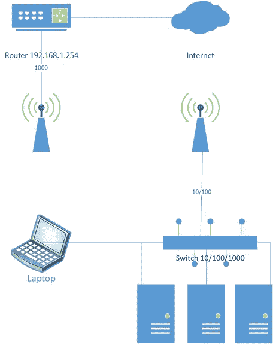

# 数据科学/大数据实验室—第 1 部分，共 4 部分:Raspberry Pi 或 VMs 集群—操作系统和通信

> 原文：<https://towardsdatascience.com/assembling-a-personal-data-science-big-data-laboratory-in-a-raspberry-pi-4-or-vms-cluster-ff37759cb2ec?source=collection_archive---------19----------------------->

## 实验室数据

## 使用 Hadoop、Spark、Hive、Kafka、Zookeeper 和 PostgreSQL 在 Raspberry Pi 4 或 VMs 集群中组建数据科学/大数据实验室

*这段文字可以用来支持在任何 Ubuntu 20.04 服务器集群中的安装，这就是设计良好的分层软件的妙处。此外，如果您有更多的节点，您可以随意分发软件。本文假设您知道 Linux 命令行，包括 ssh、vim 和 nano。*

*我不建议从少于三个树莓开始，因为你需要设置通信，并且 Zookeeper 和 Kafka 都需要奇数个节点。如果您尝试使用单个节点，可以使用本指南。尽管如此，性能可能会令人失望——对于单节点，我建议虚拟机具有合理数量的 RAM 和处理器。*

*由于篇幅原因，我不得不将教程分成四部分*

*   ***第一部分:简介、操作系统和联网***
*   [***第二部分:Hadoop 与 Spark***](/assembling-a-personal-data-science-big-data-laboratory-in-a-raspberry-pi-4-or-vms-cluster-e4c5a0473025?source=friends_link&sk=d9588dd1597ee9c0811e82666b002e43)
*   [***第三部分:PostgreSQL 和 Hive***](/assembling-a-personal-data-science-big-data-laboratory-in-a-raspberry-pi-4-or-vms-cluster-8a1da8d49b48?source=friends_link&sk=4a481ee4e3778d6c9d4e5a305a407bb6)
*   [***第四部分:卡夫卡、动物园管理员和结论***](/kafka-and-zookeeper-over-ubuntu-in-a-3-node-cluster-a-data-science-big-data-laboratory-part-4-of-4-47631730d240?source=friends_link&sk=955731d942d6f83e7f00d731e830ba30)

*所有配置文件均可在【1】:*获得

[](https://github.com/ptaranti/RaspberryPiCluster) [## ptaranti/RaspberryPiCluster

### Hadoop+Spark+Hive+Kafka+Postgresql 集群(ubuntu 20.04)的配置文件

github.com](https://github.com/ptaranti/RaspberryPiCluster) 

*免责声明* : *此文免费提供给大家使用，风险自担。我小心地引用了我所有的资料来源，但是如果你觉得遗漏了什么，请给我发个短信。由于不同的软件版本可能会因其依赖性而表现出不同的行为，我建议使用我在第一次尝试中使用的相同版本。*

# 1.介绍

培训或学习数据科学或商业智能通常是一项孤独的任务。你可以去读 MBA 或者在网上诅咒，但是巩固知识需要实践和尝试。

对于某些技术来说，这很简单。Python 和 R 可以很容易的安装在一般的电脑上。然而，一个完整的实验需要集成几个工具，从数据采集到报告/可视化。

这些工具…我能说什么呢…我不喜欢不理解我正在使用的工具。我是一个 1987 年和 12yo 一起学习 Basic 语言的老家伙。我用 Z80 从磁带播放器加载程序，在 90 年代，我管理 Novell networks，在 Minix 之后几年才使用 Linux 不，我不是博物馆馆长。我学了 Fortran，Pascal，C，Java…现在又学了 R 和 Python。我想在接近真实的环境中训练管道和分析——这让我回到了工具上。我觉得不仅需要有训练的环境，还需要真正了解这个环境。

关于环境，我说的是 Apache 支持的解决方案(和一些朋友):Hadoop，Spark，Hive，Postgres，Kafka 等等，安装在一个集群上。在你的桌面上，你很可能使用 Anaconda 和 Rstudio(抱歉 Anaconda，但我更喜欢单机 Rstudio)。

这是我梦寐以求的实验室，我去了。

大数据环境需要现实世界中的分布式解决方案，可扩展性是首要要求。因此，学习如何配置环境对我来说很重要。我没有选择基于云的解决方案——我想要完全的控制，对“个人实验室”没有任何限制。

首先，我已经在我的笔记本上安装了完整的解决方案，使用了三台虚拟机(在 VirtualBox 上安装了 Ubuntu 20.04)。它工作了，但是有一些缺点——性能和网络。最糟糕的是——我把我的笔记本电脑从家搬到工作的地方，在那里使用这种“虚拟网络”是不可接受的。

当我决定尝试 Raspberry 时，我打算为我的实验室购买一个强大的工作站来虚拟化集群。新的 Raspberry Pi 4 最高可配 4GB 内存。这不是一辆法拉利，但我只需要一辆小型车就能拥有范并完成工作。我读了一些关于如何用 Raspberry 组装集群的文本，用于 Hadoop + Spark 解决方案——他们用 PI 3 取得了成功。

然后我决定用三个树莓派组装自己的集群。

我对结果很满意；它起作用了，它的性能允许我进行实验。我会向学生推荐这个。

# 2.组装集群

第一部分将引导您组装物理集群，安装 Ubuntu server 20.04，并为集群设置环境

# 2.1 你需要什么？

> 3 个或更多覆盆子 Pi 4 4GB
> 
> 1 个千兆交换机(10/100/1000)
> 
> 用于给 Pi 供电的 USB-C 电缆
> 
> 你的覆盆子的微型 SD 卡
> 
> 网络用以太网电缆
> 
> 电源(我使用带 3 个 USB 3A 端口的充电器)
> 
> 集群的丙烯酸底座


集群装载 1


集群装载 2

# 2.1.1 关于材料的一些说明:

树莓 Pi 4 有 wifi 和千兆以太网。我选择了使用千兆交换机的有线网络进行集群通信。我还使用无线网络进行远程访问。因此，您应该使用 cat 6 电缆。

因为想玩数据，所以买了 128GB 的 SD 卡。然而，其中一张卡没有交付，我开始为第二个覆盆子(节点 pi2)使用 16GB 的卡，它工作了。购买高读写速度的优质 SD 卡对集群性能至关重要。树莓有一些扩展板，可以让你使用 2.5 HD，SSD SATA 或 NVME。我没有安装它，但你可以很容易地安装一个 NAS 或数据存储区。

我花了很多时间配置集群，发现问题和归零几乎花了三周时间。我不是一个寻求让别人遭受同样痛苦的虐待狂，所以我决定出版这个指南，希望你喜欢。

我用了这些优秀的指南作为参考，重点在第[2，3，4]:

[](https://dev.to/awwsmm/building-a-raspberry-pi-hadoop-spark-cluster-8b2) [## 构建 Raspberry Pi Hadoop / Spark 集群

### 专业提示:如果您只是在寻找如何配置 Hadoop 和 Spark 在集群上运行，请从这里开始。动机和…

开发到](https://dev.to/awwsmm/building-a-raspberry-pi-hadoop-spark-cluster-8b2) [](https://medium.com/analytics-vidhya/build-raspberry-pi-hadoop-spark-cluster-from-scratch-c2fa056138e0) [## 从头开始构建 Raspberry Pi Hadoop/Spark 集群

### 本文将带领您从头开始使用 Raspberry Pi 构建 Hadoop 集群的漫长过程。

medium.com](https://medium.com/analytics-vidhya/build-raspberry-pi-hadoop-spark-cluster-from-scratch-c2fa056138e0) [](https://developer.ibm.com/recipes/tutorials/building-a-hadoop-cluster-with-raspberry-pi/) [## 使用 Raspberry Pi 构建 Hadoop 集群——IBM 开发人员食谱

### 简介 Hadoop 潜力巨大，是最知名的大数据项目之一。在本教程中，我们将…

developer.ibm.com](https://developer.ibm.com/recipes/tutorials/building-a-hadoop-cluster-with-raspberry-pi/) 

然而，即使按照教程，我发现了许多问题和陷阱。有些问题可能与不同的软件版本有关。

为了在阅读本文时帮助您，也为了在我需要重新安装时帮助我自己，我将所有的配置文件保存在一个与 raspberries 中存在的文件夹结构相似的文件夹结构中——小心使用(IP、服务器名称等可能会因您而异)。所有文件都是最终版本，有 Hadoop、Hive、Zookeeper、Kafka 的分布式版本(Spark 和 Postgres 安装在单节点)。

# 2.2 安装操作系统

首先，您应该在集群支持中组装物理设备，而不是 SD 卡。不要急于从桌子上摆满零件开始；这样容易短路，你会丢失你的素材。

我的笔记本运行 Windows 10——我没有忘记黑暗面(Linux)——我有一些 Linux 虚拟机可供选择和使用。但是我在描述教程的时候会参考 Windows 支持软件。如果你是一个只懂 Linux 的极客，我相信你知道如何用你的工具完成工作(在 Linux 中通常更容易)。

# 2.2.1 下载并安装 Raspberry Pi 成像仪

使用 Ubuntu 服务器创建微型 SD 卡的最佳工具是 Raspberry Pi Imager [5]。该工具适用于 Windows、Ubuntu 和 Mac，可从以下网站下载:

[](https://www.raspberrypi.org/downloads/) [## 树莓 Pi 下载-树莓 Pi 的软件

### Raspberry Pi OS(以前称为 Raspbian)是我们所有型号的 Raspberry Pi 的官方操作系统。使用…

www.raspberrypi.org](https://www.raspberrypi.org/downloads/) 

此实用程序将刻录原始版本的初始操作系统。

建议:我尝试使用廉价的 microSD 转 SD 适配器，通常与笔记本 SD 插槽中的 micro SD 卡一起提供。速度非常慢，我换了一个 micro-SD 转 USB 适配器，用在 USB 3.0 端口。好多了。

Raspberry Pi 4 有 AMR64 架构——之前的版本是 AMR32。因此，任何 Linux 32/64 都可以很好地安装。在我的第一次尝试中，我使用了 Raspbian(只有 32 位版本)，但我在 Hadoop 安装上遇到了问题。之后我决定用 Ubuntu 64bit 版本(Ubuntu 推荐 Pi 4)。

插入您的 SD，启动 Raspberry Pi Imager 并格式化它(我总是在安装任何操作系统之前格式化)。安装 Ubuntu server 20.04 64 位。对你所有的 PI Micro SD 卡做同样的事情。

Ubuntu 20.04 服务器是最小版本，设置为通过 DHCP 连接以太网。

注意—如果您在将 micro SD 卡安装到 Raspberry 之前将其重新插入笔记本电脑读卡器，您将可以访问安装配置文件。理论上，你可以设置你的初始用户和网络配置。网络配置文件遵循 *yaml* 文件的网络计划标准。然而，我试了几次，都不能正常工作，于是我决定像往常一样，通过 ssh 连接或者使用键盘和显示器。

注意——Ubuntu 安装了 vim 和 nano 编辑器。我已经习惯了 vim，但是颜色的高亮模式使得阅读变得困难——即使戴着眼镜！我用了纳米。快捷方式显示在 nano 界面的底部。

# 连接到网络

这是一个集群——网络至关重要。本教程假设您有一个带路由器/网关的家庭网络。

您需要访问操作系统来配置您的网络。你可以通过两种不同的方式来实现:更简单的一种是购买一个从 micro-HDMI 到 HDMI 的适配器，有线键盘，然后逐一插入你的覆盆子。您可以使用初始用户名/密码直接访问。

默认用户/密码是 ubuntu/ubuntu，首次登录时会要求您更改密码。我把密码改成了“覆盆子”。这是一个实验，避免在集群中使用真实密码。

最初连接树莓的第二种方法是依靠您的 DHCP 并连接有线网络(以太网)上的 Pi，同样是一个接一个。

当访问您的路由器管理页面时，您将可以访问连接的设备，树莓将显示为“ubuntu”。记下远程连接的 IP 地址。

因为我的有线键盘没有准时到达，所以我用*宋承宪*做到了。一次只启动一个 Raspberry，配置它的网络、主机名、主机和用户，然后关闭它。这将有助于识别 ssh 初始连接的动态 IP。

当您给 Pi 4 加电时，您会看到 micro SD 附近的红色和绿色 led 闪烁。红色 led 表示电源，绿色表示它正在访问您的辅助内存(micro SD)。

我的所有 Pi 都有相同的用户/密码和文件位置配置。这使得管理集群变得更加容易。

# 2.2.3 第一项任务是建立您的网络。

就像我之前写的，我决定设置以太网和 wifi。我这样做是因为我的集群没有直接链接到我的路由器。我有一个 wifi 网络扩展器，TP-Link RE200，它提供一个以太网端口 10/100，但提供 2.4GHz + 5.0GHz 的无线传输。因此，我的解决方案是让千兆交换机仅用于集群内通信和我使用 wifi 的远程访问。无论如何，我将扩展器(RE200)的以太网连接到交换机，以确保到集群的第二条路由—以防万一。

Ubuntu server 20.04 使用 *netplan* 进行网络配置。作为一份简历，你制作一个格式良好的文本文件，并要求系统解析和处理/etc/netplan 文件夹中带有 *yaml* 后缀的文件。然后，Netplan 会相应地更改您的网络设置。

重要—缩进必须有 4 个空格。在意识到这一点之前，我在编辑时很挣扎。

您将找到以下要编辑的文件:

*/etc/net plan/50-cloud-init . YAML*

我很懒，只编辑了它，但是你可以通过改变它的后缀来避免 *netplan* 读取它并创建一个新的。

注意——在一些安装中与我的 Pi 失去连接后，这迫使我重新安装系统(我没有 USB 键盘)，我选择首先配置 wifi 并重新启动。在确保 wifi 正常后，我将以太网从 DHCP 改为静态 IP。

您可以复制我的文件并进行相应的编辑:

[/etc/net plan 50-cloud-init . YAML](https://github.com/ptaranti/RaspberryPiCluster/blob/master/pi1/etc/netplan/50-cloud-init-yalm)

编辑文件后，您需要确认更改:

```
ubuntu@ubuntu:/etc/netplan$ sudo netplan apply
```

您需要使该文件适应您的环境。通常，您只需决定集群的 IP，更改路由器 IP(网关)并配置 wifi(名称和密码)。我有 2 个 wifi 网络(2.4G + 5G)。

为了让我的生活更轻松，我保持简单:

```
Hostname   IP (Ethernet)     IP(wifi)  
pi1        192.168.1.11      192.162.1.21
pi2        192.168.1.12      192.162.1.22
pi3        192.168.1.13      192.162.1.23
```

注意—确保从路由器可用于 DHCP 连接的范围中删除您选择的范围。

一旦有了稳定的网络连接，就可以开始真正的配置了。请记住，集群使用网络连接，树莓之间的访问权限必须正常，否则您的分布式服务将会失败。

我的集群架构如图所示:



# 2.3 创建您的用户

您将在所有节点中创建相同的用户，使用 *sudo* 访问:

注意—不要使用低级的 *useradd* 命令！

```
sudo adduser pi  
sudo passwd pi
New password:
Retype new password:
passwd: password updated successfullysudo usermod -aG sudo pi 
sudo usermod -aG admin pi
```

*usermod* 命令*确保*sudo 访问。

作为 pi 登录，并更新您的系统！

```
sudo apt update
sudo apt upgrade
```

你会发现安装 net-tools 包很有用！它附带了 *netstat* ，我们将使用它来检查节点中的活动服务(端口):

```
sudo apt-get install net-tools
```

# 2.4 远程桌面访问

我安装了一个带有网络浏览器(chromium)和远程桌面访问(xrdp)的轻量级图形界面(xfce4)。然而，这不是真的需要，我正在考虑删除它。但是如果你是一个 GUI 爱好者，你可能会喜欢它:

为了启用远程桌面访问，您需要:

安装 xfce4 和 xrdp:

```
Sudo apt-get install xfce4
sudo apt-get install xrdp
```

并创建文件

创建文件 [/home/pi/。x 会话](https://github.com/ptaranti/RaspberryPiCluster/blob/master/pi1/home/pi/.xsession)

```
echo xfce4-session > /home/pi/.xsession
```

并编辑该文件

[/etc/xrdp/startwm.sh](https://github.com/ptaranti/RaspberryPiCluster/blob/master/pi1/etc/xrdp/startwm.sh)

```
sudo nano /etc/xrdp/startwm.sh
```

在最后一行之后增加以下内容:

```
startxfce4
```

重新启动服务:

```
sudo service xrdp restart
```

xcfe4 网页浏览器坏了。我安装了铬合金:

```
sudo apt-get install chromium-browser
```

以防万一，安装 extFat 支持(这可能有助于笔驱动程序):

```
sudo apt install exfat-fuse
```

重新启动后，您应该能够使用远程桌面从任何 windows 机器远程连接。

# 2.5 配置主机名和主机

您需要更新主机名以及/etc 中的主机文件。参见 GitHub 中的例子。

注意—从*主机*文件中删除对本地主机 127.0.01 的引用。

[/etc/hosts](https://github.com/ptaranti/RaspberryPiCluster/blob/master/pi1/etc/hosts)

关于主机名，我建议您使用 pi1、pi2、pi3、… piX。这是因为我所有的配置文件都考虑这些主机名。否则，您将需要非常小心地编辑它。

[/etc/hostname](https://github.com/ptaranti/RaspberryPiCluster/blob/master/pi1/etc/hostname)

# 2.6 安装 Java

这是一个致命的弱点:

Hadoop 经过编译，在 Java8 上运行良好。我已经寻找过了，但是我没有找到来自 Java Hotspot 8 或 Oracle Java 8 的 AMR64 架构版本。经过一些实验后，我决定支持 OpenJDK8，它已经在 Ubuntu 仓库中可用，并且维护得很好(我希望如此)。

您可以在[6]中找到关于 Hadoop 和 Java 支持的信息:

 [## 阿帕奇软件基金会

### Apache Hadoop 3.x 现在只支持 Java 8 Apache Hadoop 从 2.7.x 到 2.x 支持 Java 7 和 8 Java 11 支持现在…

cwiki.apache.org](https://cwiki.apache.org/confluence/display/HADOOP/Hadoop+Java+Versions) 

要安装 java:

```
sudo apt-get install openjdk-8-jdk
```

这是我的版本:

```
pi@p2:~$ java -version
openjdk version "1.8.0_252"
OpenJDK Runtime Environment (build 1.8.0_252-8u252-b09-1ubuntu1-b09)
OpenJDK 64-Bit Server VM (build 25.252-b09, mixed mode)
```

# 2.7 配置 SSH

编辑文件(参见 GitHub):

[/home/pi/。ssh/config](https://github.com/ptaranti/RaspberryPiCluster/blob/master/pi1/home/pi/.ssh/config)

为 ssh 创建快捷方式

为所有群集节点中的用户 pi 生成公钥/私钥对:

命令和输出，您应该期望:

```
pi@pi1:~$ ssh-keygen -t rsa
Generating public/private rsa key pair.
Enter file in which to save the key (/home/pi/.ssh/id_rsa):
Enter passphrase (empty for no passphrase):
Enter same passphrase again:
Your identification has been saved in /home/pi/.ssh/id_rsa
Your public key has been saved in /home/pi/.ssh/id_rsa.pub
The key fingerprint is:
SHA256:mKDvp5u/AsK5CxUUYdkFNSM+rSI4S4aQJR7Wd1AcPZU pi@pi1
The key's randomart image is:
+---[RSA 3072]----+
|.oB=o=Ooo ...    |
|o*oo.+ = o E     |
|o.. = o   .      |
|+  o + o         |
|*o= . o S        |
|+B.o             |
|o....            |
|.. ....          |
| .. =*o.         |
```

将公钥复制到授权密钥列表:

```
cat .ssh/id_rsa.pub  >> .ssh/authorized_keys
```

并复制到所有节点:

```
cat ~/.ssh/id_rsa.pub | ssh pi2 'cat >> .ssh/authorized_keys'
cat ~/.ssh/id_rsa.pub | ssh pi3 'cat >> .ssh/authorized_keys'
```

注意—您应该在每个群集节点中执行此过程。最后，所有节点的列表中都会有所有的公钥。这一点很重要——没有密钥会阻止以后的机器间通信。

注意——作为一个例子，我在 GitHub 中包含了我的 [ssh/authorized_keys](https://github.com/ptaranti/RaspberryPiCluster/blob/master/pi1/home/pi/.ssh/authorized_keys) 。显然，你不能使用它，因为它不会工作。你需要做你的钥匙圈。

# 基于密码的身份验证

参考教程建议禁用基于密码的身份验证，主要是因为安全问题。我决定不采纳他们的建议，因为我想使用传统的基于密码的访问来轻松访问节点。

如果您想探索这个选项，请查看本文开头引用的前两个教程。如果你想探索这个选项，请查看本文开头提到的两个教程。

# 2.8 管理集群的脚本

通过在以下文件中添加以下内容，创建函数来帮助您进行集群管理:

[/home/pi/。巴沙尔](https://github.com/ptaranti/RaspberryPiCluster/blob/master/pi1/home/pi/.bashrc)

运行命令:

```
source /home/pi/.bashrc
```

您必须在所有节点中执行此操作。如果您愿意，可以使用 *scp* 在节点之间复制。如果使用 *WinSCP* 远程访问，您将能够复制和粘贴——但是在命令行中使用 *scp* 更快，您应该学会这样做。

注意—原始教程没有 *clustercmd-sudo* 。我把它包括进来，因为我试验了需要超级用户访问的命令问题。

注意—这些函数假设节点的主机名是 pi1、pi2、pi3、pi4…，并且所有节点都有一个用户/密码 pi/pi。这些假设也是在 Hadoop/Spark/Zookeeper/Kafka/Postgres 配置下做出的。如果您选择了不同的名称，那么您需要仔细检查每一行。

# 2.9 时间同步

通常，我用 UTC 时间服务器同步我所有的机器。在集群中，这一点更加重要。

```
pi@p2:~$ clustercmd date
Fri May 29 21:09:59 UTC 2020
Fri May 29 21:09:57 UTC 2020
Fri May 29 21:10:02 UTC 2020
```

好吧，我作弊了。我的集群已经同步了，我插入了时差编辑。但是你的集群可能有差异。

运行以下命令:

```
clustercmd-sudo apt install htpdate -yclustercmd-sudo htpdate -a -l [www.pool.ntp.org](http://www.pool.ntp.org)
```

后一个命令使用 *htpdate* 将节点时钟与[www.pool.ntp.org 同步。](http://www.pool.ntp.org.)

# 然后

[](/assembling-a-personal-data-science-big-data-laboratory-in-a-raspberry-pi-4-or-vms-cluster-e4c5a0473025) [## 数据科学/大数据实验室—第 2 部分，共 4 部分:3 节点集群中的 Hadoop 和 Spark over Ubuntu

### 使用 Hadoop、Spark、Hive、Kafka 在 Raspberry Pi 4 或 VMs 集群中组建数据科学/大数据实验室…

towardsdatascience.com](/assembling-a-personal-data-science-big-data-laboratory-in-a-raspberry-pi-4-or-vms-cluster-e4c5a0473025) 

[1] P. G .塔兰蒂。[https://github.com/ptaranti/RaspberryPiCluster](https://github.com/ptaranti/RaspberryPiCluster)

[2]华生。[构建一个 Raspberry Pi Hadoop / Spark 集群](https://dev.to/awwsmm/building-a-raspberry-pi-hadoop-spark-cluster-8b2) (2019)

[3]梁伟雄。[从零开始构建 Raspberry Pi Hadoop/Spark 集群](https://medium.com/analytics-vidhya/build-raspberry-pi-hadoop-spark-cluster-from-scratch-c2fa056138e0) (2019)

[4]弗杜戈。[使用 Raspberry Pi 构建 Hadoop 集群:*使用单板计算机安装、配置和测试分布式存储和处理集群*](https://developer.ibm.com/recipes/tutorials/building-a-hadoop-cluster-with-raspberry-pi/) (2017)

[5] G .霍林沃思。[介绍 Raspberry Pi 成像仪，我们的新型成像工具](https://www.raspberrypi.org/blog/raspberry-pi-imager-imaging-utility/) (2020)

[6] A. Ajisaka。 [Hadoop Java 版本](https://cwiki.apache.org/confluence/display/HADOOP/Hadoop+Java+Versions) (2020)