# 用程序生成的游戏评估奖励学习中的概括(2/2)

> 原文：<https://towardsdatascience.com/assessing-generalization-in-reward-learning-implementations-and-experiments-de02e1d08c0e?source=collection_archive---------56----------------------->

## 奖励学习中的泛化

## 在 OpenAI Procgen 基准游戏上实现 T-REX 奖励学习算法

## 作者:安东·马基耶夫斯基，周亮，马克斯·奇西克

*注:这是* ***第二个*******两个*** *博文(部分* [*一个*](https://medium.com/@chisness/assessing-generalization-in-reward-learning-intro-and-background-da6c99d9e48) *)。在这些帖子中，我们描述了一个项目，该项目旨在评估奖励学习代理的概括能力。这个项目的实现是 GitHub 上可用的***。***

**在第一篇文章中，我们回顾了一些基本的背景材料，并描述了我们项目的灵感和目标。在此过程中，我们讨论了一些作为我们实验出发点的论文。**

****我们的实现基于 T-REX【Brown and Goo et al . 2019】**。我们选择它是因为它的简单设置，以及作者提供的开源实现，这将节省我们大量的时间。根据这篇论文，该算法在 Atari 游戏上显示了强大的结果，因此我们想评估这些结果在 Procgen 环境中的表现如何，在 proc gen 环境中，级别将随机生成，因此无法记忆。**

**我们在四个 Procgen 游戏环境中运行了 T-REX 算法:CoinRun、FruitBot、StarPilot 和 BigFish。简单回顾一下:该算法应该学会**在不访问游戏分数**的情况下玩好游戏。游戏目标必须从所提供的一组分级演示和奖励模型的结果预测中仅推断出**。****

****这些是我们实现的算法步骤:****

****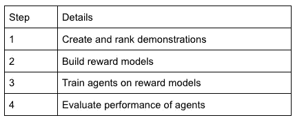****

****奖励学习算法步骤(图片由作者提供)****

# ****创建我们的演示数据集****

****为了训练任何东西，我们需要一个数据集。对于 T-REX，**数据集由来自环境**的分级演示组成。他们有多少人？在 T-REX 的论文中，作者仅用 12 个排名演示就能够在 Atari 上获得良好的结果。然而，我们怀疑我们将需要更多，因为我们相信 Procgen 环境可能会因为固有的随机等级而更难学习。****

****无论哪种方式，我们都需要从我们想要测试的四个 Procgen 环境中产生不同质量的演示。为此，我们可以自己玩游戏，也可以在这些环境中训练强化学习代理，利用实际环境本身提供的真正回报。****

****我们选择了后者；与手动方法相比，拥有训练有素的代理可以让我们以快几百倍的速度生成演示。当奖励学习的目的是在没有得到信息的情况下学习时，为什么使用真正的奖励是“合法”的？在训练期间，算法只能访问演示，而不能访问演示获得的奖励。****

****幸运的是，Procgen 的论文附带了代码，我们可以使用这些代码来训练许多代理人达到不同程度的性能。即使有这样的速度，每次生成“新鲜的”演示仍然需要在每次实验开始时等待几分钟。这将大大降低我们迭代和改进代码的效率，因此我们决定在运行任何实验之前生成所有的演示——每个环境数千个演示，并根据获得的总回报对它们进行排序****

****通过这种方式，我们为任何环境、任何质量、任何长度的演示创建了一个健壮的源，无论何时我们想要它们。****

# ****我们的第一个奖励模型****

****现在我们有了演示数据集，是时候用霸王龙的程序来训练我们的第一个奖励模型了。****

****为了评估奖励模型的质量，我们可以使用强化学习算法来训练代理，并评估代理的表现，但这在计算上是昂贵的。因此，我们寻找一个临时指标，通过它我们可以检验我们的*训练的*奖励模型与*真实的*奖励模型有多接近。**我们决定使用一个简单的衡量标准，即*相关系数*。**对于奖励模型来说，这个临时指标可能是一个不太可靠的衡量标准。然而，引入这一指标将每次实验花费的时间减少了大约 5 倍，使我们能够获得更多的数据点来评估算法。然后，我们将选择最佳回报模型，并对其运行 RL 算法，而不是必须对所有模型运行 RL 算法。****

****我们的目标是在训练奖励模型和真实环境奖励模型之间的环境事件上具有高相关性，这意味着训练奖励模型类似于真实(目标)模型。对于我们选择的四个环境中的每一个，我们都进行了测试，改变了提供给 T-REX 的演示次数。我们测量了奖励模型预测的游戏总奖励与游戏中收集的实际奖励之间的相关性。****

****看看我们的第一个结果:****

****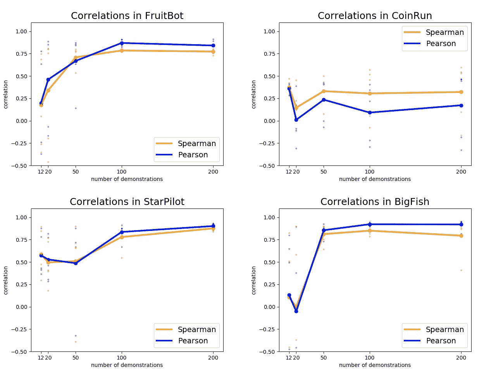****

*****在 Procgen 游戏中，不同演示次数的真实奖励和预测奖励之间的相关性*(图片由作者提供)****

****x 轴是实验中使用的演示次数，y 轴是相关系数。我们用橙色和蓝色线条向[展示了两种不同类型的相关性](https://support.minitab.com/en-us/minitab-express/1/help-and-how-to/modeling-statistics/regression/supporting-topics/basics/a-comparison-of-the-pearson-and-spearman-correlation-methods/)。图中的每个大点代表每批演示中 5 次不同运行的平均结果，由较小的点代表。****

****我们从该图中得出三个主要观察结果:****

1.  ****除了 CoinRun 之外，所有游戏的相关性看起来都很强。****
2.  ****这种相关性随着演示次数的增加而增加。正如我们所猜测的，在更复杂的 Procgen 环境中，12 个演示是不够的。从 100 到 200 个演示，相关性相当稳定和高。****
3.  ****当我们进行到 100 到 200 个演示时，运行的方差显著降低。我们看到，随着演示数量的增加，代表运行的小点越来越靠近。****

****我们的下一步是使用我们的奖励模型在 Procgen 上训练强化学习代理，该模型显示了最高的相关性，而不是来自环境的真实奖励。这是我们得到的信息:****

********

*****根据我们的一个奖励模型*(图片由作者提供)在星际飞行员中训练 RL 特工****

****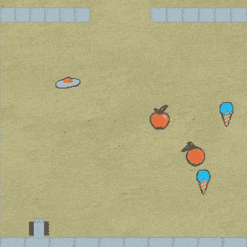****

*****根据我们的一个奖励模型*(图片由作者提供)训练 FruitBot 中的 RL 代理****

# ****有点不对劲****

****剪辑通常看起来很好，但有些东西是关闭的。如果你看看 FruitBot，你会发现尽管我们训练有素的代理已经学会了不要撞墙，但它还没有学会如何避免非水果物品，这些物品共同构成了游戏对象的一半。回想一下，游戏中的任务是生存，同时尽可能多吃水果，避免所有其他食物。理想的代理应该是这样的:****

****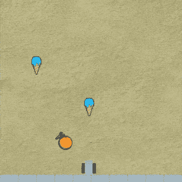****

*****最佳水果机器人代理使用 RL* 训练游戏环境的真实奖励(图片由作者提供)****

****我们推测，我们训练有素的特工主要是在学习如何在中生存*，也就是说，尽可能长时间地保持这一集(优化所谓的“长寿”目标)。生存直接导致奖励的环境的一个例子是[掷竿子](https://gym.openai.com/envs/CartPole-v0/)(在[之前的博客文章](https://medium.com/@chisness/assessing-generalization-in-reward-learning-intro-and-background-da6c99d9e48?sk=eac2f5f9d0536546869350c686873728)中显示)，代理人每阻止一根竿子倒下一秒钟就获得+1 的奖励。在 FruitBot 中，到达最后一关会得到一大笔奖励，所以也许代理人已经知道了这一点的重要性，但不知道避开非水果的重要性。*****

****不过，在下结论之前，我们想做一些进一步的测试。我们意识到，这个“长期存在”的目标非常有意义，可以用作比较我们一般奖励模型的基线——换句话说，在 Procgen 环境中训练的好的奖励模型应该比简单的奖励模型做得更好，简单的奖励模型为代理活着的每个时间步长返回+1 奖励，就像在 CartPole 中一样。通过使用这样的基线，我们将对此进行测试。所以我们做了一些对比。****

****下面我们展示了与上面相同的相关图，但是现在有了实时基线(用红色虚线表示)，显示我们的回报模型通常表现稍差或接近基线，即使有 100 和 200 次演示！CoinRun 是一个例外，因为基线本身的相关性很差。****

****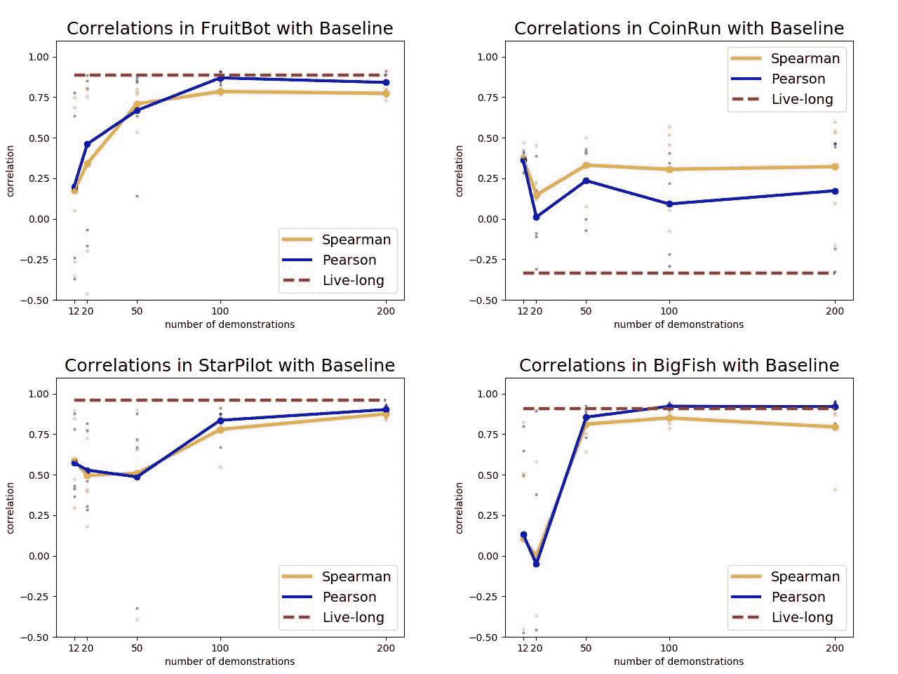****

*****在 Procgen 游戏中，不同数量的演示的真实和预测奖励之间的奖励相关性具有长期基线。所有游戏中使用两种相关类型的基线大致相同，所以我们用一条平均线来代表它们。*(图片作者提供)****

****虽然学习奖励模型和真实奖励模型之间超过 75%的相关性看起来相当强，但高寿命基线相关性是令人担忧的，因为它们表明可能有一个实际上与环境无关的高度相关的奖励模型！****

# ****怎么办？****

****深度强化学习很棘手。正如我们在上一节中看到的，看起来令人鼓舞的结果在仔细观察后可能并不那么好。我们把精力集中在 FruitBot 上，这是问题最突出的地方，我们观察了真实的和预测的奖励在各个情节中是如何变化的:****

****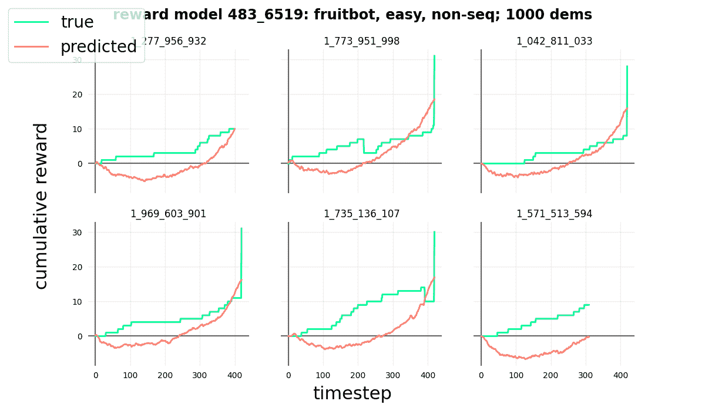****

*****使用单一奖励模型在 6 个不同的 FruitBot 等级中的真实与预测累积奖励*(图片由作者提供)****

****每张图显示了一个代理在不同级别中的真实(绿色)和预测(橙色)回报。x 轴是该集的时间步长，y 轴是到该时间步长为止获得的累积奖励。在 FruitBot 中，如果一集达到 420 个时间步，该集将自动结束，代理人将获得一大笔奖励(由结尾附近的绿色尖峰指示)。理想情况下，绿色和橙色的线看起来非常相似，因为习得的奖励应该与环境的真实奖励相似。****

****不幸的是，他们不是。事实上，除了接近尾声时的峰值之外，预测的和真实的回报似乎彼此毫无关联。这是怎么回事？****

****我们在代码中寻找错误，并尝试了几种方法来改进我们的奖励模型。在不涉及太多细节的情况下，我们尝试了标准的可靠方法来“按摩”我们的训练程序，包括诸如[提前停止](https://machinelearningmastery.com/early-stopping-to-avoid-overtraining-neural-network-models/)和[正规化](/regularization-in-machine-learning-76441ddcf99a)等元素，以及改变奖励模型的神经网络架构。****

****然而，这些变化似乎没有产生任何显著的差异，如这些更新的图表所示:****

****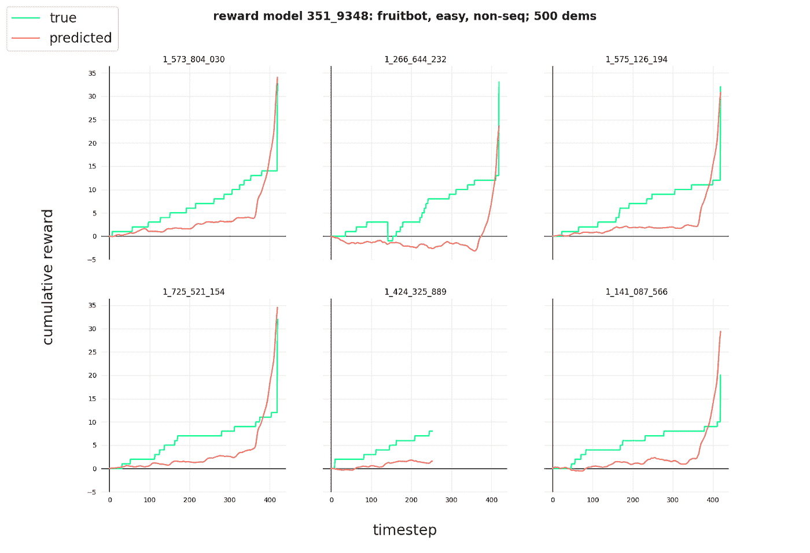****

*****在尝试改进我们的训练程序以创建更好的奖励模型后，使用单一奖励模型在 6 个不同的水果机器人级别中比较真实和预测的累积奖励*(图片由作者提供)****

****接下来，我们决定**简化实际任务**。如果代理可以在简化版本中学习，那么我们将逐渐增加任务的难度，以找出是哪些特定元素导致了问题。我们知道 Brown 等人的论文中的算法在 Atari 游戏上只有 12 个演示，并试图在 Procgen 中使任务至少一样简单。****

****首先，我们将修改 Procgen，使游戏关卡按照**固定顺序**进行，而不是随机顺序。这就是雅达利游戏的工作方式，这使得代理人更容易学习。****

****此外，我们将远远不止使用 12 次演示，而是在 T-REX 算法中使用 150 次演示来提供更多的学习数据。这应该会导致更精确的奖励模型。然而，即使在这些修改之后，水果机器人的奖励模式还是不令人满意。****

****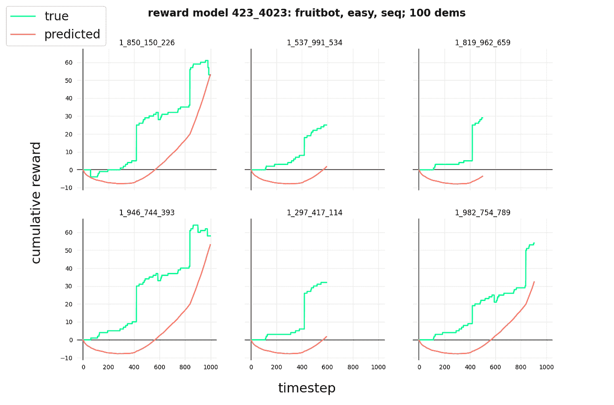****

*****在通过更多演示和连续关卡简化我们的训练程序后，使用单一奖励模型，在 6 个不同的 FruitBot 关卡中的真实与预测累积奖励*(图片由作者提供)****

****在这一点上，我们确信我们做错了*一些*的事情，因为看起来我们修改后的任务至少和褐皮书中的任务一样简单，在褐皮书中 T-REX 算法训练了成功的代理。****

# ****回到源头****

****在即使在简化的环境下也无法产生好的奖励模型之后，我们决定更仔细地研究最初的实现和作者报告的结果，以准确地指出我们的分歧所在。因为作者最初编写算法是为了在 Atari 上工作，所以我们无法进行直接比较。然而，我们*可以*看看他们提供的奖励模型与我们之前建立的长期基线相比如何。因此，我们从雅达利游戏《太空入侵者》中选取了一个经过霸王龙训练的奖励模型，并检查了它的预测奖励与环境给出的真实奖励之间的比较:****

****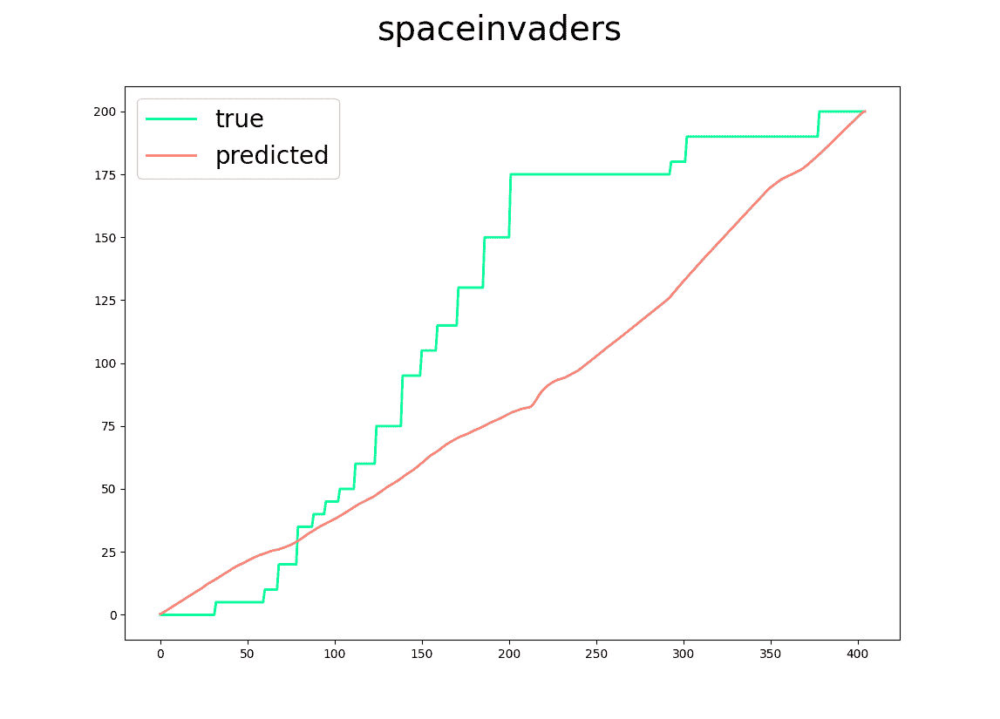****

*****雅达利游戏《太空入侵者》中真实与预测的累积奖励为了了解这个情节在最初的 T-REX 文件实现中是如何表现的*(图片由作者提供)****

****红线应该看起来像绿线，但它们非常不同，就像我们在早期的水果机器人游戏中看到的那样。看起来代理人正在学习一个恒定的正奖励，类似于长期基线。****

****经过进一步的研究，我们注意到，在论文作者提供的实现中，原始 T-REX 算法的输出是通过 sigmoid 函数传递的，该函数将预测的奖励值限制在 0 到 1 之间。****

****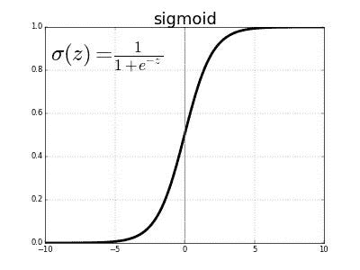****

*****s 形函数图(* [*来源*](https://www.kaggle.com/general/187778) *)*****

****我们怀疑这将使奖励模型偏向终生方法，因为给予小的、持续的积极奖励是容易的。****

****我们联系了丹尼尔·布朗，T-REX 论文的主要作者，讨论这些问题，他非常积极地回答我们的问题，并帮助我们排除可能的问题。事实证明，他自己也考虑过这个问题，甚至在他后来的一篇论文中进行了相关实验——他用霸王龙奖励模型和长期目标训练了代理人，并报告了他们的表现对比。根据报告的结果，T-REX 算法实际上产生了一个有意义的模型，其表现优于基线。****

****我们决定自己进行相应的实验。正如我们之前提到的，由于计算限制，我们无法运行我们想要的那么多“完整”测试，所以我们只在最简单的(顺序)模式下为 FruitBot 环境运行了实验。****

****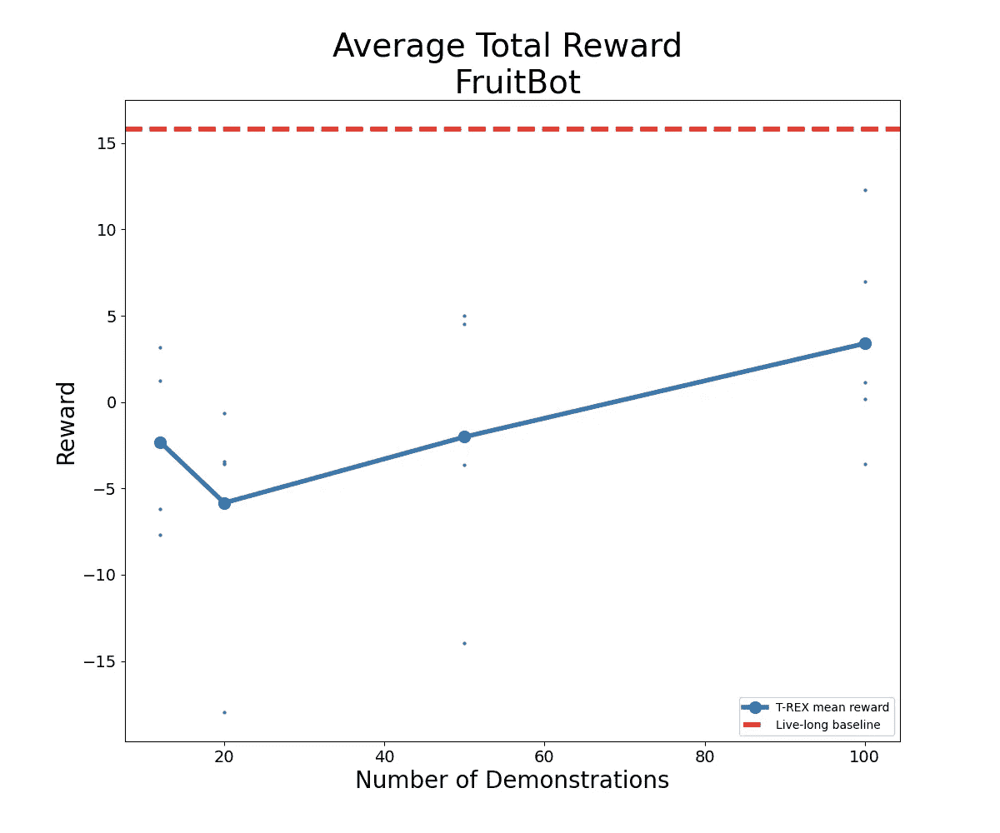****

*****训练有素的代理人在 FruitBot 中获得的平均总奖励，带有红色长期基线的连续等级*(图片由作者提供)****

****如你所见，在我们的实验中，我们找不到比那些在长期客观基线上训练过的人表现更好的代理人。公平地说，对于 T-REX 算法来说，水果机器人是一个艰难的游戏，在其他游戏中，我们有时会得到超越基线的代理，但很少如此。****

****我们不是经验丰富的深度强化学习研究人员，我们的结论可能是错误的，但对我们来说，T-REX 算法**似乎以相当小的幅度**击败了基线。我们计划看看如果我们引入 Procgen 水平的随机性，这种差异会如何变化，并且考虑到我们开始时与基线的接近程度，这种差异将很难发现。****

# ****包扎****

****经过相当长时间的讨论，我们决定最好从 T-REX 开始，尝试另一种奖励学习算法。毕竟，我们项目的最初灵感并不是霸王龙独有的——我们想从总体上研究奖励学习算法。我们最初选择霸王龙是因为它似乎最容易实现，也最容易操作；然而，回想起来，尝试使用更成熟的奖励学习方法可能会更好，特别是因为我们将该算法应用于更困难的设置。最值得注意的是，这表明实施了 Christiano 等人 2017 年的代码(在 [post one](https://chisness.medium.com/assessing-generalization-in-reward-learning-intro-and-background-da6c99d9e48) 中讨论过)，该代码通常被认为是一项重要的结果，有助于启动奖励学习在深度强化学习中的使用。****

****尽管 GitHub 上有这篇文章中的算法实现，但是没有一个能够很容易地集成到我们的项目中。因此，最简单的前进方式是从头开始重新实现。****

# ****反射****

****最初，我们感兴趣的是解决测量奖励学习代理概括能力的问题。我们认为这是一个重要的问题，因为为了让一个智能体实际部署在现实世界中，它需要能够在看不见的情况下稳健地机动。以前的泛化测试仅限于标准的强化学习算法，我们希望通过应用相同的工具(如 Procgen)来奖励学习，从而帮助弥合这一差距。****

****简而言之，我们发现我们所学的回报函数相当脆弱。在许多不同的 Procgen 环境和许多不同的参数设置下训练了许多奖励学习代理之后，我们无法获得可用于进一步稳健地训练新代理的奖励函数。我们对神经网络架构进行了实验，但这很困难，因为除了直觉之外，几乎没有指导我们探索的原则。我们尝试了一些经典的改变——增加卷积层，改变滤波器大小，改变损失函数来预测多个步骤等。—并获得了中等的结果，有时比我们已经有的要好，但没有我们希望的那么好。****

****与任何深度学习项目一样，**网络性能可能会受到架构或训练程序的精确变化的影响**。尽管我们试图尽可能好地复制 T-REX 论文中发现的方法，但总有一些参数设置会产生良好的奖励函数，这是可行的。****

# ****外卖食品****

****虽然我们的项目不幸没有带来有趣的结果，但我们获得了宝贵的经验和重要的教训，其中一些我们想分享:****

1.  ****写下你在整个项目中的进展和计划——写下你的想法可以理清你的思路。如果我们仔细考虑接下来的实验，我们会节省很多时间。尽快落地很有诱惑力，但实际上，它并不像看起来那样富有成效。****
2.  ****从既定的算法开始。重要的是获得有效的结果，然后优化实施！****
3.  ****尽早建立基线——我们已经听了无数次了，但是仍然没有像我们应该做的那样早。我们本可以更早发现主要问题。****
4.  ****不要羞于向别人寻求帮助(如果你已经完成了你的工作)。我们并不建议给人们发电子邮件来询问你可以在几分钟内搜索到的问题。但是如果你的研究是基于某篇论文，并且取得了有趣的进展，或者对之前报道的结果有一致的担忧，你当然应该尝试联系作者。在项目过程中，我们与许多导师和其他与我们项目相关的研究人员进行了交流，包括丹尼尔·布朗、简·雷科和亚当·格里夫等人。我们通过[人工智能安全营](https://aisafety.camp/)被介绍给他们中的一些人，但我们也只是简单地给其他人发邮件。他们都非常友好，对我们的问题给予了周到而详细的回答。我们非常感谢他们的帮助。****

****这总结了我们的旅程，它的结果和经验教训。我们希望每一个有抱负的研究人员都有机会体验我们在这个项目中所做的一切，我们非常感谢让这一切成为可能的人们。****