# 用程序生成的游戏评估奖励学习中的概括(1/2)

> 原文：<https://towardsdatascience.com/assessing-generalization-in-reward-learning-intro-and-background-da6c99d9e48?source=collection_archive---------48----------------------->

## 奖励学习中的泛化

## 强化学习、概括和奖励学习概述

**作者:安东·马基耶夫斯基、周亮、马克斯·奇西克**

*注:这是* ***第一篇*******两篇*** *的博文(部分* [*两篇*](https://chisness.medium.com/assessing-generalization-in-reward-learning-implementations-and-experiments-de02e1d08c0e) *)。在这些帖子中，我们描述了一个项目，该项目旨在评估奖励学习代理的概括能力。这个项目的实现是 GitHub 上可用的***。***

**这第一篇文章将提供强化学习、奖励学习和概括的背景，并总结我们项目的主要目标和灵感。如果你有必要的技术背景，可以跳过前几节。**

# **关于我们**

**我们是参加 2020 [人工智能安全营](https://aisafety.camp/) (AISC)的团队，这是一个早期职业研究人员就人工智能安全相关的研究提案进行合作的计划。简而言之，AI 安全是一个旨在确保随着 AI 的不断发展，它不会伤害人类的领域。**

**鉴于我们团队在人工智能技术安全和强化学习方面的共同兴趣，我们很高兴能在这个项目上合作。这个想法最初是由另一位 AISC 参与者 Sam Clarke 提出的，我们在夏令营期间与他进行了富有成效的交谈。**

# **强化学习**

**在强化学习(RL)中，一个主体以获得奖励为目标与一个环境进行交互。最终，代理想要学习一种策略，以便随着时间的推移获得最大的回报。不过，首先要做的是:代理人到底是什么，报酬是什么？一个*智能体*是一个通过采取行动与某个世界互动的角色，也称为*环境* **、**。例如，代理可以是玩视频游戏的角色、自动驾驶汽车模拟中的汽车或扑克游戏中的玩家。奖励只是代表代理人目标的数字，不管代理人的遭遇是否更好。例如，捡起一枚硬币可能给予积极的奖励，而被敌人击中则给予消极的奖励。**

**在 RL 中，*状态*代表环境中当前情况的一切。然而，代理实际上能看到的是一个*观察*。例如，在扑克游戏中，观察可能是代理自己的牌和对手以前的动作，而状态还包括对手的牌和一副牌中的牌的顺序(即代理看不到的东西)。在一些像象棋这样没有隐藏信息的环境中，状态和观察是一样的。**

**给定观察结果，代理采取*动作*。每次行动后，代理将从环境中获得以下形式的反馈:**

1.  ****奖励:**标量值，可以是正、零、负**
2.  ****新观察:**从先前的状态采取动作的结果，这将代理移动到新的状态并产生这个新观察。(此外，新状态是否为“终止”，意味着当前交互是已结束还是仍在进行中。比如完成一个关卡或者被对手吃掉会终止很多游戏。)**

**在 RL 中，我们的目标是*通过使用奖励作为反馈来训练*代理真正擅长一项任务。通过许多可能的训练算法之一，代理逐渐学习一种策略(也称为*策略*)，该策略定义了代理在任何状态下应该采取什么行动来最大化回报。目标是在整个*情节*中最大化奖励，这是一个代理从交互开始到结束状态所经历的一系列状态。**

**巨大成功的代理人被训练成在诸如 Atari 和 Go 游戏中有超人的表现。**

**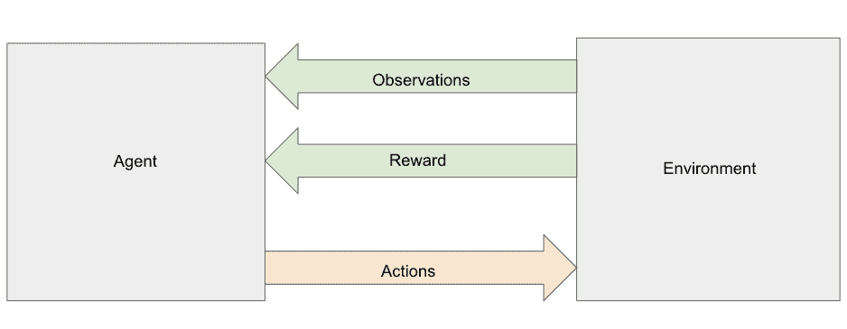**

**强化学习过程(图片由作者提供)**

**以视频游戏 Mario 为例，让我们看看一个示例算法是如何工作的。假设马里奥右边有一个敌人，左边有一个蘑菇，上面什么都没有(见下图)。在这三个行动选项中，如果向左，他可能得到+2 的奖励，如果向右，他可能得到-10 的奖励，如果向上，他可能得到 0 的奖励。马里奥采取行动后，他将处于一个新的状态，有新的观察，并根据他的行动获得奖励。然后就是下一个动作的时候了，过程继续。回想一下，目的是最大化整个情节的回报，在这种情况下，这是从游戏开始到马里奥一生中的一系列状态。**

**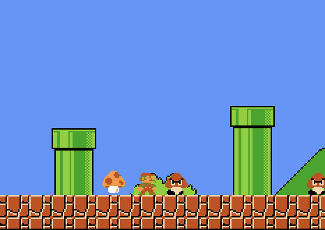**

**马里奥学习吃蘑菇(图片由作者提供)**

**算法第一次看到这种情况时，它可能会随机选择一个选项，因为它还不了解可用操作的后果。随着它越来越多地看到这种情况，它会从经验中了解到，在像这些情况下，向右走不好，向上走可以，向左走最好。我们不会直接教狗如何捡球，但通过给予奖励，狗会通过强化来学习。同样，马里奥的行动也因经验反馈而得到加强，即蘑菇是好的，而敌人不是。**

**算法是如何实现回报最大化的？不同的 RL 算法以不同的方式工作，但人们可能会跟踪从这个位置采取每个动作的结果，并且下次 Mario 在这个相同的位置时，他会根据先前的结果选择预期最有回报的动作。许多算法大多数时候选择最佳行动，但有时也会随机选择，以确保它们探索所有选项。(注意，在开始时，代理通常随机行动，因为它还没有了解任何关于环境的信息。)**

**重要的是要不断探索所有的选择，以确保代理不会找到合适的东西，然后永远坚持下去，可能会忽略更好的选择。在马里奥游戏中，如果马里奥第一次试着向右走，看到它是-10，然后试着向上走，看到它是 0，从那一点开始总是向上走就不好了。这将错过尚未探索的左转+2 奖励。**

**想象一下，你试着在家做饭，但不喜欢食物，然后去麦当劳吃了一顿美妙的饭。你发现去麦当劳是一个很好的“行动”，但如果你一直在麦当劳吃饭，而不去尝试其他可能最终会提供更好“回报”的餐厅，那将是一种耻辱(而且对健康没有好处)。**

# **一般化**

**RL 经常用在像[雅达利](https://gym.openai.com/envs/#atari)这样的游戏设定中。在 Atari 游戏(类似于马里奥风格的游戏)中使用 RL 的一个问题是这些游戏的*序列*性质。赢得一关后，你进入下一关，并继续以同样的顺序通过关卡。**算法可能只是简单地记住每一关发生的事情，然后在面对游戏中最微小的变化时悲惨地失败。**这意味着算法可能实际上并不理解游戏，而是学习记忆一系列按钮，从而为特定级别带来高额奖励。一个更好的算法，而不是学习记忆一系列按钮按压，能够“理解”游戏的结构，从而能够适应看不见的情况，或者说*概括*。**

**成功的概括意味着在以前没有见过的情况下表现出色。如果你知道 2*2 = 4，2*3 = 6，2*4 = 8，然后可以算出 2*6 = 12，这意味着你能够“理解”乘法，而不仅仅是记住等式。**

**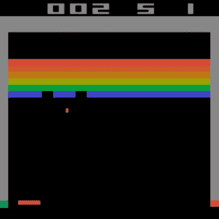**

**雅达利突破([来源](/atari-reinforcement-learning-in-depth-part-1-ddqn-ceaa762a546f))**

**让我们看一个在垃圾邮件过滤器环境中的一般化例子。这些方法通常通过收集那些将收件箱中的邮件标记为垃圾邮件的用户的数据来工作。如果一群人将“用这一招每天赚 800 美元”的邮件标记为垃圾邮件，那么该算法将在未来学习阻止所有电子邮件用户的所有这些邮件。但是，如果垃圾邮件发送者注意到他的电子邮件被阻止，并决定智取过滤器呢？第二天，他可能会发送一条新消息，“用这另一个技巧每天赚 900 美元”。仅记忆的算法将无法捕捉到这一点，因为它只是记忆要阻止的确切消息，而不是学习一般的垃圾邮件。概括算法将学习模式，并有效地理解垃圾邮件的构成。**

# **奖励学习**

**游戏通常有非常明确的内置奖励。在像[二十一点](https://gym.openai.com/envs/Blackjack-v0/)这样的纸牌游戏中，奖励对应于代理每手牌赢或输的多少。在  雅达利中，奖励依赖于游戏，但有明确的规定，比如击败敌人或完成关卡可以获得积分，被击中或死亡可以失去积分。**

**下图来自一个名为 [CartPole](https://gym.openai.com/envs/CartPole-v0/) 的经典强化学习环境，目标是让杆子在轨道上保持直立，杆子保持直立的每一秒提供+1 的奖励。代理人将车向左或向右移动，试图保持杆子平衡，保持平衡的时间越长，获得的+1 奖励就越多。**

****

**扁担([来源](https://medium.com/@tuzzer/cart-pole-balancing-with-q-learning-b54c6068d947))**

****然而，现实世界中的许多任务并没有如此明确定义的奖励，这导致了强化学习的可能应用受到限制。**这个问题因这样一个事实而变得更加复杂:即使不是不可能，也很难详细说明明确定义的奖励。人类可以在训练期间向 RL 代理提供直接反馈，但是这将需要太多的人类时间。**

**一种被称为逆向强化学习的方法包括从演示中“逆向工程”出一个奖励函数。对于复杂的任务，从演示中找出奖励函数是很难做好的。**

*****奖励学习*涉及学习奖励函数，该函数描述了在环境中的每种情况下获得多少奖励，即当前状态和动作到所接收奖励的映射。**目标是学习鼓励期望行为的奖励功能。为了训练算法来学习奖励函数，我们需要另一个数据源，例如成功执行任务的演示。奖励函数输出每个状态的奖励预测，之后标准 RL 算法可用于通过简单地用这些近似奖励代替通常已知的奖励来学习策略。**

**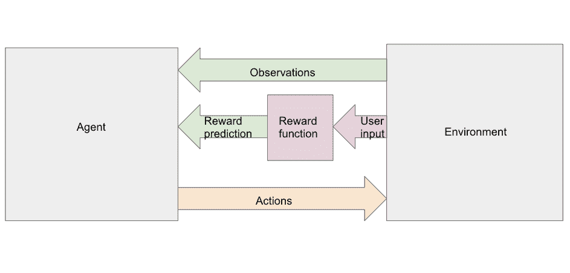**

**用奖励函数代替已知奖励的强化学习过程(图片由作者提供)**

**先前的工作(下文描述为 Christiano 等人 2017 年)提供了一个例子，说明学习奖励函数有多困难。想象一下教一个机器人做后空翻。如果你不是一个认真的体操运动员，自己演示如何成功完成这项任务将是一个挑战。**人们可以尝试设计一个代理可以学习的奖励函数，但是这种方法经常成为非理想奖励设计和奖励黑客攻击的牺牲品。**打赏黑客是指代理商可以在打赏规范中找到“漏洞”。例如，如果我们给后空翻正确的初始姿势分配了太多的奖励，那么代理人可能会学会永远重复地进入那个弯腰姿势。它会根据我们给它的奖励函数最大化奖励，但实际上不会做我们想要做的！**

**人类可以通过在每一步人工输入奖励函数来监督代理学习的每一步，但这将非常耗时和乏味。**

**指定奖励的困难指向了更大的人-人工智能协调问题，即人类希望人工智能系统符合他们的意图和价值观，但指定我们实际上想要的东西可能会令人惊讶地困难(回想一下每个精灵故事的结局！).**

# **相关文件**

**我们想看看最近的几种奖励学习算法，以评估它们学习奖励的能力。我们特别感兴趣的是，当面对以前看不见的环境或游戏关卡时，算法有多成功，这测试了它们的概括能力。**

**为此，我们利用了大量先前的工作:**

1.  **[*基于人类偏好的深度强化学习*](https://arxiv.org/abs/1706.03741)—Christiano 等人 2017。**
2.  **[*奖励从人类偏好中学习，在雅达利*](https://arxiv.org/abs/1811.06521) — 2018 由 Ibarz 等人提出。**
3.  **[*利用过程化生成对强化学习进行基准测试*](https://arxiv.org/abs/1912.01588)—Cobbe 等人 2019。**
4.  **[*从 Brown，Goo 等人的观察值*](https://arxiv.org/abs/1904.06387) — 2019，通过逆向强化学习外推超过次优演示。**

**前两篇论文在利用奖励学习和深度强化学习方面很有影响力，第三篇介绍了 OpenAI Procgen 基准测试，这是一组用于测试算法泛化的有用游戏。第四篇论文提出了前两篇论文方法的有效替代方案。**

## **从人类偏好进行深度强化学习(Christiano 等人，2017 年)**

**这篇文章的中心思想是**识别一个好的后空翻比做一个好的后空翻要容易得多。**该论文表明，对于我们只能识别出想要的行为的任务，即使我们无法演示，也可以学习预测的奖励函数。**

**提议的算法如下所示。它在通过人类偏好学习奖励函数和学习策略之间交替，这两者最初都是随机的。**

***重复直到代理牛逼:***

> ***1。展示两个简短的视频剪辑，展示代理在其当前策略的环境中行动***
> 
> ***2。问一个人在哪个视频片段中代理更好***
> 
> ***3。根据人类的反馈更新奖励函数***
> 
> ***4。基于新的奖励函数更新策略***

**模拟机器人(如下图所示)被训练在一小时内完成 900 个查询的后空翻，这是一项很难演示或手动创建奖励的任务。**

**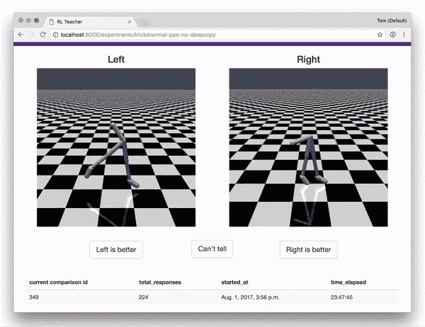**

**根据人类喜好训练后空翻动作([来源](https://github.com/nottombrown/rl-teacher)**

**实验在名为 MuJoCo 的物理模拟器和 Atari 游戏中进行。既然我们已经知道雅达利游戏的真正回报，为什么还要在雅达利进行这些实验呢？这提供了自动分配偏好的机会，而不是让人手动给出关于两个视频剪辑演示的反馈。我们可以通过简单地将具有更高真实奖励的剪辑排列为更好的剪辑来获得自动(合成)反馈。这使我们能够非常快速地进行实验，因为不需要人工。此外，在这种情况下，我们可以通过比较学习到的奖励函数和游戏中给出的真实奖励来评估算法的性能。**

**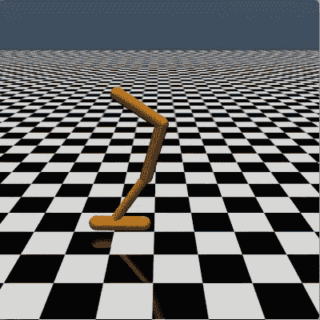**

**运动中的后空翻([来源](https://openai.com/blog/deep-reinforcement-learning-from-human-preferences/)**

## **奖励从人类偏好和 Atari 演示中学习(Ibarz 等人，2018 年)**

**本文建立在前一篇论文的基础上，在 Atari 域中使用不同的设置和不同的 RL 算法进行了额外的实验。他们的主要创新是在开始时利用人类演示，以便开始一个体面的策略，而原始算法将不得不从一个完全随机行动的代理开始，因为在开始时不知道奖励。相对于 Christiano 使用的无演示方法，这些人类演示的加入在九个测试的雅达利游戏中的三个中显著提高了学习。**

## **利用程序生成对强化学习进行基准测试(Cobbe 等人，2019 年)**

**[人工智能研究实验室 OpenAI](https://openai.com/) 开发了名为 [Procgen Benchmark](https://openai.com/blog/procgen-benchmark/) 的强化学习测试床游戏环境，其中包括 16 款独特的游戏。在每个游戏中，所有关卡都是相似的，有着相同的目标，但是实际的组成部分，如敌人和危险的位置是随机生成的，因此在每个关卡中会有所不同。**

**这意味着我们可以**在许多随机水平上训练我们的代理，然后在全新的水平上测试它**，允许我们了解代理是否能够概括它的学习。请注意与雅达利游戏的对比，在雅达利游戏中，训练是在连续的游戏级别上进行的，敌人、奖励和游戏对象总是在同一个地方。此外，当在连续的和非随机生成的游戏中测试代理的能力时，它们以相同的顺序在相同的水平上被测试。一个重要的机器学习原理是，用一组数据训练，用另一组数据测试，真正评估智能体的学习/概括能力。**

**我们在工作中主要考察了 Procgen 的四种环境:**

1.  **躲避敌人的同时，在关卡结束时收集硬币**
2.  **水果机器人:吃水果，避免非水果食物，如鸡蛋和冰淇淋**
3.  ****星际飞行员:**侧面滚动射击游戏**
4.  ****大鱼:**从小鱼开始，吃其他更小的鱼，变得更大**

**下面是每个游戏的截图。代理视图使用较低的分辨率来优化算法，以减少计算量。人类视角是指如果人类在玩游戏，游戏会是什么样子。**

**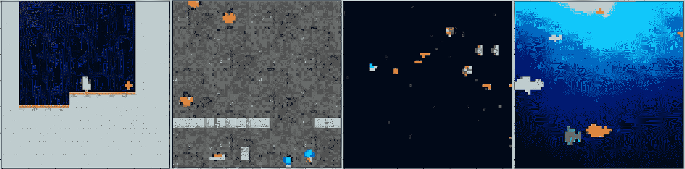**

**带有代理视图的 CoinRun、FruitBot、StarPilot 和 BigFish(图片由作者提供)**

**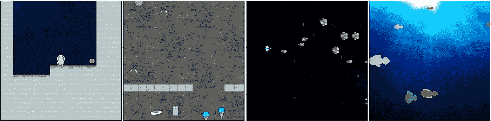**

**人类视角的 CoinRun、FruitBot、StarPilot 和 BigFish(图片由作者提供)**

**论文中的主要实验涉及在所有 16 个独特的游戏中训练代理，每个游戏的训练水平在 100 到 100，000 的范围内，同时保持训练时间固定。然后，这些代理在他们从未玩过的关卡上接受测试(这是可能的，因为每个关卡都是自动生成的)。他们发现，代理人需要在多达 10，000 个游戏级别(培训级别)上接受培训，才能在测试级别上表现良好。**

**下面的 StarPilot 游戏图用蓝色显示训练性能，用红色显示测试性能。y 轴是奖励，x 轴是用于训练的等级数。请注意，x 轴是对数刻度。**

**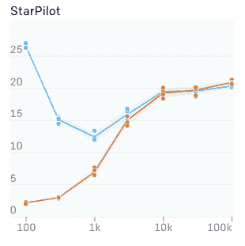**

**星际飞行员训练(蓝色)和测试(红色)([来源](https://openai.com/blog/procgen-benchmark/)**

**我们看到代理在培训期间表现非常好，然后培训绩效下降，然后又略有回升。为什么代理训练得越多越差？由于训练时间是固定的，通过只训练 100 个级别，代理将一遍又一遍地重复相同的级别，并且可以很容易地记住所有内容(但是在测试时在看不见的级别上表现很差)。有了 1，000 个级别，代理将不得不将其时间分散到更多的级别，因此也无法学习这些级别。当我们达到 10，000 或更多的级别时，代理能够看到如此多样的级别，它能够很好地执行，因为它已经开始概括它的理解。我们还看到，测试性能很快提高到接近训练性能的水平，这表明代理能够很好地概括到看不见的水平。**

## **通过从观察中进行逆向强化学习来推断次优演示之外的情况(Brown，Goo 等人，2019 年)**

**本文提出的算法名为 *T-REX* ，与之前提到的奖励学习方法不同，它**在学习过程**中不需要持续的人类反馈。虽然与监督每个代理动作相比，其他算法需要相对较少的人工时间，但它们仍然需要一个人来回答数千个偏好查询。T-REX 的一个关键思想是，通过在开始时完成所有偏好反馈，而不是在整个学习过程中持续完成，可以显著减少人类的时间投入。**

**第一步是生成正在学习的游戏或任务的演示。演示可以来自标准的强化学习代理，也可以来自人。**

**主要的想法是，我们可以通过从这些演示中提取短视频剪辑来获得大量偏好数据，并仅根据它们来自的演示的排名来给它们分配偏好。例如，有 20 个演示，每个演示将得到从 1 到 20 的等级。大量的短视频剪辑将从这些演示中选取，每个剪辑将被分配给它所来自的演示的等级，因此当它们面对彼此时，偏好将会转到来自更好的演示的剪辑。奖励函数将基于这些偏好。**

**这与以前的方法形成对比，以前的方法需要对每一对 1-2 秒的剪辑输入人类偏好。这里，我们只需要人类偏好输入来对初始演示进行排序。然而，霸王龙的缺点是它使用了一个近似值。并非来自较高等级的演示的所有剪辑都应该比来自较低等级的演示的剪辑更优选，但是该想法是平均而言，偏好将会很好地工作，并且该过程将足以学习奖励模型。**

**提供对演示的排序相当于在每一对演示之间给出偏好。例如，如果我们有三个演示，并将它们排序为 3>1>2，这意味着我们将生成 3>1、3>2 和 1>2 的排序。则根据剪辑来自哪个演示，从演示中随机生成的剪辑将被给予相同的偏好等级。**

**霸王龙的论文表明，只要有 12 次示范就足以学习一个有用的奖励模型。任何 12 个对象都有 12 * 11 / 2 = 66 个不同的对，因此从 1 到 12 对 12 个演示进行排名相当于回答多达 66 个关于哪个演示更好的查询，这比 Christiano 等人的算法所需的查询少约 100 倍。同样，尽管 T-REX 排名演示方法更有效，但由于简化了较好演示的所有剪辑都比较差演示的所有剪辑好的假设，它牺牲了精确度。**

**Brown 和 Goo 等人基于 Atari 的实验表明，霸王龙与之前描述的 Ibarz 等人的方法相比具有竞争力。它能够仅使用 12 个示范及其相应的偏好(等级)标签来学习优于示范的质量代理。**

**下图显示了五款 Atari 游戏中人类演示的得分与 T-REX 算法的得分之间的比较。虽然在蒙特祖马的复仇游戏中没有获得任何分数，但霸王龙的表现远远超过了人类 5 分中的 3 分。**

**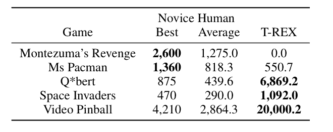**

**霸王龙算法对人类([来源](https://arxiv.org/abs/1904.06387)**

**T-REX 还在 8 场比赛中的 7 场比赛中超过了最先进的行为克隆算法(BCO)和模仿学习算法(盖尔)，如下图所示，同时在 8 场比赛中的 7 场比赛中击败了最佳演示。(行为克隆算法试图尽可能接近演示，而反向强化学习算法试图从专家演示中恢复奖励函数。)**

**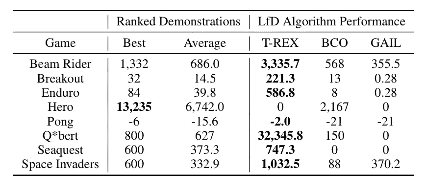**

**T-REX 算法与其他先进方法的对比([来源](https://arxiv.org/abs/1904.06387))**

# **接下来:实现和实验**

**基于 T-REX 的强大结果和简单的想法，我们决定将我们的初始实验基于将该算法与 Procgen 游戏环境相结合，这将为我们提供一个高效的奖励学习算法和各种基准游戏来测试泛化能力。我们将在本系列的[第二篇博文](https://chisness.medium.com/assessing-generalization-in-reward-learning-implementations-and-experiments-de02e1d08c0e)中解释我们实现的细节以及实验结果和我们面临的问题。**