# 评估员工调查的统计严谨性

> 原文：<https://towardsdatascience.com/assessing-statistical-rigor-of-employee-surveys-1d27e3df998a?source=collection_archive---------29----------------------->

## 让我们谈谈相关性，克朗巴赫的阿尔法和因素分析


格伦·卡斯滕斯-彼得斯在 [Unsplash](https://unsplash.com?utm_source=medium&utm_medium=referral) 上拍摄的照片

人力资源行业严重依赖广泛的评估来支持其职能。事实上，为了确保不偏不倚和公平的招聘实践，美国劳工部保持了一套指导方针([统一指导方针](http://uniformguidelines.com/testassess.pdf))，以帮助人力资源专业人员进行评估开发。

性格评估经常被用于选拔，以确定文化是否适合一家公司。认知能力(即。在所有类型和级别的工作中，智商测试一直被认为是工作表现的最佳总体预测指标(Schmidt & Hunter，1998)。结构化面试在招聘决策中被广泛使用，因为它们通过标准化问题和评分来帮助消除偏见。绩效评估使用严格的李克特评估，要求经理和同事对员工的绩效进行评级(即行为锚定等级量表)。员工参与度调查评估员工对其雇主和工作的满意度、激情、努力和承诺程度。最后但同样重要的是，员工离职调查通常在员工离职时进行，以确定员工对与组织相关的一系列话题的感受。

这种对员工评估的广泛使用催生了一个数十亿美元的行业，专门开发各种各样的测试。让我们把注意力集中在员工态度调查上，因为他们构成了这个行业的一个非常大的部分。如果你要购买一份调查，你如何确定你得到的是高质量的产品？任何一个有声望的开发者不仅应该提供给你一份手册，还应该提供一份验证报告，该报告概述了为确保调查确实测量了它想要测量的内容而采取的步骤。

在本文中，我将检查一个员工离职调查，并根据一些选定的指标来确定调查的质量。因此，当您收到调查供应商的验证报告时，您将知道并理解做出明智购买所需的指标。

# 调查开发流程

在我们进入度量标准和代码之前，让我们花几分钟回顾一下一个统计上严格的调查是如何开发和验证的。

*   这个过程从一个问题开始。例如:“我的员工对他们的工作和公司满意吗？”
*   我们如何定义“幸福”？在我们开始写调查问题之前，我们需要从操作上定义“幸福”。我们搜寻员工快乐研究的文献。毫无疑问，你将到达诸如员工满意度、承诺和参与度等主题。你会读到几十份提出员工满意度独特模型的研究报告。Hackman & Oldham 的工作特征模型因其全面性和统计有效性而经常被用于员工满意度调查。有效性是指许多研究人员在他们的研究和/或评估中采用了这个模型，并发现它是正确的。

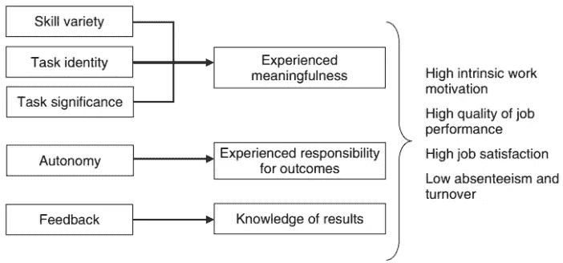

hackman & old ham(1980)的工作特征模型

*   所选模型将作为构成调查的问题或项目的基础。根据调查的长度，我们将为每个部分写 3-10 个项目(即技能多样性、任务同一性、自主性等。)的模型。我们编写了多个问题来确认员工对每个模型组件的看法。我们将把重点放在定量项目上，这些项目要求员工选择一个与他们的内在态度(即李克特量表)。
*   每个问题都可以通过允许研究领域的杰出研究人员(即员工满意度)来仔细检查每个问题。当员工因不当的雇佣决定而受到诉讼时，内容有效性经常在法律诉讼中被引用。其他形式的验证包括结构和标准有效性。
*   完成第一份草案后，将使用与全部员工非常相似的员工样本进行试点测试。为了对结果有信心，获得大量有代表性的样本是很重要的。
*   一旦实施了调查并收集了数据，就需要检查某些心理测量属性，即可靠性和有效性。基于心理测量结果，调查被修改，直到可以实现最佳心理测量。

# 员工离职调查示例

首先，这个虚构的数据集及其结果应该被视为虚构的。其次，终止原因(即。自愿、非自愿、退休等。)已从加载的数据集中省略，因为本文将专门关注李克特量表问题的心理测量属性。

```
import pandas as pd
import numpy as np
import scipy.stats as stats
import matplotlib.pyplot as plt
import seaborn as sns
import pingouin as pg
from factor_analyzer import FactorAnalyzer
from factor_analyzer.factor_analyzer import calculate_bartlett_sphericity
from factor_analyzer import ConfirmatoryFactorAnalyzer, ModelSpecificationParserimport warnings
warnings.filterwarnings('ignore')
pd.set_option('display.max_columns', None)
%matplotlib inlinewith open('likert.csv') as f:
    likert_items = pd.read_csv(f)
f.close()likert_items.head()
```

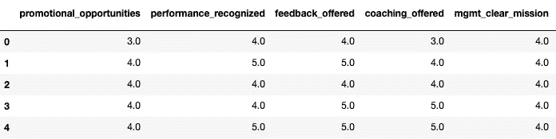

```
len(likert_items), likert_items.describe().T
```

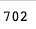

len(李克特 _ 项目)

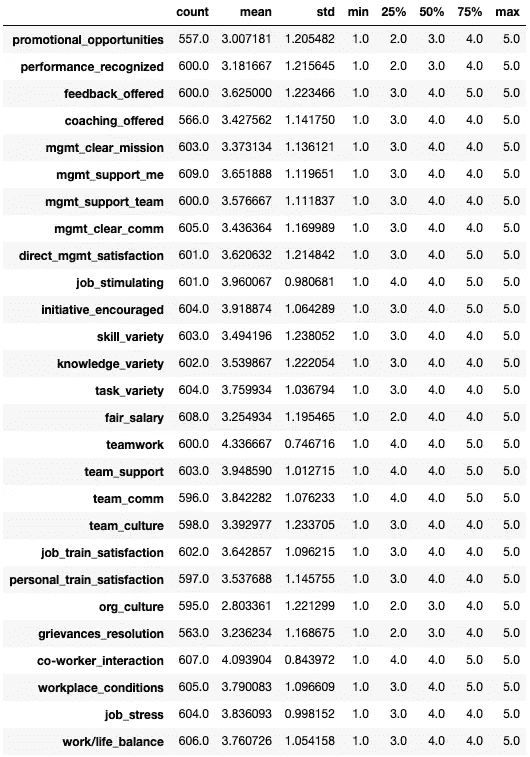

在加载我们的库时，我们有一个约 702 名员工的数据集，他们回答了 27 个 Likert 类型的问题，其中 1 个是强烈不同意，5 个是强烈同意。所提问题会影响员工对晋升机会、经理满意度、工作满意度、培训和工作/生活平衡的看法。

> 我们必须承认，被解雇的员工不需要填写离职调查。这完全由他们决定，因此调查结果可能会有偏差

## 潜在因素

如上所述，精心设计的调查植根于经过验证的学术模型，本次调查也不例外。已经开发了 27 个单项来评估 8 个潜在因素。

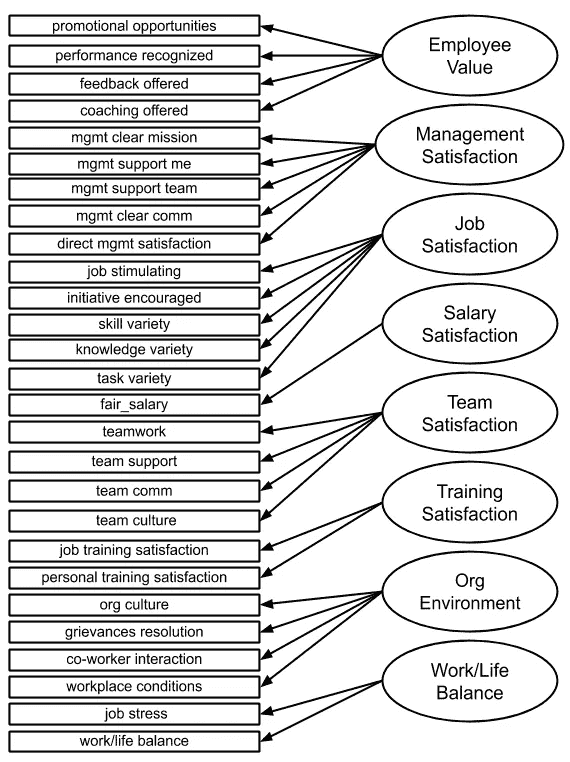

## 相关

```
likert_corr = likert_items.corr()plt.figure(figsize=(25,15))
mask = np.zeros_like(likert_corr, dtype=np.bool)
mask[np.triu_indices_from(mask)] = True
plt.figure(figsize=(70,40))
plt.xticks(fontsize=50)
plt.yticks(fontsize=50)
sns.heatmap(likert_corr, cmap='coolwarm', annot=True,
            fmt=".2f", annot_kws={'size': 40, 'color': 'black'}, linewidths=2,
            vmin=-0.5, mask=mask)
```

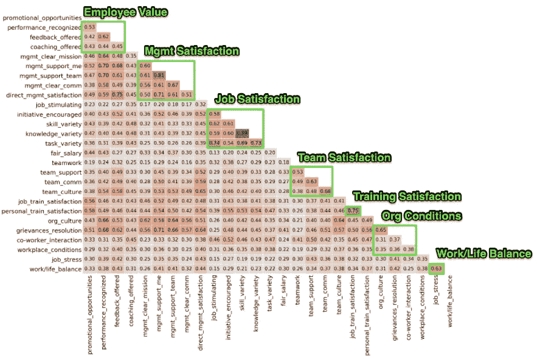

当处理定量问题时，我们使用的第一个工具是可靠的相关性。相关矩阵将为我们提供调查的心理测量质量的第一手线索。以绿色突出显示的相关性是那些旨在衡量相同潜在结构的项目。这些相关性应保持相对较高的相关性(0.5 至 0.7)，因为这将表明这些项目正在测量一个较大结构的几个独特的子组件。然而，如果相关性太大(0.7 以上)，这将意味着项目可能测量非常相似或甚至相同的结构。我们最终希望我们的问题是评估一个更大因素的不同子成分，如“工作满意度”。

另一方面，突出显示区域之外的相关性应该保持尽可能低。这将表明这些项目正在测量非常不同的结构。例如，direct_mgmt_satisfaction 和 feed _ offed(0.75)之间的高度相关性相当令人沮丧，因为它们测量的是不同的潜在结构(员工价值和管理满意度)。另一方面，这种相关性也让我们看到了“反馈提供”项目的错误分类，因为经理最经常提供建设性的反馈，因此，人们可能会认为该项目实际上是评估管理满意度。

总的来说，查看相关矩阵，似乎管理满意度、工作满意度、团队满意度、培训满意度和工作/生活平衡是相对较强的潜在因素。另一方面，员工价值和组织环境相当薄弱。最后，薪酬满意度由一个问题组成。

## 可靠性

可靠性是一致性的衡量标准。换句话说，如果有人多次参加同样的性格评估，他们的分数应该不会相差很大。开发调查时最突出的可靠性指标是 **Cronbach 的 Alpha** ，这是一种内部一致性的衡量标准。Alpha 假定是一维的，或者传递到它的函数中的项目测量一个因素，因此，我们需要分别计算每个潜在因素的 Alpha。

```
valued = likert_items[['promotional_opportunities', 'performance_recognized', 'feedback_offered','coaching_offered']]mgmt_sati = likert_items[['mgmt_clear_mission','mgmt_support_me',
'mgmt_support_team', 'mgmt_clear_comm', 'direct_mgmt_satisfaction']]job_satisfaction = likert_items[['job_stimulating', 'initiative_encouraged', 'skill_variety','knowledge_variety', 'task_variety']]team_satisfaction = likert_items[['teamwork','team_support', 'team_comm', 'team_culture']]training_satisfaction = likert_items[['job_train_satisfaction',
'personal_train_satisfaction']]org_environment = likert_items[['org_culture', 'grievances_resolution', 'co-worker_interaction', 'workplace_conditions']]work_life_balance = likert_items[['job_stress','work/life_balance']]salary_satisfaction = likert_items[['fair_salary']]dict = {'valued': valued, 'mgmt_sati': mgmt_sati,
        'job_satisfaction': job_satisfaction,
        'team_satisfaction': team_satisfaction,
        'training_satisfaction': training_satisfaction,
        'org_condition': org_condition,
        'work_life_balance': work_life_balance}for i in dict:
    print('{} Alpha: {}'.format(i, pg.cronbach_alpha(data=dict[i], nan_policy='listwise'))
```

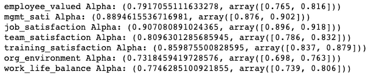

管理满意度、工作满意度、团队满意度和培训满意度都表现出高到非常高的阿尔法系数(0.8+)。高 alpha 结果表示项目正在测量相同的基础结构。员工价值、组织环境和工作生活平衡导致较低的阿尔法系数，这意味着项目可以改进，以更好地衡量他们的结构。我们至少需要 2 个项目来衡量 alpha，因此，salary_satisfaction 不包括在此分析中。

> 另一种常用的可靠性测量是“重测信度”。对同一样本进行多次调查，并比较分数以确定一致性。

# 要素分析

## 探索性因素分析

因素分析或更具体地说探索性因素分析经常用于调查开发过程中。它用于在开发阶段对评估进行初步探索。因子分析是一种数据简化技术，它试图将特征之间通常存在的差异提取到一个因子中。换句话说，旨在评估共同潜在因素的调查项目将一起协变。Covary 的意思是，如果有人在第一个问题上回答“非常同意”,他们很可能会在另一个旨在评估潜在因素的问题上以类似的方式回答。

**全民教育与主成分分析**

EFA 在降维方面类似于 PCA(主成分分析),但它有一些不同之处:

*   一个 EFA 识别潜在因素，这些潜在因素可以被解释，因为这些潜在因素是有意开发的。
*   PCA 试图解释最大方差(PC1 将保存最大方差)，而 EFA 试图解释特征之间的协方差。
*   PCA 执行其分析，而不考虑潜在的结构，它只是想说明特征中的所有差异。
*   通过设计，PCA 成分是正交的(不相关)，但是 EFA 因子不需要正交(取决于旋转)。

**巴特利特球形度试验**

在尝试使用因子分析之前，应该进行“Bartlett 球形检验”,检验是否有多个特征可以简化为潜在因子。Bartlett 检验的结果是显著的(p=0.00)，这意味着数据可以减少，我们可以继续进行因子分析。

```
chi_square_value,p_value=calculate_bartlett_sphericity(likert_items)
chi_square_value, p_value
```

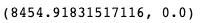

```
factor = FactorAnalyzer()
factor.fit(likert_items)ev, v = factor.get_eigenvalues()
plt.figure(figsize=(15,10))
plt.plot(range(1, likert_items.shape[1]+1), ev, marker='X', markersize=12)
plt.xlabel('# of Factors')
plt.ylabel('Eigenvalues')
plt.grid()
plt.show()
```

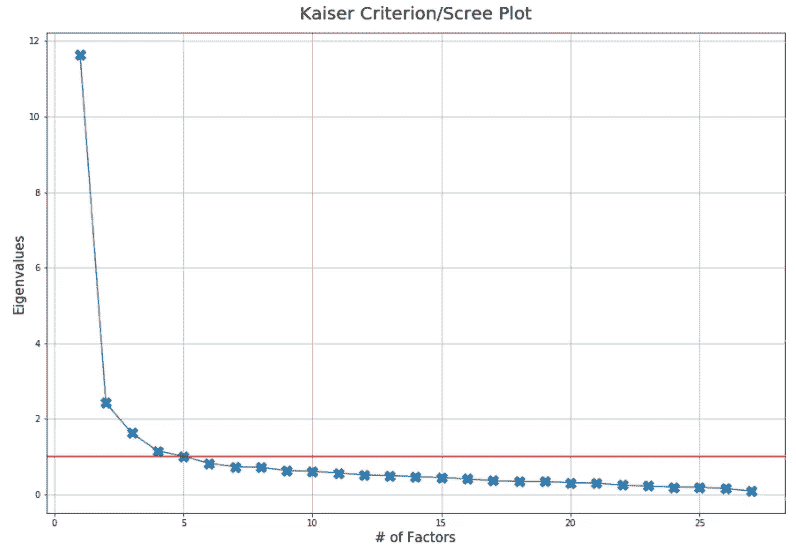

我们可以使用 scree 图来确定最佳的因素数量。Kaiser 标准提到，一个因子应该解释一定量的差异，才能被视为有效因子。我们通常将截止值设置为 1 个特征值。

```
factor = FactorAnalyzer(8, rotation='promax', method='ml', impute='mean')factor.fit(likert_items)
factors = factor.loadings_
factors_df = pd.DataFrame(factors, columns=['factor1', 'factor2', 'factor3','factors4','factor5', 'factor6', 'factor7', 'factor8'] index=likert_items.columns)factors_df.style.bar(subset=['factor1', 'factor2', 'factor3',
'factors4','factor5', 'factor6','factor7','factor8'], color='green')
```

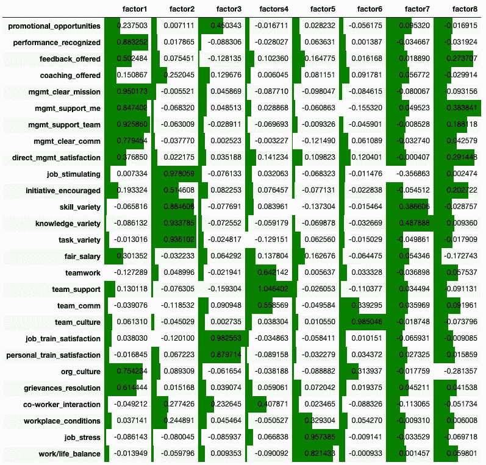

尽管 scree 图中有 5 个最佳因素，但我们知道该调查包含 8 个潜在因素。最后，加载分数的临界值相当主观，但我们将使用 0.5。

**因素 1:** 除了一个“管理满意度”项目外，其他项目在该因素中的权重都很高。我们还有来自“员工价值”和“组织环境”的项目，它们在因子 1 中的权重很高。此外，在回答问题时，评估“管理满意度”结构的项目似乎将调查参与者置于一个整体的组织视角或心态中。换句话说，要求个人从整体上考虑管理。然而，当调查对象回答“直接管理满意度”问题时，他们的视角变窄了，尽管享受着更广泛的组织领导，但他们对直接经理的看法可能会有所不同。这可能解释了为什么“直接管理满意度”项目在因子 1 上的加载如此之低。

我建议调查将管理潜在结构分为广义领导和直接经理满意度。此外，我强烈建议需要重新考虑“employee_value”结构，因为这些项目不会一起加载到任何因子上。

**因素 2:** 这个因素几乎完美地加载到“工作满意度”结构中。这将表明这些项目已经被很好地开发，并且正在测量它们缩进去测量的内容。

**因素 3:** “培训满意度”完美加载到因素 3 上。然而，重要的是要提到“评估促销机会”这一项有一定的积极意义。这是有意义的，因为一个为员工提供培训机会的组织肯定会有一个好的继任计划。

因素 4: 因素 4 似乎与“团队满意度”结构相对应。虽然，“team_culture”项由于加载量较低，需要改进。试图评估诸如“文化”之类的模糊主题的项目通常以较低的负荷出现在它们指定的结构中。也许将项目集中在组织文化模型的一个或两个特定组成部分肯定会有助于缩小问题的范围。

**因素 5:** 这个因素承载了巨大的“工作/生活平衡”潜在结构。

**因素 6:** 有趣的是,“团队交流”和“团队文化”在因素 6 上的负荷都非常高，尽管事实上“团队交流”也在因素 4 上负荷。因为“team_comm”在两个因素上负荷很高，这将表明调查者可能对该问题有不同的解释。也许在这个问题中加入一些上下文可能有助于提高它对因子 4 的加载。最后，简单地改变评估“团队满意度”的问题的顺序可能有助于这两个项目更好地载入因素 4。

**因子 7:** 我们没有看到任何可识别的结构加载到因子 7 上。

**因子 8:** 这是唯一加载“fair_salary”项的因子。在提出任何建议之前，这个结构当然需要更多的问题。

## 验证性因素分析

验证性因素分析最常用于确认已经验证的评估。例如，您希望使用从供应商处购买的现成调查来进行员工参与度评估。利用对您的特定组织员工样本的调查进行试点测试可能是个好主意。CFA 将是一个很好的工具，可以确认调查旨在衡量的基本结构，但要使用你的员工样本。

事实上，研究人员经常使用两种因素分析来验证他们的评估。使用 EFA 来观察有目的开发的结构并没有错。我发现全民教育的结果对于提炼单个项目的问题非常有帮助。一旦你根据 EFA 结果改进了项目，CFA 结果通常也会增加。

```
model_dict = {'valued_employee': ['promotional_opportunities', 'performance_recognized','feedback_offered', 'coaching_offered'],'mgmt_sati':['mgmt_clear_mission', 'mgmt_support_me', 'mgmt_support_team','mgmt_clear_comm', 'direct_mgmt_satisfaction'],'job_satisfaction': ['job_stimulating', 'initiative_encouraged',
'skill_variety','knowledge_variety','task_variety'],'salary_satisfaction': ['salary_satisfaction'],'team_satisfaction': ['teamwork','team_support', 'team_comm', 'team_culture'],'training_satisfaction': ['job_train_satisfaction', 'personal_train_satisfaction'],'org_condition': ['org_culture', 'grievances_resolution', 'co-worker_interaction','workplace_conditions'],'work_life_balance': ['job_stress','work/life_balance']}model_spec = ModelSpecificationParser.parse_model_specification_from_dict(
    likert_items, model_dict)cfa = ConfirmatoryFactorAnalyzer(model_spec, disp=False)
cfa.fit(likert_items)cfa_factors_df = pd.DataFrame(cfa.loadings_, columns=['factor1', 'factor2','factor3','factors4','factor5','factor6','factor7', 'factor8'],index=likert_items.columns)cfa_factors_df.style.bar(subset=['factor1','factor2','factor3',
'factors4','factor5','factor6','factor7','factor8'], color='orange')
```

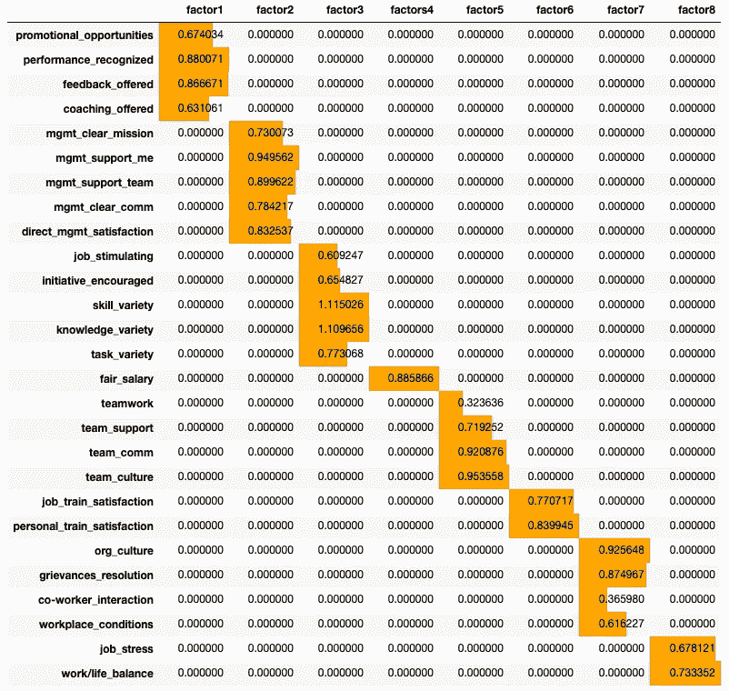

# 摘要

## 员工价值

CFA 结果似乎大部分证实了从相关矩阵、alpha 信度和 EFA 得到的结果。评估“employee_value”结构的项目当然需要改进，因为在衡量什么方面似乎有些混乱。“绩效 _ 认可”和“反馈 _ 提供”似乎是衡量一个潜在的结构，因为它们的相关性是 0.63，并且它们对 EFA 和 CFA 的负荷都很高。该结构的 alpha 可靠性处于可接受的边缘(0.79)，当我们查看其他指标时，肯定需要对该结构进行工作。

## 管理满意度

除了“direct _mgmt_satisfaction”之外，衡量管理满意度的项目都很完善，经得起相关性、alpha 可靠性和因子分析的严格测试。如前所述，与其他问题相比,“direct _mgmt_satisfaction”问题可能存在规模问题。调查参与者大多回答关于更广泛的领导力结构的问题，这个问题问的是他们的直接经理。

## 工作满意度

所有 4 项分析都支持评估该结构的项目质量。我什么都不会改变:)

## 团队满意度

当比较 EFA 和 CFA 时，该结构具有一些矛盾的加载结果。然而，这些矛盾，边缘阿尔法可靠性，以及项目之间不那么惊人的相关性，指向急需修订的问题。我认为团队的结构是可操作的，但是“团队文化”的概念在参加调查的人中可能有不同的解释。

## 培训满意度

为了建立可信的信度和结构效度，每个结构至少提供 3 个问题是很重要的。衡量这一结构的两个项目写得非常好，似乎在评估一个因素。我想看看其他问题。柯克帕特里克的培训评估模型可以作为附加问题的基础。

## 组织环境

不幸的是，就像“员工价值”一样，这一概念需要进行重大修改。所有的指标都导致了低于标准的结果，从表面效度的角度来看，很难在心理上将这些项目包含在一个内聚的结构中。

## 工作/生活平衡

很像“训练满意度”,这个结构表现很好，但我们希望每个结构至少有 3 个项目。

## 薪资满意度

这个结构由一个项目组成，从实用的角度来看，它根本就不存在。即使是克朗巴赫的阿尔法也需要至少两个问题。

# 结论

开展员工调查无疑需要做大量的工作。更有甚者，当调查变成评估(即。认知能力或技能测试)在招聘过程中的严格性和文档呈指数级增长。我希望你喜欢看一些 I/O 心理学家的工作。一如既往，我欢迎您的反馈。