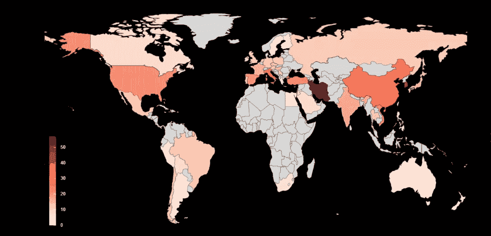
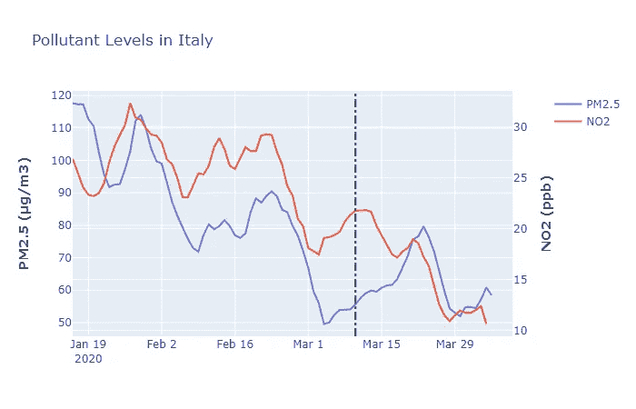
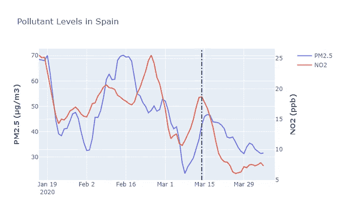
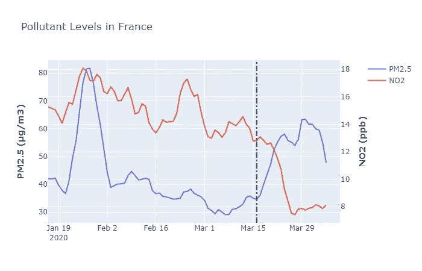
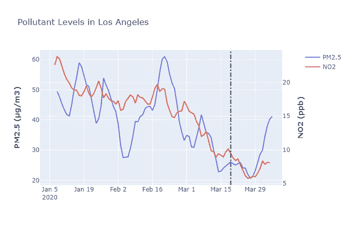
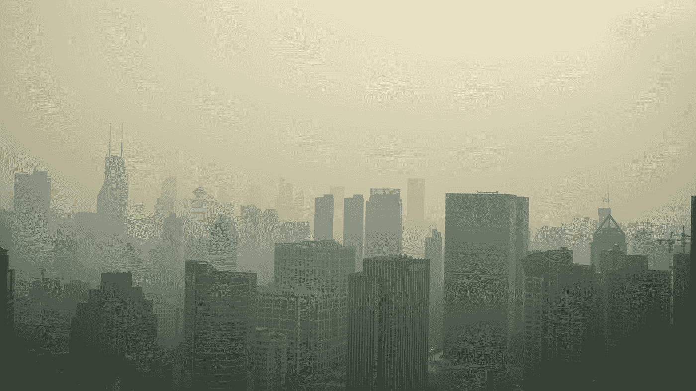
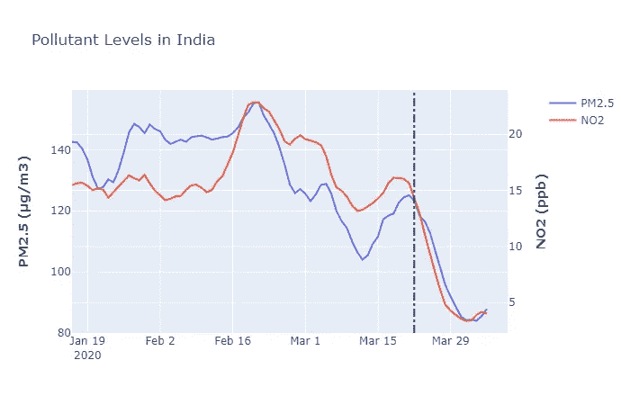

# 冠状病毒封锁对我们环境的影响分析。

> 原文：<https://towardsdatascience.com/assessing-the-impact-of-the-coronavirus-lockdown-on-our-environment-through-data-2905535da51e?source=collection_archive---------2----------------------->

汤姆·霍尔姆斯在 [Unsplash](https://unsplash.com?utm_source=medium&utm_medium=referral) 上拍摄的照片

> **更新至 4 月 4 日的最新数据**

你可能已经看到了推文，或者更糟的是，你可能已经分享了新闻；威尼斯有海豚和天鹅，中国有大象，在这个清新纯净、没有人类的世界里自由自在地游荡。在这个艰难的时刻，我们都想相信一些好的事情，但事实证明那些新闻和图片是假的，不完全是假的，只是与当前全球范围内的冠状病毒封锁无关。海豚和天鹅总是在威尼斯，大象的照片是一张旧照片。

所以问题来了，这是同一个古老的地球，还是仅仅好了一点点？为了消除噪音，揭示真正的真相，我决定查阅数据。空气质量指数(AQI)是一个非常可靠的指标，它反映了空气污染水平，因此是了解封锁影响的一个非常好的方法，至少对我们的低层大气是如此。你可以在 CovidExplore.com**这里看到全球污染物水平每周的变化。**

****

**自 2020 年第一周以来的 NO2 浓度。新冠肺炎的气候面**

**我知道，对吧？你可以看到一月底(第五周)和现在的巨大差异。具体来说，二氧化氮水平受到了巨大的冲击，因为街上几乎没有汽车，也很少有工业在运营。最大的不同将出现在意大利、西班牙和伊朗，这些国家采取了最严格的封锁措施来应对病毒的传播。**

> **[CovidExplore.com](http://www.covidexplore.com/)是用这个 github 库创建的:[https://github.com/mayukh18/covidexplore](https://github.com/mayukh18/covidexplore)。**

** [## mayukh18/covidexplore

### flask app 通过数据探索新冠肺炎对世界的影响。该项目的主要目标是评估…

github.com](https://github.com/mayukh18/covidexplore) 

现在让我们看看各地的数据和推论。** 

# **欧洲**

****

**空太阳门广场，马德里。图片:路透社**

**一旦我们更深入地了解欧洲三个国家的污染水平，就会更加清楚:意大利、西班牙和法国，这三个国家是最早进入封锁状态的。**

****

**意大利于 3 月 10 日进入完全封锁状态(由垂直黑线表示)，是此次危机中受冲击最大的国家。二氧化氮水平不言自明。然而，PM2.5 并没有反映出太多的变化。**

****

**西班牙于 3 月 14 日进入封锁状态。**

****

**法国于 3 月 16 日进入封锁状态。**

**因此，汽车和工业排放减少的影响是显而易见的，在上述三个国家中，二氧化氮水平都达到了历史最低水平。然而，PM2.5 水平在很大程度上与锁定无关。还需要 2-3 周的时间来全面评估人类缺席对它的影响。**

**CNN 比较了 3 月 19 日和 2020 年 3 月之间的 NO2 水平[这里](https://edition.cnn.com/2020/03/27/europe/europe-pollution-decline-coronavirus-lockdown-intl/index.html)。毫无疑问，1-2 周的无所事事可以治愈我们的情绪。**

**这是一段由欧洲航天局的 Sentinel-5P 卫星处理的欧洲上空的排放视频。**

# **美国**

**川普对新冠肺炎局势的政策一直不一致。没有任何全国性的封锁，各州已经采取了自己的预防措施。加利福尼亚州和纽约州是受影响最严重的州之一。加州在全州范围内采取了最早的 T2 居家订单措施之一。**

****

**洛杉矶记录了美国最早的案例之一，因此像在家工作限制旅行这样的措施早在当局介入之前就在基层开始了。结果相当明显。你可以在这里查看加州和美国其他城市[上空 NO2 水平的巨大差异。](https://edition.cnn.com/2020/03/23/health/us-pollution-satellite-coronavirus-scn-trnd/index.html)**

# **亚洲**

****

**照片由[瑞安·楚](https://unsplash.com/@ryaneof?utm_source=medium&utm_medium=referral)在 [Unsplash](https://unsplash.com?utm_source=medium&utm_medium=referral) 上拍摄**

**但最重要的可能是武汉，这一切的开始。就空气污染而言，中国也是世界上污染最严重的国家之一。1 月 23 日，武汉和湖北省的其他城市被中国政府完全封锁。在我们所有的样本中，这座城市给了我们最长的锁定视角。**

****

**这是欧空局为中国准备的相应的排放视频。**

**很明显，不是吗？如果你想看到封锁的即时效果，最好的例子是印度。印度在 3 月 22 日进行了试验性封锁后，从 3 月 25 日开始进入完全封锁状态。**

****

**事实上，新德里的人们在很长一段时间里一直看到如此低的空气质量指数水平。**

**我们气候的任何改善都不能证明或弥补我们世界人民正在经历的生命损失、苦难和痛苦。想一想都是愚蠢的。但是，我们能做的也许是从中吸取教训。COVID 危机导致了这一阶段，因为我们的世界领导人忙于否认它的影响，就像他们否认气候变化的各个方面一样。下一次，危机可能是气候危机。因此，我们应该做好准备。它的装甲可能没有任何缝隙。**

> **数据是从[aqicn.org](https://aqicn.org)获得的。每个国家的数据是其最大城市的平均值的近似值。为了使图表可读(因为读数波动很大)，显示的数据是过去 7 天的滚动平均值。这是截至 2020 年 3 月 27 日的最新数据。**
> 
> **搜集来的 AQI 数据就在 https://github.com/mayukh18/covidexplore[的仓库里。其他与 COVID 病例相关的数据从 https://github.com/CSSEGISandData/COVID-19](https://github.com/mayukh18/covidexplore)[约翰霍普金斯大学系统科学与工程中心](https://github.com/CSSEGISandData/COVID-19)获得**

# **参考资料:**

1.  **贝尔瑞秋。"为什么人们如此渴望相信这个假故事是真的？"国家地理，2020 年 3 月 27 日。[https://www . national geographic . com/animals/article/why-do-people 如此渴望相信这个假故事是真的](https://www.nationalgeographic.com/animals/article/why-do-people-want-so-badly-to-believe-this-fake-story-is-true)**
2.  **董，恩生等，“一个基于网络的实时跟踪的交互式仪表板”，2020 年 2 月 19 日。考研。[https://pubmed.ncbi.nlm.nih.gov/32087114](https://pubmed.ncbi.nlm.nih.gov/32087114/)**
3.  **帕特尔，卡莎。“意大利上空空气中二氧化氮减少”2020 年 3 月 13 日。美国宇航局地球天文台。[https://earth observatory . NASA . gov/blogs/earth matters/2020/03/13/airborne-nitrogen-dioxide-reduces-over-Italy](https://earthobservatory.nasa.gov/blogs/earthmatters/2020/03/13/airborne-nitrogen-dioxide-decreases-over-italy/)**
4.  **加州下令封锁该州 4000 万居民，2020 年 3 月 19 日。华尔街日报。[https://www . wsj . com/articles/China-reports-no-new-domestic-coronavirus-infections-for-first-time-since-outbreak-started-11584611233](https://www.wsj.com/articles/china-reports-no-new-domestic-coronavirus-infections-for-the-first-time-since-outbreak-started-11584611233)**