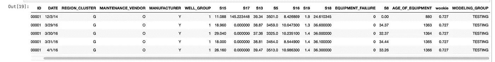

# 将面板数据分配给机器学习模型的训练、测试和验证组

> 原文：<https://towardsdatascience.com/assigning-panel-data-to-training-testing-and-validation-groups-for-machine-learning-models-7017350ab86e?source=collection_archive---------17----------------------->

*确保您的团队是独立的，避免部署灾难*


作者图片

 [## shad Griffin/面板采样

### 在 GitHub 上创建一个帐户，为 shadgriffin/panelsampling 的开发做出贡献。

github.com](https://github.com/shadgriffin/panelsampling) 

横截面数据包括在一个时间段内测量的单个实体。比如一万个人测一次就是横截面数据。

时间序列包括在多个时间段测量的一个实体。例如，十年来每天测量的单台机器就是一个时间序列。

面板数据包括在多个时间段测量的多个实体。例如，十个月内每月测量的 1000 名消费者是面板数据。或者说，100 天内每天测量 100 台机器，就是面板数据。

面板数据在数据科学中相当常见。有时，它被称为横截面时间序列数据。我还听说它被称为汇集的时间序列数据。不管你怎么称呼它，作为一名实践数据科学家，你很可能不得不处理它。

构建机器学习模型时，将数据中的记录分配给建模组是标准程序。通常，我们将数据随机分为训练组、测试组和验证组。在这种情况下，随机意味着数据集中的每条记录都有均等的机会被分配到三个组之一。

然而，当您处理面板数据时，稍微改变一下正常过程是有意义的。

在这本笔记本中，我通过一个简单的例子来说明如何做到这一点。

# **开始调教**

导入所有相关的 Python 库

```
import numpy as np
import numpy.dual as dualimport pandas as pd
```

从 GitHub 导入数据

```
#Remove the data if you run this notebook more than once
!rm equipment_failure_data_1.csv#import first half from github
!wget [https://raw.githubusercontent.com/shadgriffin/machine_failure/master/equipment_failure_data_1.csv](https://raw.githubusercontent.com/shadgriffin/machine_failure/master/equipment_failure_data_1.csv)# Convert csv to pandas dataframe
pd_data_1 = pd.read_csv("equipment_failure_data_1.csv", sep=",", header=0)#Remove the data if you run this notebook more than once
!rm equipment_failure_data_2.csv#Import the second half from github
!wget [https://raw.githubusercontent.com/shadgriffin/machine_failure/master/equipment_failure_data_2.csv](https://raw.githubusercontent.com/shadgriffin/machine_failure/master/equipment_failure_data_2.csv)# convert to pandas dataframe
pd_data_2 = pd.read_csv("equipment_failure_data_2.csv", sep=",", header=0)#concatenate the two data files into one dataframe
pd_data=pd.concat([pd_data_1, pd_data_2])
```

# **数据探索**

```
pd_data.head()
```


以下是对数据集中字段的描述。

ID —代表特定机器的 ID 字段。

日期—观察的日期。

REGION_CLUSTER —表示机器所在区域的字段。

MAINTENANCE_VENDOR —代表为机器提供维护和服务的公司的字段。

制造商——制造相关设备的公司。

WELL _ GROUP 表示机器类型的字段。

设备年龄-机器的年龄，以天为单位。

S15 —传感器值。

S17 —传感器值。

S13 —传感器值。

S16 —传感器值。

S19 —传感器值。

S18 —传感器值。

S8 —传感器值。

设备故障——“1”表示设备出现故障。“0”表示设备没有出现故障。

该数据代表一个面板数据集。我们在多个时间段测量了多台机器。ID 代表机器，DATE 代表日期。现在，让我们检查一下我们有多少台机器和多少个日期。

检查行数和列数。该数据有 307，751 行和 16 列

```
pd_data.shape
```


数据集中有 421 台机器。

```
xxxx = pd.DataFrame(pd_data.groupby(['ID']).agg(['count']))
xxxx.shape
```


数据集中有 731 个不同的日期。

```
xxxx = pd.DataFrame(pd_data.groupby(['DATE']).agg(['count']))
xxxx.shape
```


# **按实体(机器 id)创建测试、培训和验证组**

我们可以将每个记录随机分配给培训、测试或验证组。虽然这可能行得通，但我不会推荐它。我建议在实体级别(在本例中是机器)将记录分配给组。

为什么？

嗯，我可以用一些多音节词(如自相关、回旋镖或蛋黄酱)来描述为什么，但让我们想想。

为什么我们将数据分成培训、测试和验证组？

我们希望确保我们的模型不会过度拟合。换句话说，我们希望确保我们的模型适用于新数据。

例如，让我们假设我们建立了一个模型，它以 100%的准确率预测了去年发生的事情。干得好，对吧？嗯，模型去年预测的多好真的不重要。我们需要它来预测今天、明天和后天。因此，如果一个模型以 100%的准确率预测了去年，却没有预测到明天，那就有点糟糕了。

在训练数据上构建模型，并在测试和验证数据集上验证准确性，可以减少过度拟合的机会(注意，这仍然是可能的，但我将把这个讨论留到以后进行)。

为了防止过度拟合，我们的培训、测试和验证组必须是独立的。也就是说，训练组中的数据必须不同于测试和验证组。或者，至少尽可能的不同。

那么，如果我们只是将面板数据集中的每条记录随机分配给每个组，会发生什么呢？

我们最终得到每个组中每个实体的记录。

例如，使用简单的随机选择方法，如果我们在 100 天内每天测量 100 台机器，那么物理上位于休息室旁边的机器很可能会出现在培训、测试和验证组中。同样，如果您与个人打交道(其中一个人的名字是 Steve Wakahookie)，Steve Wakahookie 很可能会出现在所有三个组中。

换句话说，你的培训、测试和验证小组并不是独立的，因为史蒂夫和休息室旁边的机器都在这三个小组中。

史蒂夫正在接受测试。史蒂夫正在接受训练。史蒂夫在验证中。如果他潜伏在所有三个群体中，那么这三个群体就不是独立的。

现在，如果我们基于实体分配组成员，所有 Steve 的记录将在培训、测试或验证组中。同样，休息室与机器相关联的所有记录将只属于三个组中的一个。

如果 Steve 参加了培训，但没有参加测试或验证，那么这个组就是独立的。

如果休息室旁边的机器在测试中，但不在培训或验证中，则这些组是独立的。

下面是几行 python 代码，以确保您的培训、测试和验证组是独立的。

获取所有 id(机器)的唯一列表。

```
aa=pd_datapd_id=aa.drop_duplicates(subset='ID')
pd_id=pd_id[['ID']]
pd_id.shape
```


用 0 到之间的随机数创建一个新变量。

```
np.random.seed(42)
pd_id['wookie'] = (np.random.randint(0, 10000, pd_id.shape[0]))/10000pd_id=pd_id[['ID', 'wookie']]
```

给每台机器 30%的机会通过验证，35%的机会通过测试，35%的机会通过训练数据集。

```
pd_id['MODELING_GROUP'] = np.where(((pd_id.wookie <= 0.35)), 'TRAINING', np.where(((pd_id.wookie <= 0.65)), 'VALIDATION', 'TESTING'))
```

这是每组有多少台机器坠落。

```
tips_summed = pd_id.groupby([‘MODELING_GROUP’])[‘wookie’].count()
tips_summed
```


将每个 id 的组追加到每个单独的记录中。

```
pd_data=pd_data.sort_values(by=['ID'], ascending=[True])
pd_id=pd_id.sort_values(by=['ID'], ascending=[True])pd_data =pd_data.merge(pd_id, on=['ID'], how='inner')pd_data.head()
```



这是每组中记录的数量。

```
tips_summed = pd_data.groupby(['MODELING_GROUP'])['wookie'].count()
tips_summed
```


# 结论

所以，这就对了。现在，我们准备建立一个机器学习模型。通过将实体而不是记录放入您的培训、测试和验证组，您可以确保这些组之间的独立性，并构建适用于昨天、今天和明天的模型。

# 作者

Shad Griffin 是 IBM 的一名数据科学家