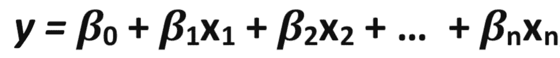
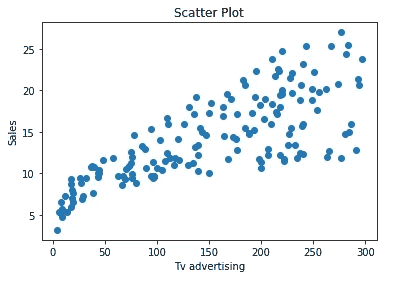
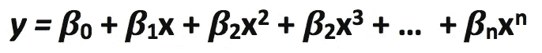
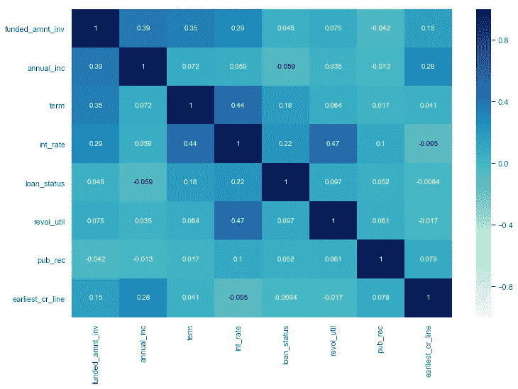
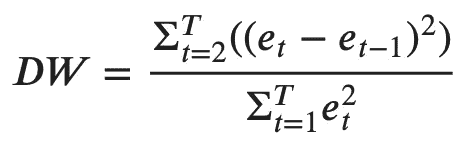
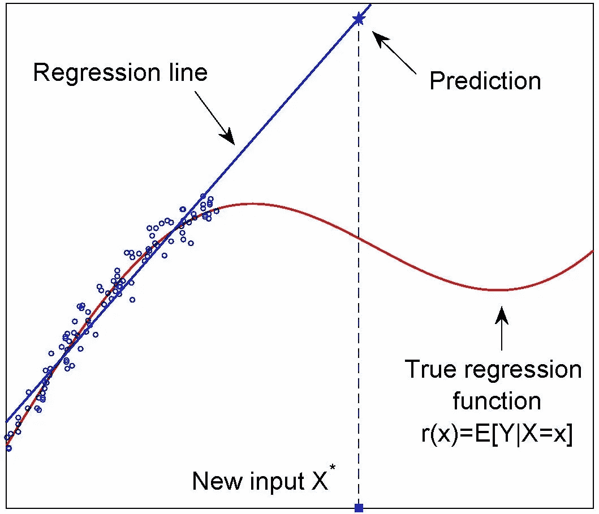

# 线性回归中的假设你可能不知道。

> 原文：<https://towardsdatascience.com/assumptions-in-linear-regression-528bb7b0495d?source=collection_archive---------17----------------------->

## 进入现实世界

## 模型应该符合这些假设，以产生与数据的最佳线性回归拟合。

约瑟夫·巴里恩托斯在 [Unsplash](https://unsplash.com?utm_source=medium&utm_medium=referral) 上拍摄的照片

*—所有图像(情节)均由作者生成和修改。*

# 介绍

首先在处，线性回归是一种建模最佳**的方法*自变量与*因变量之间的线性关系******。最简单的线性回归形式可由以下方程定义，该方程包含一个自变量和一个因变量:**

****

**简单线性回归**

****x** 为自变量，
**y** 为因变量，
***β* 1** 为 x 的系数，即斜率，
***β* 0** 为截距(常数)，表示 y 轴上直线与原点的距离。**

> ****线性回归**是一种[线性](https://en.wikipedia.org/wiki/Linearity)方法，用于模拟标量响应(或[因变量](https://en.wikipedia.org/wiki/Dependent_variable))和一个或多个[解释变量](https://en.wikipedia.org/wiki/Explanatory_variable)(或[自变量](https://en.wikipedia.org/wiki/Independent_variable))之间的关系。
> ——[维基百科](https://en.wikipedia.org/wiki/Linear_regression)**

## **线性回归类型**

****1。简单线性回归**——回归的最简单形式，涉及一个自变量和一个因变量，如上所述，我们在模型中拟合一条线。**

****2。多元线性回归** —回归的复杂形式，涉及多个自变量和一个因变量，可通过以下等式解释:**

****

**多元线性回归**

****x1** 到 **xn** 为自变量，
**y** 为因变量，
***β* 1** 到 ***β* n** 为各自 x 特征的系数，
***β* 0** 为截距(常数)，表示 y 轴上直线距离原点的距离。**

# **线性回归的假设**

****

**[汤姆·罗伯茨](https://unsplash.com/@tomrdesigns?utm_source=medium&utm_medium=referral)在 [Unsplash](https://unsplash.com?utm_source=medium&utm_medium=referral) 上的照片**

****1。线性关系** —假设并理解自变量和因变量之间的关系是线性的，即系数必须是线性的，这是我们通过建模和预测发现的。**

****

**作者图片**

**预测变量被视为固定值，可以是任何复杂函数，如多项式、三角函数等。但是系数将与预测变量严格线性相关。**

****

**多项式回归**

**该假设用于实施**多项式回归**，其使用线性回归将响应变量拟合为预测变量的任意多项式函数，预测变量也与系数成线性关系。**

****2。同方差(恒定方差)**-假设残差项(即特征和目标之间关系中的“噪声”或随机扰动)必须具有恒定方差，即误差项在独立特征的不同值之间是相同的，与预测变量的值无关。**

****

**作者图片—已修改**

**分布中不应该有明确的模式，如果有特定的模式，数据就是异方差的。最左边的图显示了误差项之间没有明确的模式，即分布不断变化，而中间的图显示了误差随着估计值减小然后增大的模式，违反了恒定方差规则，并且最右边的图还显示了误差项随着预测值减小的特定模式，表示异方差。如果两个或多个正态分布共享一个公共协方差(或相关)矩阵，则它们是同方差的。**

****3。多元正态性** —假设误差项呈正态分布，即误差项的平均值为零，误差项之和也等于零。一个鲜为人知的事实是，随着样本量的增加，不再需要残差的正态性假设。**

****

**上面的 q-q 图表明误差或残差是正态分布的。误差项可以看作是一些微小残差或误差的合成。随着这些小残差数量的增加，误差项的分布趋于接近正态分布。这种趋势被称为中心极限定理，其中 t 检验和 f 检验仅在误差项呈正态分布时适用。**

****4。无多重共线性**-多重共线性定义为模型中使用的独立变量之间的相互关联程度。假设独立特征变量彼此之间根本不相关或者非常不相关，这使得它们是独立的。因此，在实际实施中，两个独立特征之间的相关性不得大于 30%，因为这会削弱所建模型的统计能力。为了识别高度相关的特征，可以使用成对图(散点图)和热图(相关矩阵)。**

****

**相关热图—作者提供的图片**

**高度相关的特征不应用于模型中，以保持模型与其所有特征之间的紧密关系，因为这些特征往往会一致变化。因此，随着一个特征的改变，相关特征的改变不会使后者如模型所要求的那样恒定，同时使用加权系数预测结果，并且回归系数的预期解释不符合。**

****5。无自相关** —假设数据中的特征之间不存在自相关。它主要发生在残差之间存在相关性的时候，即残差不应该正相关或负相关，并且应该具有良好的整体分布。这通常发生在下一个时刻依赖于前一个时刻的时间序列模型中。残差项中相关性的存在也降低了模型的可预测性。**

**自相关可以在杜宾-沃森测试的帮助下进行测试。德宾-沃森检验统计量定义为:**

****

**德宾-沃森方程**

**Durbin-Watson 检验统计量的值总是在 0 到 4 之间。精确值 2.0 表示在样本中没有检测到自相关。介于 0 和 2 之间的值表示正自相关，介于 2 和 4 之间的值表示负自相关。**

****6。无外推** —外推是一种可以存在于原始观测范围之外的估计。假设已训练的模型将能够仅针对位于训练数据范围内的数据，根据独立特征值来预测因变量的值。因此，模型不能保证预测值超出训练好的独立特征值的范围。**

****

**作者图片—已修改**

# **结论:**

**我们已经解释了在对给定数据集实施线性回归模型之前必须关注的最重要的假设。这些假设只是一种正式的措施，以确保所建立的线性回归模型的可预测性足够好，从而为我们提供给定数据集的最佳可能结果。如果不满足这些假设，将不会停止建立线性回归模型，但会为模型的可预测性提供良好的信心。**

**感谢阅读。你可以在这里找到我的其他[机器学习相关的帖子](https://towardsdatascience.com/@imsparsh)。**

**希望这篇帖子有用。我感谢反馈和建设性的批评。如果你想谈论这篇文章或其他相关话题，你可以在这里或在 [LinkedIn](https://www.linkedin.com/in/imsparsh/) 给我发短信。**

** [## 是什么让逻辑回归成为一种分类算法？

### 对数优势，基线的逻辑回归解释。

towardsdatascience.com](/what-makes-logistic-regression-a-classification-algorithm-35018497b63f)  [## 机器学习中最常见的损失函数

### 每个机器学习工程师都应该了解机器学习中这些常见的损失函数，以及何时使用…

towardsdatascience.com](/most-common-loss-functions-in-machine-learning-c7212a99dae0)**