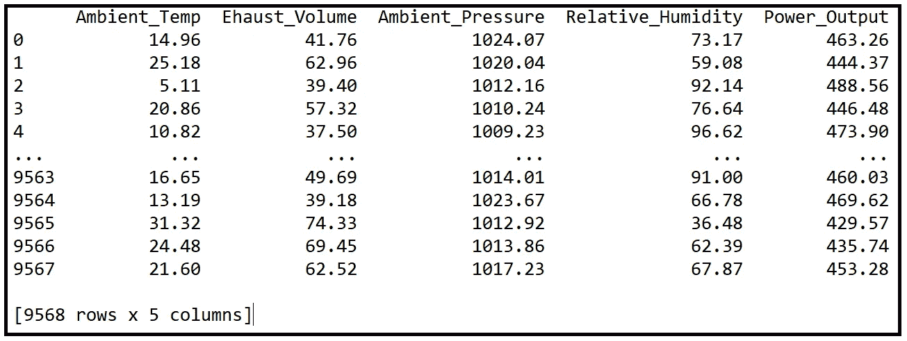
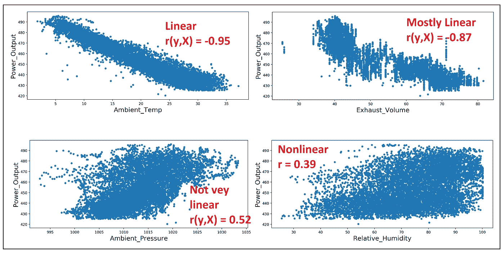
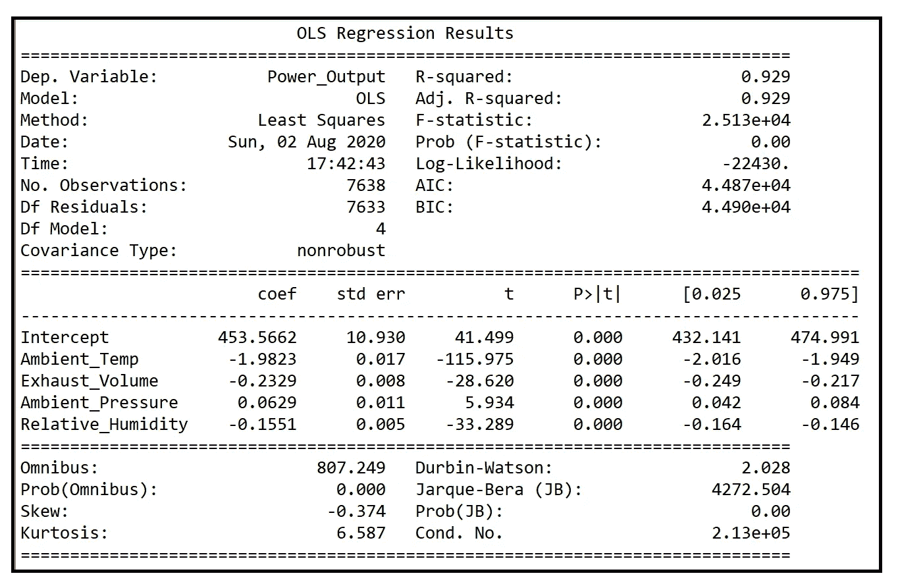
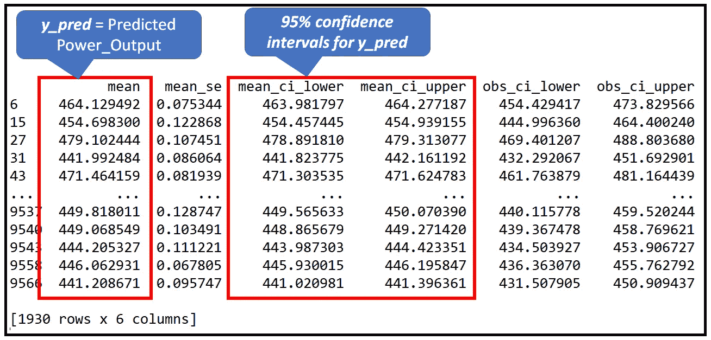
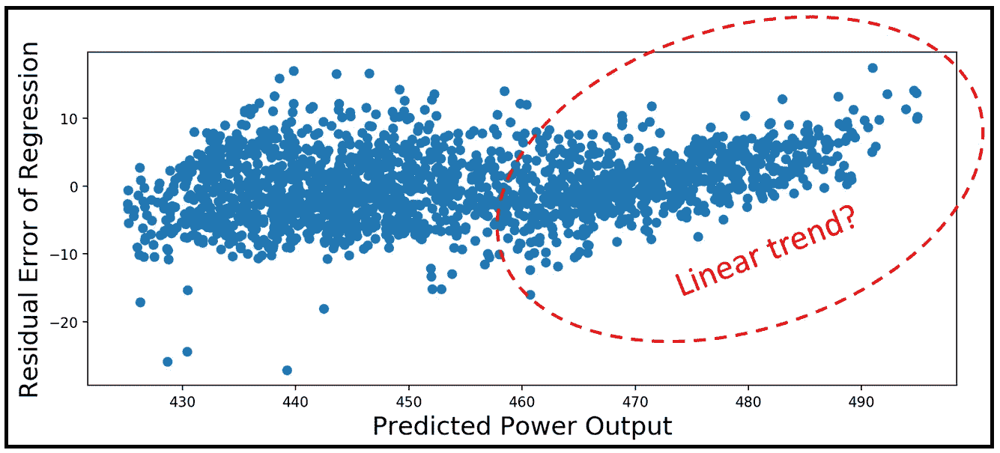
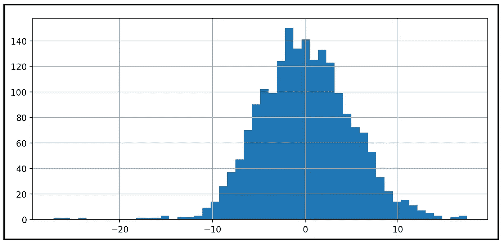
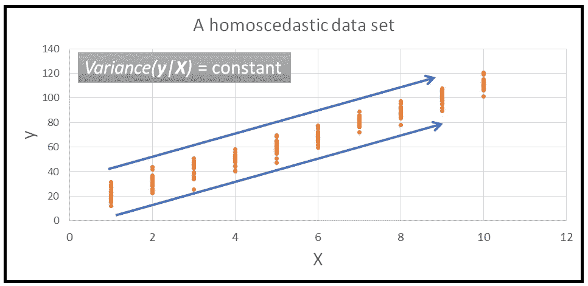
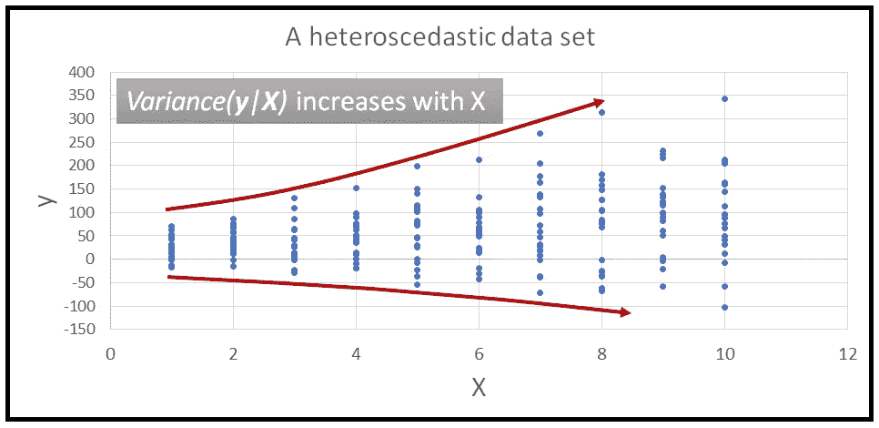

# 线性回归的假设

> 原文：<https://towardsdatascience.com/assumptions-of-linear-regression-5d87c347140?source=collection_archive---------0----------------------->

## 以及如何使用 Python 测试它们。

线性回归是回归模型的自行车。这很简单，但非常有用。它可以用于各种领域。它有一个很好的封闭解，这使得模型训练成为一个超快速的非迭代过程。

线性回归模型的性能特征已被充分理解，并得到数十年严格研究的支持。该模型的预测很容易理解，很容易解释，也很容易辩护。

> 如果只有一个回归模型，你有时间彻底了解，它应该是线性回归模型。

如果您的数据满足线性回归模型(特别是普通最小二乘回归(OLSR)模型)的假设，在大多数情况下，您不需要做进一步的调查。

这就引出了 OLSR 模型的以下四个假设:

1.  **线性函数形式:**响应变量 ***y*** 应该是与解释变量 ***X.*** 线性相关
2.  **残差应为 i.i.d.:** 在训练数据集上拟合模型后，模型的残差应为独立同分布的随机变量。
3.  **残差应呈正态分布:**残差应呈正态分布。
4.  **残差应该是同方差的:**残差应该是恒方差的。

让我们详细看看这四个假设，以及如何检验它们。

# 假设 1:线性函数形式

线性几乎不需要解释。毕竟，如果您选择进行线性回归，您就假设基础数据呈现线性关系，特别是以下线性关系:

***y****=****β*********x****+****ϵ***

其中 ***y*** 为因变量向量， ***X*** 为包含截距的解释变量矩阵， ***β*** 为回归系数向量，*为误差项向量，即 ***y*** 中的 ***X****

***如何使用 Python 测试线性假设***

*这可以通过两种方式实现:*

1.  *一种简单的方法是相对于每个解释变量***【x _ j】***绘制 ***y*** ，并目视检查散点图的非线性迹象。*
2.  *人们还可以使用 *Pandas* 中的`DataFrame.corr()`方法来获得响应变量*和每个解释变量 ***x_j*** 之间的皮尔逊相关系数*‘r’*，以获得线性相关程度的定量感受。**

> **请注意，只有当 **y** 和 **X** 之间的关系已知为线性时，才应使用皮尔逊的‘r’。**

**让我们对联合循环发电厂的 4 个运行参数的 9568 个观测值的以下数据集进行线性假设测试，这些观测值持续了 6 年时间:**

****

**数据来源: [UCI 机器学习知识库](https://archive.ics.uci.edu/ml/datasets/Combined+Cycle+Power+Plant)**

**解释变量 ***x_j*** 为以下 4 个电厂参数:**

****环境温度**摄氏度
排气容积水银柱高度
厘米**环境压力**毫巴水银柱
相对湿度百分比**

**响应变量 ***y*** 是电厂的 **Power_Output** ，单位 MW。**

**让我们将数据集加载到熊猫数据框架中。**

```
****import** pandas **as** pd
**from** patsy **import** dmatrices
**from** matplotlib **import** pyplot **as** plt
**import** numpy **as** npdf = pd.**read_csv**('power_plant_output.csv', **header**=0)**
```

**绘制每个解释变量相对于响应变量 Power_Output 的散点图。**

```
**df.**plot**.**scatter**(**x**='Ambient_Temp', **y**='Power_Output')
plt.**xlabel**('Ambient_Temp', **fontsize**=18)
plt.**ylabel**('Power_Output', **fontsize**=18)
plt.**show**()df.**plot**.**scatter**(**x**='Exhaust_Volume', **y**='Power_Output')
plt.**xlabel**('Exhaust_Volume', **fontsize**=18)
plt.**ylabel**('Power_Output', **fontsize**=18)
plt.**show**()df.**plot**.**scatter**(**x**='Ambient_Pressure', **y**='Power_Output')
plt.**xlabel**('Ambient_Pressure', **fontsize**=18)
plt.**ylabel**('Power_Output', **fontsize**=18)
plt.**show**()df.**plot**.**scatter**(**x**='Relative_Humidity', **y**='Power_Output')
plt.**xlabel**('Relative_Humidity', **fontsize**=18)
plt.**ylabel**('Power_Output', **fontsize**=18)
plt.**show**()**
```

**这是四个情节的拼贴画:**

****

**每个解释变量的功率输出散点图(图片由[作者](https://sachin-date.medium.com/)提供)**

**可以看到，环境温度和排气体积似乎与发电厂的功率输出线性关系最大，其次是环境压力和相对湿度。**

**让我们也打印出皮尔逊的“r”:**

```
**df.corr()['Power_Output']**
```

**我们得到以下输出，这支持了我们的视觉直觉:**

```
**Ambient_Temp        -0.948128
Exhaust_Volume      -0.869780
Ambient_Pressure     0.518429
Relative_Humidity    0.389794
Power_Output         1.000000
Name: Power_Output, dtype: float64**
```

> **相关阅读: [**相关性背后的直觉**](/the-intuition-behind-correlation-62ca11a3c4a) ，对皮尔逊相关系数的深入讲解。**

# ****假设 2: i.i.d .残差****

**人们在拟合 OLSR 模型时作出的第二个假设是，模型拟合数据留下的残差是**独立**、**同分布** **随机变量**。**

**我们将这一假设分为三部分:**

1.  **残差是随机变量，**
2.  **它们是**独立的**随机变量，并且**
3.  **它们的概率分布是**相同的**。**

## ****为什么残差是随机变量？****

**在我们对数据集训练线性回归模型之后，如果我们通过相同的模型运行训练数据，该模型将生成预测。姑且称之为 ***y_pred。*** 对于向量 ***y_pred*** 中的每个预测值 *y_pred* ，从响应变量向量 ***y*** 中都有对应的实际值 *y* 。差值 *(y — y_pred)* 为残差' *ε'* 。这些 *ε* 的数量与训练集中的行数一样多，它们一起形成残差向量 ***ε*** 。**

**每个残差 *ε* 都是一个**随机变量**。要理解为什么，回想一下我们的训练集 ***(y_train，X_train)*** 只是从一些非常大的*值总体*中抽取的 *n* 值的*样本*。**

**如果我们从相同的总体中抽取不同的样本***(y _ train’，X _ train’)***，那么模型对第二个样本的拟合会有所不同，从而产生一组不同的预测***【y _ pred’***，并因此产生一组不同的残差**=****【y’—y _ pred’)******

**在对模型进行训练之后，从总体中抽取的第三训练样本将会产生第三组残差***ε=(y″—y _ pred″)、*** 等等。**

**现在可以看到，向量 ***ε*** 中的每个残差可以从与人们愿意用来训练模型的样本训练数据集的数量一样多的值集中取随机值，从而使每个残差 *ε* 成为随机变量。**

****为什么残差需要独立？****

**两个随机变量是独立的，如果其中一个取某个值的概率不依赖于另一个变量取的值。当你掷一个骰子两次时，它在第二次掷出 1，2，…，6 的概率并不取决于它在第一次掷出的数值。所以这两次投掷是独立的随机变量，可以各自取 1 到 6 的值，与另一次投掷无关。**

**在回归的背景下，我们已经看到了为什么回归模型的残差是随机变量。如果残差不是独立的，它们可能会表现出某种模式(肉眼并不总是很明显)。这种模式中有回归模型在对训练集进行训练时无法捕获的信息，从而使模型达不到最优。**

**如果残差不是独立的，这可能意味着很多事情:**

*   **您的模型中缺少一个或多个重要的解释变量。缺失变量的影响表现为残差中的一种模式。**
*   **你建立的线性模型只是数据集的错误模型。例如，如果数据集显示出明显的非线性，并且您试图在这样的数据集上拟合线性回归模型，那么 ***y*** 和 ***X*** 之间的非线性关系将以不同模式的形式在回归的残差中表现出来。**
*   **残差不独立的第三个有趣原因是所谓的**多重共线性**，这意味着解释变量本身彼此线性相关。多重共线性会导致模型的系数变得不稳定，也就是说，当在不同的训练集上进行训练时，它们会从一次训练运行到下一次训练运行之间剧烈波动。这可能会使模型的总体拟合优度统计数据受到质疑。多重共线性(尤其是极端多重共线性)的另一个严重影响是，模型的最小二乘求解器可能会在模型拟合过程中抛出无穷大，从而使模型无法拟合定型数据。**

****如何检验残差的独立性？****

**核实独立性并不容易。但是有时可以在残差与预测值的**图**或残差与实际值的**图**中检测到模式。**

**另一种常用技术是使用**杜宾-沃森测试**，该测试测量每个残差与“先前”残差的相关程度。这就是所谓的**滞后-1 自相关**，这是一种用于确定时间序列回归模型的残差是否独立的有用技术。**

**让我们用一个线性回归模型来拟合电厂数据，并检验回归的残差。**

**我们将开始使用 Patsy 库创建模型表达式[，如下所示:](https://patsy.readthedocs.io/en/latest/quickstart.html)**

```
**model_expr = 'Power_Output ~ Ambient_Temp + Exhaust_Volume + Ambient_Pressure + Relative_Humidity'**
```

**在上面的模型表达式中，我们告诉 Patsy，Power_Output 是响应变量，而 Ambient_Temp、Exhaust_Volume、Ambient_Pressure 和相对湿度是解释变量。Patsy 将默认添加回归截距。**

**我们将使用 patsy 雕刻出如下的 ***y*** 和 ***X*** 矩阵:**

```
**y, X = **dmatrices**(model_expr, df, **return_type**='dataframe')**
```

**让我们也划分出训练和测试数据集。训练数据集将是整体大小的 80%(***y，X*** )，其余将是测试数据集:**

```
**mask = np.**random**.rand(**len**(X)) < 0.8
X_train = X[mask]
y_train = y[mask]
X_test = X[~mask]
y_test = y[~mask]**
```

**最后，在训练数据上建立和训练普通最小二乘回归模型，并打印模型摘要:**

```
**olsr_results = linear_model.**OLS**(y_train, X_train).fit()
print(**'Training completed'**)

print(olsr_results.summary())**
```

**我们得到以下输出:**

****

**statsmodels 打印出的 OLS 回归输出(图片由[作者](https://sachin-date.medium.com/)提供)**

**接下来，让我们获得模型在**测试**数据集上的预测，并获得其预测:**

```
**olsr_predictions = olsr_results.**get_prediction**(X_test)**
```

**`olsr_predictions` 是类型*stats models . regression . _ prediction。预测结果*和预测可以通过*prediction result . summary _ frame()*方法获得:**

```
**prediction_summary_frame = olsr_predictions.**summary_frame**()
print(prediction_summary_frame)**
```

****

**模型的预测和 95%的上下置信水平(图片由[作者](https://sachin-date.medium.com/)提供)**

**我们来计算回归的残差***ε****=****(y _ test—y _ pred):*****

```
**resid = y_test['Power_Output'] - prediction_summary_frame['mean']**
```

**最后，让我们对照预测值`y_pred=prediction_summary_frame[‘mean’]`绘制`resid` :**

```
**plt.xlabel('Predicted Power Output', fontsize=18)
plt.ylabel('Residual Error of Regression', fontsize=18)
plt.scatter(y_test['Power_Output'], resid)
plt.show()**
```

**我们得到如下的情节:**

****

**根据模型预测绘制的残差(图片由[作者](https://sachin-date.medium.com/)提供)**

**可以看出，对于较小的功率输出值，残差或多或少是无模式的，但在功率输出范围的高端，它们似乎显示出线性模式。它表明，在功率输出范围的高端，模型的预测不如在范围的低端可靠。**

## ****为什么残差应该有**相同的分布？**

**同分布意味着对应于每个数据行的预测的残差 *ε_i* 具有相同的概率分布。如果误差分布不一致，就不能可靠地使用显著性检验，如用于回归分析的 [**F 检验**](/fisher-test-for-regression-analysis-1e1687867259) 或对预测进行置信区间检验。这些测试中有许多依赖于残差相等，并且*正态分布*。这让我们想到了下一个假设。**

# **假设 3:残差应该是正态分布的**

**在上一节中，我们看到了如何以及为什么回归的残差被假设为独立的同分布(i.i.d .)随机变量。假设 3 强加了一个额外的约束。这些误差应该都具有均值为零的正态分布。用统计语言来说:**

> **∀ *i* ∈ *n，ε_i ~ N(0，* σ)**

**这一符号读作如下:**

**对于长度为 *n* 行的数据集中的所有 *i* ，回归的第 I 个残差是一个正态分布的随机变量(这就是为什么用 *N* ()表示)。这个分布的均值为零，方差为σ。此外，所有的 *ε_i 具有相同的方差σ* ，即它们是同分布的。**

**一个常见的误解是，线性回归模型要求解释变量和响应变量呈正态分布。**

*****x_j*** 和 ***y*** 往往甚至不会同分布，更不用说正态分布了。**

> **在线性回归中，只有回归的残差才需要正态性。**

**事实上，残差的正态性甚至不是严格要求的。如果残差不是正态分布的，那么你的回归模型不会出现可怕的错误。常态只是一种可取的性质。**

**通常告诉你的是，你的模型的大多数预测误差是零或接近零，大误差比小误差少得多。**

## ****如果残差不是 *N(0，σ )* 分布会怎么样？****

**如果回归的残差不是 *N(0，σ )* ，那么依赖于具有 *N(0，σ )* 分布的误差的显著性的统计测试就简单地停止工作。**

**举个例子，**

*   **只有当回归误差分布为 *N(0，σ)**时， [**F 检验用于回归分析**](/fisher-test-for-regression-analysis-1e1687867259) 的 F 统计量才具有所需的卡方分布。如果回归误差不是正态分布的，f 检验不能用于确定模型的回归系数是否共同显著。然后你将不得不使用一些其他的测试来找出你的回归模型是否比通过数据集均值的直线做得更好。***
*   **同样， [**t 值和置信区间**](https://en.wikipedia.org/wiki/Confidence_interval#Significance_of_t-tables_and_z-tables) 的计算假设回归误差为 *N(0，σ )* 分布。*如果回归误差不是正态分布的，模型系数和模型预测的 t 值将变得不准确，您不应过于相信系数或预测的置信区间。***

****非正态的一个特例:双峰分布残差****

**有时，人们发现模型的残差具有双峰分布**，即它们有两个峰值。这可能指向一个错误指定的模型，或者模型中缺少一个重要的解释变量。****

****例如，考虑以下情况:****

****您的因变量是一个二进制变量，如 Won(编码为 1.0)或 Lost(编码为 0.0)。但是你的线性回归模型将会产生连续实数范围的预测。如果模型沿着大约 0.5 的该标度的狭窄范围产生其大部分预测，例如 0.55、0.58、0.6、0.61 等。回归误差的峰值要么在零的一侧(当真值为 0 时)，要么在零的另一侧(当真值为 1 时)。这表明您的模型无法决定输出应该是 1 还是 0，因此它预测的值大约是 1 和 0 的平均值。****

****如果缺少一个关键的二进制变量(称为指示变量),就会发生这种情况，它会以下列方式影响输出值:****

*****当变量值为 0 时，输出范围在一定范围内，比如接近 0。*****

*****当变量的值为 1 时，输出会呈现一个全新的值范围，这是以前的范围所没有的，比如 1.0 左右。*****

****如果模型中缺少此变量，预测值将在两个范围之间取平均值，从而导致回归误差出现两个峰值。一旦添加了这个变量，模型就被很好地指定了，它将正确地区分解释变量的两个可能范围。****

```
****Related read: [**When Your Regression Model’s Errors Contain Two Peaks**](/when-your-regression-models-errors-contain-two-peaks-13d835686ca)****
```

## ****如何检验残差的正态性？****

****有许多可用的正态性检验。检查正态性最简单的方法是测量残差分布的偏度和峰度。****

> ****完美正态分布的偏度为 0，峰度为 3.0。****

****任何偏离，无论是正的还是负的，都表明偏离了常态。当然不可能得到完美的正态分布。预计会出现一些偏离常态的情况。但是“一点点”的离开是多少呢？如何判断离职是否重大？****

****偏离是否显著由正态性的统计检验来回答，如 **Jarque Bera 检验**和**综合检验**。这些测试中的 p 值≤ 0.05 表示分布在≥ 95%的置信水平下为正态分布。****

****让我们在电厂数据集上训练的线性回归模型上运行 Jarque-Bera 正态性测试。回想一下，残留误差存储在变量`resid`中，它们是通过对测试数据运行模型并从观测值 *y_test* 中减去预测值 *y_pred* 而获得的。****

```
******from** statsmodels.compat **import** lzip
**import** statsmodels.stats.api **as** smsname = ['Jarque-Bera test', 'Chi-squared(2) p-value', 'Skewness', 'Kurtosis']**#run the Jarque-Bera test for Normality on the residuals vector** test = sms.**jarque_bera**(resid)**#print out the test results. This will also print the Skewness and Kurtosis of the resid vector** lzip(name, test)****
```

****这会打印出以下内容:****

```
****[('**Jarque-Bera test**', 1863.1641805048084), ('**Chi-squared(2) p-value**', 0.0), ('**Skewness**', -0.22883430693578996), ('**Kurtosis**', 5.37590904238288)]****
```

****残差的偏斜度为-0.23，峰度为 5.38。Jarque-Bera 测试得出的 p 值是< 0.01 and thus it has judged them to be respectively different than 0.0 and 3.0 at a greater than 99% confidence level thereby implying that the residuals of the linear regression model are for all practical purposes not normally distributed.****

****Let’s plot the frequency distribution of the residual errors:****

```
****resid.**hist**(**bins**=50)
plt.show()****
```

****We get the following histogram showing us that the residual errors do seem to be normally distributed (but the JB has shown that they are in fact not so):****

********

****Frequency distribution of residual errors (Image by [作者](https://sachin-date.medium.com/)****

> ****相关阅读: [**用偏度和峰度检验正态性**](/testing-for-normality-using-skewness-and-kurtosis-afd61be860) ，关于正态性的深入解释和正态性的统计检验。****
> 
> ****相关阅读: [**当你的回归模型的误差包含两个峰值**](/when-your-regression-models-errors-contain-two-peaks-13d835686ca) **:** 一个关于处理双峰残差的 Python 教程。****

# ******假设 4:残差应该是同方差的******

****在上一节中，我们看到了为什么残差应当*为 N(0，σ )* 分布，即均值为零且方差为 *σ的正态分布。*在本节中，我们对它们施加了一个额外的约束:*方差σ应该是常数。特别是，σ不应该是响应变量* **y** *的函数，从而间接地是解释变量* ***X*** *的函数。*****

> *****一个数据集具有恒定方差的性质叫做***。而与之相反，其中方差是解释变量* **X** *的函数称为* ***异方差*** *。******

*****下面是一组显示同方差的数据:*****

**********

*****同方差的例子(图片由[作者](https://sachin-date.medium.com/)提供)*****

*****这是一个显示异方差的例子:*****

**********

*****异方差的例子(图片由[作者](https://sachin-date.medium.com/)提供)*****

*****在谈论同方差或异方差时，我们总是考虑条件方差:*Var(****y****|****X****=****X _ I****，或者 Var(****ε****|)这读作 ***y*** 的方差或 ***ε*** 对于***X****=****X _ I***的某个值。******

> ******相关阅读:** [**每个数据科学家都应该知道的三个条件:**](/3-conditionals-every-data-scientist-should-know-1916d48b078a) 条件期望、条件概率&条件方差:回归建模者的实用见解****

## ****为什么我们希望残差是同方差的？****

****残差具有作为 ***y*** (因此 ***X*** )的函数的方差的直接后果是残差不再是同分布的。每个 ***X=x_i*** 的 ***ε*** 的方差会不同，从而导致 ***ε中每个 *ε_i* 的概率分布不相同。*******

****我们已经看到，如果残差不是同分布的，我们就不能使用显著性检验，例如用于回归分析的 [**F 检验**](/fisher-test-for-regression-analysis-1e1687867259) ，或者对回归模型的系数或模型预测执行置信区间检查。许多这些测试依赖于独立的残差，**同分布的**随机变量。****

## ****什么会导致残差是异方差的？****

****当线性模型拟合到响应变量 ***y*** 的波动是当前值 ***y*** 的某个函数的数据时，异方差误差经常出现，例如，它是当前值 ***y*** 的百分比。这种数据集通常出现在货币领域。一个例子是公司股票价格的绝对变动量与当前股票价格成比例。另一个例子是某些产品销售的季节性变化与销售水平成正比。****

****数据收集过程中的错误也会引入异方差。例如，如果测量仪器在测量值中引入与测量值成比例的噪声，则测量值将包含异方差。****

****模型误差中引入异方差的另一个原因是简单地对数据集使用了错误的模型，或者遗漏了重要的解释变量。****

## ****如何修复模型残差中的异方差？****

****处理异方差误差有三种主要方法:****

1.  ****转换因变量，使其线性化，并抑制异方差。常用的变换有*对数(****y****)*和*平方根(****y****)*。****
2.  ****确定模型中可能缺失的重要变量，以及导致误差变化以形成模式的变量，并将这些变量添加到模型中。或者，停止使用线性模型，切换到完全不同的模型，如广义线性模型或神经网络模型。****
3.  ****简单地接受残差中存在的异方差。****

## ****如何检测残差中的异方差？****

****有几种检验同质性的方法。以下是一些例子:****

*   ****[停车测试](https://en.wikipedia.org/wiki/Park_test)****
*   ****[格雷泽测试](https://en.wikipedia.org/wiki/Glejser_test)****
*   ****[布鲁赫-异教徒测试](https://en.wikipedia.org/wiki/Breusch%E2%80%93Pagan_test)****
*   ****[白色测试](https://en.wikipedia.org/wiki/White_test)****
*   ****[戈德菲尔德–匡特测试](https://en.wikipedia.org/wiki/Goldfeld%E2%80%93Quandt_test)****

******使用 Python 测试异方差******

****让我们通过使用**怀特测试来测试模型的异方差残差。**我们将使用之前建立的线性模型中的误差来预测发电厂的输出。****

****异方差的**白色测试**使用以下推理来检测异方差:****

1.  ****如果残差 ***ε*** 是异方差的，则它们的方差可以由***【y】***(因此由模型的解释变量 ***X*** 及其平方( ***X )*** 和叉积*(****X****)的组合来“解释”*****
2.  ****因此，当在误差 ***ε*** 和 ***(X*** ， ***X*** ，***X***X***X***)上拟合辅助线性模型时，期望辅助线性模型将能够解释至少一些关系，即****
3.  ****如果我们对辅助模型运行回归的 [**F 检验**](/fisher-test-for-regression-analysis-1e1687867259) ，并且 f 检验返回≤ 0.05 的 p 值，这将使我们接受 f 检验的替代假设，即辅助模型的系数共同显著。因此，拟合的辅助模型*是*确实能够捕捉主模型的残差 ***ε*** 和模型的解释变量*之间的有意义的关系。这使我们得出结论，主模型 ***ε*** 的残差是异方差的。*****
4.  *****另一方面，如果 f 检验返回 p 值≥ 0.05，那么我们接受 f 检验的零假设，即主模型的残差 ***ε*** 与模型的解释变量 ***X*** 之间没有有意义的关系。因此，主模型 ***ε*** 的残差是同方差的。*****

*****让我们对之前在测试数据集上运行拟合电厂输出模型时获得的残差进行白色测试。这些残留误差存储在变量`resid.`中*****

```
*******from** statsmodels.stats.diagnostic **import** het_whitekeys = ['Lagrange Multiplier statistic:', 'LM test\'s p-value:', 'F-statistic:', 'F-test\'s p-value:']**#run the White test**
results = **het_white**(resid, X_test)**#print the results. We will get to see the values of two test-statistics and the corresponding p-values**
**lzip**(keys, results)*****
```

*****我们看到以下几点:*****

```
*****[('**Lagrange Multiplier statistic:**', 33.898672268600926), ("**LM test's p-value:**", 2.4941917488321856e-06), ('**F-statistic:**', 6.879489454587562), ("**F-test's p-value:**", 2.2534296887344e-06)]*****
```

*****您可以看到，回归的 f 检验返回的 p 值为 2.25e-06，比 0.01 还要小得多。*****

*****因此，在 99%的置信度下，我们可以说白色测试**使用的辅助模型**能够解释主要模型的残差`resid`和主要模型的解释变量(在这种情况下为`X_test`)之间的有意义的关系。*****

*****因此，我们**拒绝 f 检验的零假设**，即电厂输出模型的残差是异方差的，而**接受另一个假设**，即模型**的残差是异方差的**。*****

*****回想一下，我们在残差与预测值 ***y_pred 的关系图中看到了以下各种线性模式:********

**********

*****残差与预测值(图片由[作者](https://sachin-date.medium.com/)提供)*****

*****从这个图中，我们应该预期我们的线性模型的残差是异方差的。白测正好印证了这个预期！*****

> *******相关阅读:** [**异方差没什么可怕的**](/heteroscedasticity-is-nothing-to-be-afraid-of-730dd3f7ca1f) 深入了解异方差及其后果。*****
> 
> *******延伸阅读:** [**非线性、异方差数据的稳健线性回归模型**](/heteroscedasticity-is-nothing-to-be-afraid-of-730dd3f7ca1f):Python 中的分步教程*****

# *****摘要*****

*****普通最小二乘回归模型(也称为线性回归模型)是一种简单而强大的模型，可用于许多真实世界的数据集。*****

*****OLSR 模式有着坚实的理论基础。它的预测是可以解释和辩护的。*****

*****为了充分利用 OLSR 模型，我们需要做出并验证以下四个假设:*****

1.  *****响应变量 ***y*** 应该与解释变量 ***X*** 线性相关**。*******
2.  *****回归的**残差**应该是**独立、同分布的随机变量**。*****
3.  *****残差应该是正态分布的。*****
4.  *****残差应该具有恒定的方差，即它们应该是**同方差的**。*****

# *****相关阅读*****

*****[](/robust-linear-regression-models-for-nonlinear-heteroscedastic-data-14b1a87c1952) [## 非线性异方差数据的稳健线性回归模型

### Python 的分步教程

towardsdatascience.com](/robust-linear-regression-models-for-nonlinear-heteroscedastic-data-14b1a87c1952) [](/the-intuition-behind-correlation-62ca11a3c4a) [## 相关性背后的直觉

### 两个变量相关到底意味着什么？我们将在本文中回答这个问题。我们还将…

towardsdatascience.com](/the-intuition-behind-correlation-62ca11a3c4a) [](/heteroscedasticity-is-nothing-to-be-afraid-of-730dd3f7ca1f) [## 异方差没有什么可怕的

### 使用 Python 的原因、影响、测试和解决方案

towardsdatascience.com](/heteroscedasticity-is-nothing-to-be-afraid-of-730dd3f7ca1f) 

# 引用和版权

**联合循环电厂数据集**:从 [UCI 机器学习库](https://archive.ics.uci.edu/ml/datasets/Combined+Cycle+Power+Plant)下载，用于以下引用请求:

*   p NAR tüfek ci，使用机器学习方法预测基本负荷运行的联合循环发电厂的满负荷电力输出，国际电力和能源系统杂志，第 60 卷，2014 年 9 月，第 126–140 页，ISSN 0142–0615，[，](http://dx.doi.org/10.1016/j.ijepes.2014.02.027)，
    ( [，](http://www.sciencedirect.com/science/article/pii/S0142061514000908))
*   Heysem Kaya，pnar tüfek ci，sadk fik ret gürgen:预测燃气和蒸汽联合涡轮机功率的本地和全球学习方法，计算机和电子工程新兴趋势国际会议论文集，2012 年，第 13–18 页(2012 年 3 月，迪拜

*感谢阅读！如果您喜欢这篇文章，请* [***关注我***](https://timeseriesreasoning.medium.com) *获取关于回归和时间序列分析的技巧、操作方法和编程建议。******