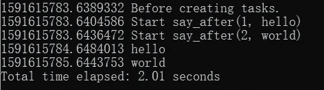

# 不对称不是平行

> 原文：<https://towardsdatascience.com/asyncio-is-not-parallelism-70bfed470489?source=collection_archive---------14----------------------->

## 你可能听说过 Python [asyncio](https://docs.python.org/3/library/asyncio.html) 是并发的，但不是并行编程。但是怎么做呢？我用简单的例子解释一下。


让我们从一个完美的并发例子#1 开始。

异步函数 say_after 是 Python 官方文档中的一个例子。它在休眠“延迟”秒后打印出“什么”。

在 main 函数中，我们创建了 say_after 的两个任务，一个在 1 秒后说‘hello’，另一个在 2 秒后说‘world’。运行它，我们看到它总共用了 2 秒钟，因为两个任务同时运行。完美！



主功能没有延迟

但是它们平行吗？让我们用更多的例子来理解并发性和并行性之间的区别。

示例 2:

我们将主函数替换如下。

如您所见，我们在创建任务后添加了一个 print 来检查任务是否在创建后立即启动，并在 main 函数中添加了一个 0.5 秒后的异步 sleep。注意 main 本身就是一个任务([协程](https://docs.python.org/3/library/asyncio-task.html#coroutine)确切地说)。

以下是输出:


主模式下异步睡眠 0.5s

第一，总共还是 2 秒，没有变化。它同时运行主任务和另外两个 say_after 任务。主服务器中的异步睡眠没有阻塞。

第二，“延迟前—创建任务后”在开始 say_after 任务前打印。是啊！创建的任务在创建后并不立即开始，而是由**安排**在所谓的[事件循环](https://docs.python.org/3/library/asyncio-eventloop.html)中运行。它们仅在主任务等待时启动，即本例中的`await asyncio.sleep(0.5)`。根据我的理解，你不能控制任务的执行顺序，即优先级。

例 3:

主模式下阻止睡眠 0.5

在这个例子中，我们用 time.sleep 替换了 asyncio.sleep，time . sleep 等待 main 中的阻塞，并查看 say_after 任务何时开始。


看到总数现在是 2.5 秒。task1 在创建后 0.5 秒开始。很明显，任务不是并行的，即同时执行。

实施例 4:

你可能会争论应该用 asyncio.sleep 代替 time.sleep 用 asyncio 编程。主要任务正在做某事并导致延迟，这是怎么回事？

干线环路延迟 1 秒

在这个例子中，我们用一个循环替换 time.sleep，在主任务中增加大约 1 秒的延迟。


你可以看到我们得到了相似的结果。say_after 任务延迟开始，总时间变为 3 秒。

例 5:

如果一项任务开始了，它能保证在预期的时间内结束吗？不要！
下面我们来看看这个例子。

time.sleep 主模式 3s

我们在第 7 行中使用 asyncio.sleep(0.1)来允许 task1 和 task2 启动，但是在第 8 行中添加 time.sleep(3)来阻止 3 秒钟。
以下是输出:


您可以在第 3 行和第 4 行看到两个任务都立即开始，但不是在预期的 1 秒或 2 秒后“说”，而是在 3 秒后“说”(结束)。

原因是当 say_after 等待 1 / 2 秒时，事件循环返回到主任务并在那里阻塞 3 秒钟，然后才能返回到 say_after 任务继续。

你可以在这里找到完整的演示文件。

# 结论

Asynicio 尽最大努力做到并发，但它不是并行的。

您无法控制任务的开始和结束。

如果您在任务创建后立即等待任务，您可以控制启动，如下所示，但是它变成了同步编程，这对于异步目的没有意义。请注意，即使这不是 100%的保证，并认为自己。

```
task1 = asyncio.create_task(say_after(1, ‘hello’))
await task1
```

因此，如果你正在开发一个对时间敏感的应用程序，避免使用 asyncio(广义上的协程事件循环)。这种限制的原因是事件循环只使用一个线程来调度多个任务。

# 供选择的

那么并行的解决方案是什么呢？[穿线](https://docs.python.org/3/library/threading.html)。

这是示例 5 的等效代码，它在主函数中有 3 秒钟的睡眠阻塞。

输出如下所示。


3 秒延迟的线程输出

看到 task1 和 task2 都立即开始，并在预期的 1 秒和 2 秒内结束。

您也可以使用[多处理](https://docs.python.org/3.7/library/multiprocessing.html)来利用多个 CPU 内核。

最后，我并不是说您不应该使用事件循环，它在处理网络流量时非常有用。但这取决于你的需要。

[Linkedin](https://www.linkedin.com/in/xiejiping/)