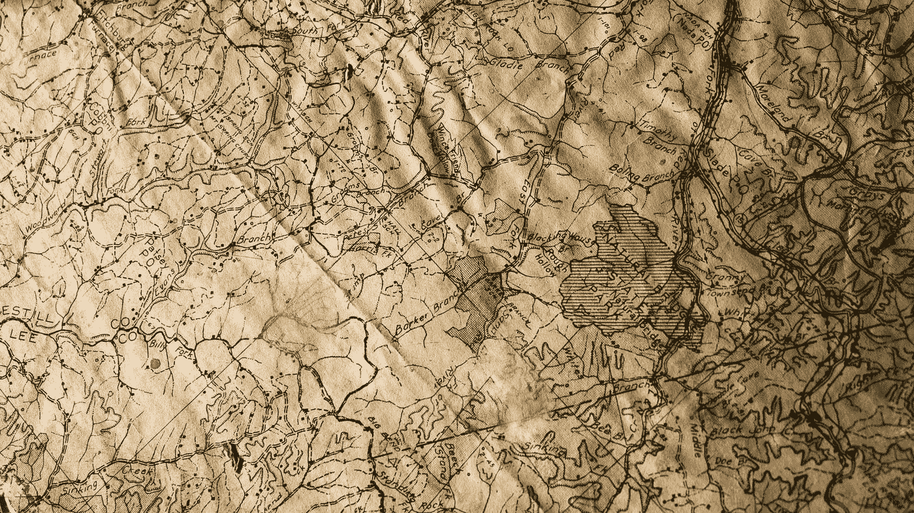
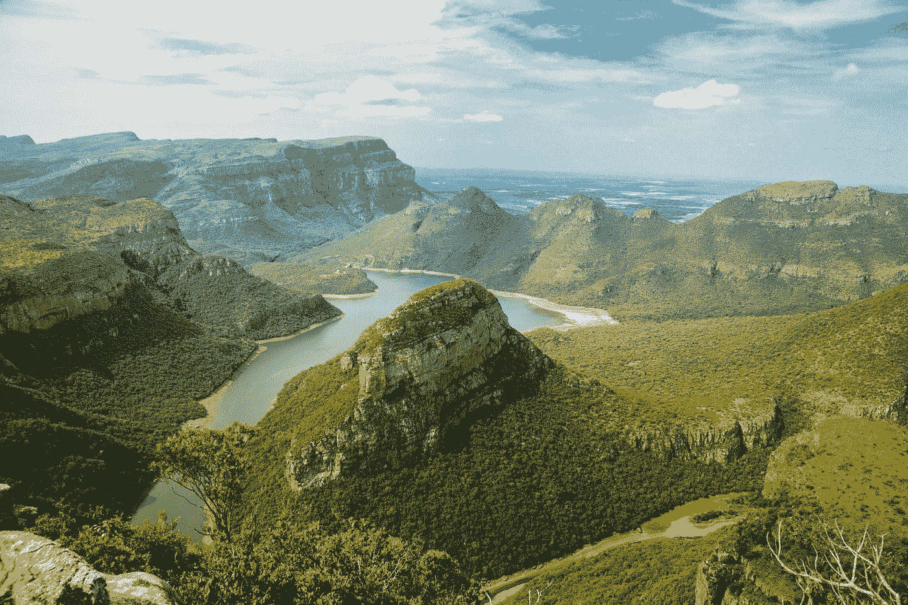

# 在地理和数据科学的交叉点上

> 原文：<https://towardsdatascience.com/at-the-intersection-of-geography-data-science-5cd065e7bf22?source=collection_archive---------35----------------------->

## 地理正在卷土重来，这要归功于数据科学

安妮·斯普拉特在 [Unsplash](https://unsplash.com?utm_source=medium&utm_medium=referral) 上的照片

# 地理，就像地图之类的东西，对吧？

如果你在成长过程中学习地理的经历和我一样，那么你也可以说出(几乎)所有 50 个州及其相应的首府。也许如果你不是美国人，你可以说出你国家的不同省份及其首府，甚至更多。让我们为此给自己一点鼓励吧！当我告诉你我决定主修“命名美国首都”这个领域，也就是更广为人知的“地理学”时，你可能不会感到震惊，我得到的是许多茫然的目光。据我所知，大多数美国人对你仍然可以在大学主修地理感到惊讶。相信我，我也是！我不认为我们需要更多的地图，或者美国的首都。

在大学的最后一个季度，我接触到了地理信息系统(GIS)，有些人可能会称之为现代制图。由于没有留下来学习 GIS 和支付更多学费的愿望，我毕业时错过了可能是我在地理学位中唯一可以获得的硬技能的机会。五年后，我进入了更广阔的数据科学领域，并结合 Python 的新知识，重新学习了 GIS 的奇迹和威力。事情是这样的，在我看来，地图永远不会无趣(好的地图，那是)。

# GIS 的现代进步

现在是 2005 年，而“世界上只有 15%的地区被绘制到了地理编码的详细程度”( [Lalitesh Katragadda，TEDIndia 2009](https://www.ted.com/talks/lalitesh_katragadda_making_maps_to_fight_disaster_build_economies/transcript) )。这还不包括海洋或海底测绘，如果我需要提醒你的话，它们占地球表面的 71%。因此，只有 29%的地球表面中的 15%被精确地绘制到那个点上。跳到 2020 年的今天，谷歌声称已经绘制了地球上 98%的地图。谷歌的街景在 2007 年才开始，所以在很短的时间内涵盖了大量的文字内容。这些进步是天文数字，也许超过了摩尔定律的速度。

> *“绘制世界地图是不可能的——我们选择并制作图形，以便我们能够理解它”——罗杰·汤姆林森，1981 年的一份议程笔记*

但是，对于所有这些不断积累的结构化和非结构化地理空间数据，您能做些什么呢？我们用这些数据在做什么？可能性令人眼花缭乱，当然，正如任何强大的工具一样，[伦理在谁有权使用它以及如何使用它方面发挥着重要作用](https://www.technologyreview.com/2005/06/01/101244/do-maps-have-morals/)(本文触及了 GIS 的一些黑暗起源和军国主义目的)。自 20 世纪 60 年代 GIS 首次出现以来，世界各地的机器学习和人工智能工程师已经将地图绘制技术提升到了新的高度。

照片由[尼克·舒利亚欣](https://unsplash.com/@tjump?utm_source=medium&utm_medium=referral)在 [Unsplash](https://unsplash.com?utm_source=medium&utm_medium=referral) 上拍摄

地图不仅帮助我们导航，以最有效的方式把我们从 A 点带到 B 点。但是，随着我们今天拥有的数据量的增加，地图正在我们这个时代一些最前沿和最具创新性的项目中得到应用。这让我既兴奋又紧张。如果您有兴趣了解更多的历史和现代进步，请查看这个很酷的交互式 GIS 时间轴。

# 我兴奋什么？

## 应对气候变化

我们中的许多人都熟悉我们看到的世界各地海平面上升的地图，以及由于极地冰盖的快速融化而将遭受苦难的沿海城市和岛国。当然，理解和应对气候变化的最佳方式是能够[看到我们的世界是如何变化的](https://gisgeography.com/climate-change-effects-maps/)。我们必须能够看到我们面对的是什么。

在加利福尼亚，数据科学家和工程师已经使用卫星图像探测地球表面的热量，为公众提供几乎实时更新的西海岸野火地图。

## 公共卫生

即使作为一名大学地理专业的学生，我个人也从未像在过去 9 个月的全球疫情生活中那样对地图如此着迷。每周我都会看一张世界地图，看看这个世界在做什么。几乎每天我都在看纽约市的地图，看看这个城市的哪些区域是新指定的热点。人们依赖这种地图，不仅是为了去上班，也是为了安全地生活。

初创公司 Zzapp Malaria 正试图利用 GIS 技术，通过众包和测绘需要处理蚊子的水源，来帮助根除非洲的疟疾。对于非洲大陆的一个重大健康问题，这是一个令人难以置信的技术解决方案。

[丽娜·洛斯](https://unsplash.com/@linaloos?utm_source=medium&utm_medium=referral)在 [Unsplash](https://unsplash.com?utm_source=medium&utm_medium=referral) 上的照片

## 更加

与任何数据可视化一样，它需要讲述一个故事，否则人们不会连接。幸运的是，地图是很好的讲述故事的工具，因为它们可以帮助我们了解背景。地图很特别，因为它们有助于我们了解彼此以及我们周围世界的关系。随着现代数据采集和地理信息系统技术的发展，地图的局限性和它们能教给我们的东西正在不断减少。地理空间数据技术已经帮助创新了一切餐厅定位(Yelp)和汽车服务(优步)，从而改善了像伊斯坦堡这样的城市的地震后管理。

# 我紧张什么？

## 监视…差不多就是这样

监视是最重要的。我们许多人每天都在口袋里装着 GPS 追踪器，这绝对是一个黑色幽默的反乌托邦笑话。我将第一个承认，尽管我“只允许在使用应用程序时进行位置跟踪”，但我也不是最警惕关闭这些应用程序的人……尽管任何心怀不轨的人都可能将最良性的工具变成大规模杀伤性武器，但我们不要忘记意想不到的后果(比如一个肤浅的外观评级应用程序，有一天会摧毁民主的结构)。人们希望，像特里斯坦·哈里斯(Tristan Harris)和硅谷良心中的其他人这样的告密者将继续为人道主义价值观大声疾呼，因为这片土地的法律不可避免地跟不上技术进步的步伐。

# 兴奋起来，保持警惕

地理和数据科学的进步以及两者的融合令人兴奋不已。我希望你已经知道地理不仅仅是知道东西在哪里，以及说出各州首府的名字。当然你已经知道了，我只是需要提醒自己地理仍然很酷。