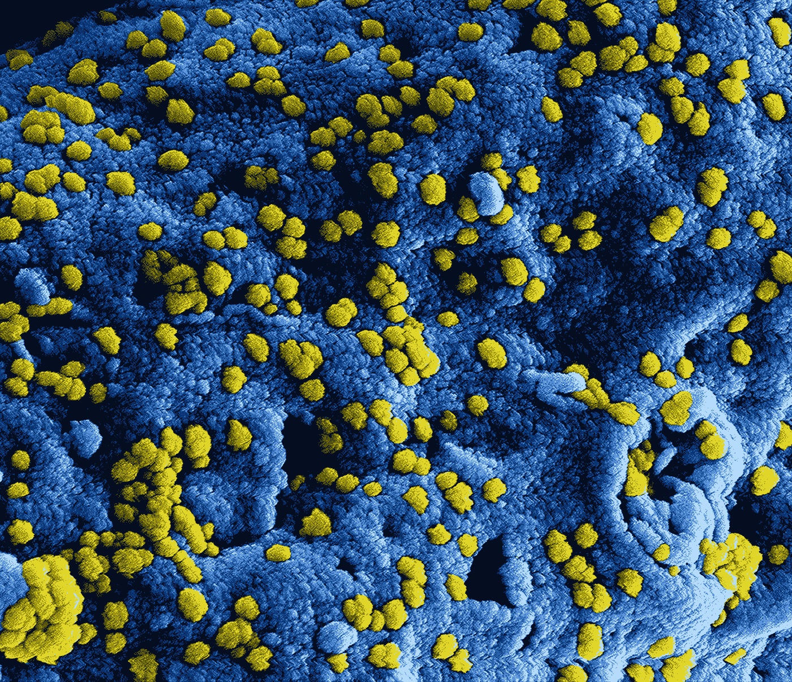
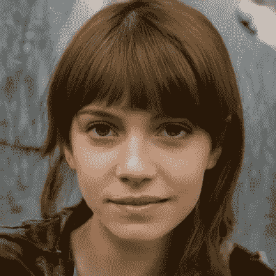
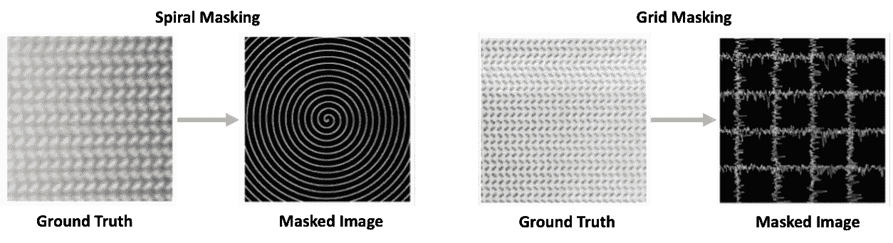
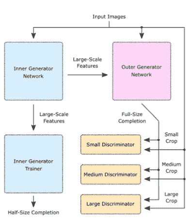
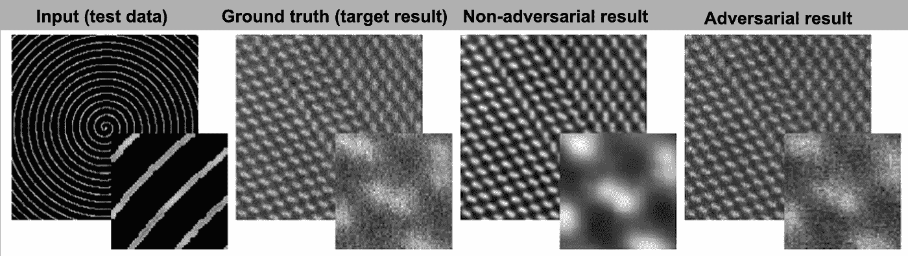
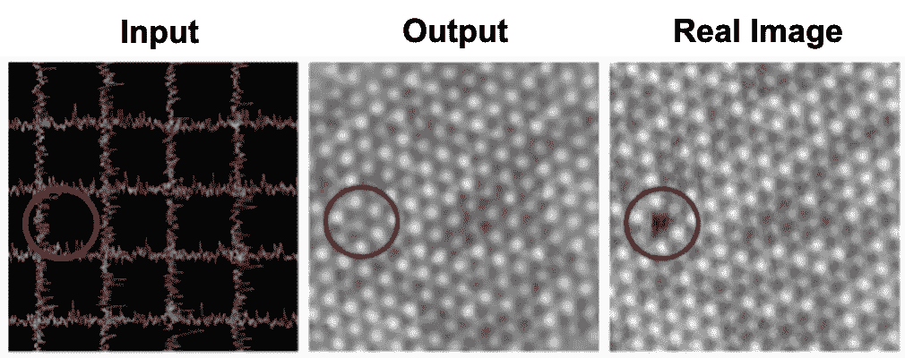

# 原子级深度学习

> 原文：<https://towardsdatascience.com/atomic-scale-deep-learning-34238feda632?source=collection_archive---------63----------------------->

# ML 能预测我们看不到的东西吗？

我通过总结激动人心的新研究论文来探索人工智能对传统科学的影响。在这篇文章里我在看一篇很棒的新论文:*【部分扫描透射电镜与深度学习】(* [*科学报道，* **10** ，8332，2020](https://www.nature.com/articles/s41598-020-65261-0) )。

**1|用电子我们能看到什么？**

如果我想要一个物体的图像，我可以用我的相机拍照。相机快速记录可见光与物体相互作用的快照。这对于大多数日常情况来说非常有效，但当试图创建非常小的对象(如微生物、细胞、纳米材料和晶体)的图像时，就会出现问题。这些物体非常小，小于可见光的波长，所以我们看不见它们。在这些情况下，可以使用一种更有效的成像技术:电子显微镜(EM)。EM 不是记录低能量可见光如何与物体相互作用，而是发射一束高能电子束到样本上并记录这种相互作用。电子束的波长很短，甚至可以分辨非常小的特征，最好的显微镜可以达到原子级的分辨率——它们可以让我们看到原子！有许多不同类型的 EM，它们被用于无数的科学领域，从新材料开发到生物科学。

看看这张细胞(蓝色)表面的病毒颗粒(黄色)的惊人照片，它是通过扫描电镜收集的。

这张彩色扫描电镜照片显示了蓝色细胞表面的黄色病毒颗粒(MERS-CoV)。[unsplash.com](https://unsplash.com)

尽管这些技术已经彻底改变了科学的许多方面(2017 年[诺贝尔化学奖](https://www.nobelprize.org/prizes/chemistry/2017/press-release/)被授予冷冻电子显微镜),但它也有很多问题。电磁机器由电子枪和加速器、强大的真空系统和电磁透镜组成。它们并不便宜，而且获得它们的机会非常有限。此外，成像过程不是瞬间的；对于扫描 EM 技术，聚焦的电子束必须在样品表面的每一个微小部分上移动，并将结果整理以生成完整的图像。这降低了图像收集和研究的速度。最重要的是，这些超高能电子束会破坏敏感材料，妨碍高质量成像。

**2|这跟机器学习有什么关系？**

最近，在使用 ML 人工生成真实感图像方面有了真正令人兴奋的进展；神经网络现在可以填补照片中缺失的部分，甚至可以重新制作旧的低分辨率电脑游戏。下面的图片不是真人的照片，它是由人类肖像数据库中训练的神经网络创建的。

人脸的人工图像是由一个经过人体画像训练的模特生成的。公共领域图像。

如果我们不必扫描整个样品表面来生成 EM 图像会怎么样？如果我们可以快速扫描样本的一部分(产生部分扫描)，并使用这些深度学习技术准确填充空白，会怎么样？

这些是 Jeffrey Ede 和 Richard Beanland 在他们的[论文](https://www.nature.com/articles/s41598-020-65261-0)*部分扫描透射电子显微镜与深度学习中提出的问题。*减少电子束扫描可以彻底改变 EM 成像，加快数据收集，甚至可以研究非常精细的材料。他们训练深度学习模型来完成部分 STEM(扫描透射 EM)图像，并获得了一些非常酷的结果。

**4|数据，数据，数据…**

每个 ML 工程师都知道数据收集和处理将决定一个项目的成败。你需要大量数据来训练一个神经网络。在这种情况下，作者整理了来自许多科学家工作的 16，000 幅高质量 STEM 图像的数据集。这个数据集非常多样化，包括不同材料的图像，放大到原子尺度。通过将每个 EM 图像裁剪成更小的子图像，并通过翻转和旋转来随机增加它们，训练数据的量进一步增加。

那么，如何将大量完整的 EM 图像(地面真实数据)转换成部分扫描呢？训练数据是通过将每个图像乘以一个二进制掩码得到的:乘以 1 保留像素值(一个“扫描”区域)，而乘以 0 删除该像素值(一个未扫描图像的“空白”区域)。

因为 EMs 不以这种方式扫描，所以研究了不同的屏蔽程序。网格和螺旋扫描提供了图像表面的均匀覆盖，扫描路径之间的间隔甚至可以调整，以改变原始图像被掩盖的程度。

演示通过应用二元蒙版生成的原始 STEM 图像和人工螺旋/网格图案。在[知识共享许可](https://creativecommons.org/licenses/by/4.0/)下，经[原文](https://www.nature.com/articles/s41598-020-65261-0)许可修改。

接下来，生成式对抗网络(GAN)被训练来填充这些部分扫描的掩蔽区域。

**5|什么是甘？**

2014 年，Ian Goodfellow 和他的同事[报道了这类 ML 模型](https://arxiv.org/pdf/1406.2661.pdf)。让 GANs 真正酷的是，他们有两个截然不同的神经网络，相互竞争。“生成式”网络产生尽可能接近真实情况的虚拟数据点；在这种情况下，从部分扫描创建完整的图像。第二个“辨别”网络被训练来区分地面真实和生成的图像。随着两个网络的竞争和学习，发生器产生的图像与地面真相难以区分，而鉴别器在识别它们方面有所提高。这些令人惊叹的甘在图像生成方面取得了非常酷的突破，比如[完成了照片的缺失部分](https://arxiv.org/pdf/1803.07422.pdf)，甚至[改进了天文图像](https://arxiv.org/pdf/1702.00403.pdf)。

本文中使用的 GAN 比传统系统稍微复杂一些。首先，有一个多级生成器:由内部生成器生成的大规模图像特征被外部生成器增强，以生成完整的图像。这些生成的图像然后以两种方式用于学习。如果传递到训练者网络，通过与地面真实图像的比较计算均方误差，并用作即时反馈度量。这是非对抗性训练。或者，鉴别者观察不同大小的随机作物来预测图像是真实的还是生成的。这就是对抗性训练。

用于完成 STEM 图像的 GAN 的简化方案。在[知识共享许可](https://creativecommons.org/licenses/by/4.0/)下，经[原文](https://www.nature.com/articles/s41598-020-65261-0)许可复制。

结果如何？

通过训练这个 GAN 系统，取得了一些非常惊人的结果。看看下面的图像:使用只有 1/20 像素覆盖率的螺旋扫描，图像几乎与原始数据完全相同。与非对抗性系统优化的图像相比，使用对抗性学习方法制作的图像看起来更真实且不那么模糊。

比较掩蔽训练数据、地面真实茎图像和由 GAN 的非对抗性和对抗性训练的输入制成的人工图像。根据[知识共享许可](https://creativecommons.org/licenses/by/4.0/)经[原文](https://www.nature.com/articles/s41598-020-65261-0)许可修改。

扫描模式的类型对测试误差有影响:螺旋扫描产生的非对抗性图像比网格扫描产生的误差低。这是因为误差随着离扫描路径距离的增加而系统地增加。这有道理；在信息输入最少的地方，需要更多的推断。所以螺旋更好，因为它们间隔更小。

7|一些需要考虑的事情

没有完美的结果，我想指出几个问题:

1.  目前的电子显微镜无法实现用于制作部分图像的螺旋和网格状扫描系统，因此必须开发其他扫描路径。
2.  最小化误差的最佳扫描路径不是固定的模式，而是对每个样本都是唯一的。作者说，他们正在研究一个动态扫描系统，它会根据输入自动改变，这真是一个令人兴奋的想法！
3.  该模型在预测可预测的结果方面做得很好，但它不能创建意外的数据。看看下面的图片，它显示了真实图像中缺失的原子缺陷。因为它位于扫描路径之间，所以 GAN 没有预测到缺陷。不幸的是，观察缺陷和意想不到的结果是电子显微镜最有趣的应用之一，这突出了这种部分扫描技术的一个关键缺陷；我们可能会错过有趣的结果。
4.  这项新技术的表现一直优于之前报道的系统:[深度学习超采样扫描透射电子显微镜](https://arxiv.org/pdf/1910.10467.pdf)。作者说，这是因为他们直到验证和训练损失分散后才进行训练，他们预计他们的系统会随着更多的计算而变得更好。也许…但是我们不能确定，所以一定要记住这一点。

地面真实图像(包含缺陷)与未预测缺陷的发生器输出的比较。在[知识共享许可](https://creativecommons.org/licenses/by/4.0/)下，经[原创论文](https://www.nature.com/articles/s41598-020-65261-0)许可修改。

**7|最终想法**

总的来说，这篇论文非常值得一读，它展示了部分 STEM 技术是如何将电子轰击减少 10-100 倍的。从部分扫描生成的完整图像显示只有 3-6%的误差，考虑到 STEM 本身是一种噪声技术，这已经是相当不错的了。这对于那些在有限时间内接触电磁设备的科学家以及那些研究电子敏感材料的人来说，可能真的很有帮助。

如果你喜欢这篇总结，我鼓励你阅读[原文](https://www.nature.com/articles/s41598-020-65261-0)以获得更深入的结果！