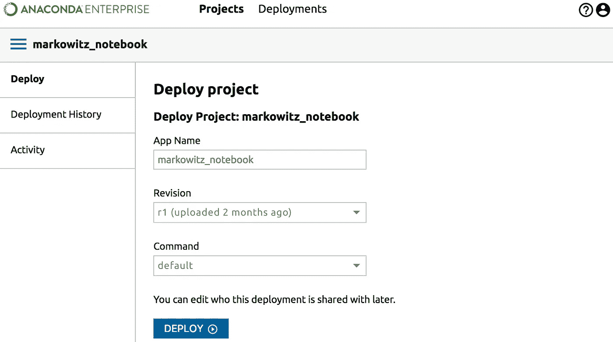
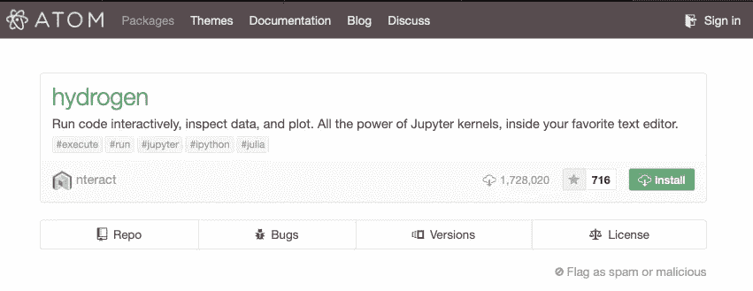
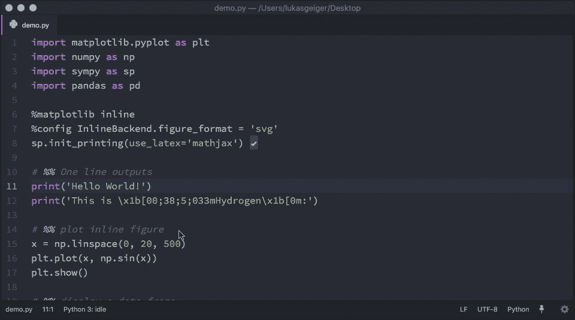
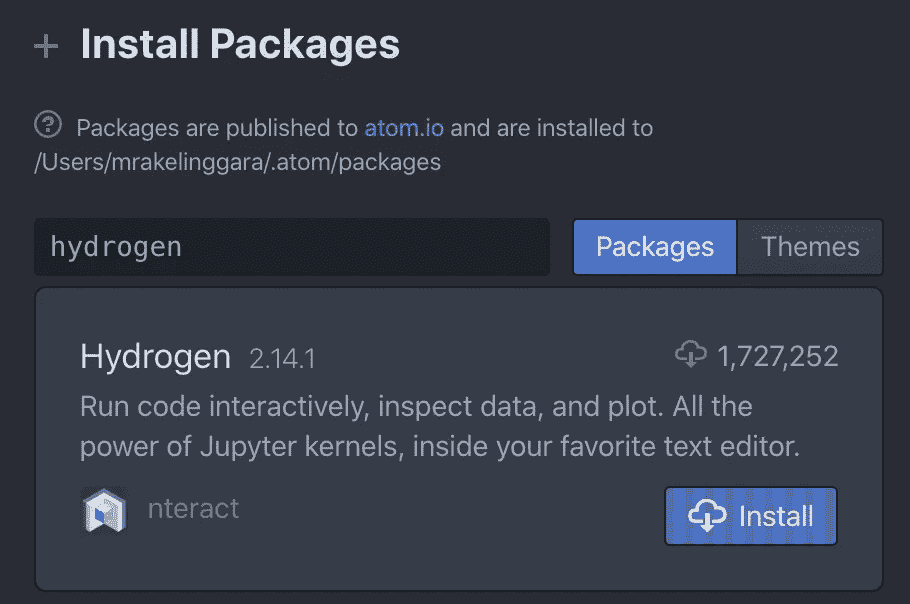
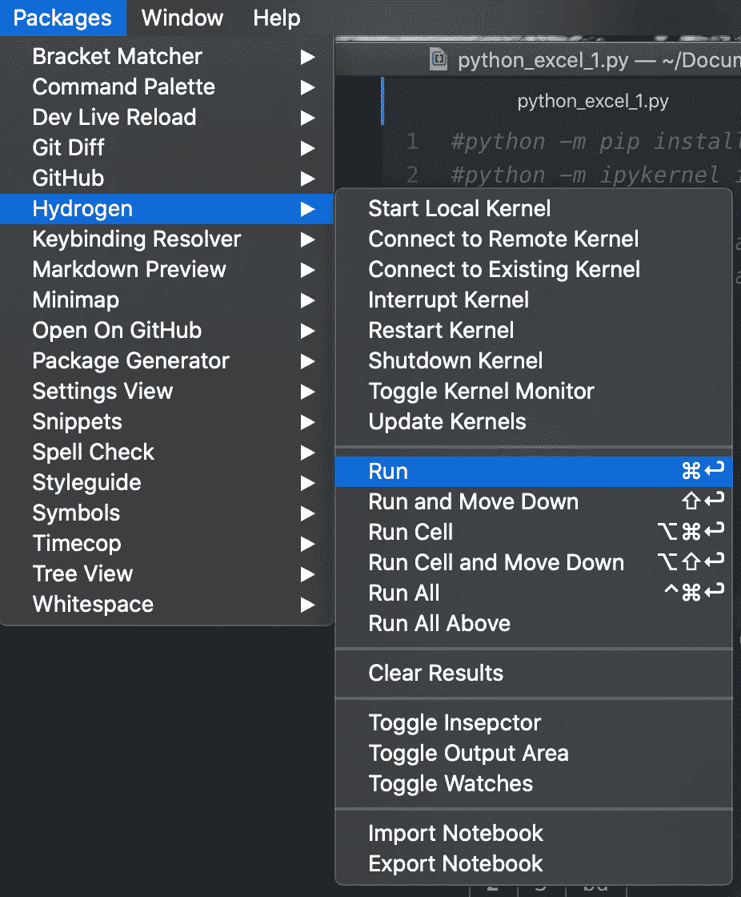
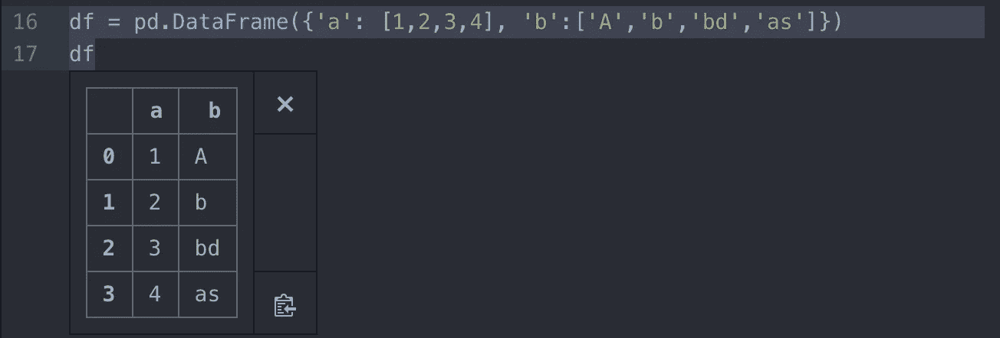

# 用 Python 编写数据科学项目的 Atom 之氢

> 原文：<https://towardsdatascience.com/atoms-hydrogen-for-writing-data-science-projects-using-python-46b6507fcdf7?source=collection_archive---------13----------------------->


萨法尔·萨法罗夫在 [Unsplash](https://unsplash.com?utm_source=medium&utm_medium=referral) 上拍摄的照片

每当我想写 Python 代码时，不管是为了测试还是部署，我都会打开 Jupyter Notebook 开始写。为什么不呢，对吗？它是免费的、开源的，每个人似乎都喜欢它(例如)。

如果您的公司想在他们的生产环境中部署您的代码，您可以使用 [Anaconda Enterprise](https://enterprise-docs.anaconda.com/en/docs-site-5.0.2/user-guide/tutorials/deploy-notebook-project.html) 来完成。



在 Anaconda 企业中部署 Jupyter 笔记本电脑

但是，如果您需要在您的项目中编写 Python 模块，那么在 Jupyter 中编写和测试模块，将其保存为 Python 文件，然后将其包含在您的主 Jupyter 笔记本中等等，这可能并不理想。

另外，部署 Anaconda Enterprise 的缺点是什么？嗯……


Anaconda 企业成本的谷歌结果

这就是我寻找替代工具的原因。它可以省去编写产品模块化代码的麻烦，但我仍然可以一行一行地运行代码，还可以内联显示数据和变量。

原子氢包来了！！！



氢是什么？

就像官方文件中的标语所说的

> Jupyter 内核的所有功能，在您最喜爱的文本编辑器中。

到目前为止，这是真的，我喜欢我的 MacOS 10.15。它可以将您的 Atom 文本编辑器变成一个类似 Jupyter 的笔记本！另外，Atom 是一个轻量级的文本编辑器，提供了大量的包，使它成为一个非常棒的代码编辑器。



来源:氢官方页面

这篇文章将向你介绍我在安装 **MacOS 10.15** 过程中遇到的问题的步骤和解决方法。

# 1.安装 Atom

当然，这是一个非常容易做到的步骤。直接去 [https://atom.io](https://atom.io) 下载最新版本的 atom。下载完成后，只需将应用程序文件复制并粘贴到您的应用程序文件夹中。

“那就双击打开吧？”—嗯，也不尽然。

许多 Mac 用户，包括我自己，发现我们无法打开编辑器，并收到了这样的消息。

> “Atom 2”打不开，因为苹果无法对其进行恶意软件检查。这个软件需要更新。有关详细信息，请联系开发人员。

但是不用担心。

只需**右键点击应用文件，然后点击“打开”。**

# 2.安装氢气包

点击 ***原子>偏好>安装>氢型*T5**点击安装**。**



安装氢气包

一旦完成，您将需要安装 Python 的内核，否则，Hydrogen 将无法工作。打开你的终端，输入下面的代码。

```
python -m pip install ipykernel
python -m ipykernel install --user
```

这将安装 IPykernel，这是 Python 的一个内核，这样 Hydrogen 就可以像 Jupyter 那样让 Atom 执行 Python 代码。

一旦完成，重启 Atom，您将能够逐行运行您的代码，甚至显示您的`pandas`数据框和您通常在 Jupyter 中制作的其他视觉效果。要查看命令快捷键，你可以在 ***包>氢*** 上查看，在那里你会找到你可以使用的快捷键列表。你会发现它们和朱庇特的很相似。



氢捷径

要仅运行选定的代码行，只需选择要执行的代码行，然后按下**运行**快捷键。



太棒了，对吧？

要了解氢的全部功能，你可以在官方页面上查看。

## 加号—自动完成

最后，如果没有自动完成功能，它就不是一个编辑器。

Hydrogen 已经提供了自动完成功能，但是当我尝试的时候，几个变量或者内置的 Python 函数都没有显示出来。因此，我建议您添加`autocomplete-python`包。

点击 ***原子>首选项>安装>类型【自动完成-python】***。然后单击安装。

如果你在自动完成基本的 Python 关键字和变量时发现了一些麻烦，可能是语法文件复制不正确。要修复它，您可以在您的终端中尝试下面的代码。

```
cd ~/.atom/packages/autocomplete-python/lib/jedi/parser
cp grammar3.6.txt grammar3.7.txt
```

# 最后的话

希望这篇帖子是有用的，并且每个人都有更好的时间来编写复杂的模块化机器学习、数据预处理或数据分析代码。尤其是在新冠肺炎·疫情造成的困难时期。