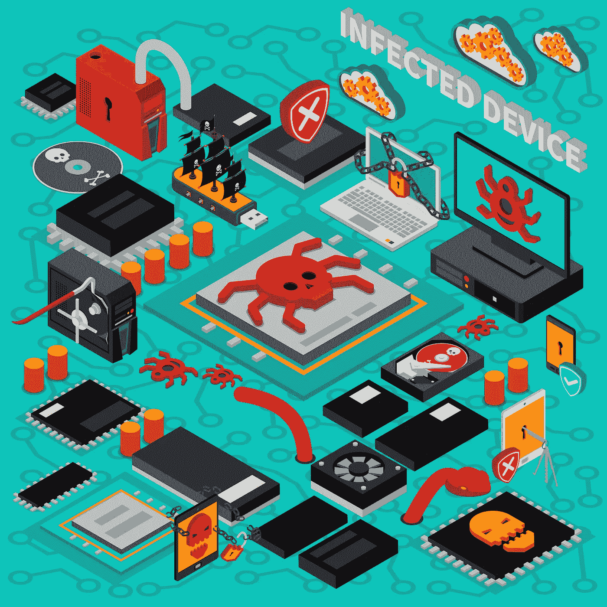

# 攻击模式检测和预测

> 原文：<https://towardsdatascience.com/attack-pattern-detection-and-prediction-108fc3d47f03?source=collection_archive---------50----------------------->

## 网络对手在努力避免检测方面变得越来越复杂，许多现代恶意软件工具已经采用了绕过防病毒和其他威胁检测措施的新方法。

由于网络和组织使用复杂的方法来检测和响应攻击，这种响应可能会非常强烈，以至于犯罪分子会尝试使用更强的方法来响应。网络犯罪分子的复杂性不断增加，加上人工智能(AI)攻击的潜力不断扩大。

然而，网络安全正处于关键时刻，该领域必须将未来的研究重点放在能够预测关键情景和结果的网络攻击预测系统上，而不是依赖防御解决方案和专注于缓解。世界各地的计算机系统需要基于对网络威胁的全面预测分析的系统。

人工智能(AI)在很大程度上依赖于机器学习(ML)，它有能力识别从过去的经验中产生的模式，并基于这些模式做出预测。近年来，可以使用机器学习和人工智能等东西来攻击网络和设备的群技术显示出了新的潜力。

通过理解行为模式，分析恶意活动之间的模式和联系，预测未来的行动，并最终防止或检测潜在的恶意行为，可以定义有用的攻击模式。

上述网络威胁预测系统提供了有希望和有限的可能性，但大规模协调攻击需要在几个方面取得进展，包括检测和预测计算机系统中产生的事件。混淆技术用于通过故意使恶意代码难以理解来绕过检测，以便绕过网络的检测。

在评估网络安全风险时，必须考虑黑客的行为，考虑到已知漏洞的数量和攻击者渗透网络的选择，这可能是一项艰巨的任务。

在最近进行的一项特定研究中，数据被输入到两种深度学习技术中，这两种技术使用序列数据来描述网络攻击。他们还整合了基于信息论的分歧措施，以生成和完善对计算机和网络的假想攻击。

另一项由 NSF(国家科学基金会)资助的研究旨在基于网络罪犯的最新犯罪学理论模拟网络攻击场景。ASSERT/CASCADES 项目随着我们对不断发展的网络恐怖主义技术的了解而不断发展。该项目能够使用网络上发生的可观察到的恶意活动来预测即将到来的攻击。预计将有可能制定策略来区分正在进行的恶意活动，并在这些事件发生之前应对即将到来的关键威胁。

NEPAR 是另一个关于攻击模式识别的项目，用于提取美国和世界各地超过 150 万次网络攻击的模式数据。他们从公共和私人来源获取数据，发现并使用每次攻击中使用的特征和模式。这预测了对特定系统(例如计算机系统或网络)的攻击的可能性，并预测了对这些特定系统的成功攻击的可能性。

一些组织已经开始使用 MITRE 框架对攻击进行统计分析，以进行战术排序。蓝队防守游戏手册用于根据红队的对手游戏手册预测战术和绘制具体威胁，红队的对手游戏手册是根据收集的数据创建和更新的，并由该组织的数据收集和分析工具进行分析，如开源威胁评估工具包(OSTAT)。然后可以开发防御行动手册来创建反应日志，以使用网络指纹识别攻击。

将这两者结合起来，可以让 SOC(安全运营中心)安全团队准确了解网络钓鱼攻击的情况，以及如何在员工上当之前向他们发出警报。当对手突破网络时，可以借助红队防守游戏本识别攻击策略。

在一个懒惰的安全环境中，预测下一次攻击是领先一步应对与成功的电子邮件安全事件相关的中断的唯一方法。识别组织漏洞所在的异常和模式以及攻击者下一步可能攻击的位置是一种积极主动的方法。那些因为昨天的袭击而试图识别身份的人仍然处于更大的风险中。

据信，安全研究人员可以使用攻击模式识别或检测方法作为一种可以提供预防措施来防止未来攻击的方法。

**引用来源**

*   [https://research features . com/2018/07/09/网络安全-威胁-我们能预测他们吗/](https://researchfeatures.com/2018/07/09/cybersecurity-threats-can-we-predict-them/)
*   [https://gcn . com/blogs/emerging-tech/2017/03/analyzing-terrorist-patterns . aspx](https://gcn.com/blogs/emerging-tech/2017/03/analyzing-terrorist-patterns.aspx)
*   [https://www . informationsecuritybuzz . com/articles/why-prediction-and-not-detection-is-the-key to-reducing-email-risk/](https://www.informationsecuritybuzz.com/articles/why-prediction-and-not-detection-is-the-key-to-reducing-email-risk/)
*   [https://www . science daily . com/releases/2017/03/170302115740 . htm](https://www.sciencedaily.com/releases/2017/03/170302115740.htm)
*   [https://threat post . com/combining-ai-playbooks-predict-cyber attacks/151367/](https://threatpost.com/combining-ai-playbooks-predict-cyberattacks/151367/)