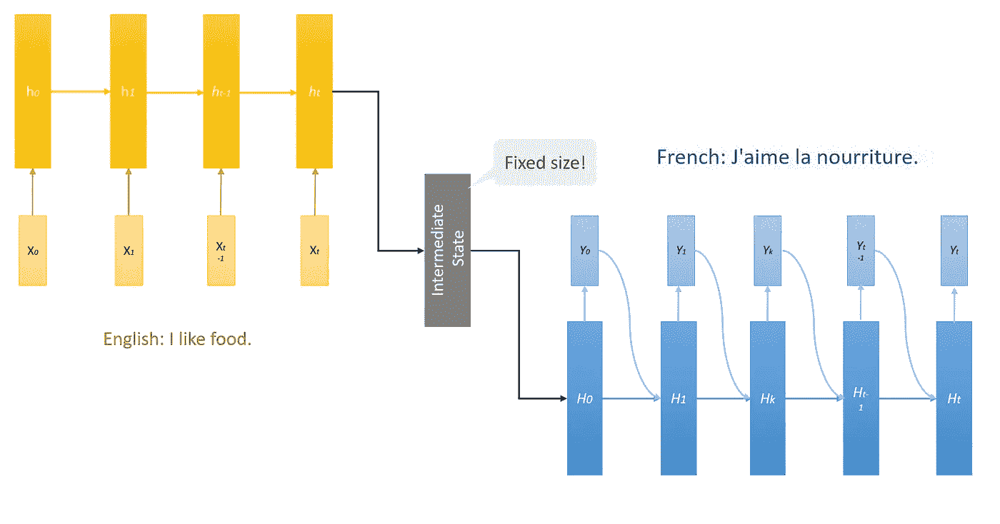
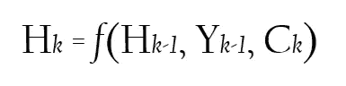
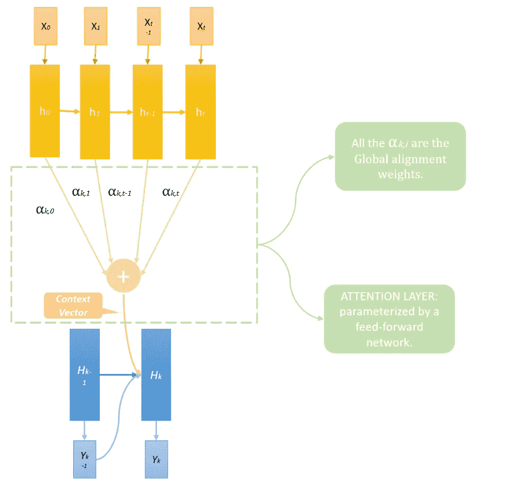
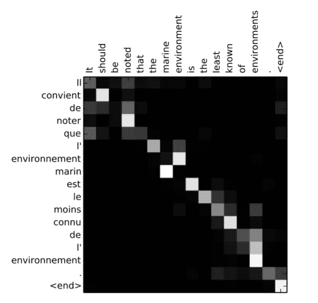
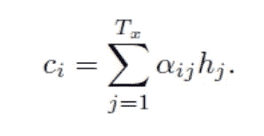
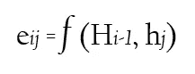
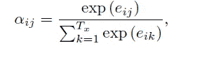
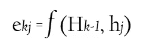

# 理解深度学习中的注意力

> 原文：<https://towardsdatascience.com/attaining-attention-in-deep-learning-a712f93bdb1e?source=collection_archive---------1----------------------->

## 一点点关注怎么改变了 AI 游戏！


在 [Unsplash](https://unsplash.com?utm_source=medium&utm_medium=referral) 上由[哈尼恩·克里姆利](https://unsplash.com/@haneenkrimly?utm_source=medium&utm_medium=referral)拍摄的照片

在我之前的一篇[文章](https://medium.com/analytics-vidhya/the-price-of-free-d662016a5229?source=friends_link&sk=924bc170af02df5b9c38b6e99965a136)中，我谈到了注意力是我们人类拥有的最重要的资产之一。我们选择如何度过时间，以及在这段时间里我们选择关注什么，几乎决定了我们所有努力的结果。

在这篇文章中，我们将讨论我们如何给一个 ML 模型聚焦的能力，以及它对其性能的影响。

# 为什么模特需要被关注

让我们回顾一下一项任务——在许多 NLP 模型中普遍解决的任务——翻译。在大多数情况下，逐字翻译是行不通的，因为大多数语言没有共同的句子结构。一个简单的例子:

```
English => French
red => rouge
dress => robe
“*red dress*” => “*robe rouge*”
Notice how red is before dress in English but rouge is after robe.
```

NLP 模型通常处理此类任务的方式是，在中间状态下捕获输入句子中的所有信息——对象的细节，对象如何相互关联——然后使用此中间信息，并在输出语言中表达出来。在我们开始解码输出序列之前，用于该中间状态(即捕获来自输入序列的所有信息的状态)的向量的大小是固定的。



NLP 模型如何从输入序列转换到输出序列。输入序列和编码器型号以黄色显示，而输出序列和解码器型号以蓝色显示。**注意，编码器模型中的 t 与解码器模型中的 t 无关，仅用于表示每个模型中的下一个时间步长。**

中间状态在整个过程中起着至关重要的作用。它记住输入句子中传递的所有信息的能力对解码输出的质量至关重要。无论是翻译还是 QnA 任务，其中输入是一个问题和一个段落，模型需要基于该段落或任何其他序列到序列建模操作来预测该问题的答案，中间状态仍然是难题中最关键的部分。

> 这是最好的时代，这是最坏的时代，这是智慧的时代，这是愚蠢的时代，这是信仰的时代，这是怀疑的时代，这是光明的季节，这是黑暗的季节，这是希望的春天，这是绝望的冬天，我们面前什么都有，我们面前什么都没有，我们都将直奔天堂， 我们都在朝着另一个方向前进——简而言之，那个时代与现在的时代如此相似，以至于它的一些最喧闹的权威人士坚持认为，无论是好是坏，它只是在最高级的比较中被接受。
> 
> ——双城记，查尔斯·狄更斯。

现在我要求你们在从左到右看一遍后，记住这个句子，甚至不要翻译，我限制了你们可以在笔记上写的单词数。不太容易，是吗？

记住这句话怎么样？这句话是关于汽车充满了我完全虚构的事实。*免责声明:以下声明中出现的数字和用例是虚构的，它们的任何意义纯属巧合。*

> 这辆车高 2 米**——靠在我的朋友身上，宽 12 米**——不幸的是，不太容易拥抱，8 米**轴距**——不管这些信息有什么用途，只有 0.1 米的**转弯半径**——让你更容易避开所有的问题，200 升的**行李箱空间**——可以装下你旅行时携带但从未使用过的所有行李， 0.25 米的**离地间隙**——如果你曾经在车下寻求庇护，6 **缸发动机**带 5 个**气门**——这是一个你只会在炫耀时使用的规格，最后还有一个**双顶置凸轮轴**，因为大型汽车有很大的词汇。 你真诚的:)****

****玩笑归玩笑，在这种情况下，你不仅要记住我随机放进去的所有数字，还要记住它对应的特征——用粗体显示。在一个地方搞砸了，你就全弄错了。****

****到目前为止，很明显，在**输入很长句子的情况下，中间状态失败，不足以捕获所有信息。当它处理完整个输入时，通常会忘记第一部分。为了提高模型的性能，并减轻中间状态单独负责将解码器可用的所有信息编码成固定长度向量以及成为潜在瓶颈的负担，我们使用了 ***注意力*** 的概念。使用这种新方法，信息可以在整个注释序列(编码器隐藏状态)中传播，解码器可以相应地有选择地检索这些信息。******

# **模型中的注意机制**

**注意机制试图通过**允许解码器模型访问所有隐藏状态**来克服中间状态的信息瓶颈，而不是在预测每个输出时，从编码器的最后一个隐藏状态构建单个向量——也称为中间状态。**

****

**计算解码器模型的下一个隐藏状态。**

**解码器中单元的输入现在得到以下值:**

1.  **解码器型号 Hₖ *-* ₁.的前隐藏状态**
2.  **先前输出的解码器型号 Yₖ *-* ₁.**
3.  **一个上下文向量 Cₖ—是所有编码器隐藏的*的*注释的加权和。*(新增)***

****

**我在[原稿](https://arxiv.org/pdf/1409.0473.pdf)上的图像。为了简单起见，我没有在这个图中显示中间状态。h *t(最后一个编码器隐藏状态)将是中间状态，它将作为第一步中的输入被提供给解码器模型。***

## **上下文向量和全局对齐权重的一些特征**

**全局对齐权重很重要，因为它们告诉我们下一次输出应该关注哪些注释。权重将会并且应该在解码器模型的每个时间步长中变化。它们是通过使用前馈神经网络来计算的。**

****

**每个情节的 x 轴和 y 轴分别对应于源句子(英语)和生成的翻译(法语)中的单词。每个像素示出了第 j 个源单词的注释对于第 I 个目标单词的权重αij(参见等式 1)。(6))、灰度(0:黑色、1:白色)——[原纸。](https://arxiv.org/pdf/1409.0473.pdf)**

**一些值得注意的观察结果:**

*   **在预测下一步时，权重很高——以白色显示——每次只显示几个词。对于给定的输出单词，不超过 3-4 个单词具有高关注度。**
*   **注意力不会在特定的输入单词上停留很长时间。也就是说，仅仅因为前一步中的权重高，并不意味着后续步骤中的权重也会高。**
*   **有时注意力会回到输入的单词上——看看输出中的单词“ *que* ”以及它的注意力是如何集中在第一个单词“ *It* ”上的。**

## **预测时的流动——在模型的测试/验证期间**

**步骤的顺序如下:**

****编码器型号:****

*   *****第一步* :** 运行输入序列得到所有隐藏状态，计算中间状态。**

****解码器型号:****

*   *****第二步:*** 为 *k* ᵗʰ步骤从注意层神经网络中获取全局对齐权值⍺ₖ ⱼ。**
*   *****第三步:*** 计算上下文向量通过将⍺ₖ ⱼ 与 hⱼ 相乘，用于范围 0 到 *t 的 j，其中 t=* 编码器模型中的步骤。**

****

**计算上下文向量的公式。对于我们的第三步，i = k。**

*   *****第四步:*** 取解码器的前一个隐藏状态，Hₖ *-* ₁ *、*上下文向量 Cₖ *、*和前一个输出 Yₖ *-* ₁ 得到解码器的下一个隐藏状态 Hₖ *。*预测 Yₖ来自 Hₖ.**
*   *****第五步:*** 重复 2、3、4 直到模型预测结束 token。**

## **如何获得全局对齐权重**

**我们知道我们使用前馈神经网络来输出这些全局对准权重 **⍺ₖ ⱼ** 。这些权重的目的是反映每个注释 hⱼ w.r.t .的重要性，前一个隐藏状态在决定下一个状态 Hₖ.在某种程度上，这允许模型决定关注输入的哪些部分。权重越大，越受关注。所以下一个问题是，它的输入是什么，我们如何训练它？**

## ****输入****

**我们将解码器隐藏状态和注释都输入到我们的神经网络中，以预测单个值——e**ₖⱼ**，正如论文作者喜欢称之为“**关联能量”**——表示注释在下一个解码器步骤 Hₖ.中的重要性我们对所有注释重复这个过程。一旦我们有了对应于所有注释的关联能量，我们就进行 softmax 以获得**全局对齐权重** ⍺ₖ ⱼ.**

****

**神经网络接收解码器的第 I 个隐藏状态和编码器的第 j 个隐藏状态，以预测每个 eij、**相关能量**。对于我们来说，i=k，因为我们在解码器模型中对第 k 个时间步长进行了处理。**

****

****全局对齐权重**:每个权重是神经网络输出的软最大值(eij)。**

**前面提到的步骤 2 现在可以分解如下:**

*   *****步长 2.a:*** 计算 eₖ ⱼ其中 j = 0 到 t，t =编码器模型中的时间步长。解码器隐藏状态对于所有 j 将是相同的，并且将是 Hₖ *-* ₁.**

****

**对于 j = 0 到 t，即编码器中的所有隐藏状态。**

*   *****步骤 2.b:*** 一旦我们得到了所有的 eₖⱼ，做一个 Softmax 得到⍺ₖ ⱼ.**

## **培训/损失计算**

**比对模型直接计算软比对—考虑所有输入，这允许损失函数的梯度—为整个序列到序列模型的最终输出计算—反向传播。该梯度用于联合训练对齐模型以及整个平移模型。**

**设⍺ᵢ ⱼ是目标单词 Yᵢ从源单词 X **ⱼ** 翻译过来的概率。然后，第 *i* 个上下文向量 Cᵢ是概率为⍺ᵢ ⱼ的所有注释中的期望注释。当每个时间步长的损失被反向传播时，我们计算所有三个输入的梯度——先前的隐藏状态、先前的输出和上下文向量。*(如果这对你来说有点困惑，请在这里阅读更多关于反向传播*[](/back-propagation-721bfcc94e34?source=friends_link&sk=acbff34da1a05019364dff8893317331)**)*在我们计算其输入的梯度之前，所有在一个时间步长中回流的梯度将被加在一起。***

***Cₖ在每个时间步的梯度被用作我们用来预测全局比对权重的前馈神经网络的损失。***

# ***对性能的影响***

*   ***具有注意机制的模型能够显著地优于传统的编码器-解码器模型，而不管句子的长度，并且它对源句子的长度更加鲁棒。***
*   ***它还能够正确地将每个目标单词与源句子中的相关单词或它们的注释对齐，因为它会生成正确的翻译。***
*   ***它为[变形金刚](/transformers-89034557de14)和[谷歌的 BERT](https://medium.com/@ria.kulshrestha16/keeping-up-with-the-berts-5b7beb92766) 等 SOTA 模型铺平了道路，从而推动了该领域的进一步发展——这些模型启发了脸书的 [RoBERTa](https://arxiv.org/pdf/1907.11692.pdf) ，微软的 AzureML-BERT 以及更多。***

# ***结论***

1.  ***在我们当前的 RNNs 方法中，中间状态是性能的瓶颈。***
2.  ***注意力可以通过在预测下一个输出隐藏状态时查看每个单独的输入状态来解决这个问题。***
3.  ***计算注意力的数学方法。***
4.  ***与基于 RNNs 的模型集成。***
5.  ***RNN +注意力模型的表现。***

## ***后续阅读:***

***[](/transformers-89034557de14) [## 变形金刚(电影名)

### 或者我喜欢称之为类固醇引起的注意。💉💊

towardsdatascience.com](/transformers-89034557de14) [](/keeping-up-with-the-berts-5b7beb92766) [## 跟上贝茨

### NLP 镇最受欢迎的家庭。

towardsdatascience.com](/keeping-up-with-the-berts-5b7beb92766) 

如果你喜欢这篇文章，并想探索更多关于 [Transformer](/transformers-89034557de14) 和 [BERT](https://medium.com/@ria.kulshrestha16/keeping-up-with-the-berts-5b7beb92766) (现已发布)，请务必查看我在同一网站上的文章。😄✌️

# 参考文献+推荐阅读

*   [原文](https://arxiv.org/pdf/1409.0473.pdf)。
*   我对深度学习中注意力机制的初步理解。
*   [Analytics vid hya 为每个人提供的深度学习中注意力机制的全面指南](https://www.analyticsvidhya.com/blog/2019/11/comprehensive-guide-attention-mechanism-deep-learning/)。
*   [https://github . com/tensor flow/tensor flow/blob/master/tensor flow/contrib/eager/python/examples/NMT _ with _ attention/NMT _ with _ attention . ipynb](https://github.com/tensorflow/tensorflow/blob/master/tensorflow/contrib/eager/python/examples/nmt_with_attention/nmt_with_attention.ipynb)(tensor flow 实现可在其官网上作为教程使用)

# 我认为你会喜欢的其他文章😄

*   [是的，你应该听听安德烈·卡帕西的歌，并了解反向传播](/back-propagation-721bfcc94e34)
*   [NLP 模型评估—最新基准](/evaluation-of-an-nlp-model-latest-benchmarks-90fd8ce6fae5)
*   [计算流体力学中的机器学习](/machine-learning-in-computational-fluid-dynamics-7018941414b9)
*   [跟上 BERT](https://medium.com/@ria.kulshrestha16/keeping-up-with-the-berts-5b7beb92766)—了解 BERT 如何利用注意力并创建了一个双向模型。

> 我很高兴你坚持到了这篇文章的结尾。*🎉我希望你的阅读体验和我写这篇文章时一样丰富。*💖**
> 
> 请点击这里查看我的其他文章[。*🔍*](https://medium.com/@ria.kulshrestha16)
> 
> 如果你想联系我，我会选择推特。*📬****