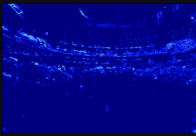
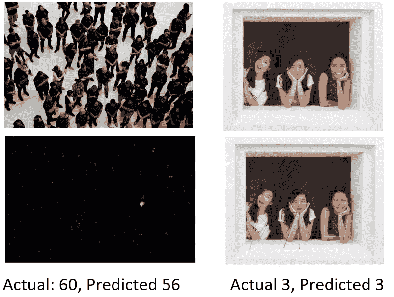
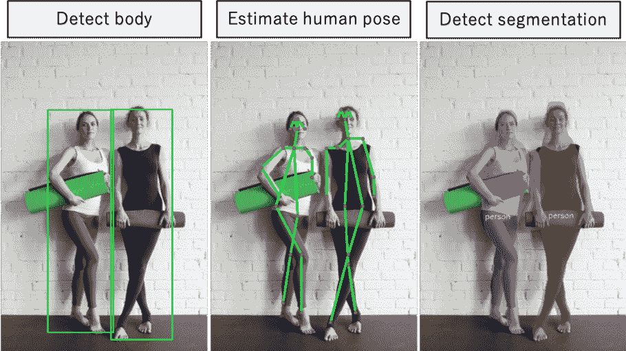
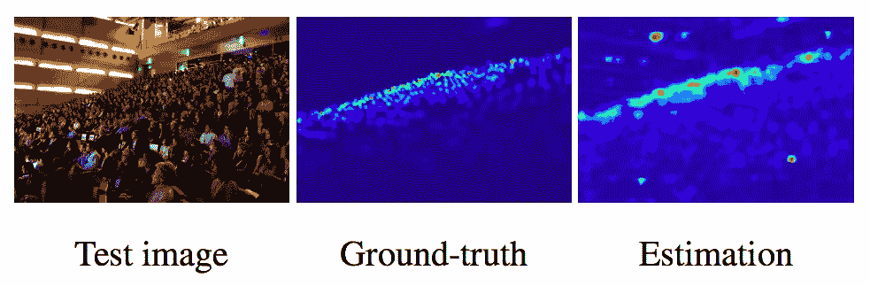
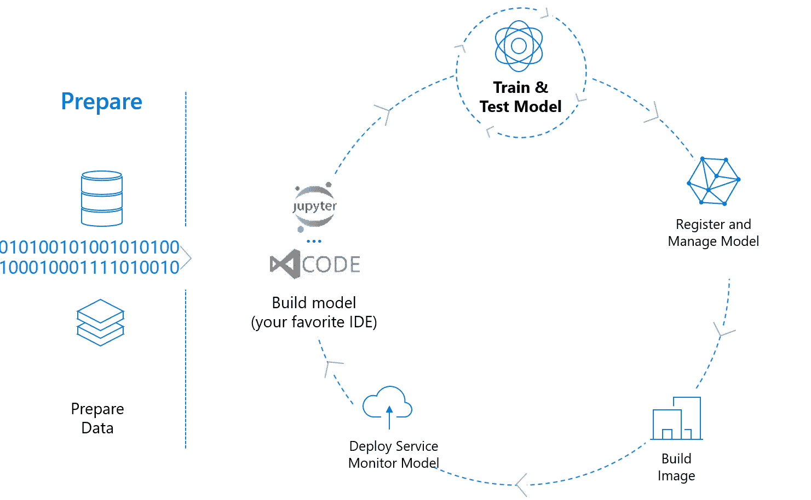
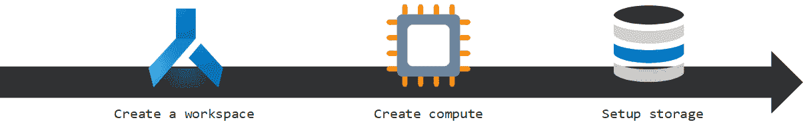
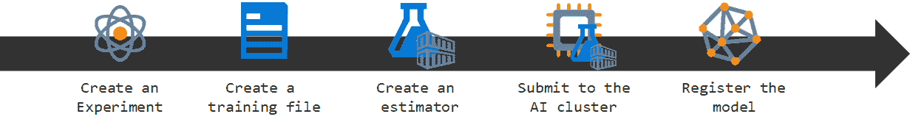

# 基于 C-3 框架和 Azure ML 的出勤估计

> 原文：<https://towardsdatascience.com/attendance-estimation-with-azure-ml-e6678f8a44ed?source=collection_archive---------54----------------------->

图片来自 Pexels https://www . Pexels . com/photo/people-on-stadium-event-1916 816/

TLDR；这篇文章提供了一个 E2E Jupyter 笔记本，用于训练带有 [C-3 框架](https://github.com/gjy3035/C-3-Framework)和[用于 Python 的 AzureML SDK](https://docs.microsoft.com/en-us/python/api/overview/azure/ml/?WT.mc.id=aiapril-medium-abornst&view=azure-ml-py)的人群计数模型

# 什么是受众评估

作为人工智能云开发者的倡导者，我经常发现自己在各种各样的观众面前说话。现在我有时间在家工作时制作一些新的演示，我一直在想当生活恢复正常时，如何更好地了解我所谈论的观众。

我经常根据注册或目测来估计我的演讲范围，但是如果有更好的方法呢？作为一名人工智能工程师，我受到了[微软猫团队在人群计数](https://github.com/microsoft/computervision-recipes/tree/master/contrib/crowd_counting)方面所做工作的启发。我找不到任何关于如何在云上大规模训练这类模型的教程，于是决定自己写一篇，为我的读者记录这个过程。

帖子的代码可以在下面找到

 [## aribornstein/AudienceEstimationAuzreML

### 观众估计的 E2E 人群计数示例—aribornstein/AudienceEstimationAuzreML

github.com](https://github.com/aribornstein/AudienceEstimationAuzreML) 

如果你是 Azure 的新手，你可以使用下面的链接开始免费订阅。

 [## 立即创建您的 Azure 免费帐户| Microsoft Azure

### 开始享受 12 个月的免费服务和 200 美元的信用点数。立即使用 Microsoft Azure 创建您的免费帐户。

azure.microsoft.com](https://azure.microsoft.com/en-us/free/?WT.mc.id=aiapril-medium-abornst) 

# 检测与密集方法

在我们开始之前，我们应该试着理解两种顶级观众评估方法之间的区别。

左图为密集模型，右图为姿态检测模型。图片来自[https://github . com/Microsoft/computer vision-recipes/tree/master/contrib/crowd _ counting](https://github.com/microsoft/computervision-recipes/tree/master/contrib/crowd_counting)

**基于检测的方法**，如人物检测、语义分割和姿态估计，在小人群中效果最佳，但难以扩展到估计几十人或更多人的较大观众规模。

来自 pynino 库[https://github.com/hampen2929/pyvino](https://github.com/hampen2929/pyvino)的检测后和分段的结果

**密集方法**尝试学习原始图像和密度图之间的特征映射，该密度图是通过在图像中的所有人上放置关键点而生成的。这些模型最适用于估计大量受众的规模。

稠密地图的一个例子和从密度近似模式返回的估计输出

最受欢迎的密集模式之一是[多列 CNN ( **MCNN)** 模式](https://zpascal.net/cvpr2016/Zhang_Single-Image_Crowd_Counting_CVPR_2016_paper.pdf)，因为它的评估时间相对较快。

# 运行预训练的密集近似器模型

有[大量文档说明如何在云中训练和使用基于预训练检测](https://medium.com/@ylashin/detectron2-the-basic-end-to-end-tutorial-5ac90e2f90e3)的模型，以及一些[现成的云服务。](https://docs.microsoft.com/en-us/azure/cognitive-services/computer-vision/concept-object-detection?WT.mc.id=aiapril-medium-abornst)

在这篇文章中，我们将展示如何使用 [AzureML SDK](https://docs.microsoft.com/en-us/python/api/overview/azure/ml/?WT.mc.id=aiapril-medium-abornst&view=azure-ml-py) 和 [C-3-Framework](https://github.com/gjy3035/C-3-Framework) 运行和训练你自己的 MCNN 密集近似模型。

高君宇开发的 C-3 框架为 PyTorch 中实现的六种常见主流人群计数数据集和 MCNN 的多种模型配置提供了预处理代码。

 [## gjy 3035/C-3-框架

### 一个开源的 PyTorch 代码正在开发中。我们将抽出业余时间来开发…

github.com](https://github.com/gjy3035/C-3-Framework) 

在他的 G [itHub Repo](https://github.com/gjy3035/C-3-Framework) 中，高提供了经过处理的数据集和预训练的模型的链接。他没有在一个文档中提供端到端的示例，但是，因此我冒昧地在 Jupyter notebooks 中自己编写了一个示例，演示如何安装框架和运行预训练的模型。

 [## aribornstein/AudienceEstimationAzureML

### permalink dissolve GitHub 是 4000 多万开发人员的家园，他们一起工作来托管和审查代码，管理…

github.com](https://github.com/aribornstein/AudienceEstimationAzureML/blob/master/LocalCrowdCounting.ipynb) 

# 使用 Azure ML 训练您自己的大规模密集近似模型

Azure 机器学习服务提供了几种训练机器学习模型的方法，从使用 [SDK](https://docs.microsoft.com/en-us/azure/machine-learning/?WT.mc.id=aiapril-medium-abornst) 的代码优先解决方案到低代码解决方案，如 [AutoML](https://azure.microsoft.com/en-us/blog/visual-interface-for-azure-machine-learning-service/?WT.mc_id=aiapril-medium-abornst) 和[可视化设计器](https://azure.microsoft.com/en-us/blog/visual-interface-for-azure-machine-learning-service/?WT.mc_id=aiapril-medium-abornst)。

使用 [AzureML SDK](https://docs.microsoft.com/en-us/azure/machine-learning/?WT.mc.id=aiapril-medium-abornst) 训练模型有 8 个简单的步骤

前 3 个步骤与设置培训基础架构有关，从选择计算设备到加载数据。

剩下的五个步骤与设置环境有关，以运行和试验不同的培训脚本，并管理生成的模型。

在下面的笔记本中，您将看到这 8 个步骤中的每一个步骤的示例，以此来训练您自己的大规模受众评估模型。

 [## aribornstein/AudienceEstimationAzureML

### permalink dissolve GitHub 是 4000 多万开发人员的家园，他们一起工作来托管和审查代码，管理…

github.com](https://github.com/aribornstein/AudienceEstimationAuzreML/blob/master/AML%20Crowd%20Counting%20Notebook.ipynb) 

一旦你运行了这个笔记本，一定要看看我的关于生产机器学习的 9 个技巧，并试着摆弄代码。我在笔记本底部留了几个挑战让你尝试。

 [## 生产机器学习的 9 个高级技巧

### TLDR；将最新的机器学习模型整合到生产应用程序中是一件值得做的事情…

medium.com](https://medium.com/microsoftazure/9-advanced-tips-for-production-machine-learning-6bbdebf49a6f) 

此外，我还在下面列出了一些关于人群计数的很好的资源。

# 额外资源

 [## gjy 3035/Awesome-人群统计

### 如果您有任何问题、建议或改进，请提交问题或 PR。[C^3 框架]一个开源的…

github.com](https://github.com/gjy3035/Awesome-Crowd-Counting)  [## 这是破纪录的人群！一个必读的教程来建立你的第一个人群计数模型，使用…

### 人工智能和机器学习将在未来十年成为我们最大的帮手！今天早上，我在…

www.analyticsvidhya.com](https://www.analyticsvidhya.com/blog/2019/02/building-crowd-counting-model-python/)  [## 微软/计算机视觉-食谱

### 这个库提供了人群计数算法的生产就绪版本。不同的算法是统一的…

github.com](https://github.com/microsoft/computervision-recipes/tree/master/contrib/crowd_counting)  [## C³ Framework 系列之一：一个基于 PyTorch 的开源人群计数框架

### 首发于微信公众号： 我爱计算机视觉 C3F：首个开源人群计数算法框架 【后期代码以及实验的重大更新，将会在该知乎专栏连载】…

zhuanlan.zhihu.com](https://zhuanlan.zhihu.com/p/65650998)  [## 人群计数变得简单

### 作为 Udacity 学者的经历:

medium.com](https://medium.com/secure-and-private-ai-writing-challenge/crowd-counting-made-easy-1bf84f18ff61) 

# 后续步骤

这里有一些额外的资源来帮助你在 Azure 上的计算机视觉之旅。

 [## 自定义视觉| Microsoft Azure

### 通过简单地上传和标记一些图像，开始训练你的计算机视觉模型。模型在…上进行自我测试

azure.microsoft.com](https://azure.microsoft.com/en-us/services/cognitive-services/custom-vision-service/?WT.mc_id=aiapril-medium-abornst)  [## 计算机视觉|微软 Azure

### 利用 Azure 认知服务 Computer Vision 从图像中提取丰富的信息并分析内容。

azure.microsoft.com](https://azure.microsoft.com/en-us/services/cognitive-services/computer-vision/?WT.mc_id=aiapril-medium-abornst)  [## 视频索引器-人工智能视频洞察|微软 Azure

### 使用视频索引器从视频和音频文件中自动提取元数据。提高媒体的性能…

azure.microsoft.com](https://azure.microsoft.com/en-us/services/media-services/video-indexer/?WT.mc_id=aiapril-medium-abornst)  [## 计算机视觉浏览器

### AI2 计算机视觉浏览器提供了各种流行的模型演示-尝试，比较，并评估与您自己的…

vision-explorer.allenai.org](https://vision-explorer.allenai.org/)  [## Facebook 研究/检测器 2

### Detectron2 是脸书人工智能研究所的下一代软件系统，实现了最先进的物体检测…

github.com](https://github.com/facebookresearch/detectron2) 

# 关于作者

[**亚伦(阿里)博恩施泰因**](https://www.linkedin.com/in/aaron-ari-bornstein-22aa7a77/) 是一名人工智能研究员，对历史充满热情，致力于新技术和计算医学。作为微软云开发倡导团队的开源工程师，他与以色列高科技社区合作，用改变游戏规则的技术解决现实世界的问题，然后将这些技术记录在案、开源并与世界其他地方共享。