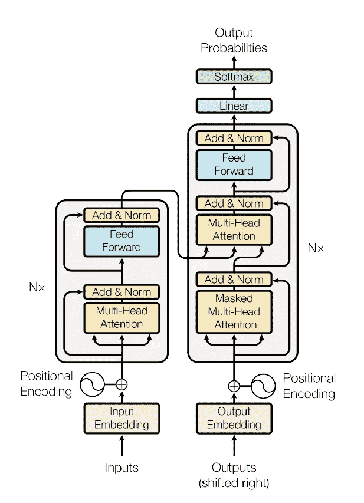
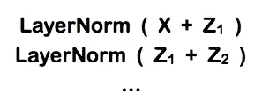
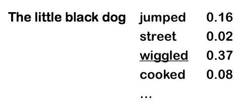

# 注意力和变压器模型

> 原文：<https://towardsdatascience.com/attention-and-transformer-models-fe667f958378?source=collection_archive---------10----------------------->

## [实践教程](https://towardsdatascience.com/tagged/hands-on-tutorials)

## 一个复杂的算法，简单解释一下

(图片由作者提供)

[2017](https://arxiv.org/abs/1706.03762)瓦斯瓦尼等人的《注意力就是你所需要的全部》是一篇里程碑式的论文，提出了一种全新的模型——变压器。如今，Transformer 模型在机器学习领域中无处不在，但它的算法非常复杂，难以琢磨。所以这篇博客希望能让你对此有更多的了解。

# 基本架构

那么下图中所有这些彩色矩形意味着什么呢？一般而言，转换器模型基于编码器-解码器架构。编码器是左手边的灰色矩形，解码器是右手边的那个。编码器和解码器都由两个和三个子层组成，分别是:**多头自关注**、一个**全连接前馈网络**和——在解码器的情况下——**编码器-解码器自关注**(在下面的可视化中称为多头关注)。

变压器架构(来源:Vaswani 等人，2017 年)

图中看不清楚的是，变压器实际上堆叠了多个编码器和解码器(图中用 Nx 表示，即编码器和解码器堆叠了 *n* 次)。这意味着一个编码器的输出用作下一个编码器的输入，一个解码器的输出用作下一个解码器的输入。

# 多头自我关注

Transformer 的新之处并不在于它的编码器-解码器架构，而在于它摒弃了传统上使用的循环层。相反，它完全依赖于自我关注。

那么什么是自我关注呢？简而言之，这是模型理解其接收到的输入的方式。

递归模型的一个问题是长期相关性(在一个序列内或跨几个序列)经常丢失。也就是说，如果序列开头的一个单词对于序列结尾的一个单词很重要，那么一旦到达最后一个单词，模型可能会忘记第一个单词。那些 RNNs 没那么聪明吧？；-)变形金刚模型使用不同的策略来记忆整个序列:自我关注！

序列中的长期依赖:如果模型没有从一开始就记住“男孩”，它可能不知道在结尾使用哪个代词。他，她，它？(图片由作者提供)

在自我注意层，输入 x(表示为向量)通过输入的三个表示向量:q(ueries)，k(eys)和 v(values)被转换成向量 z。这些用于计算一个分数，该分数显示该特定输入应该对给定序列中的其他元素给予多少关注。

我刚才用语言模糊表达的东西可以用下面的公式更精确地定义:

(图片由作者提供)

由于公式并不总是非常直观，一步一步的可视化计算应该会使事情变得更清楚一些。

(图片由作者提供)

比方说我们要为“蓬松煎饼”序列中的“蓬松”这个词计算**自我关注度。首先，我们将输入向量 *x1* (代表单词“fluffy”)与三个不同的权重矩阵 Wq、Wk 和 Wv(在训练期间不断更新)相乘，以获得三个不同的向量:q1、k1 和 v1。对输入向量 *x2* (代表单词“煎饼”)进行完全相同的操作。我们现在有了两个单词的查询、键和值向量。**

**查询**是我们想要计算自我关注度的单词的表示。因此，由于我们想获得对“fluffy”的自我关注，我们只考虑它的查询，而不考虑“pancakes”的查询。一旦我们计算完“fluffy”的自我关注度，我们也可以丢弃它的查询向量。

**键**是序列中每个单词的表示，用于匹配我们当前想要计算自我注意的单词的查询。

**值**是序列中每个单词的实际表示，我们真正关心的表示。将查询和关键字相乘得到一个分数，这个分数告诉我们每个值(以及相应的单词)在自我关注向量中所占的权重。请注意，该值不是直接与分数相乘，而是首先将分数除以 *dk* 的平方根，即关键向量的维数，然后应用 softmax。

这些计算的结果是每个单词一个向量。最后一步，将这两个向量相加，瞧，我们有了对单词“fluffy”的自我关注。

自我关注“他的”这个词。这些线条表示单词“his”对序列中其他单词的关注程度。(图片由作者提供)

你可能注意到了，它叫*多头*自关注。这是因为上面的过程使用不同的权重矩阵进行了多次，这意味着我们最终得到了多个向量(在下面的公式中称为头部)。这些报头然后被连接并乘以权重矩阵 Wo。这意味着每个大脑学习不同的关于给定序列的信息，并且这些知识在最后被结合。

(图片由作者提供)

到目前为止，我还没有提到最重要的一点:所有这些计算都可以**并行化**。为什么这是一件大事？我们先来看看 RNNs。它们需要按顺序处理顺序数据，也就是说，一个序列中的每个单词都要一个接一个地传递给模型。然而，变压器模型可以一次处理所有输入。这使得这些模型非常快，允许它们用大量的数据进行训练。您现在想知道，如果转换器一次收到一个句子，它是如何知道句子的正确顺序的？我将在下面关于位置编码的部分解释这一点。

正如我们在展示 Transformer 架构的第一张图片中看到的，自关注层集成在编码器和解码器中。刚刚看了一下自我关注在编码器中的样子。然而，解码器使用所谓的 ***屏蔽*多头自关注**。这意味着解码器输入中的一些位置被屏蔽，从而被自我关注层忽略。他们为什么要戴面具？当预测句子的下一个单词时，解码器不应该知道哪个单词在预测的单词之后。相反，解码器应该只知道直到当前位置的字。毕竟，当实际使用模型来获得真正的下一个单词预测时，解码器也无法看到未来的位置。因此，通过在训练期间屏蔽它们，我们不允许解码器作弊。

在第一句话中(带面具)，下一个词远比第二句话(不带面具)更难预测。“它的尾巴”这个词清楚地表明，预测这个词可能是“摆动”。(图片由作者提供)

该模型的一个关键方面仍然缺失。信息是如何从编码器流向解码器的？这就是**编码器-解码器自关注层**在这里的目的。这一层的工作方式与编码器中的自我关注层非常相似。然而，查询向量来自前一个被屏蔽的自我关注层，键和值向量来自最顶层编码器的输出。这允许解码器考虑编码器输入序列中的所有位置。

# 前馈网络

所以我们现在知道了自我关注层在每个编码器和解码器中做了什么。这就给我们留下了另一个我们没有谈到的子层:全连接的前馈网络。它们进一步处理自关注层的输出，然后将它们传递给下一个编码器或解码器。

(图片由作者提供)

每个前馈网络由两个线性层组成，中间有一个 ReLU 函数。权重和偏差 W1、W2、b1 和 b2 在序列中的不同位置是相同的，但是在每个编码器和解码器中是不同的。

# 位置编码

正如我们已经说过的，Transformer 模型可以并行处理序列中的所有单词。然而，这意味着丢失了一些重要的信息:序列中的**字位置。为了保留这些信息，单词的位置和顺序必须对模型明确。这是通过位置编码完成的。这些位置编码是与输入向量维数相同的向量，使用正弦和余弦函数计算。为了组合输入向量和位置编码的信息，它们被简单地相加。**

要更详细地解释位置编码到底是如何工作的，我在这里推荐[这篇文章](https://kazemnejad.com/blog/transformer_architecture_positional_encoding/)。

# 图层规范化

变压器模型的一个小但重要的方面是层标准化，它在每个编码器和解码器的每个子层之后执行。

(图片由作者提供)

首先，将各个编码器或解码器层的输入和输出相加。这意味着在最底层，输入向量 X 和输出向量 Z1 相加；在第二层中，输入向量 Z1 和输出向量 Z2 等等。然后用零和单位方差的平均值对求和向量进行归一化。这可以防止给定层中的值范围波动过大，从而使模型更快地收敛。

为了更深入地解释图层规范化，我在这里推荐[这篇文章](https://leimao.github.io/blog/Layer-Normalization/)。

# 最终线性层和 Softmax

最后，为了得到输出预测，我们需要将最后一个解码器的输出向量转换成单词。因此，我们首先将输出向量输入到一个全连接的线性层中，并获得一个词汇表大小的 logits 向量。然后，我们将 softmax 函数应用于这个向量，以便获得词汇表中每个单词的概率分数。然后，我们选择概率最大的单词作为我们的预测。

《小背狗 __》下一个词预测的概率得分。(图片由作者提供)

# 摘要

Transformer 模型是一种新的编码器-解码器模型，它使用自我注意来理解语言序列。这允许并行处理，从而使它比任何其他具有相同性能的模型快得多。他们因此为现代语言模型(如[伯特](https://arxiv.org/abs/1810.04805)和 [GPT](https://openai.com/blog/language-unsupervised/) 以及最近的[图像生成模型](https://arxiv.org/abs/1802.05751)铺平了道路。

## **参考文献**

[1] A. Vaswani，N. Shazeer，N. Parmar，J. Uszkoreit，L. Jones，A. N. Gomez，L. Kaiser 和 I. Polosukhin，[注意力是你所需要的一切](https://arxiv.org/abs/1706.03762) (2017)，NIPS'17:第 31 届神经信息处理系统国际会议论文集
[2] A. Kazemnejad， [Transformer Architecture:位置编码](https://kazemnejad.com/blog/transformer_architecture_positional_encoding/) (2019)，Amirhossein Kazemnejad

## 信用

特别感谢 Philip Popien 对本文的建议和更正。