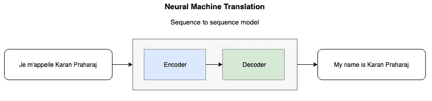
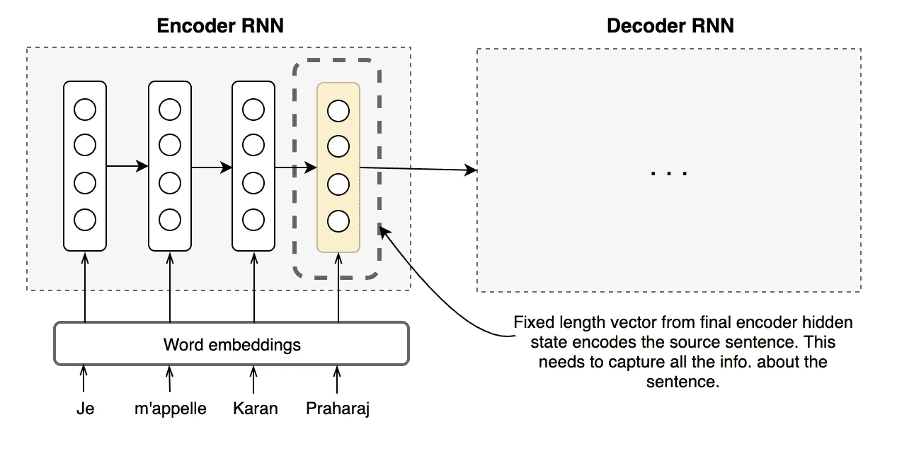
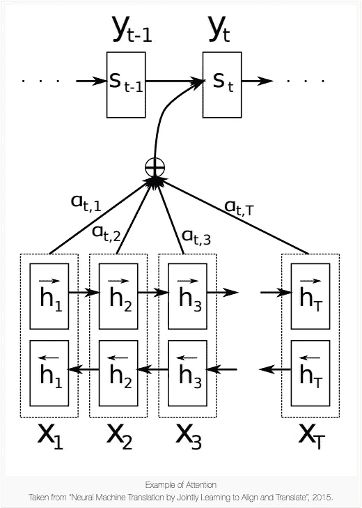

# 注意机器翻译

> 原文：<https://towardsdatascience.com/attention-for-machine-translation-4a95db38ee34?source=collection_archive---------48----------------------->

## 神经机器翻译模型的注意机制的简要综述。

我们的大脑并不具备一次处理大量信息的能力。然而，我们*所擅长的是*专注于我们被给予的信息的一部分来理解它。当你被要求把一个句子从一种语言翻译成另一种语言时，你处理句子的方式是一边走一边挑选单个的单词，把它们串成短语，然后在心里为每一部分指定目标语言中相应的单词/短语。

当一个书面单词呈现给你进行翻译时，它会在你的大脑中启动一系列的神经认知过程。你大脑中正常的语言系统会读出你母语中的单词，但对于翻译来说，这种通常的倾向必须被抑制，这样翻译出来的意思才能显现出来。大脑的一个特定区域(称为“尾状核”)协调这一活动，就像管弦乐队的指挥一样，产生令人震惊的复杂行为。本质上，单词或单词序列的句法、语音、词汇和语义方面被包含、吸收，然后被语境化，以将所述单词序列翻译成其在目标语言中的对等物。

翻译——无论是人工翻译还是机器翻译——在本质上都不是客观的，也就是说，对于任何给定的句子，都没有*唯一的*翻译。人工翻译固有地带来将源语言单词、语法或句法引入目标语言表达的风险。两个人翻译一个相对较长的句子很少会完全相同。尽管最终的结果有所不同，但不变的是翻译的大致过程。对于翻译中出现的任何目标语言单词或短语，译者会更多地关注源句子的某些部分。

直到 2015 年，Bahdanau、Cho 和 Bengio 引入了“注意力”机制，人类的这种与生俱来的品质才被赋予机器算法。提出这种机制是为了通过允许模型自动(软)搜索源句子中与预测目标单词相关的部分来最大化翻译性能，而不必将这些部分显式地形成为硬段。我承认这句话可能很难理解，但是我们将通过分解它并一次注意一部分来理解它。(很 meta，我知道。)这篇 2015 年的论文影响深远，它将继续成为几个最先进模型的构建模块。

## 为什么我们需要关注？

在传统的神经机器翻译模型中，编码器-解码器组合与用于每种语言的编码器和解码器一起使用，或者将特定于语言的编码器应用于每个句子，然后比较其输出。编码器 RNN 读取源句子并将其编码成固定长度的向量。然后，解码器会根据编码器提供的矢量进行翻译。由语言对的编码器和解码器组成的整个编码器-解码器系统被联合训练以最大化给定源句子的正确翻译的概率。

## 瓶颈

这种体系结构的一个问题是，它过度依赖于一个固定长度的向量来包含所有必要的信息，并且是源句子的高质量表示。这种在固定向量向量上压缩和捕获所有信息的压力是一个瓶颈，它使得编码器神经网络难以在长句上表现良好。前面已经表明，随着输入句子长度的增加，基本编码器-解码器的性能会迅速下降。

## 核心理念

为了解决这个问题，Bahdanau 等人引入了一个对编码器-解码器模型的扩展，该模型学习联合对齐和翻译。新的架构部署了一个双向 RNN 作为编码器和解码器，它将能够关注所有的隐藏状态，而不仅仅是最终的隐藏状态。这种修改所做的是为解码器提供决策的灵活性，并因此识别源句子中可能与目标句子中下一个单词的预测更相关的部分。这是注意力机制的直觉，它现在把我们引向实现这一点的数学。

因此，这种新方法便于信息在注释序列中传播，解码器可以相应地选择性地检索该信息。

通过语言这一媒介，我们能够在很长的空间和时间范围内交流思想，但是句子中词与词之间的句法联系的建立，无论它们是否彼此靠近，都是任何语言表达思想的基础。这就是注意力介入并帮助从源语言到目标语言的语法映射的地方。识别单词与同一个句子中可能很远的其他单词的关系——同时忽略对我们试图预测的单词没有太大影响的其他单词——这就是注意力的目的。

我很想解释一下注意力机制 *的* [*代数，但是我发现 Medium 的编辑对数学写作毫无帮助。你可以在本页*](https://karanpraharaj.github.io/post/attention/) *底部的* [*找到解释。*](https://karanpraharaj.github.io/post/attention/)

***您可以访问我的页面*** [***这里***](https://karanpraharaj.github.io) ***。你可以关注我的推特供稿*** [***这里***](https://twitter.com/IntrepidIndian) ***。***

# 参考

[1] Bahdanau，d .，Cho，K. & Bengio，Y. [通过联合学习对齐和翻译的神经机器翻译。](http://arxiv.org/abs/1409.0473)在*程序中。学习代表国际会议* (2015)

[2]赵京贤、亚伦·库维尔和约舒阿·本吉奥。[使用基于注意力的编码器-解码器网络描述多媒体内容。](http://arxiv.org/abs/1507.01053) (2015)

[3]苏茨基弗，I .维尼亚尔斯，o .和勒。用神经网络进行序列对序列学习。在*程序中。神经信息处理系统进展。* (2014)

[4]克里斯·奥拉赫的博文。[“注意力和增强循环神经网络](https://distill.pub/2016/augmented-rnns/)”