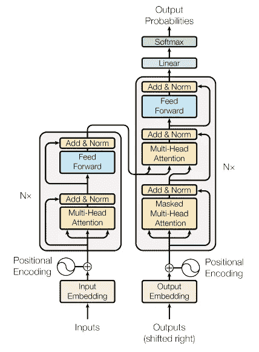
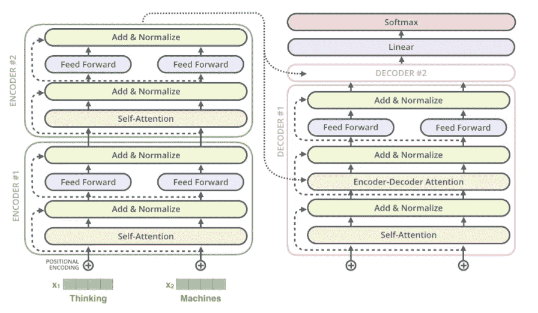

# 注意力是你所需要的:发现变压器纸

> 原文：<https://towardsdatascience.com/attention-is-all-you-need-discovering-the-transformer-paper-73e5ff5e0634?source=collection_archive---------0----------------------->

## [入门](https://towardsdatascience.com/tagged/getting-started)

## Tensorflow 中变压器模型的详细实现


图片来自 Pixabay 的罗宇胜·谭

本帖我们将对论文中的相关神器[](https://arxiv.org/pdf/1706.03762.pdf)**【瓦斯瓦尼、阿希什&沙泽尔、诺姆&帕尔马、尼基&乌斯科雷特、雅各布&琼斯、利翁&戈麦斯、艾丹&凯泽、卢卡兹&波洛舒欣、伊利亚进行描述和揭秘。(2017))【1】*。这篇论文在注意力机制的使用上是一个巨大的进步，是对一个叫做 Transformer 的模型的主要改进。在 NLP 任务中出现的最著名的当前模型由几十个变压器或它们的一些变体组成，例如，GPT-2 或 BERT。*

*我们将描述这个模型的组成部分，分析它们的运作，并建立一个简单的模型，我们将应用于一个小规模的 NMT 问题(神经机器翻译)。为了阅读更多关于我们将要解决的问题，并了解基本的注意力机制是如何工作的，我推荐你阅读我以前的帖子[“编码器-解码器模型和注意力机制指南”](https://medium.com/better-programming/a-guide-on-the-encoder-decoder-model-and-the-attention-mechanism-401c836e2cdb)。*

# *为什么我们需要变压器*

*在诸如神经机器翻译的序列到序列问题中，最初的提议是基于在编码器-解码器架构中使用 RNNs。这些体系结构在处理长序列时有很大的局限性，当新元素加入序列时，它们保留第一个元素信息的能力就丧失了。在编码器中，每一步中的隐藏状态都与输入句子中的某个词相关联，通常是最近的一个词。因此，如果解码器只访问解码器的最后一个隐藏状态，它将丢失序列的第一个元素的相关信息。然后为了处理这个限制，引入了一个新概念**注意力机制**。*

*与 RNNs 通常关注编码器的最后状态不同，在解码器的每个步骤中，我们会查看编码器的所有状态，从而能够访问关于输入序列所有元素的信息。这就是 attention 所做的，它从整个序列中提取信息，一个所有过去编码器状态的**加权和。这允许解码器为输出的每个元素分配更大的权重或重要性给输入的某个元素。在每一步中学习聚焦于输入的正确元素，以预测下一个输出元素。***

*但是这种方法仍然有一个重要的限制，每个序列必须一次处理一个元素。编码器和解码器都必须等到完成`t-1`步骤才能处理`t-th`步骤。**因此，在处理庞大的语料库时，这是非常耗时和计算效率低下的**。*

# *变压器是什么？*

> *在这项工作中，我们提出了 Transformer，这是一种避免递归的模型架构，它完全依赖于一种注意机制来绘制输入和输出之间的全局依赖关系。Transformer 允许显著提高并行性……Transformer 是第一个完全依赖自我关注来计算其输入和输出表示而不使用序列比对 RNNs 或卷积的转导模型。*
> 
> *“注意力是你所需要的全部”论文[1]*

*Transformer 模型使用自我关注机制提取每个单词的特征，以**计算出句子中所有其他单词对前面提到的单词的重要性**。并且没有使用递归单元来获得该特征，它们只是加权和与激活，因此它们可以是非常并行和高效的。*

*但是我们将更深入地研究它的架构(下图)，以理解所有这些部分的作用[1]。*

**

*摘自瓦斯瓦尼等人 2017 年发表的论文《注意力是你所需要的一切》*

*我们可以看到，左边是编码器模型，右边是解码器模型。两者都包含一个重复 N 次的“注意力和前馈网络”的核心模块。但首先我们需要深入探讨一个核心概念:自我关注机制。*

# *自我关注:基本操作*

> *自我关注是一个序列对序列的操作:一个向量序列进去，一个向量序列出来。我们称输入向量为`x1`、`x2`、…、`xt`以及相应的输出向量为`y1`、`y2`、…、`yt`。向量都具有维度 k。为了产生输出向量`yi`，自关注操作简单地对所有输入向量进行加权平均*，*最简单的选择是点积。*
> 
> *彼得·布鲁姆的《从零开始的变形金刚》*

*在我们模型的自我关注机制中，我们需要引入三个元素:查询、值和键*

## *查询、值和键*

*在自我关注机制中，每个输入向量都以三种不同的方式使用:查询、键和值。在每个角色中，它都与其他向量进行比较，以获得自己的输出`yi`(查询)，获得第 j 个输出`yj`(键)，并在建立权重(值)后计算每个输出向量。*

*为了获得这个角色，我们需要三个维度为*k×k*的权重矩阵，并为每个`xi`计算三个线性变换:*

**

*彼得·布鲁姆的《从零开始的变形金刚》*

*这三个矩阵通常被称为 *K* 、 *Q* 和 *V、*、**三个可学习的权重层，它们被应用于相同的编码输入**。因此，由于这三个矩阵中的每一个都来自相同的输入，我们可以将输入向量的注意机制应用于其自身，即“自我注意”。*

## *成比例的点积注意力*

> *输入包括维度`dk`的查询和关键字，以及维度`dv`的值。我们计算查询与所有键的点积，将每个键除以`dk`的平方根，并应用`softmax`函数来获得值的权重。*
> 
> *“注意力是你所需要的全部”论文[1]*

*然后我们使用 *Q* 、 *K* 和 *V* 矩阵来计算注意力得分。**分数衡量的是在某个位置的一个单词上对输入序列的其他位置或单词的关注程度**。也就是说，查询向量与我们正在评分的相应单词的关键向量的点积。因此，对于位置 1，我们计算点积。)的`q1`和`k1`，然后是`q1`。`k2`，`q1`。`k3`以此类推，…*

*接下来，我们应用“缩放”因子来获得更稳定的梯度。softmax 函数无法在大值下正常工作，导致梯度消失并减慢学习速度[2]。在“软最大化”之后，我们乘以值矩阵以保留我们想要关注的单词的值，并最小化或移除不相关单词的值(它在 V 矩阵中的值应该非常小)。*

*这些操作的公式是:*

**

*摘自瓦斯瓦尼等人 2017 年发表的论文《注意力是你所需要的一切》[1]。标度点积注意力公式。*

## *多头注意力*

*在前面的描述中，注意力分数一次集中在整个句子上，这将产生相同的结果，即使两个句子以不同的顺序包含相同的单词。相反，我们希望关注单词的不同部分。*“我们可以给自我注意更大的区分能力，* ***通过组合几个自我注意头，*** *把词向量分成固定数量(h，头数)的组块，然后在相应的组块上应用自我注意，使用 Q，K，V 子矩阵。*、【2】彼得·布鲁姆、[《从零开始的变形金刚》](http://peterbloem.nl/blog/transformers)。这产生了不同的分数输出矩阵。*

**

*摘自瓦斯瓦尼等人 2017 年发表的论文《注意力是你所需要的一切》*

*但是下一层(前馈层)只需要一个矩阵，每个单词一个向量，所以*“在计算每个头部的点积之后，我们将输出矩阵连接起来，并乘以一个额外的权重矩阵* `*Wo*` *，*【3】。这个最终的矩阵从所有的注意力头获取信息。*

## *位置编码*

*我们简单地提到，句子中单词的顺序是这个模型中要解决的问题，因为网络和自我注意机制是排列不变的。如果我们打乱输入句子中的单词，我们会得到相同的解。我们需要创建单词在句子中的位置的表示，并将其添加到单词嵌入中。*

> *为此，我们将“位置编码”添加到编码器和解码器堆栈底部的输入嵌入中。位置编码与嵌入具有相同的维数，因此两者可以相加。有许多位置编码的选择。*
> 
> *“关注是你所需要的”论文*

*因此，我们应用一个函数将句子中的位置映射到一个实值向量。网络将学习如何使用这些信息。另一种方法是使用位置嵌入，类似于单词嵌入，用向量对每个已知位置进行编码。*“在训练循环期间，需要所有接受的位置的句子，但是位置编码允许模型推断出比训练期间遇到的序列长度更长的序列长度”*，【2】。*

*在该论文中，应用了正弦函数:*

**

*摘自瓦斯瓦尼等人 2017 年发表的论文《注意力是你所需要的一切》[1]。位置编码*

# *编码器*

*现在已经描述了模型的所有主要部分，我们可以介绍编码器组件了，[4]:*

*   ***位置编码**:将位置编码添加到输入嵌入中(我们的输入单词被转换成嵌入向量)。*“在两个嵌入层(编码器和解码器)和预 softmax 线性变换之间共享相同的权重矩阵。在嵌入层中，我们将这些权重乘以模型维度的平方根“*”[1]。*
*   *`N=6`相同层，包含两个子层:一个**多头自关注**机构，和一个**全连接前馈网络(**两个线性变换和一个 ReLU 激活)。但是它是按位置应用于输入的，这意味着同一个神经网络被应用于属于句子序列的每一个“标记”向量。*

**

*   *每个子层(attention 和 FC 网络)周围都有一个**残差连接**，将该层的输出与其输入相加，之后是一个**层归一化**。*
*   *在每个残差连接之前，应用一个**正则化**:*“在将每个子层的输出添加到子层输入并归一化之前，我们对每个子层的输出应用丢失。此外，我们对编码器和解码器堆栈“*”[1]中的嵌入和位置编码的总和应用丢失，丢失率为 0.1。*

> **归一化和残差连接是用来帮助深度神经网络更快更准确地训练的标准技巧。层标准化仅应用于嵌入维度。**
> 
> *彼得·布鲁姆，《从零开始的变形金刚》[2]*

*首先，我们实现编码器层，六个模块中的每一个都包含在编码器中:*

*下图将显示详细的组件:*

**

*杰伊·阿拉玛的《变形金刚》*

*编码器代码:*

*记住**只有来自最后一层(第 6 层)的向量被发送到解码器**。*

# *解码器*

*解码器与编码器共享一些组件，但考虑到编码器输出，它们的使用方式有所不同[4]:*

*   ***位置编码**:类似编码器中的位置编码*
*   *`N=6`相同的层，包含 3 个三子层。第一，掩蔽多头注意或**掩蔽因果注意**，以防止位置注意后续位置。*“这种屏蔽，结合输出嵌入偏移一个位置的事实，确保了位置 I 的预测可以仅依赖于小于 I 的位置处的已知输出”[1]* 。它是通过设置为与点积注意模块的 softmax 层中的禁止状态相对应的值来实现的。**第二组件**或**“编码器-解码器关注”**对解码器的输出执行多头关注，键和值向量来自编码器的输出，但是查询来自先前的解码器层。*“这使得解码器中的每个位置都能处理输入序列中的所有位置”【1】*。最后是全连接网络。*
*   ***残差连接**和**层归一化**围绕每个子层，类似于编码器。*
*   *并重复在编码器中执行的相同的**残差下降**。*

*解码器层:*

**

*杰伊·阿拉玛的《变形金刚》*

*在 N 个堆叠解码器的末端，**线性层**，一个全连接的网络，将堆叠输出转换为一个更大的向量*，即逻辑值*。*“****soft max 层*** *然后把那些分数(logits)变成概率(都是正的，加起来都是 1.0)。选择具有最高概率的单元，并产生与之相关的单词作为该时间步长的输出“，* [3] Jay Alammar，[“图示变压器”](http://jalammar.github.io/illustrated-transformer/)。*

*解码器组件:*

# *连接所有部件:变压器*

*一旦我们定义了我们的组件并创建了编码器、解码器和 linear-softmax 最终层，我们就可以将这些部分连接起来，形成我们的模型，即 Transformer。*

*值得一提的是**我们创建了 3 个遮罩**，每个遮罩都允许我们:*

*   **编码器掩码*:填充掩码，用于从注意力计算中丢弃填充标记。*
*   **解码器掩码 1* :该掩码是填充掩码和前瞻掩码的联合，有助于因果注意力“在未来”丢弃令牌。我们取填充掩码和前瞻掩码之间的最大值。*
*   **解码器掩码* 2:它是填充掩码，应用于编码器-解码器关注层。*

*正如你所看到的，然后我们调用编码器、解码器和最终的 linear-softmax 层来获得我们的 Transformer 模型的预测输出。*

**

*图片来自[pix abay](https://pixabay.com/es/?utm_source=link-attribution&utm_medium=referral&utm_campaign=image&utm_content=2167835)Gerd Altmann*

# *训练变压器模型*

*现在，我们已经详细描述了本文中的组件，我们准备实现它们，并在 NMT 问题上训练一个转换器模型。这是一个出于教育目的的玩具问题。*

*我们不会在这篇博文中处理数据争论。请点击我在简介中提到的链接，获取更多信息，并查看所提供的代码，以了解数据是如何加载和准备的。总之，创建词汇，标记化(包括一个`eos`和`sos`标记)并填充句子。然后我们创建一个数据集，一个批量数据生成器，用于批量训练。*

*我们需要**创建一个定制的损失函数**来屏蔽填充标记。*

*我们使用论文中描述的 Adam 优化器，包括`beta1=0.9`、`beta2=0.98`和`epsilon=10e-9`。然后，我们**创建一个调度程序，根据以下内容改变训练过程中的学习率**:*

**

*“你所需要的只是关注”论文。学习率衰减。*

## *主训练功能*

*训练功能类似于许多其他 Tensorflow 训练，是序列到序列任务的常见训练循环:*

*   *对于生成批量输入和输出的批量生成器上的每次迭代*
*   *得到从 0 到 length-1 的输入序列，以及从 1 到 length 的实际输出，每个序列步骤中预期的下一个字。*
*   *调用变压器来获得预测*
*   *计算实际输出和预测之间的损失函数*
*   *应用梯度来更新模型中的权重并更新优化器*
*   *计算批次数据的平均损失和准确度*
*   *显示一些结果并保存每个时期的模型*

*就这样，我们有了训练模型的所有必要元素，我们只需要创建它们并调用训练函数:*

**

*[Jr Korpa](https://unsplash.com/@korpa?utm_source=unsplash&utm_medium=referral&utm_content=creditCopyText) 在 [Unsplash](https://unsplash.com/s/photos/language-learning?utm_source=unsplash&utm_medium=referral&utm_content=creditCopyText) 上拍摄的照片*

# *做预测*

*当训练 ML 模型时，我们不仅对优化损失或准确性感兴趣，我们还希望我们的模型做出足够好的预测，在这种情况下，看看模型如何处理新句子。**预测函数**将向模型输入标记化的句子，并返回预测的新句子，在我们的示例中，是从英语到西班牙语的翻译。*

*这是该过程中的步骤:*

*   *将输入句子标记为一系列标记*
*   *将初始输出序列设置为`sos`标记*
*   *直到我们达到最大长度或者模型返回了`eos`令牌*
*   *预测下一个单词。该模型返回 logits，请记住，在损失计算中应用了 softmax 函数。*
*   *获取概率最高的单词在词汇表中的索引*
*   *将预测的下一个单词连接到输出序列*

*最后，我们的最后一个函数接收一个英语句子，调用转换器将其翻译成西班牙语并显示结果。*

*对于这个例子，我们只是用模型维度的一些值和前馈网络的单元进行实验，来训练模型一个小时。如果您想要优化模型，您可能应该对其进行更长时间的训练，并为超参数设置许多不同的值。*

***代码在我的 github 库 [Transformer-NMT](https://github.com/edumunozsala/Transformer-NMT) 中**可用。代码部分摘自 Udemy 上 SuperDataScience 团队的一门名为《Python 中的现代自然语言处理》的优秀课程。我强烈推荐。*

*翻译的一些例子是:*

```
**#Show some translations*
sentence = "you should pay for it."
print("Input sentence: {}".format(sentence))
predicted_sentence = translate(sentence)
print("Output sentence: {}".format(predicted_sentence))**Input sentence: you should pay for it. 
Output sentence: Deberías pagar por ello.***#Show some translations*
sentence = "we have no extra money."
print("Input sentence: {}".format(sentence))
predicted_sentence = translate(sentence)
print("Output sentence: {}".format(predicted_sentence))**Input sentence: we have no extra money. 
Output sentence: No tenemos dinero extra.***#Show some translations* sentence = "This is a problem to deal with."
print("Input sentence: {}".format(sentence))
predicted_sentence = translate(sentence)
print("Output sentence: {}".format(predicted_sentence))**Input sentence: This is a problem to deal with. 
Output sentence: Este problema es un problema con eso.***
```

*我希望您喜欢尝试 Transformer 模型。在以后的帖子中，我们将处理另一个 NLP 任务。*

# *参考*

*[1]瓦斯瓦尼、阿希什&沙泽尔、诺姆&帕马尔、尼基&乌兹科雷特、雅各布&琼斯、利翁&戈麦斯、艾丹&凯泽、卢卡什&波洛舒欣、伊利亚、[《注意力就是你需要的一切》](https://arxiv.org/pdf/1706.03762.pdf)，2017。*

*[2]彼得·布洛姆，[《从零开始的变形金刚》](http://peterbloem.nl/blog/transformers)博文，2019。*

*[3]杰·阿拉玛，[《变形金刚》](http://jalammar.github.io/illustrated-transformer/)博文，2018。*

*[4]莉莲翁，[“注意？立正！!"](https://lilianweng.github.io/lil-log/2018/06/24/attention-attention.html)博文，2018。*

*[5]里卡多·法因德斯-卡拉斯科，[《关注是你所需要的全部》的评论](https://ricardokleinklein.github.io/2017/11/16/Attention-is-all-you-need.html)博文，2017*

*[6]亚历山大·拉什，[《带注释的变形金刚》](http://nlp.seas.harvard.edu/2018/04/03/attention.html)，2018，哈佛 NLP 小组。*