# AUC 及其在 CatBoost 中的实现

> 原文：<https://towardsdatascience.com/auc-and-its-implementation-in-catboost-6bc740c01f98?source=collection_archive---------33----------------------->

## 本教程是关于受试者工作特征(ROC)曲线下的区域(AUC)及其在 CatBoost 中的实现，用于二元分类、多类分类和排序问题。

# 关于 AUC

**ROC 曲线**显示了*模型区分等级*的能力。

将类别随机分配给对象的模型是“坏的”分类器，并且具有对角 ROC 曲线。分类器越好，ROC 曲线越高。绘制 ROC 曲线，y 轴为 TPR、[真阳性率](https://en.wikipedia.org/wiki/Receiver_operating_characteristic#Basic_concept)，x 轴为 FPR、[假阳性率](https://en.wikipedia.org/wiki/Receiver_operating_characteristic#Basic_concept)。该曲线也可以根据模型的[敏感性和特异性](https://en.wikipedia.org/wiki/Sensitivity_and_specificity)进行解释，y 轴为敏感性，x 轴为(1-特异性)。

构建和可视化 ROC 曲线可用于*测量具有不同概率边界的分类算法性能*和*选择实现指定假阳性或假阴性率所需的概率边界*。

**AUC** 是 ROC 曲线下的面积。对所有对象进行正确排序的模型的最佳 AUC = 1(所有具有类别 1 的对象被分配比类别 0 的对象更高的概率)。作为随机猜测的“坏”分类器的 AUC 等于 0.5。

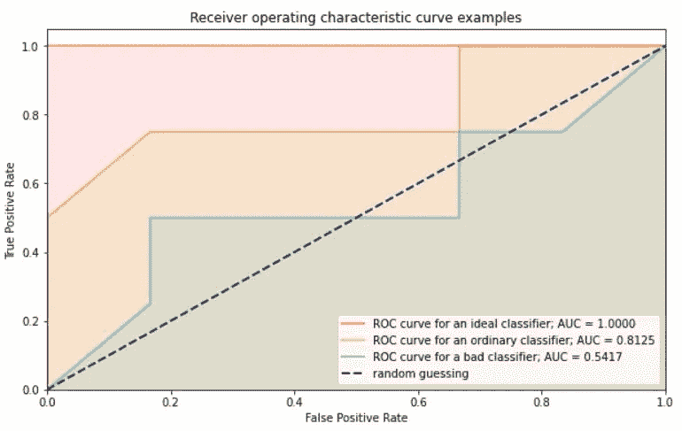

AUC 用于二元分类、多类分类和排序问题。 *AUC 测量正确排序对象的比例和模型区分类别的能力*。

AUC 具有一个重要的统计特性:分类器的 *AUC 相当于分类器将随机选择的阳性实例排列得高于随机选择的阴性实例的概率*。

# CatBoost 实现

对于[二分类](https://catboost.ai/docs/concepts/loss-functions-classification.html)、[多分类](https://catboost.ai/docs/concepts/loss-functions-multiclassification.html)、[排序](https://catboost.ai/docs/concepts/loss-functions-ranking.html)问题，在 CatBoost 中有 AUC 的实现。您可以在过度拟合检测和自动最佳模型选择的训练期间计算 AUC，使用 [model.eval_metric](https://catboost.ai/docs/concepts/python-reference_catboost_eval-metrics.html) 评估新数据上的模型，并将 AUC 用作预测评估和与 [utils.eval_metric](https://https//catboost.ai/docs/concepts/python-reference_utils_eval_metric.html) 比较的指标。请参阅如何在真实数据集上使用 Catboost 中的 AUC 一节中使用 CatBoost 进行模型拟合和 AUC 计算的示例。

# 有用的链接

*   在维基百科上阅读更多关于 ROC 的内容。
*   要从头开始了解 ROC 曲线的构建，请参见文章。
*   要了解多类分类的 AUCμ，请参见文章。

# 二元分类

## 二元分类的计算规则

二元分类的 AUC 根据以下公式计算:


其中 *aᵢ,aⱼ* —算法给出的物体属于类别 1 的预测(概率)。

对所有对象对 *i，j* 计算总和，使得: *tᵢ=0，tⱼ=1* 其中 *t* 是真正的类标签。

如果对象 *i，j* 排序正确，则 *I* 是等于 1 的指示函数:


用户可以为每个对象分配权重，以指定每个对象在度量计算中的重要性。

# 二元分类 AUC 计算的一个简单例子

让我们看一个简单的 ROC 曲线构建和 AUC 计算的例子:

我们有 10 个对象的样本，4 个来自类 1，6 个来自类 0(“类”列)。所有对象同等重要(权重= 1)。假设我们预测了对象来自类别 1 的概率(“预测”列)。

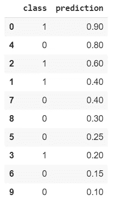

分母等于对象对的数量 *i，j* 使得真实类 *tᵢ=0,tⱼ=1* 。因为有 4 个来自类 1 的对象和 6 个来自类 0 的对象，所以分母等于 24。

对于来自类 1 的每个对象，计算来自类 0 的对象的数量，这些对象在排序的数据集中位于下面(概率较小)。

我们添加+1 个正确排序的对象(例如，id 为 0 和 4 的对象)，如果概率相等，则添加+0.5 个对象(例如，id 为 1 和 7 的对象)。

例如，ID = 1 的对象将+4.5 加到 AUC 分子上，与 ID:8，3，6，9 的对象正确排序，并且与对象 7 具有相同的预测:

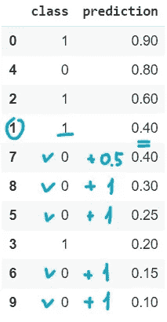

```
denominator = sum(toy_example['class'] == 1) * sum(toy_example['class'] == 0)numerator = (6 + 5 + 4.5 + 2)manually_calculated_auc = numerator / denominatormanually_calculated_auc = 0.7292
```

让我们用 Catboost 计算同样的指标，并确保一切都是正确的:

```
catboost_auc = eval_metric(toy_example['class'], toy_example['prediction'], 'AUC')[0]
```

# 受试者工作特征曲线

要构建 ROC 曲线，请将类别 1 (n1)的对象数量放在正方形中，第 1 条边沿 y 轴，类别 0 (n0)的对象数量沿 x 轴。

按照由模型预测以降序排列的目标标签列表，将沿着 y 轴增加 1/n1，遇到类别 1 的对象，并且沿着 x 轴增加 1/n0，遇到类别 0 的对象。

通过“类”列从上到下，如果类是 1，我们就在图上向上，如果类是 0，我们就在图上向右。当遇到预测相同的对象时，将 y 轴上的数字 1 和 x 轴上的数字 0 相加，然后沿着矩形的对角线前进。

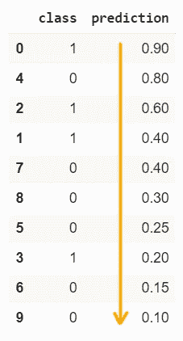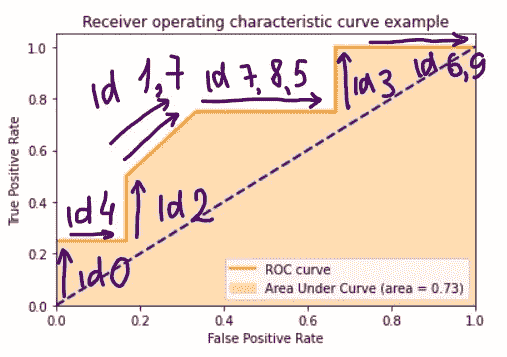

# AUC:加权计算

CatBoost 允许我们为数据集中的每个对象分配一个权重，以便根据上面的公式计算 AUC。如果没有分配权重，所有权重都等于 1，因此 AUC 与正确排序对的数量成比例。如果分配给此属性的权重被更改。

权重对于不平衡的数据集非常有用。如果在训练数据集中存在具有少量样本的一类或一组对象，则增加相应对象的权重可能是合理的。

例如，如果我们将权重 10 分配给一个对象，这可以理解为将 9 个相同的对象添加到数据集。

让我们以权重= 10 的一个重要对象的错误和正确分类为例来计算 AUC。

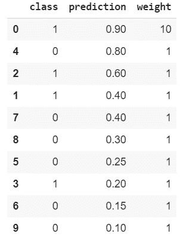

```
roc_auc = catboost.utils.eval_metric(toy_example[‘class’], toy_example[‘prediction’], ‘AUC’, weight=toy_example[‘weight’])[0]
```

AUC = 0.9167。一个重要的对象被正确排序，AUC 增加

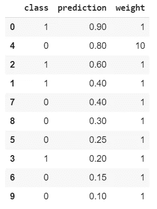

```
roc_auc = catboost.utils.eval_metric(toy_example['class'], toy_example['prediction'], 'AUC', weight=toy_example['weight'])[0]
```

AUC = 0.4417。一个重要对象订购错误，AUC 下降

# 多类分类的 AUC

Catboost 中的多类分类实现了两个 AUC 指标。

首先是 **OneVsAll** 。根据二元分类计算原则，对每个类别分别计算 AUC 值。

第二个是 **AUC** μ，其被设计为满足以下特性:

*   物业 1。如果模型在每个例子中给出正确标签的概率最高，那么 AUC = 1
*   房产 2。对实施例的随机猜测产生 AUC = 0.5
*   房产 3。AUC 对类别偏差不敏感

AUCμ可以解释为类别之间成对 AUC 的平均值。详情可在[文章](http://proceedings.mlr.press/v97/kleiman19a/kleiman19a.pdf)中找到。

# OneVsAll AUC

Catboost 中的 OneVsAll AUC 返回 n-class 分类的 n 个 AUC 值。根据二进制分类计算规则，为从 0 到 K–1 编号的每个类 K 单独计算该值。类别 k 的对象被认为是正的，而所有其他的被认为是负的。

它的工作方式与二进制分类几乎相同，所以我在这里跳过计算细节(它们在 iPython 笔记本中)。

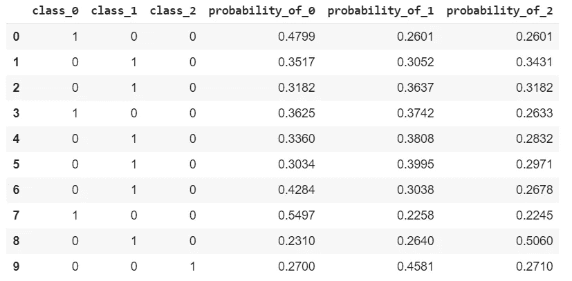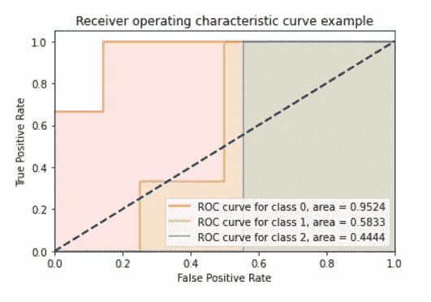

OneVsAll AUC 衡量分类器区分一类对象与另一类对象的能力。

OneVsAll 的一个优势是能够分别监控不同类的性能。

# AUCμ

AUCμ可用作评估度量以防止过度拟合，而 OneVsAll AUC 仅可用于包含 k 值的信息(k 是类的数量)。

让我们来看看 AUCμ公式:


*K* 是班数， *i < j ≤ K* 是班数。

*S(i，j)* 是类 *i* 和 *j* 之间的可分性度量，定义为:


在哪里

*   *I* 是应用于 *O* 结果的指示函数，如果 O*返回正值则返回 1，如果*O*返回负值则返回 0，如果*O*返回 0 则返回 0.5。*
*   *O* 是一个方向函数，指示两个实例的顺序是正确、错误还是相同。如果预测排序正确，则返回正值；如果排序错误，则返回负值；如果排序相同，则返回 0。
*   *a，b* 分别是来自类 *i，j* 的对象，
*   *p(a)，p(b)* 是对象属于类别的预测概率的向量，
*   *y(a)，y(b)* 是对象的真标签 *a，b* (一热向量)，
*   *vᵢ ⱼ* 是一个两类决策超平面法向量。

*O* 计算如下:


向量 *v_i，j* 来自误分类代价矩阵 *A* ，该矩阵是在学习任务之后手动定义的。

*vᵢ ⱼ=A ᵢ.—ⱼ.*

一个 *ᵢ ⱼ* 是当实例的真实类是 *j* 时，将实例分类为类 *i* 的成本。然后，A 在*(k1)*—单纯形上定义一个划分，并归纳出 *K* 类之间的决策边界。

默认的误分类成本矩阵值在任何地方都是 1，除了对角线上的值是 0。它被称为 argmax 划分矩阵，因为它以最大概率分配一个类。

这是一个具有 argmax 划分矩阵 a 的 3 类分类问题的划分。对于使用定义的划分矩阵，边界(由箭头标记)被移动。

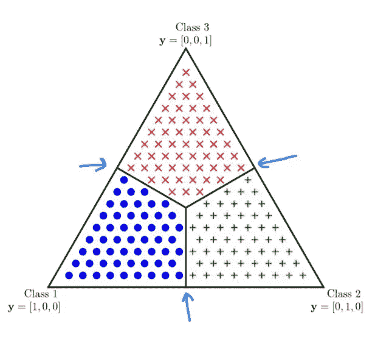

请关注文章了解更多详情。

CatBoost 允许我们设置误分类成本矩阵 A 和对象的权重来计算 AUCμ。

让我们计算一个非常小的例子的 AUCμ，这个例子有 3 个类和 4 个对象:

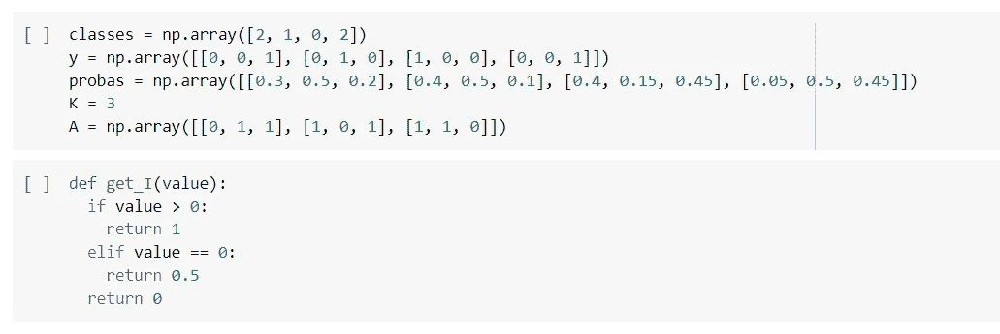

让我们计算每个有序类对的 S(i，j ):

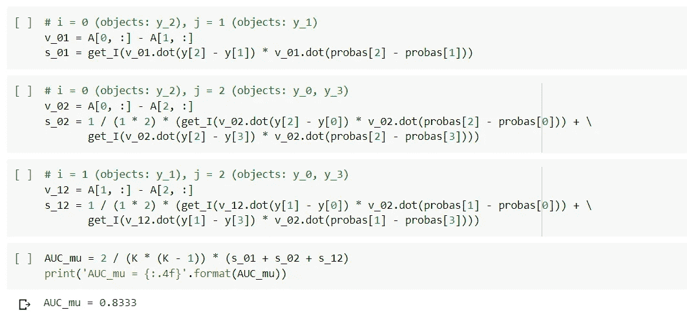

让我们用 Catboost AUCμ计算相同的指标，并确保一切都是正确的:

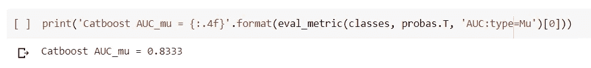

我们可以看到 AUCμ相当高，但实际上，算法性能很差，精度为 0.25。因此，在培训期间评估其他重要指标是合理的。

AUCμ是评估算法在多分类问题中分类能力的一个很好的概括度量。在文章的[第 4.3 节中可以看到更多关于多类 AUC 计算的不同方法及其特性。](http://proceedings.mlr.press/v97/kleiman19a/kleiman19a.pdf)

AUCμ可以解释为类别之间成对 AUC 的平均值。与 OneVsAll AUC 不同，AUCμ是单个值，因此它可以在用于过拟合检测和树修剪的训练期间用作评估度量。

# 排名的 AUC

对于 CatBoost 中的排名，有两种不同的 AUC。

## 经典 AUC

用于具有对数损失和交叉熵损失函数的模型。它具有与二元分类的 AUC 相同的公式:


*aᵢ* ， *aⱼ* —预测对象的等级 *i，j* 。

对所有对象对 *i，j* 计算总和，使得: *tᵢ=0，tⱼ=1* 其中 *t* 是相关的。


上面的公式适用于目标值等于 1 和 0 的简单任务。如果我们有更多的目标值呢？

如果目标类型不是二进制，那么具有目标值 *t* 和权重 *w* 的每个对象 *i* 被替换为两个对象用于度量计算:

*   *重量 *wt* 目标值为 1 的σ₁*
*   *重量为*w(1t)*的σ₂* ，目标值为 0。

目标值必须在范围*[0；1]* 。

让我们为一个小例子计算排名的经典 AUC。假设我们有 2 个文档，2 个请求，相应的相关性在范围[1，5]内，预测相关性在范围[0，1]内:

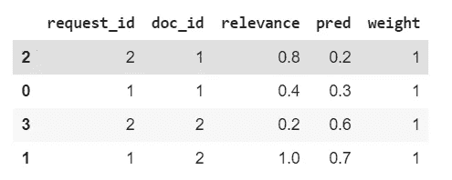

数据预处理后(详见笔记本),我们得到:

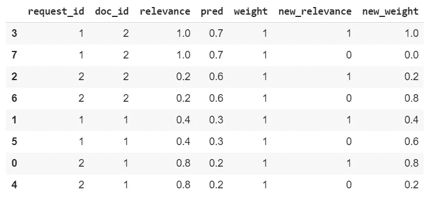

让我们计算 AUC:

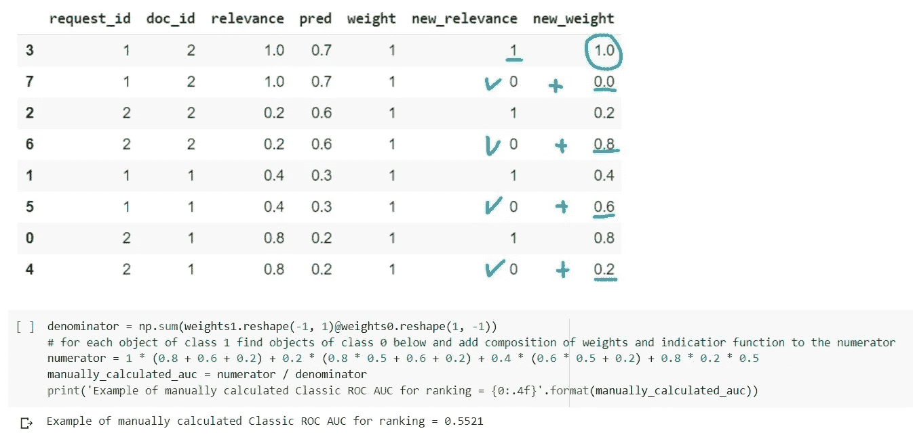

# 排名 AUC

AUC 排名用于损失函数排名。


*aᵢ，*是预测对象的等级 *i，j* 。

对所有对象对 *i，j* 计算总和，使得: *tᵢ < tⱼ* 其中 *t* 是相关的。


排名 AUC 直接衡量正确排名对的数量。问题是指标的计算不考虑组。在我们的例子中，我们有组(请求),并且我们可能想要测量组内的质量，但是目前，AUC 是在数据集上计算的，并且如果例如一个请求的前一个文档的排名低于另一个文档的前一个文档，而真实排名相反(但是仍然是每个文档的前一个),则 AUC 惩罚我们。

AUC 用于排序的另一个问题是，它没有将顶部对象与其他对象区分开来。如果我们有许多不相关的文档，这些文档被模型排序为不相关，但排名在前 10 位，AUC 可能仍然很高，因为不相关对象的“尾巴”比相关对象的排名低。

# 概观

AUC 是一种广泛使用的度量标准，用于衡量模型区分类别和正确排序来自不同类别/具有不同相关性的对象的能力。AUC 是不可微的，因此不能用作损失函数，但作为一种度量，它提供了很多信息，非常有用。

我们研究了以下 AUC 类型:

*   二元分类的 AUC。这是一个经典的度量标准，用来衡量模型的质量。ROC 曲线允许选择概率阈值以满足所需的假阳性或假阴性率。
*   多类分类的 AUC:OneVsAll 和 AUCμ。OneVsAll AUC 有助于控制每个类的算法性能，但不能用作防止过度拟合的度量。相反，AUCμ是一个很好的概括指标，但是不能检测一个类的问题。
*   排名的 AUC:经典 AUC 和排名 AUC。AUC 适合于排序任务，因为它被设计成测量算法如何区分类别，并且它简单地转移到区分相关和不相关的对象。但是 AUC 没有考虑到在排序问题中，前 n 个位置非常重要，并且平等地对待每个正确排序的文档对。

要更深入地了解数据处理、计算细节以及在 CatBoost 中使用 AUC 的示例，请参见 iPython 笔记本，代码见 [CatBoost 教程](https://github.com/catboost/catboost/blob/master/catboost/tutorials/metrics/AUC_tutorial.ipynb)。