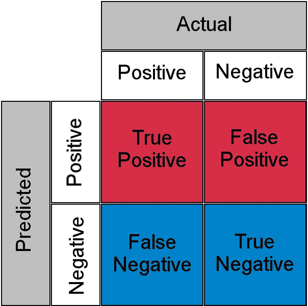
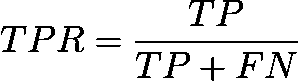
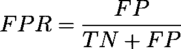
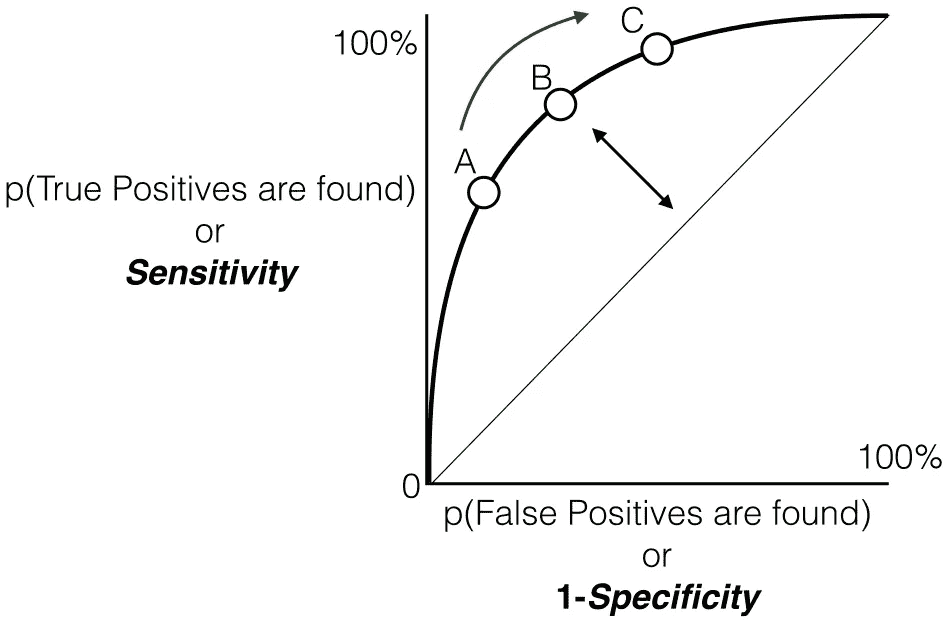
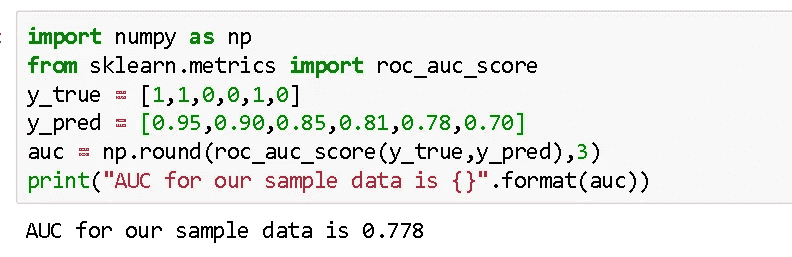
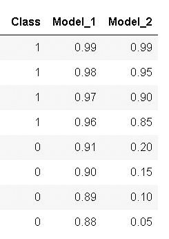
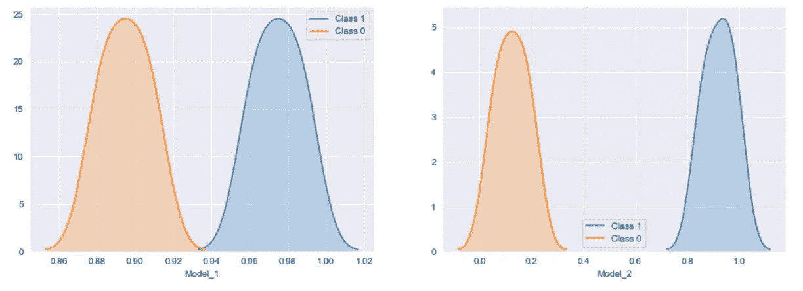

# AUC-ROC:简化

> 原文：<https://towardsdatascience.com/auc-roc-simplified-5914185d24e?source=collection_archive---------35----------------------->

## 直觉的理解


来源:https://pxhere.com

# 介绍

机器学习的一个重要方面是模型评估。你需要一些机制来评估你的模型。这就是这些性能指标发挥作用的地方，它们让我们感觉到你的模型有多好。如果你熟悉机器学习的一些基础知识，那么你必须了解这些指标，如准确度、精确度、召回率、auc-roc 等。

假设您正在处理一个二元分类问题，并提出了一个准确率为 95%的模型，现在我问您这实际上意味着什么，您可以很快说出您的模型做出的 100 个预测中，有 95 个是正确的。让我们更进一步，现在基本的指标是回忆，我问同样的问题，你可能会花一点时间，但最终你会得出一个解释，比如在 100 个相关数据点(一般为正类)中，你的模型能够识别其中的 80 个。到目前为止，我们假设您使用 AUC-ROC 作为指标评估您的模型，得到 0.75 的值，我再次问您同样的问题，0.75 或 75%意味着什么，现在您可能需要思考一下，有些人可能会说模型有 75%的机会正确识别数据点，但现在您应该已经意识到不是这样。让我们试着对分类问题中最流行的一个性能指标有一个直观的理解。

# 历史

如果你参加过任何在线机器学习竞赛/黑客马拉松，那么你一定遇到过曲线下面积-接收器操作员特征，也称为 AUC-ROC，其中许多人将它作为他们分类问题的评估标准。让我们承认，当你第一次听说它的时候，你一定有过这样的想法，这个又长又花哨的名字是怎么回事？ROC 曲线的起源可以追溯到第二次世界大战，它最初用于分析雷达信号。美国陆军试图测量他们的雷达接收机在信号噪声中正确识别日本飞机的能力。现在我们有了一个小小的起源故事，让我们进入正题

# 几何解释

这是你在谷歌上搜索 AUC-ROC 时会遇到的最常见的定义。基本上，ROC 曲线是显示分类模型在所有可能阈值下的**性能的图表(阈值是一个特定值，超过该值，您就说某个点属于特定类别)。曲线绘制在两个参数之间**

*   真阳性率
*   假阳性率(FPR)

在理解 TPR 和 FPR 之前，让我们先快速看一下混淆矩阵。



来源:[知识共享](https://creativecommons.org/licenses/by-sa/4.0/deed.en)

*   **真阳性**:实际阳性和预测阳性
*   **真阴性**:实际阴性，预测为阴性
*   **假阳性(I 型错误)**:实际阴性但预测为阳性
*   **假阴性(II 型错误)**:实际阳性但预测为阴性

简单来说，你可以把假阳性称为**假报警**，把假阴性称为**漏警*。*** 现在让我们看看 TPR 和 FPR 是什么情况。



作者图片



作者图片

基本上，TPR/回忆/灵敏度是正确识别的阳性样本的比率**，FPR 是错误分类的阴性样本的比率**，如前所述，ROC 只不过是 TPR 和 FPR 之间跨越所有可能阈值的图，AUC 是该 ROC 曲线下的整个面积。****

********

****来源:[知识共享](https://creativecommons.org/licenses/by-sa/3.0/deed.en)****

# ****概率解释****

****我们看了几何解释，但我想这仍然不足以开发 0.75 AUC 实际含义背后的直觉，现在让我们用概率的观点看一下 AUC-ROC。****

****让我先谈谈 AUC 的工作，稍后我们将在此基础上建立我们的理解****

> ****AUC 衡量模型区分类别的能力****

****0.75 的 AUC 实际上意味着假设我们取属于不同类别的两个数据点，那么有 75%的机会模型能够分离它们或者正确地对它们进行**排序**，即正点比负类具有更高的预测概率。(假设较高的预测概率意味着该点理想情况下属于正类)****

****下面举个小例子，让事情更清楚。****

```
**╔═══════╦═══════╦═════════════╗
║ Index ║ Class ║ Probability ║
╠═══════╬═══════╬═════════════╣
║ P1    ║     1 ║ 0.95        ║
║ P2    ║     1 ║ 0.90        ║
║ P3    ║     0 ║ 0.85        ║
║ P4    ║     0 ║ 0.81        ║
║ P5    ║     1 ║ 0.78        ║
║ P6    ║     0 ║ 0.70        ║
╚═══════╩═══════╩═════════════╝**
```

****这里我们有 6 个点，其中 P1、P2、P5 属于第 1 类，P3、P4、P6 属于第 0 类，并且在概率列中有相应的预测概率，正如我们说过的，如果我们取两个属于不同类的点，那么模型秩正确排序它们的概率是多少****

****我们将采取所有可能的配对，这样一个点属于类 1，另一个点属于类 0，我们将有总共 9 个这样的配对，下面是所有这 9 个可能的配对****

```
**╔═══════╦═════════╦═══════════╗
║ Index ║  Pair   ║ IsCorrect ║
╠═══════╬═════════╬═══════════╣
║     1 ║ (P1,P3) ║ Yes       ║
║     2 ║ (P1,P4) ║ Yes       ║
║     3 ║ (P1,P6) ║ Yes       ║
║     4 ║ (P2,P3) ║ Yes       ║
║     5 ║ (P2,P4) ║ Yes       ║
║     6 ║ (P2,P6) ║ Yes       ║
║     7 ║ (P3,P5) ║ No        ║
║     8 ║ (P4,P5) ║ No        ║
║     9 ║ (P5,P6) ║ Yes       ║
╚═══════╩═════════╩═══════════╝**
```

****此处，列 **isCorrect** 表示所提及的点对是否是基于预测概率的正确排序，即 1 类点比 0 类点具有更高的概率，在这 9 个可能的点对中的 7 个中，1 类点的排序高于 0 类点，或者我们可以说，如果选择一对属于不同类的点，模型将有 77%的机会能够正确区分它们。沃拉。现在，我认为您可能对这个 AUC 数字有一点直觉，只是为了澄清任何进一步的疑问，让我们使用 scikit learn 的 AUC-ROC 实现来验证它****

********

****AUC 验证的样本代码(图片由作者提供)****

# ****何时使用****

****尽管如此，AUC-ROC 在某些地方可能并不理想。****

*   ****AUC-ROC 在数据集严重失衡的情况下效果不佳，为了给出一些直觉，让我们回顾一下这里的几何解释。基本上 ROC 是 TPR 和 FPR 之间的情节(假设少数阶级是积极阶级)，现在让我们再次仔细看看 FPR 公式****

********

****作者图片****

****FPR 的分母有一个真阴性作为一个因素，因为阴性类占多数。FPR 的分母由真阴性主导，这使得 FPR 对少数类预测的任何变化不太敏感(由于分母较高，假阳性数字的任何变化在 FPR 没有得到适当反映)。为了克服这个问题，使用精确召回曲线代替接收方操作者特征曲线，然后计算 AUC，尝试自己回答这个问题精确召回曲线如何处理这个问题*(提示:比较 PR 曲线和 ROC 输入，召回和 TPR 是相同的，技术上只有 FPR 被精确代替，只需比较两者的分母，并尝试评估 PR 曲线中不平衡问题是如何解决的)*****

*   ****AUC-ROC 试图衡量分类的等级排序是否正确，它没有考虑实际预测的概率，让我用一小段代码来说明这一点****

```
**import pandas as pdy_pred_1 = [0.99,0.98,0.97,0.96,0.91,0.90,0.89,0.88]
y_pred_2 = [0.99,0.95,0.90,0.85,0.20,0.15,0.10,0.05]
y_act = [1,1,1,1,0,0,0,0]
test_df = pd.DataFrame (zip(y_act,y_pred_1,y_pred_2),columns=['Class','Model_1','Model_2'])
test_df**
```

********

****两个样本模型(图片由作者提供)****

****如上所述，我们有两个模型 Model_1 和 Model_2，这两个模型都很好地隔离了这两个类别，但是如果我让你从它们中选择一个，你会选择哪一个，请稍等片刻，让我先画出这些模型的概率。****

```
**import matplotlib.pyplot as pltcols = ['Model_1','Model_2']
fig,axs = plt.subplots(1,2,figsize=(15,5))
for index,col in enumerate(cols): 
    sns.kdeplot(d2[d2['Status']==1][col],label="Class 1",shade=True,ax=axs[index])
    sns.kdeplot(d2[d2['Status']==0][col],label="Class 0",shade=True,ax = axs[index])
    axs[index].set_xlabel(col)
plt.show()**
```

********

****预测概率分布(图片由作者提供)****

****如果之前有任何轻微的疑问，我想现在你的选择将是非常清楚的，Model_2 是一个明显的赢家。但两者的 AUC-ROC 值是相同的，这是它的缺点，它只是测量模型是否能够正确地对类进行排序，它不查看模型区分两个类的程度，因此，如果您需要使用实际预测的概率，那么 AUC-ROC 可能不是正确的选择，对于那些好奇的人来说，log loss 是解决此问题的一种度量****

****因此，理想情况下，当数据集没有严重的不平衡，并且您的用例不要求您处理实际预测的概率时，应该使用 AUC-ROC。****

# ******多类别的 AUC******

****对于多类设置，我们可以简单地使用一个对所有的方法，每个类都有一条 ROC 曲线。假设您有四个类别 A、B、C、D，那么所有四个类别都有 ROC 曲线和相应的 AUC 值，即，一旦 A 是一个类别，B、C 和 D 组合起来就是其他类别，类似地 B 是一个类别，A、C 和 D 组合起来就是其他类别，等等。****

# ****结束注释****

****AUC-ROC 是您在处理分类问题时会经常遇到的东西，无论是在线黑客马拉松还是您的组织中分配给您的项目。我希望我能够对 AUC-ROC 到底是什么以及何时使用它给出一些基本的理解。如果您想讨论什么或有任何建议，可以通过以下方式联系我:****

****领英:【https://www.linkedin.com/in/ravindra-sharma-832a04156 ****

# ****参考****

****[1]: [《利用受试者工作特征(ROC)曲线分析分类模型:历史兴趣的最后注解》](http://www.math.utah.edu/~gamez/files/ROC-Curves.pdf) (PDF)。*犹他大学数学系*。犹他大学数学系。检索于 2017 年 5 月 25 日****