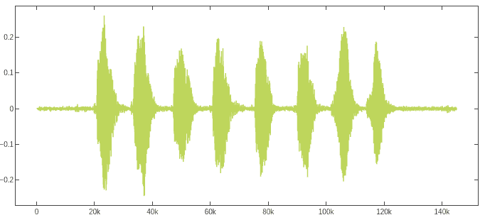
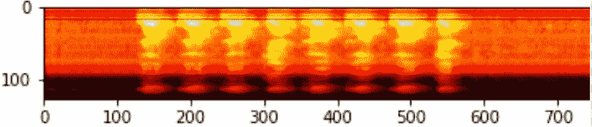
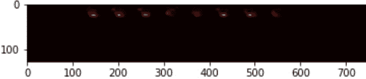
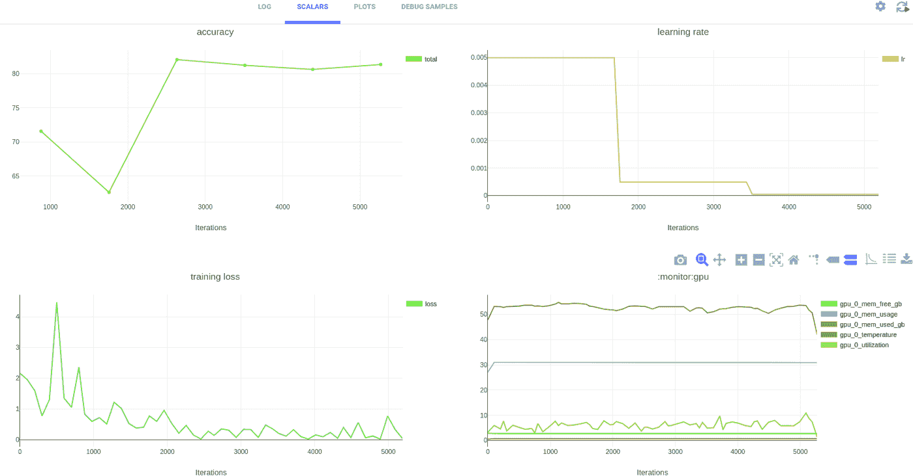
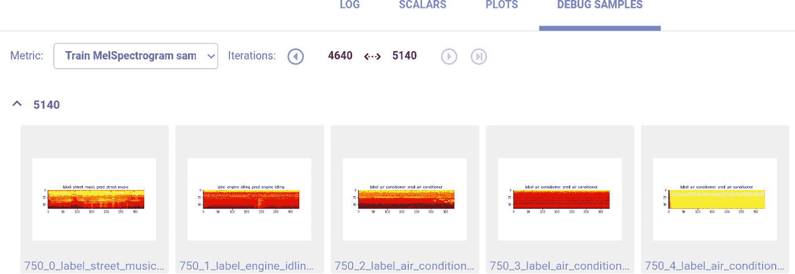
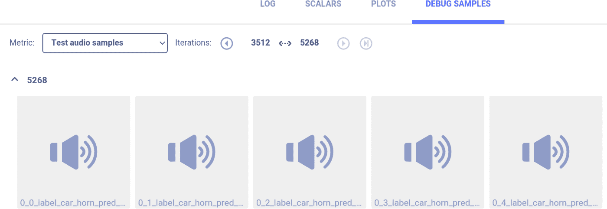

# 使用 PyTorch 的生态系统工具进行音频分类

> 原文：<https://towardsdatascience.com/audio-classification-with-pytorchs-ecosystem-tools-5de2b66e640c?source=collection_archive---------20----------------------->

## PYTORCH 生态系统

## torchaudio 和 Allegro 列车介绍

torchaudio 和 Allegro 列车的音频分类

音频信号无处不在。因此，对各种场景的音频分类越来越感兴趣，从听力受损者的火警检测，通过用于维护目的的引擎声音分析，到婴儿监控。虽然音频信号本质上是时间性的，但在许多情况下，可以利用图像分类领域的最新进展，并使用流行的高性能卷积神经网络进行音频分类。在这篇博文中，我们将通过使用将音频信号转换到频域的流行方法来演示这样一个例子。

这篇博文是关于如何利用 PyTorch 的生态系统工具轻松启动 ML/DL 项目的系列文章的第三篇。之前的博文主要关注[图像分类](https://allegro.ai/blog/ml-dl-engineering-made-easy-with-pytorch-and-allegro-trains/?utm_source=pytorch_blog&utm_medium=referral&utm_campaign=trains_c&utm_content=audioclass)和[超参数优化](https://allegro.ai/blog/accelerate-hyperparameter-optimization-with-pytorchs-ecosystem-tools/?utm_source=pytorch_blog&utm_medium=referral&utm_campaign=trains_c&utm_content=audioclass)。在这篇博文中，我们将展示如何使用 [Torchaudio](https://pytorch.org/audio/) 和 [Allegro Trains](https://allegro.ai/trains-open-source/?utm_source=pytorch_blog&utm_medium=referral&utm_campaign=trains_c&utm_content=audioclass) 实现简单高效的音频分类。

# 基于卷积神经网络的音频分类

近年来，卷积神经网络(CNN)已被证明在图像分类任务中非常有效，这导致了各种架构的设计，如 Inception、ResNet、ResNext、Mobilenet 等。这些 CNN 在图像分类任务上实现了最先进的结果，并提供了各种现成的经过预先训练的骨干。因此，如果我们能够将音频分类任务转移到图像领域，我们将能够利用这些丰富的主干来满足我们的需求。

如前所述，我们希望将音频信号转换成图像，而不是直接使用声音文件作为振幅与时间信号。以下预处理是使用[这个脚本](http://t.allegro.ai/code_pytorch_audioclassification)在 [YesNo](https://pytorch.org/audio/datasets.html#yesno) 数据集上完成的，该数据集包含在 [torchaudio 内置数据集](https://pytorch.org/audio/datasets.html)中。

作为预处理的第一阶段，我们将:

*   **使用 torchaudio 读取音频文件**
*   **以固定的采样率对音频信号进行重新采样** —这将确保我们将使用的所有信号都具有相同的采样率。理论上，采样信号可以代表的最大频率略低于采样率的一半(称为[奈奎斯特频率](https://en.wikipedia.org/wiki/Nyquist_frequency))。由于 20 kHz 是人类通常能听到的最高频率，44100 Hz 的采样率被认为是最受欢迎的选择。然而，在许多情况下，为了减少每个音频文件的数据量，移除较高的频率被认为是合理的。因此，对于低比特率的 MP3 文件，20050 Hz 的采样率已经相当普遍。在我们的例子中，我们将使用这个采样率。
*   **创建单声道音频信号** —为简单起见，我们将确保我们使用的所有信号都有相同数量的声道。

**这种预处理的代码如下:**

**生成的 matplotlib 图如下所示:**

来自 YESNO 数据集的音频信号时间序列

现在是时候将这个时序信号转换到图像域了。我们将通过将其转换为频谱图来实现，频谱图是信号频谱随时间变化的直观表示。为此，我们将使用对数标度的 mel 谱图。mel 频谱图是一种频谱图，其中频率被转换为 mel 标度，Mel 标度考虑了这样一个事实，即人类在较低频率下比在较高频率下更善于检测差异。mel 音阶会转换频率，使音高距离相等的人听起来距离相等。

因此，让我们使用 torchaudio 转换，并将以下代码行添加到我们的代码片段中:

现在，音频文件被表示为二维频谱图图像:

Mel 光谱图(上图)及其对数标度版本(下图)

这正是我们想要实现的。音频分类问题现在转化为图像分类问题。

# 使用 Allegro-Trains、torchaudio 和 torchvision 进行音频分类

Pytorch 的生态系统包括各种开源工具，可以启动我们的音频分类项目，并帮助我们管理和支持它。在这篇博客中，我们将使用其中的三种工具:

*   [Allegro Trains](https://allegro.ai/trains-open-source/?utm_source=pytorch_blog&utm_medium=referral&utm_campaign=trains_c&utm_content=audioclass) 是一款开源的机器学习和深度学习实验管理器和 MLOps 解决方案。它提高了人工智能团队的效率和生产力，以及本地和云 GPU 的利用率。Allegro Trains 帮助研究人员和开发人员零集成地管理复杂的机器学习项目。
*   [Torchaudio](https://pytorch.org/audio/) 是一个由 I/O 函数、流行数据集和常见音频转换组成的包。
*   [Torchvision](https://pytorch.org/docs/stable/torchvision/index.html) 是一个由流行的数据集、模型架构和计算机视觉的通用图像转换组成的包。

为了简单起见，我们不会在这个博客中解释如何安装一个 [Trains-server](http://t.allegro.ai/git_trains_server_p1) 。因此，实验将被记录在 Allegro Trains [演示服务器](http://t.allegro.ai/demo_pytorch_audioclassification)上。有关如何部署自托管 Trains 服务器的更多信息，请参见 Allegro Trains [文档](https://allegro.ai/docs/deploying_trains/trains_deploy_overview/?utm_source=pytorch_blog&utm_medium=referral&utm_campaign=trains_c&utm_content=audioclass)。

出于本博客的目的，我们将使用 [UrbanSound8K](https://urbansounddataset.weebly.com/urbansound8k.html) 数据集，该数据集包含来自 10 个类别的 8732 个带标签的声音摘录(< =4s)，包括狗叫、警笛和街头音乐。我们将使用预训练的 ResNet 模型来分类这些音频文件。

**我们将从初始化 Allegro Trains 来跟踪我们所做的一切开始:**

接下来，我们将确保代码中没有隐藏“神奇数字”,并且所有脚本参数都反映在实验管理器 web 应用程序中。当编写 python 脚本时，可以使用流行的 argparse 包，Allegro Trains 会自动拾取它。在我们编写 Jupyter 笔记本示例时，我们将定义一个配置字典，并将其连接到 Allegro Trains 任务对象:

现在是时候定义我们的 PyTorch 数据集对象了。这个对象应该包括数据加载和数据预处理。数据集元数据的加载在类的构造函数中完成，并基于 UrbanSound8K 数据集结构进行配置。因此，它将如下所示:

接下来我们要做的是定义 Dataset 类的 __ *getitem__* 方法。如前所述，我们希望这部分执行几个预处理步骤:

1.  加载音频文件
2.  将其重新采样到预配置的采样速率，注意这里这样做是为了简单起见。对音频文件进行重新采样是一项耗时的功能，会显著降低训练速度，并导致 GPU 利用率下降。建议在训练周期之前对所有文件执行该预处理功能。
3.  将其转换成单声道音频信号
4.  将其转换成 Mel 频谱图信号

除此之外，我们希望所有转换后的信号具有相同的形状。因此，我们将把所有 Mel 光谱图裁剪到一个预先配置的长度，并把比这个长度短的光谱图补零。结果应该是这样的:

现在最精彩的部分来了。由于我们已经将问题从音频域转换到图像域，所以我们不需要担心定义模型。我们可以使用 Torchvision 自带的内置模型之一。我们决定选择有效且健壮的 ResNet 模型。由于数据集很小，我们希望降低过度拟合的风险，因此我们将使用小而有效的 ResNet18 模型。除了我们刚刚采取的这个伟大的捷径，Torchvision 使我们能够加载在 Imagenet 上预先训练的模型，因此训练将更短，更有效。

我们需要做的就是使模型的输入层和输出层适应我们的数据。这很容易做到，如下所示:

就是这样！我们可以开始训练我们的模型了。在这篇博客中，我们不会讨论培训和评估循环的结构。它们非常简单明了——你可以在[完整笔记本](http://t.allegro.ai/UrbanSound8)中查找它们。我们只需注意，在训练和评估过程中，我们确保将音频信号、标量(损耗、精度)和频谱图报告给 PyTorch 的内置 TensorBoard 类，以便进行调试。Allegro Trains 会自动拾取发送到 TensorBoard 的所有报告，并将它们记录在 web 应用程序中您的实验下。

我们剩下要做的就是使用[火车代理](http://t.allegro.ai/git_trains_agent_p1)在本地或远程机器上执行我们的 Jupyter 笔记本，并在 [Allegro Trains 的 web 应用](http://t.allegro.ai/demo_pytorch_audioclassification)上观看我们的培训进度。

Allegro Trains webapp 中标量报告的快照

因为我们确保每隔几个迭代就报告调试数据，所以我们可以检查 Allegro Trains webapp 中的调试样本部分，并确保输入模型的数据是有意义的。我们可以听原始音频信号或检查频谱图:

Mel 光谱图调试报告的快照

音频调试样本的快照

# 摘要

自动音频分类是一个不断发展的研究领域，包括语音、音乐和环境声音等领域。这一新兴领域可以极大地受益于丰富的经验和为计算机视觉任务开发的各种工具。因此，利用 PyTorch 生态系统开源工具可以推动您的音频分类机器学习项目。您不仅可以享受一套免费的开源生产力工具，还可以通过将信号从时域转换到频域，使用一套强大且经过验证的预训练计算机视觉模型。

在本教程中，我们演示了如何使用 Tochaudio、Torchvision 和 Allegro Trains 来完成简单有效的音频分类任务。通过零集成工作和零成本，您可以获得一个通用的培训和评估脚本。要了解更多信息，请参考[快板列车文件](https://allegro.ai/docs/?utm_source=pytorch_blog&utm_medium=referral&utm_campaign=trains_c&utm_content=audioclass)、[火炬广播文件](https://pytorch.org/audio)和[火炬广播文件](https://pytorch.org/docs/stable/torchvision/index.html)。

在本系列的下一篇博文中，我们将展示如何使用 PyTorch 生态系统轻松创建机器学习管道。这对于我们有重复任务序列的情况非常有效。比如预处理和训练，就像我们在这篇博文开头提到的。

*原载于 2020 年 10 月 18 日*[*https://allegro . ai*](https://allegro.ai/blog/audio-classification-with-pytorchs-ecosystem-tools/)*。*