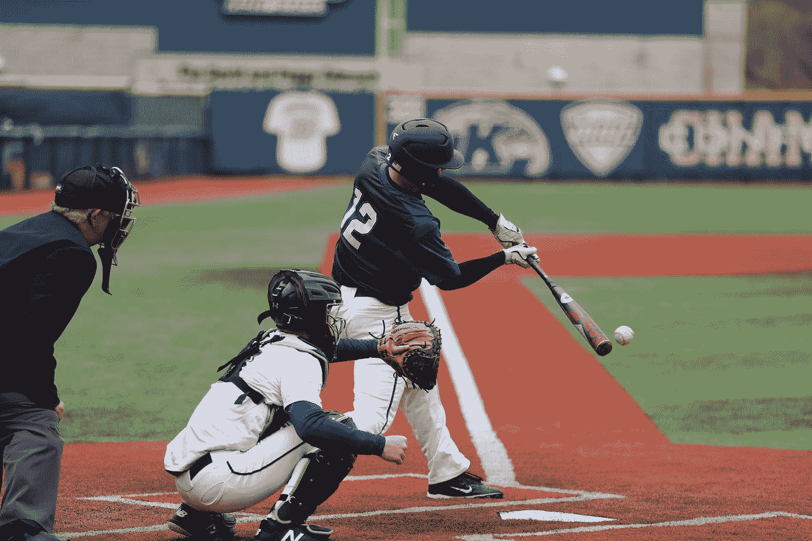
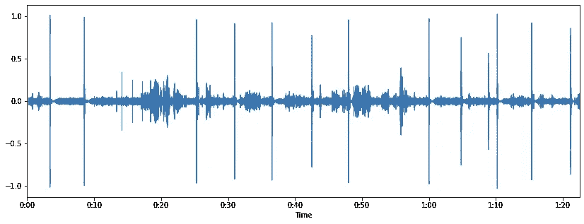
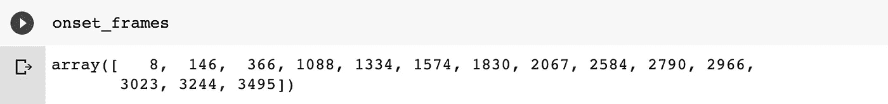
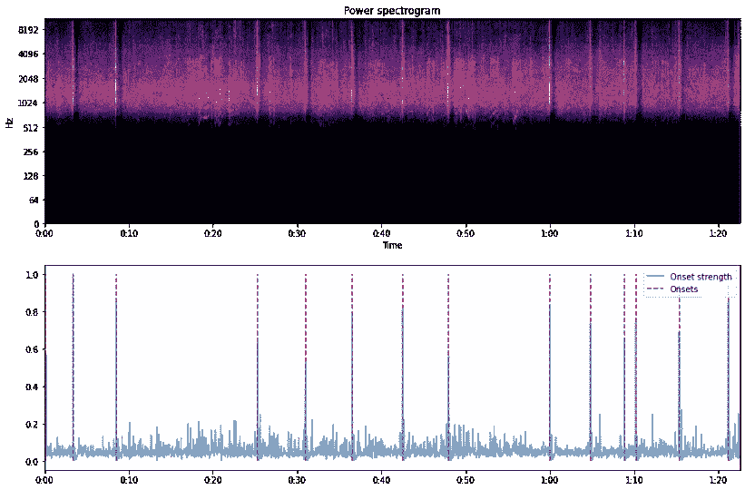
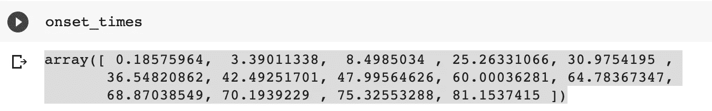
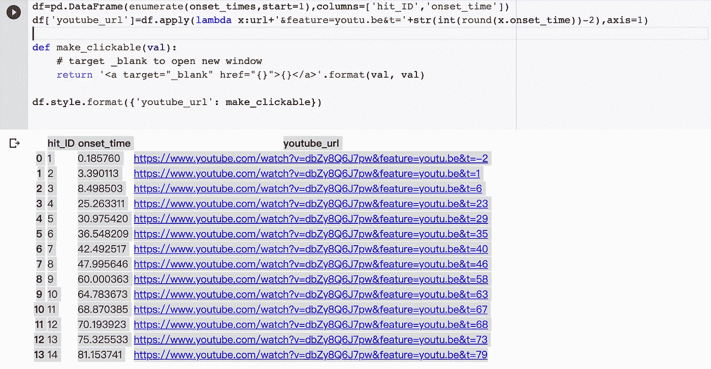

# 音频开始检测:使用 Librosa 为棒球应用程序准备数据

> 原文：<https://towardsdatascience.com/audio-onset-detection-data-preparation-for-a-baseball-application-using-librosa-7f9735430c17?source=collection_archive---------30----------------------->

## 使用声音来识别视频中的击球时间



[周隼](https://unsplash.com/@chris_chow?utm_source=medium&utm_medium=referral)在 [Unsplash](https://unsplash.com?utm_source=medium&utm_medium=referral) 上拍照

# 介绍

我希望为棒球应用程序建立一个深度学习项目，其中一个挑战是数据收集。我需要很多击球手击球的短片。但是我在网上找不到这种数据集，因此，我决定自己收集和制作数据集。

我发现的大多数棒球击球视频在一个长视频剪辑中包含多次击球，例如:

我需要找到击球的瞬间，把它们剪下来，分成短片。一种简单的方法是手工操作，但是这非常费时费力。

我需要一个工具来自动完成这项工作。

受郑健国作品《[用深度学习视频分析](https://tht.fangraphs.com/building-a-robot-umpire-with-deep-learning-video-analysis/)构建机器人裁判》的启发，我决定尝试一下 ***【发病检测】*** 。

经过一些研究和阅读教程，如[这个](https://musicinformationretrieval.com/onset_detection.html)，我使用 **librosa 的发作检测**功能。

# 加载视频

第一步是从 YouTube 下载并加载视频。我用 [pafy](https://pythonhosted.org/pafy/) 做的。

```
filename='batting_pratice' 
url='https://www.youtube.com/watch?v=dbZy8Q6J7pw' 
video = pafy.new(url)
clip = video.getbest(preftype="mp4")
clip.download()
os.rename(clip.filename,filename+'.mp4')
```

该视频现已下载并保存为“batting _ pratice.mp4”

# 加载音频

然后我可以用 [librosa](https://librosa.org/doc/latest/index.html) 加载音频。

```
x, sr = librosa.load(filename+'.mp4')
```

如果你感兴趣就去玩吧。

```
ipd.Audio(data=x, rate=sr)
```

并绘制波形图

```
plt.figure(figsize=(14, 5))
librosa.display.waveplot(x, sr=sr)
plt.show()
```



音频波形图(图片由作者提供)

你可以看到有一些尖刺，是击球的声音。工作是确定它们的时间。

# 应用过滤器

一个额外的步骤是使用高通滤波器过滤一些低频噪声。可以使用 scipy 来完成。

```
from scipy.signal import butter,filtfilt**def** butter_highpass(data,cutoff, fs, order=5):
   """
   Design a highpass filter.
   Args:
   - cutoff (float) : the cutoff frequency of the filter.
   - fs     (float) : the sampling rate.
   - order    (int) : order of the filter, by default defined to 5.
   """
   # calculate the Nyquist frequency
   nyq = 0.5 * fs
   # design filter
   high = cutoff / nyq
   b, a = butter(order, high, btype='high', analog=False)
   # returns the filter coefficients: numerator and denominator
   y = filtfilt(b, a, data)
   return yx_f=butter_highpass(x,1000, sr, order=5)
```

# 发病检测

然后我们可以开始发作检测，我们使用 *librosa.onset* 。详细介绍可以在他们的 [doc](https://librosa.org/doc/latest/generated/librosa.onset.onset_detect.html#librosa.onset.onset_detect) 中找到。

```
o_env = librosa.onset.onset_strength(x_f, sr=sr)
times = librosa.frames_to_time(np.arange(len(o_env)), sr=sr)
onset_frames = librosa.util.peak_pick(o_env, 3, 3, 3, 5, 0.3, 100)
```

在这之后，我们应该看到存储在 onset_frames 中的峰值。



然后我们可以绘制它并检查。

```
D = np.abs(librosa.stft(x_f))plt.figure(figsize=(15,10))ax1 = plt.subplot(2, 1, 1)
librosa.display.specshow(librosa.amplitude_to_db(D, ref=np.max),
x_axis='time', y_axis='log')
plt.title('Power spectrogram')plt.subplot(2, 1, 2, sharex=ax1)
plt.plot(times, o_env, label='Onset strength')
plt.vlines(times[onset_frames], 0, o_env.max(), color='r', alpha=0.9,
linestyle='--', label='Onsets')plt.axis('tight')
plt.legend(frameon=True, framealpha=0.75)
plt.show()
```



发病检测(图片由作者提供)

看起来我们确定了所有的发病点。

现在，我们可以将 onset_frames 转换为时间:

```
onset_times = librosa.frames_to_time(onset_frames)
```

这会返回一个时间数组。



然后，我们可以将数据放入数据帧中，并在特定时间创建 youtube URLs。



检查其中一个[示例](https://www.youtube.com/watch?v=dbZy8Q6J7pw&feature=youtu.be&t=29)。成功了！

# 切断视频

然后，我们可以使用计时将视频剪切成短片。我想要 3 秒的剪辑，所以我从(开始时间-1.5)到(开始时间+1.5)开始。这可以使用 ffmpeg 来完成。

```
for hit_time in onset_times:ffmpeg_extract_subclip(filename+'.mp4',round(hit_time)-1.5,    
     round(hit_time)+1.5,  
     targetname=filename+'/'+filename+'_'+str(int(hit_time))+".mp4")
```

现在，我有了一个工具，可以根据声音来检测击球，并自动进行切割。下一步将使用该工具收集更多数据，用于进一步培训。

感谢阅读。欢迎提出建议和意见。

在这里支持我:【https://medium.com/@c.kuan/membership】T2