# 具有深度学习的音频源分离

> 原文：<https://towardsdatascience.com/audio-source-separation-with-deep-learning-e7250e8926f7?source=collection_archive---------11----------------------->

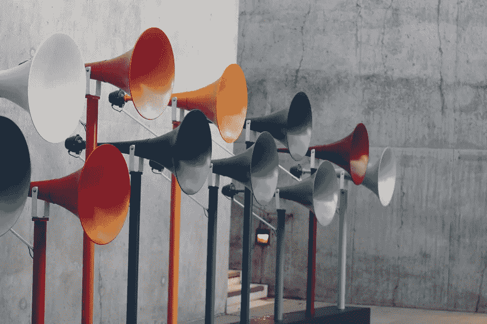

## 基本上是一种听觉超能力

## 作者:阿卡什·库马尔、桑尼·卡雷尔、普拉吉瓦尔·波卡雷尔、卡尼什克·辛格、凯莉·特雷维尼奥和米盖尔·加尔萨

想象一下，走进一个拥挤嘈杂的自助餐厅，能够将你听到的所有噪音“解混”到各自的扬声器中。这就是音频源分离的问题:将输入的混合音频信号分解成它最初来自的源。

音频源分离，也称为鸡尾酒会问题，是音频领域最大的问题之一，因为它在许多情况下都有实际用途:识别歌曲的人声，帮助聋人在嘈杂的区域听到扬声器，在逆风骑自行车时隔离电话中的声音，你会明白这一点。

我们提出了一种利用深度学习的优势来解决这个问题的方法。

# 我们的数据

在处理这个问题时，我们使用了 UrbanNoise8K 和 LibriSpeech 数据集。UrbanNoise 数据集为我们提供了各种背景噪音，而 LibriSpeech 数据集为我们提供了各种人在没有任何背景噪音的情况下阅读一本书。我们自己为音调分离生成音调。

# 我们的方法

在对该主题进行初步研究后，我们决定使用频谱图来处理音频，而不是原始波形。虽然 Lyrebird 的 MelGAN 和 OpenAI 的全新 Jukebox 在生成原始音频波形方面取得了成功，但我们项目的时间框架和神经网络的深度不允许我们与原始音频进行交互，因为它非常复杂。使用频谱图(原始 STFT 输出)，我们不会丢失有关音频波形的信息，并且可以以最小的损失重建它。

为了新奇，我们决定尝试不同的独特损失函数和训练架构，概述如下。

# 模型

我们尝试了许多不同的模型进行实验，从普通卷积神经网络到密集层，但我们决定采用两种模型 A 和 b。这两种模型都具有下述 U-Net 风格的架构。

U-Net 架构最初在图像分割中获得成功，但后来也被用于光谱图分析。下图总结了架构。它包括缩减像素采样层，将图像的高度和宽度减少到一个点。然后使用某种策略对图像进行上采样。残差(跳过)连接被添加到在相应的上采样层和下采样层之间具有相同形状的层之间。

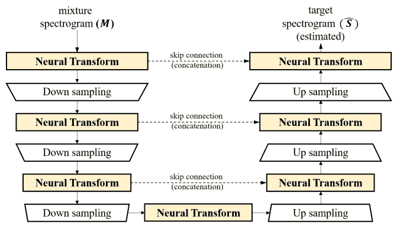

适用于音频的 U-Net 模型。从[这张](https://arxiv.org/pdf/1912.02591.pdf)纸上检索。

我们在 PyTorch 中实现了模型 A，它基于上面参考资料中引用的 Choi 等人的论文中的图表。这个想法非常类似于 U-Net 的下采样和带有跳跃连接的上采样。神经变换层仅改变图像中通道的数量，而下采样/上采样层将图像的高度和宽度改变 2 倍(简单卷积)。神经变换层和下采样层的数量从 7 到 17 不等。

每个神经变换层是一个由 4 个批处理范数、ReLU 和卷积运算组成的密集块，如下图所示。密集块意味着每个较小的块接收所有先前块的输出作为输入，本质上是将通道添加到“全局状态”变量上。下图说明了这个想法。

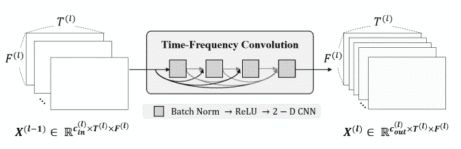

神经变换层图。从[这张](https://arxiv.org/pdf/1912.02591.pdf)纸上检索。

模型 B 是模型 A 的缩小版，没有批次标准层。这在下面引用的 Belz 的博客文章中取得了成功。

模型 A 和模型 B 的输入是混合信号的频谱图。对于模型 A，输出值是预测语音的声谱图，目标值是目标孤立语音的声谱图。模型 B 的一个变化是，输出值不是预测语音，而是预测噪声的声谱图，目标是目标噪声的声谱图。通过从输入混合信号中减去预测的噪声信号来预测模型 B 中的语音。

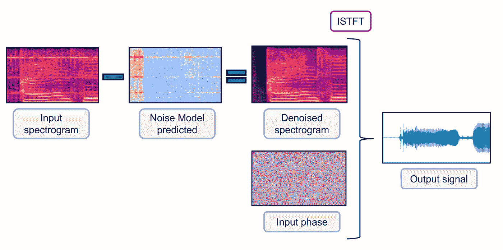

星等谱图描述。来源:[文森特贝尔兹](https://towardsdatascience.com/@vincentbelz?source=post_page-----36a1991d3d8d----------------------)，通过[媒介](/speech-enhancement-with-deep-learning-36a1991d3d8d)。

我们使用两种不同类型的光谱图。一种类型是简单的 STFT 输出，其产生复数值频谱图，并被表示为代表实部和虚部的双通道图像。另一种类型仅涉及将 STFT 的幅度作为单通道图像馈送，并在最后接收幅度谱图。用于重建的短语只是初始 STFT 相位(相位不变)，如上图所示。

# 损失函数

损失函数是优化最重要的部分之一，因为它决定了最小化哪个表面。我们测试了以下损失函数，并使用它们与加权的线性组合。

为了理解损失函数，让我们定义一些变量。v 是语音谱图信号。n 是噪声频谱图信号。m 是输入到神经网络的混合音频信号。

**M** = **V** + **N**

**V*** 是生成器看到 m 后给出的预估语音。

**M** →发电机→ **V***

目标是得到尽可能接近真实声音的估计声音。

目标: **V*** = **V**

**V 上的 MSELoss，V***

输出和目标之间的常规元素级 ms 损耗是我们损耗函数中的主要项之一。这是一种广泛使用的稳健损失，但它没有考虑特征的局部性。

**V，V*上的噪声加权 MSE loss**

输出和目标之间的常规元素 MSELoss，但基于该点的真实噪声强度进行了额外的元素加权。我们希望这将有助于消除噪音，而不是重建声音(这相对容易做到)。

**休伯在 N，N*上的损失**

Huber 损耗本质上是 MSE 损耗和 MAE 损耗的分段函数，在低误差值时，它表现得像 MSE，但是在某个阈值之后，它变成 MAE。这惩罚了小于 MSE 的异常值，但是在低损失值下具有相似的 MSE 属性。我们认为这可以帮助微调输出和目标之间的误差。

**V，V*上的可微结构相似性(SSIM)损失**

与 MSELoss 不同，SSIM 损失最初用于通过考虑位置来比较两幅图像的结构相似性。这个想法是，MSELoss 对于两幅非常相似的图像中的轻微偏移是不鲁棒的。这个术语可以捕捉两个光谱图的整体结构，并查看它们是否大致相同。

**源投影损失**

我们自己想出了这个损失，与噪声加权 MSELoss 的想法相同:专门去除噪声。与其在谱图空间中工作，我们尝试对谱图的像素值运行 MSELoss，不如在更简单的空间中工作？基本思想是，您可以将所有频谱图视为大向量，并通过投影回真实语音和真实噪声向量加上一些正交噪声伪像来分解估计的语音向量。

分解:**V ***= a**V**+b**N**+**R**

目标现在变为简单地将 a，b，R 分别减少为 1，0， **0** 。

目标:**V ***=**V**→**V ***= 1**V**+0**N**+**0**

为此，我们可以将 a，b， **R** 上的 MSELoss 设为 1，0， **0，**。

该损失函数直接测量与真实语音和真实噪声部分的关系。

然而，当在实践中应用时，出现了一个问题。大部分损失来自最小化 **R** 噪声误差的幅度，而不是减少投射到噪声上的量。如果这一项的权重较低，那么就会出现 R 增长过快的问题，并在结果中引入不必要的噪声伪像，使这种损失弊大于利。

# 【计算机】优化程序

除非另有说明，学习率为 0.001 的 Adam 优化器在任何地方都被使用。在源投影实验中，使用了 SGD，因为它在输出中创建了更少的 **R** 矢量伪像(从 **V** + **N** 到 **V** 采取了更直接的直线路径)。

# 色调分离

为了从头开始，我们决定简单地分离一个被恒定音调覆盖的声音。我们对模型的输入是一个人说话，背景中播放一种音调，模型试图将声音从音调中分离出来，只返回声音。运行模型 A，我们得到了非常好的结果，如下所示。

输入:

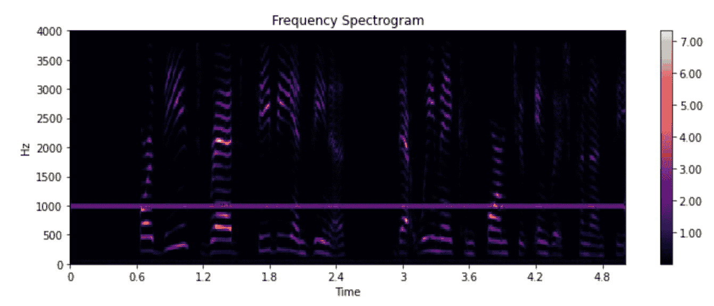 [## mix0.wav

### 编辑描述

drive.google.com](https://drive.google.com/open?id=1s0U2uXMw-xT1MU9ZzlFON2gFAQnmDwwM) 

输出:

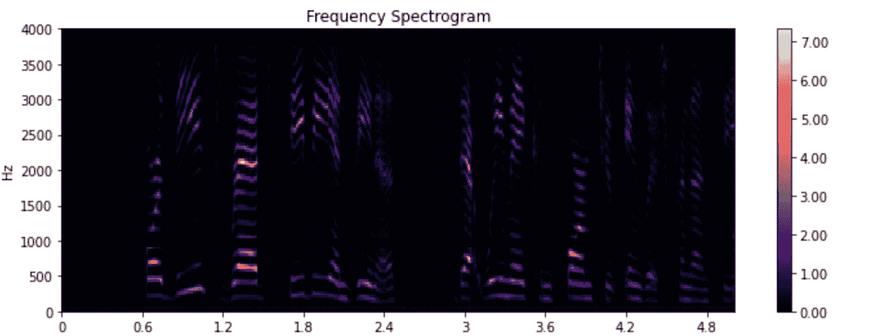 [## vp0_naive.wav

### 编辑描述

drive.google.com](https://drive.google.com/open?id=1-vVWxPjqA-P_Ov-a15H63sE7dh1rCc9a) 

培训损失图表:

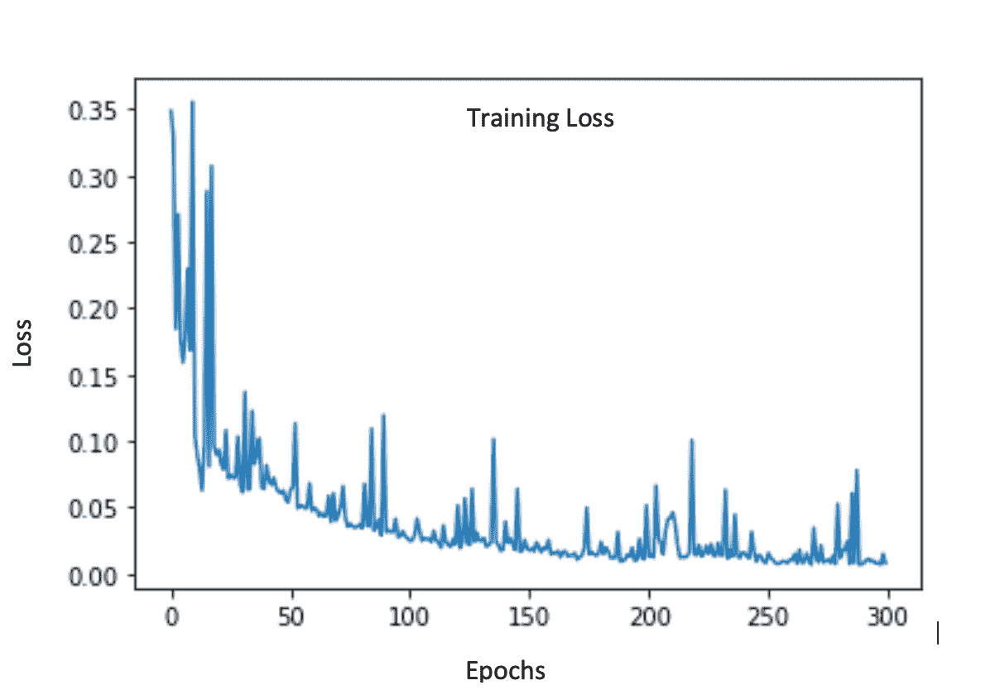

# 空调噪声分离

作为一个更高级的挑战，我们决定分离被空调噪音覆盖的声音。我们对模型的输入是一个人说话，背景中有交流噪声，模型试图分离交流噪声，只返回说话的人。运行模型 A，我们得到的结果如下所示。

培训损失图表:

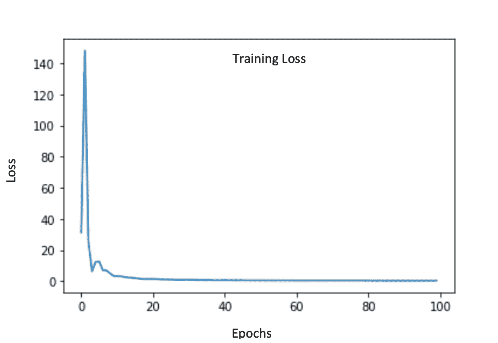

输入音频:

 [## 输入. wav

### 编辑描述

drive.google.com](https://drive.google.com/open?id=1_7q0LLQ52WFUCDTiWze0f2olRCu-2rLC) 

输出音频:

 [## 输出. wav

### 编辑描述

drive.google.com](https://drive.google.com/open?id=13XY25Y3GK__ZX7TeRy7Wq0l2Pso7obNW) 

# 用 GAN 方法分离空调噪声

为了改进之前的结果，我们决定采用 GAN 方法。众所周知，甘很难训练，而且很不稳定。考虑到这一点，我们决定预先训练生成器和鉴别器，本质上是在训练过程中给它们一个“开端”。我们希望这将增加 GAN 的训练稳定性和收敛性。

由于我们已经有了一个训练过的生成器，我们预先训练了一个鉴别器网络来区分真实语音和来自生成器的估计语音。这是鉴频器的先验训练损失图:

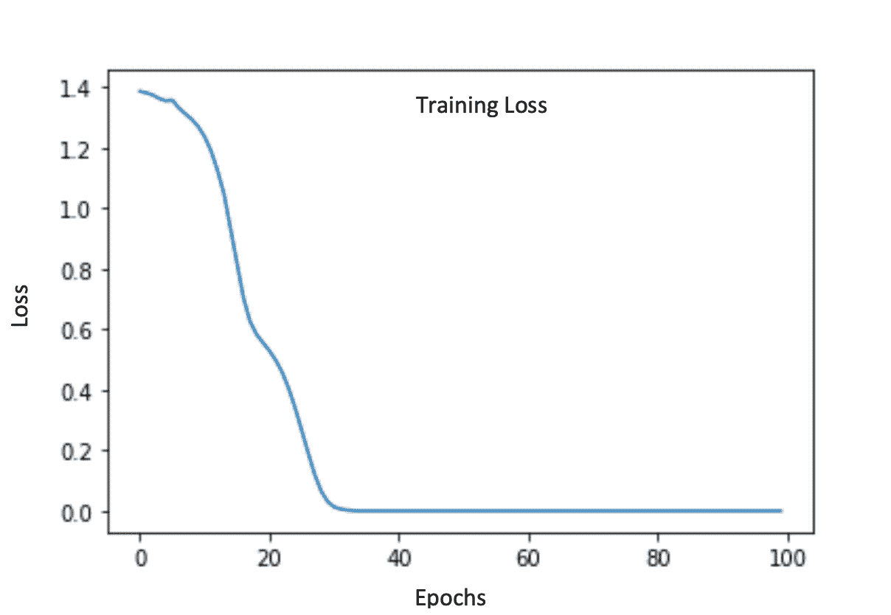

在预训练之后，我们在一个经典的对抗设置中设置发生器和鉴别器并进一步训练。发生者损失是先前损失项与欺骗鉴别者的新的对抗性损失的组合。

以下是发电机的训练损耗:

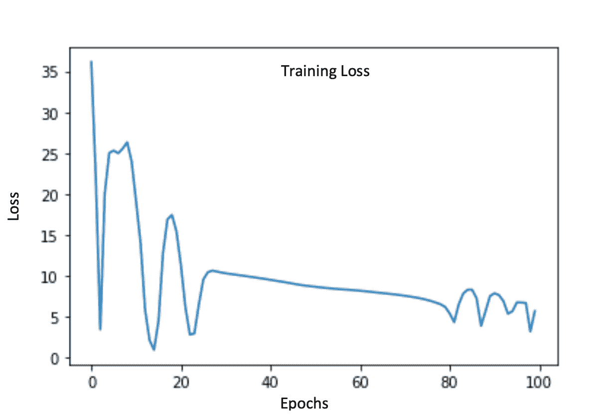

这是鉴别器的训练损失:

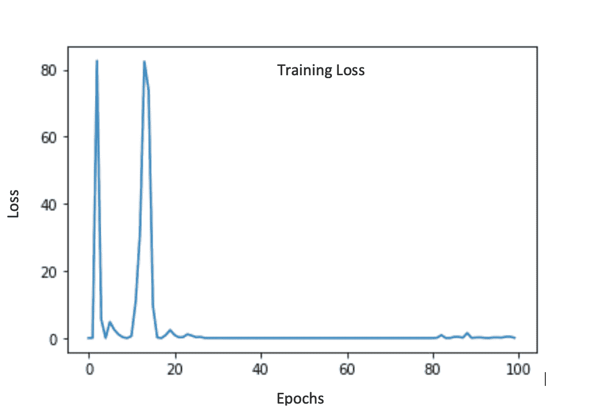

以下是我们在所有培训后取得的成果:

输入音频:

 [## 输入. wav

### 编辑描述

drive.google.com](https://drive.google.com/open?id=1Yy06WGs84DNcVbeKdpnOEOn6auXpkvFX) 

输出音频:

 [## 输出. wav

### 编辑描述

drive.google.com](https://drive.google.com/open?id=1rmFPAqOTv3IeQe5_1yhClcIWgPyFv_0g) 

虽然这听起来不太好，但我们断定这是因为我们的发电机不够深。我们为此总共使用了 7 个神经变换层，当用 GPU 训练时，可以很容易地增加到 17 或更高。

# 狗叫声分离

在我们的一个实验中，我们只在嘈杂的演讲中训练模型 B，对于噪音，我们从噪音数据集中提取不同的狗叫声音。该模型使用 10 个时期的 5000 个嘈杂的语音进行训练。为了便于训练模型，每个有噪声的语音音频保持 1 秒的长度。

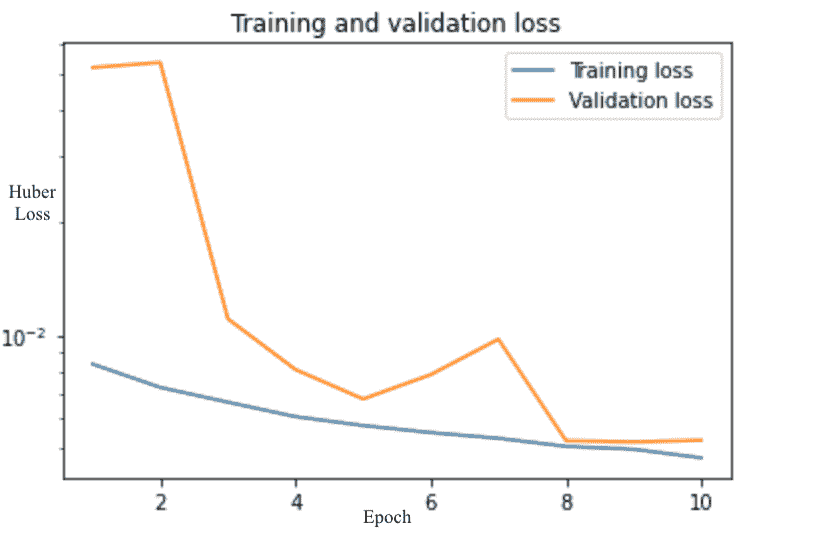

在训练该模型之后，我们使用该模型来预测干净的语音。下面我们展示了输入噪声语音、目标干净语音和预测语音的频谱图和音频剪辑。

输入:

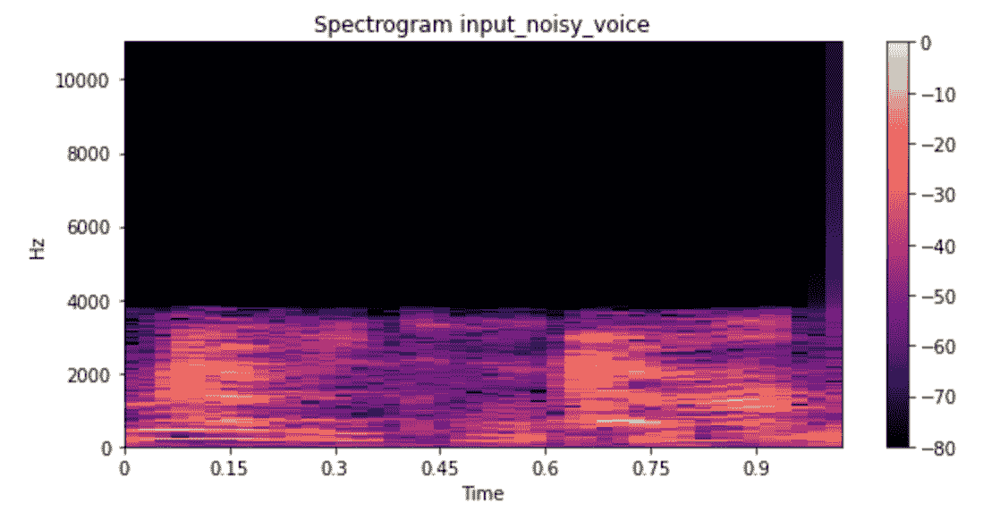 [## 输入. wav

### 编辑描述

drive.google.com](https://drive.google.com/open?id=1-b27xEeqiWwDXFlwCM-igicFma_Gfy9U) 

输出:

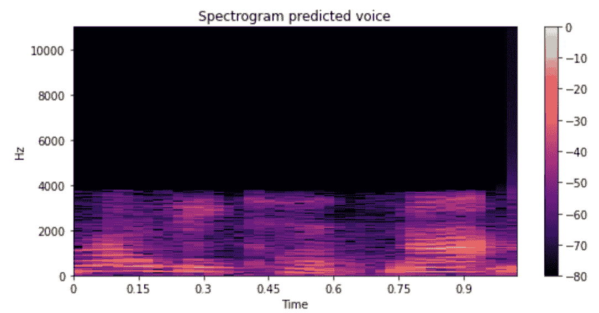 [## 输出. wav

### 编辑描述

drive.google.com](https://drive.google.com/open?id=1hxZGgl5BA9WDZz8VaEi56EqjqsnO7Olh) 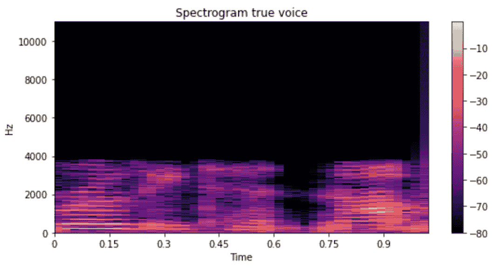

总体而言，该模型在训练数据和验证数据上都表现良好。预测的 80 毫秒的干净语音音频剪辑听起来非常像真实的声音。

# 网站(全球资讯网的主机站)

这是我们网站的链接:[https://audio-separation.herokuapp.com/](https://audio-separation.herokuapp.com/)

简而言之，我们的网站接受任意长度的嘈杂音频输入，通过我们的模型输入片段，然后将它们组合在一起，返回声音的干净版本。用户可以选择将声源添加到他们的输入中，以测试模型是否有效。我们使用 React.js 开发前端，使用 Python Flask 开发后端。我们面临的主要挑战是后端处理前端发送的任意长度的音频文件。此外，我们不得不面对 Heroku cloud 实例内存不足的问题，因为 Tensorflow 和 PyTorch 占用了大量空间。为了解决这个问题，我们转向了 AWS，它提供了更大的存储选项。一旦我们解决了安装正确的包和拥有足够内存的后勤问题，我们就能够使用 Material-UI 和 React.js 开发前端。

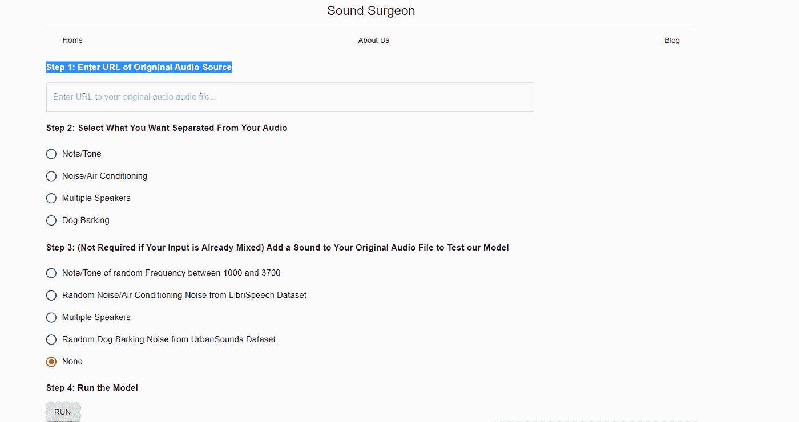

来自我们网站的截图

# 结论

我们在这个项目中完成了大量的工作。我们的模型 A 在色调分离方面表现得非常好，但在去除复杂的空调噪音时有其缺点，因为它太浅了。我们的 B 型车比 A 型车小，在狗叫声中表现良好。模型 B 中的变化是我们预测了噪音而不是更复杂的声音，并从我们的输入声音中去除了预测的噪音。另一方面，在模型 A 中，我们使用了更直接的方法，我们试图直接预测无声的声音。在这两个模型中，我们自己版本的 U-net 架构都发挥了关键作用。

我们的主要方法是创建一个鉴别器网络和生成器，独立地对它们进行预训练，然后过渡到对抗式训练，如 GAN。对于该方法，我们使用投影损失通过将估计的噪声投影到真实语音和真实噪声以及剩余项来直接去除噪声。然后使用 MSE，我们能够尝试训练我们的模型忽略真实噪声和剩余项分量。虽然这种方法无法产生我们希望的空调噪音结果，但我们相信，如果我们能够用更强的计算能力和更深的网络来训练它，它将会成功。

# 未来的工作

这个项目还有相当多的工作要做。从尝试鸡尾酒会问题的完整解决方案到通用噪声分离器，我们希望看到更多的成果。在这个项目中，我们将采取的下一步措施包括首先尝试创建能够学习分离各种噪音的模型。虽然我们已经能够创建模型来处理狗叫等个体噪音，但更复杂的噪音，如警笛声，却超出了我们的能力范围。在此之后，我们期望继续将这些单独的模型结合起来，以创建一个单一的更通用的模型，可以从语音中消除任何类型的噪声。在这里，我们甚至可以更进一步，尝试识别我们正在消除的噪声。最后，我们的最终目标是解决多个扬声器，特别是 GAN。这将是一个更具挑战性的问题，因为我们必须从噪音中识别出语音，并试图将每个声音从其他声音中分离出来。

# 更多信息

Github 链接:[https://github.com/akarshkumar0101/DSProject](https://github.com/akarshkumar0101/DSProject)

来源:

*   【https://arxiv.org/pdf/1912.02591.pdf 号
*   【https://arxiv.org/pdf/1710.10779.pdf 
*   [https://arxiv.org/abs/1710.11428](https://arxiv.org/abs/1710.11428)
*   [https://pdfs . semantic scholar . org/b665/fee 51 fff 861 c 55319137916 a 10935193 BCB 0 . pdf](https://pdfs.semanticscholar.org/b665/fee51fff861c55319137916a10935193bcb0.pdf)
*   [https://pdfs . semantic scholar . org/1f 85/596488 b 67 EFC ba 51026 E1 ce 32 DCC d 1796176 . pdf](https://pdfs.semanticscholar.org/1f85/596488b67efcba51026e1ce32dccd1796176.pdf)
*   [https://towards data science . com/advanced-topics-in-deep-convolutionary-neural-networks-71ef 1190522d](/advanced-topics-in-deep-convolutional-neural-networks-71ef1190522d)
*   [https://towards data science . com/speech-enhancement-with-deep-learning-36a 1991d 3d 8d](/speech-enhancement-with-deep-learning-36a1991d3d8d)

使用的 Python 库:

*   利布罗萨
*   PyTorch
*   火炬报
*   皮托尔赫-SSIM
*   米尔评估
*   NumPy
*   Matplotlib
*   tqdm
*   火炬摘要