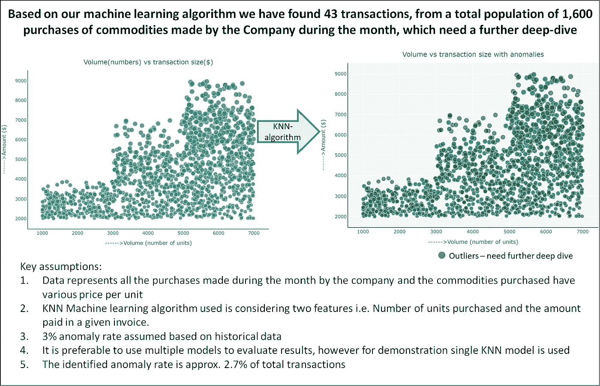
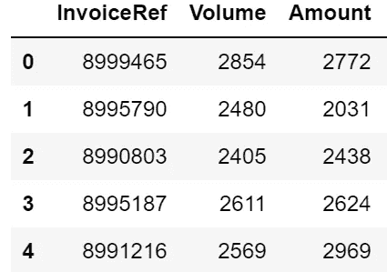
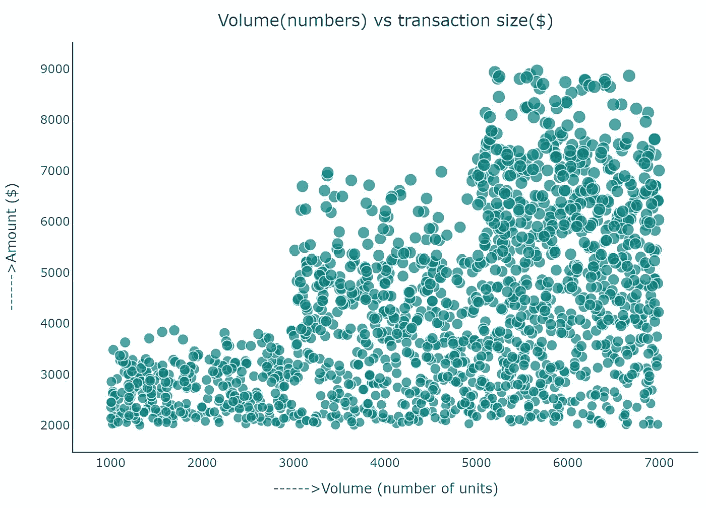
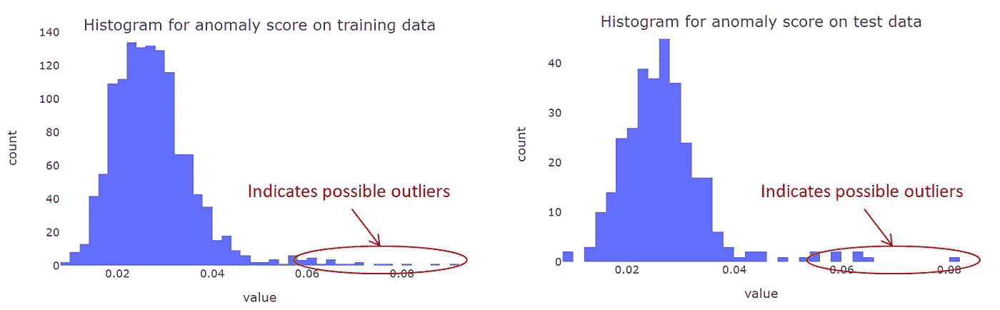
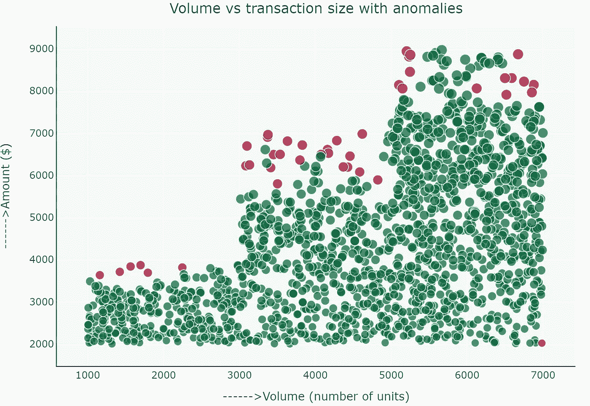
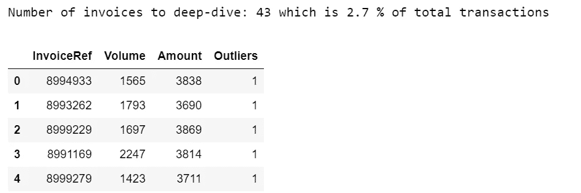

# 使用机器学习算法的审计:金融数据科学用例

> 原文：<https://towardsdatascience.com/audit-using-machine-learning-algorithm-a-financial-data-science-use-case-2316571c024c?source=collection_archive---------21----------------------->

## ML 算法在现实审计中的应用


弗兰克·维西亚在 [Unsplash](https://unsplash.com?utm_source=medium&utm_medium=referral) 上拍摄的照片

数据科学的世界充满了奇迹(除了独角兽！).它无处不在，在健康科学、太空探索、图像识别、机器人、欺诈检测等领域都有应用。如果你曾经在网飞或 Prime 上看过一些东西，那么你很有可能已经接触到了令人惊叹的电影推荐算法！

> 我们如何在一个典型的内部审计职能中运用 ML 技术来减少假阴性和提高效率。副作用:降低成本。

金融业也不例外，我们已经看到了组织向应用先进的数据科学技术进行见解生成、预测、预算和欺诈风险的巨大转变。

当我在日常审计中研究 ML 的用例时，作为一名财务专业人员，我们都面临的一个非常现实的问题是**“与标准有何不同”**？

假设您有 1，600 笔交易(或购买发票)，其中每笔交易代表“购买数量”(体积)和为该数量支付的“金额”。为了识别任何异常值(即不遵循正常模式的交易)，在典型的审计环境中，我们会尝试从总体中抽取随机样本，然后希望我们的“随机”抽样能够检测到任何此类异常。这有时既费时又事与愿违，因为我们有遗漏实际异常值的风险，这些异常值不会被我们的样本发现，因此会报告假阴性。这对审计职能的成本和效率都有不利影响。

因此，我尝试采用一种 ML 算法(KNN，下面会进一步解释)来解决上述问题，并自动进行异常检测。该算法使用发票的数量和金额特征，并计算 1，600 个这种发票集中的异常值。

现在好的算法或代码和我们讲的故事一样好。因此，在我讲述准则的本质之前，下面是一份一页的执行摘要或电梯演讲，可以与我们的业务利益相关方分享:



如果你想知道模型是如何建立的，请继续阅读下面的内容。

## **数据科学拯救**

Python 中一个专门用于**离群点检测**建模的包叫做 **PyOD** 。这个包(我用 **pip install pyod** 安装的)提供了多种算法来检测异常值，并且非常容易实现。然而，在本文中，我将把自己限制在一个基于**邻近度的**模型的用例上，这个模型被称为 KNN 或 K-最近邻。 **KNN** 是一种数学模型，它测量到最近的第 K 个*邻居的距离，并根据该距离识别数据中的异常值。这是一种分类算法，将异常值分类为“1”和“0”的二进制结果，或者说“是”或“否”。*

以下是分步实施的方法:

## **第一步:数据集**

对于任何数据科学项目，生成有意义的随机数据集与算法或代码本身一样重要。所以我强烈推荐阅读关于‘随机数据’和‘种子’的好资源。生成的数据集是一组 1600 张购买发票，代表两个特征，即当月购买的“数量”和为该发票支付的“金额”。下面是它看起来的样子(想象的但看起来仍然足够真实！)



为 KNN 建模生成的随机数据

## 第二步:想象

让我们使用 Plotly 散点图快速可视化数据。关于 [**的快速纲要，请参考我的文章**](/covid-19-data-visualisation-with-plotly-d1c96423942e?source=friends_link&sk=09954119645f71eca5f0684cbff40b29) **。**



## 步骤 3:训练和测试模型

现在有趣的部分来了，我们实际上建立了我们的模型并训练了算法。这些是我通常会遵循的步骤:

1.  **预处理和缩放数据:**这有效地将数据标准化并缩放到 0 和 1 之间的值，这有助于处理现实生活中变化很大的大量数据集。然后，我们重塑数据集的特征(体积和数量),以便进一步处理。

```
from **sklearn.preprocessing** import **MinMaxScaler**
scaler = MinMaxScaler(feature_range=(0, 1))
df[[‘Volume’,’Amount’]] = scaler.fit_transform(df[[‘Volume’,’Amount’]])**# reshape the individual features to numpy arrays**
x = df['Volume'].values.reshape(-1,1)
y = df['Amount'].values.reshape(-1,1)X = np.concatenate((x,y),axis=1)
```

**2。分割训练和测试数据:**我使用了 80:20 的训练/测试分割。然后首先使用训练数据训练该模型，并使用测试数据测试该模型。由模型生成的异常分数的可视化为我们提供了正常和异常数据是如何分割的指示。

```
from sklearn.model_selection import train_test_split
**#split dataset into train and test data**
X_train, X_test, y_train, y_test = train_test_split(X, y, test_size=0.2, random_state=42)
print (‘Train set:’, X_train.shape, y_train.shape)
print (‘Test set:’, X_test.shape, y_test.shape)**# train KNN detector**
from pyod.models.knn import KNN
clf_name = 'KNN'
clf = KNN(contamination=0.03, n_neighbors = 5) #assuming a 3% outliers based on some historical data
clf.fit(X_train)
**#raw anomaly score**
y_train_scores = clf.decision_scores_
**#Train predictions**y_train_pred = clf.predict(X_train) *#creates outlier labels (0 or 1)*
**#print size for sanity check**
print('Train score size: ',y_train_scores.shape)
print('Train prediction size: ',y_train_pred.shape)**# Now we have the trained KNN model, let's apply to the test data to get the predictions**
y_test_pred = clf.predict(X_test) # outlier labels (0 or 1)
**# Generate the anomaly score using clf.decision_function:**
y_test_scores = clf.decision_function(X_test)
**#print size for sanity check**
print('Test score size: ',y_test_scores.shape)
print('Test prediction size: ',y_test_pred.shape)**Output:**Train set: (1280, 2) (1280, 1)
Test set: (320, 2) (320, 1)Train score size:  (1280,)
Train prediction size:  (1280,)Test score size:  (320,)
Test prediction size:  (320,)
```

**3。可视化训练和测试分数:**让我们使用‘y _ train _ scores’和‘y _ test _ scores’将异常分数可视化为一个简单的直方图。注意异常的数量。

```
**#visualise training scores**
fig = px.histogram(y_train_scores)
fig.show()**#visualise test scores**
fig = px.histogram(y_test_scores)
fig.show() **# lets see the number of anomalies**
print('Anomalies in test data: ',np.count_nonzero(y_test_pred))
print('Anomalies in training data: ',np.count_nonzero(y_train_pred))**output:**
Anomalies in test data:  10
Anomalies in training data:  33
```



**4。将模型应用到给定的数据集:**现在，我已经使用了上面为这个示例生成的相同数据集来演示我们如何获得最终结果。

```
**#Apply model to the given data set**
y_pred=clf.predict(X)
y_pred_scores = clf.decision_function(X)
```

**5。将所有这些放在一起:**在这一步中，我们**将预测标签** s ('0 '和' 1 ')附加到数据集，**可视化**和**对异常值** ('1 ')的过滤，以获得需要进一步调查的发票列表:

```
df1[‘Outliers’] = y_pred.tolist() #append list to copy of dataframe**#visualise data using plotly fro df1 dataframe**
fig = go.Figure(go.Scatter(x=df1['Volume'], y=df1['Amount'],mode='markers',marker=dict(size=df1['Amount']**0.26+3,color=df1['Outliers'],colorscale='rdylgn_r')))fig.update_layout(xaxis_showgrid=True, yaxis_showgrid=True, plot_bgcolor='whitesmoke', 
        title={
        'text': 'Volume vs transaction size with anomalies',
        'y':.88,
        'x':0.5,
        'xanchor': 'center',
        'yanchor': 'top'},width=800,
    height=600)
fig.update_xaxes(title= '------>Volume' ,showline=True, linecolor='black')
fig.update_yaxes(title= '------>Amount', showline=True,linecolor='black')#overlay the bars
fig.show()
```



```
**# Filter data on Outliers = 1**
Review_sample=df1.loc[df1[‘Outliers’] == 1].reset_index()
Review_sample.drop(‘index’, inplace=True, axis=1)
print(‘Number of invoices to deep-dive:’, len(Review_sample), ‘which is’, round(len(Review_sample)/len(df1)*100,1),’% of total transactions’)
Review_sample.head()
```



显示 43 个“异常”交易中前五张发票的输出

上面展示了金融和审计环境中机器学习用例的一个非常简单的例子。在现实世界的问题中，我们肯定需要考虑许多因素和多种模型的使用，但是为了文章的长度，我只把它限制在 KNN。

在以后的文章中，我将深入研究数据科学在金融和会计领域的应用和用例。在自学之旅中，请随时评论或联系，分享关于这方面的想法或想法。

有关 PyOD 的更多资源，请参考此处 的 [**文档链接。链接里有一些非常好的文章，给了我很多启发和帮助。**](https://pyod.readthedocs.io/en/latest/)