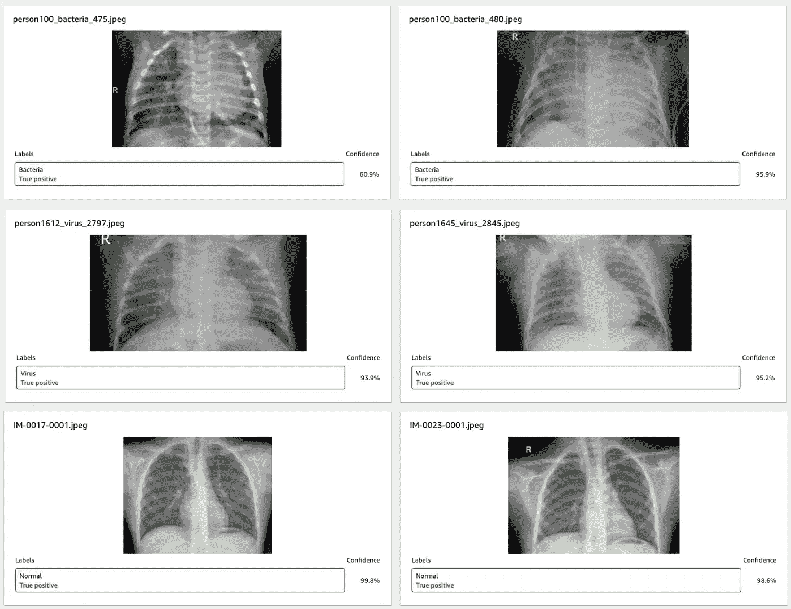
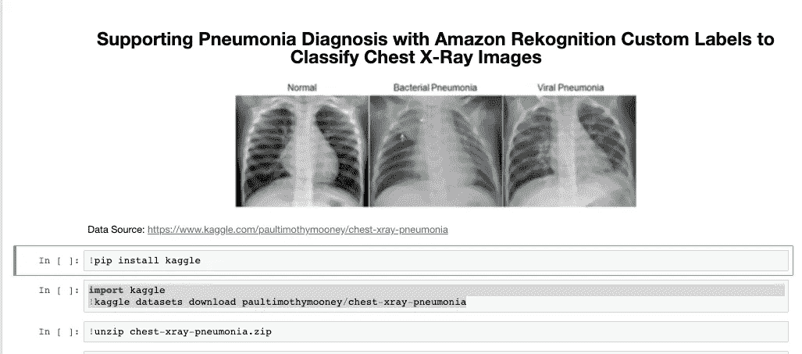
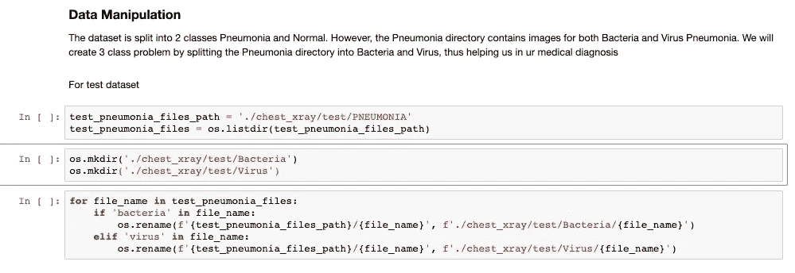
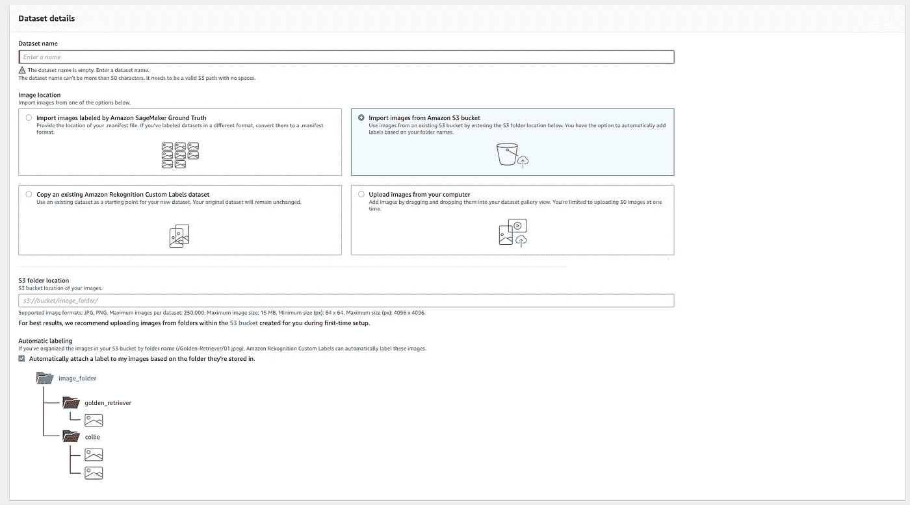
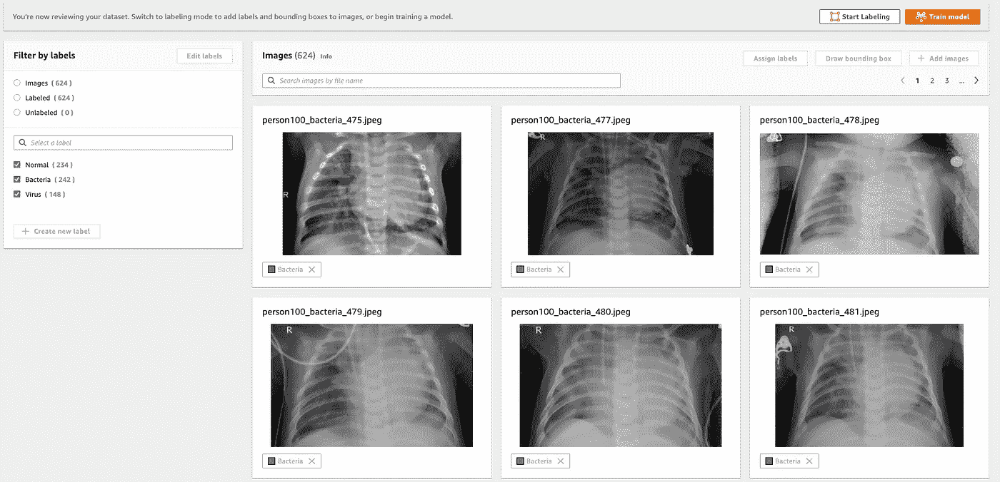
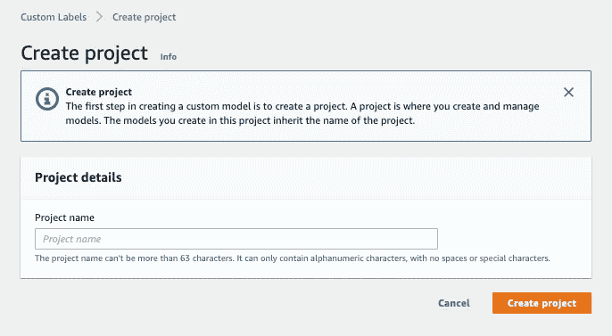
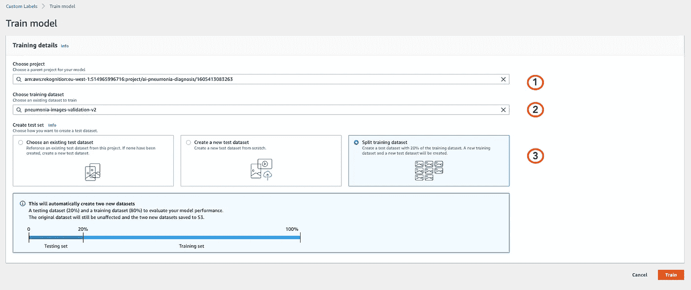
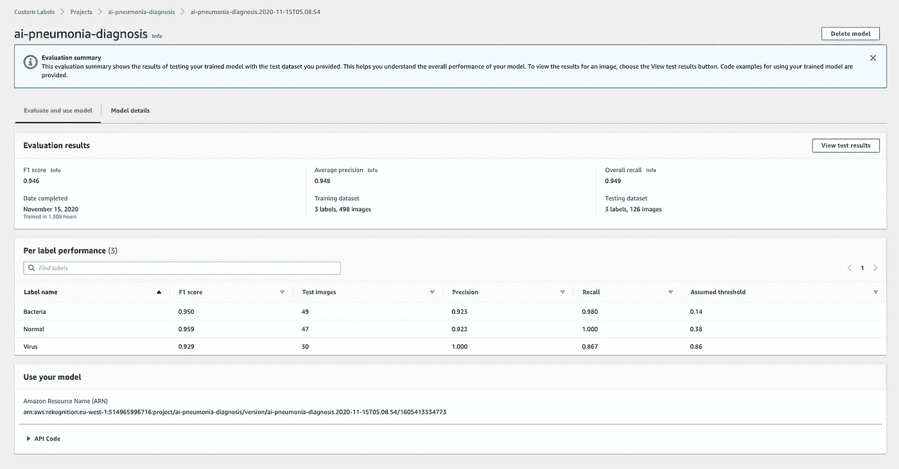
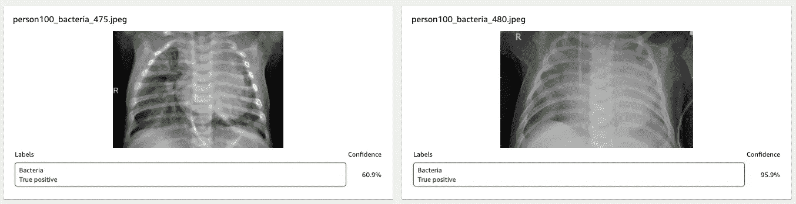
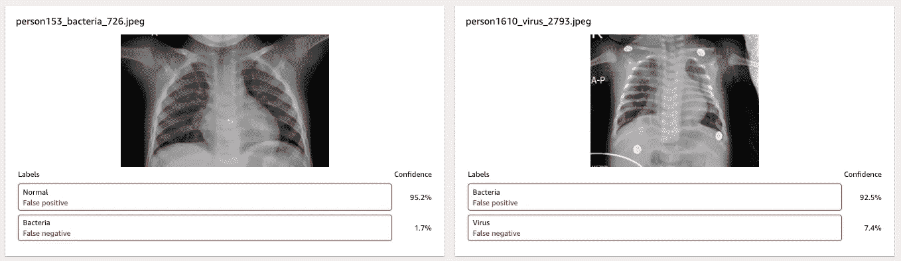

# 使用 Amazon Rekognition 定制标签增强肺炎胸部 x 光诊断

> 原文：<https://towardsdatascience.com/augment-pneumonia-diagnosis-with-amazon-rekognition-custom-labels-6f2fb79a986d?source=collection_archive---------44----------------------->

亚马逊 Rekognition 自定义标签胸部 x 光预测模型测试结果

在尼日利亚读高中的时候，我想成为一名医生——我们都知道结果如何。公平地说，我进入了医学院预科，但在第二年意识到我不是被设计来切割人体的。在那之后，我换了学校学习计算机科学，我们都知道结果如何。然而，我并没有失去对改善医学科学的执着。2013 年，我的学士论文重点是使用基于案例的推理来诊断伤寒。如果我从头再来，我将利用自然语言理解方面的进步来利用临床记录，实时预测伤寒病例。保持警惕。

在过去的几周里，我一直在为[亚马逊识别定制标签](https://aws.amazon.com/rekognition/custom-labels-features/) ⁵、来自 [AWS](https://aws.amazon.com/) 的令人惊叹的人工智能服务寻找新的用例——这是继切片面包之后最伟大的事情。在仔细研究了 Kaggle 之后，我偶然发现了胸部 x 光图像(肺炎)数据集，这是我的灵光一现。如果医疗从业者可以在没有 Google⁴的计算能力和技术专长的情况下利用人工智能诊断肺炎，会怎么样？

> 假设:如果医疗从业者可以在没有谷歌的计算能力和技术专长的情况下利用人工智能诊断肺炎，会怎么样？

# 这项工作

## 准备数据集

为了使用 Amazon Rekognition 自定义 Labels⁵训练模型，我需要将数据集保存在本地并通过 Amazon Rekognition 自定义标签控制台手动上传，或者已经存储在 Amazon S3 存储桶中。考虑到数据集的大小和要完成的任务，我决定利用云的力量——AWS。我启动了我的亚马逊 SageMaker 笔记本，安装了 [Kaggle python 库](https://github.com/Kaggle/kaggle-api)。

下一步是将图像上传到 S3 的一个地点。然而，我意识到一个小故障。尽管 Kaggle 数据集页面的信息显示了 3 类——正常、细菌性肺炎和病毒性肺炎，但文件夹仅分为 2 类——正常和肺炎。通过对图像的简单浏览，我意识到它们可以根据文件名进一步分成 3 类，这要感谢数据集管理员。

随着 3 类到位，数据被上传到我的 S3 桶，并准备进行训练。这是我做过的任何计算机视觉任务中最简单的数据争论，少了 11 行代码。

完成上述步骤后，我必须使数据集对 Amazon Rekognition 自定义标签可用。我简单地从在亚马逊自定义 Labels⁵中创建一个新的数据集开始，在 web 控制台上点击几下，指向我在 S3 中的数据集位置。Amazon Rekognition 自定义标签为您提供了直接从控制台标注数据集的机会。如果你有一些图片，我会推荐这个。在我的场景中，我有超过 3k 张图片，并通过文件夹结构将它们分成不同的类别，我必须选中“*,根据图片存储的文件夹自动为图片添加标签。*”选项，这样 Amazon Rekognition 可以自动推断标签。

我得到了什么:

随着数据集导入 Amazon Rekognition，是时候训练我的医疗诊断助手了。

## 训练模型

要在 Amazon Rekognition 自定义标签中训练模型，首先要创建一个项目。

一旦创建了项目，Amazon Rekognition 自定义标签就可以训练我的模型了。不到 5 次点击，我就开始了我的模特训练。为此，我:

1.  选择了项目，
2.  选择我的训练数据集，
3.  指示 Amazon Rekognition 应该拆分训练数据集，
4.  点击了“火车”橙色按钮，然后
5.  等待(用机器学习模型训练时最需要的属性)。

# 结果呢

正如我提到的，我开始证明我的假设是错误的，医疗从业者不可能在没有谷歌的情况下使用人工智能对胸部 X-rays⁸进行分类。结果证明我错了:**确实有可能**，感谢亚马逊 Rekognition 定制 Labels⁵.让我们从评估我花了多少钱开始。

## **费用**

1.  数据集在网上很容易找到，这让我几乎不用花钱就能下载。
2.  我的亚马逊 SageMaker 笔记本花费了我大约 2 美元，我也用它来完成其他任务
3.  亚马逊 S3 成本低于 0.90 美元
4.  亚马逊 Rekognition 定制标签的模型培训持续 1.308 小时，每小时 1 美元；大约 2 美元。

总培训费用约为 5 美元(4.90 美元)。这不需要谷歌的财力。

为了用训练好的模型进行预测，亚马逊 Rekognition 定制标签的费用是 4 美元/小时。因此，如果我将我的生产用例设计为在一个 28 天的月中每天 4 小时进行批量预测，我将花费大约 450.00 美元/月(包括可扩展性和基础设施管理)。从而帮助全球成千上万的医疗从业者提高肺炎诊断水平，挽救数百万人的生命。看到更好的主意了吗？

## 模型度量

我不会去详细定义每个指标，我已经在以前的 post⁷和亚马逊 Rekognition 自定义 Labels⁵文件中广泛地这样做了。技术上，模型性能精度为 0.946 ~=94.6%。

总之，在胸部 x 射线数据集上的 Amazon Rekognition 自定义标签上训练的肺炎诊断模型能够正确预测患者是否患有细菌性肺炎、病毒性肺炎或零肺炎病例。

# 此外

想想这对全世界卫生保健的重要性和规模，即使是在最偏远的地方。想想可以重用这种方法的医疗用例。想想我们可以通过用人工智能增强医疗从业者的 X 射线诊断来拯救生命。

迫不及待地想知道您将使用亚马逊 Rekognition 自定义 Labels⁵.构建什么你可以通过[电子邮件](mailto:elesin.olalekan@gmail.com)联系我，在[推特](https://twitter.com/elesinOlalekan)关注我，或者在 [LinkedIn](https://www.linkedin.com/in/elesinolalekan/) 联系我。

# 参考

[1]克曼尼，丹尼尔；张、康；Goldbaum，Michael(2018)，“用于分类的*标记光学相干断层扫描(OCT)和胸部 X 射线图像*”，Mendeley Data，v2[http://dx.doi.org/10.17632/rscbjbr9sj.2](http://dx.doi.org/10.17632/rscbjbr9sj.2)

[2]更大的善的意义，维基百科，[https://en.wiktionary.org/wiki/greater_good](https://en.wiktionary.org/wiki/greater_good)

[3]基于案例的推理，维基百科，[https://en.wikipedia.org/wiki/Case-based_reasoning](https://en.wikipedia.org/wiki/Case-based_reasoning)

[4]利用已裁定的图像标签开发胸部 x 光的深度学习模型，[https://ai . Google blog . com/2019/12/Developing-Deep-Learning-Models-for . html](https://ai.googleblog.com/2019/12/developing-deep-learning-models-for.html)

[5]亚马逊 Rekognition 定制标签，[https://aws.amazon.com/rekognition/custom-labels-features/](https://aws.amazon.com/rekognition/custom-labels-features/)

[6]胸部 x 光影像(肺炎)，[https://www . ka ggle . com/paultimothymooney/胸部 x 光-肺炎](https://www.kaggle.com/paultimothymooney/chest-xray-pneumonia)

[7]带亚马逊 Rekognition 定制标签的 AI Powered Video Assistant 裁判，[https://medium . com/@ elesin . olalekan/AI-Powered-Video-Assistant-referend-with-Amazon-Rekognition-Custom-Labels-5e 4902 b 47 ce 5](https://medium.com/@elesin.olalekan/ai-powered-video-assistant-referee-with-amazon-rekognition-custom-labels-5e4902b47ce5)

[8] Google details AI 以人类级别的准确度对胸部 X 射线进行分类，[https://venturebeat . com/2019/12/03/Google-details-AI-that-classified-胸部 X 射线以人类级别的准确度进行分类/](https://venturebeat.com/2019/12/03/google-details-ai-that-classifies-chest-x-rays-with-human-level-accuracy/)