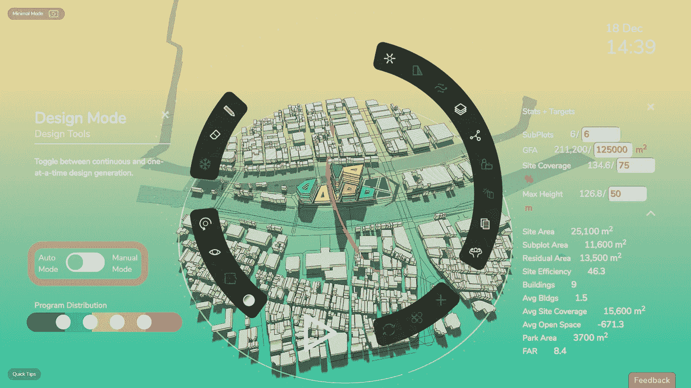
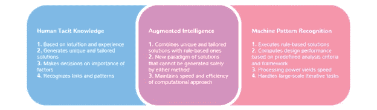
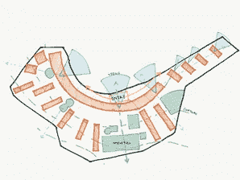
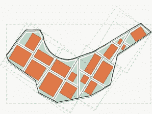
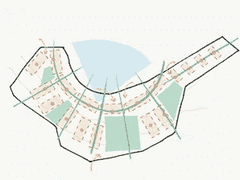
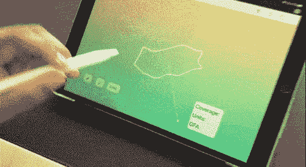

# 设计师需要增强智能，而不是黑盒人工智能

> 原文：<https://towardsdatascience.com/augmented-intelligence-for-sustainable-design-and-architecture-2f96a2fac95e?source=collection_archive---------26----------------------->

## 我们正处于深度学习的复兴时期，但通用人工智能仍然很遥远。设计师需要工具来利用人工智能最擅长的东西:放大人类创造力的极限

# 急需颠覆的行业

建筑行业面临着生存危机。这是[数字化程度最低的行业之一](https://hbr.org/2016/04/a-chart-that-shows-which-industries-are-the-most-digital-and-why)和[全球领先的二氧化碳排放源](https://www.curbed.com/2019/9/19/20874234/buildings-carbon-emissions-climate-change)。随着全球气温上升和大规模人口向城市中心迁移，我们迫切需要一种能够实现更可持续的工作方式的数字化变革。

作为建筑师，我们可以从其他领域学习，这些领域在开发协同人机系统方面取得了快速进展，这些系统利用了人类和人工智能生成的推理的积极方面。

在过去的一年里，开发了许多人工智能工具，为设计的环境影响和性能提供了新的见解。尽管潜力巨大，但广泛采用仍存在几个障碍:

1.  *需要大量专业知识来利用他们的能力*
2.  *人工智能和其他计算方法需要严格定义的设计目标*
3.  对于客户——为项目融资的客户——来说，这些工具的输出仍然不透明，不可理解。

在[**Digital Blue Foam**](http://www.digitalbluefoam.com)(DBF)，我们开发新的解决方案，加速世界向更好、更可持续的城市转型。我们是设计师和技术专家，具有强烈的责任感，推动建筑、工程和施工(AEC)行业迫切需要的革命向碳负项目发展。

在新的设计时代来临之际，几个基本问题依然存在:

*   我们如何开发工具，给予设计师更大的权力来促进可持续设计？
*   ***下一代用户交互是什么样子的？***
*   ***我们如何在一个设计工具中连接人类和机器智能的长处？***

# 人工智能毫无意义

[2019 年是新机器学习(ML)应用多产的一年](/14-deep-learning-uses-that-blasted-me-away-2019-206a5271d98)。ML，机器从结构化数据或深度学习的非结构化数据中推断输出的能力，已经获得了大量的炒作和歇斯底里。这导致了一个普遍的误解，即如果我们使用最新的算法和计算能力收集和处理足够的数据，智能就会出现。事实根本不是这样。

使用相关性而不是因果关系的策略，ML 识别模式的速度非常快，尤其是当输入数据结构良好时。这就是它在玩像 *Flappy Bird 这样的视频游戏时如此有效的原因。*在大多数电子游戏中，规则和目标是一致的；不像真实世界，模式总是保持不变。但是当情况发生变化时会发生什么呢？

因果智能是人类智慧的基础。虽然人类识别模式的能力相对较差，但我们擅长将过去的知识重新应用到新的情况中。所以当 *Flappy Bird 2 发布的时候，*我们知道它将会有和第一代几乎一样的规则和目标，我们很快适应了。另一方面，我们的人工智能什么都不懂；它只是遵循一种模式。当模式改变时，人工智能变得无用。

# 增强智能的接口

Digital Blue Foam 开发了一种工具，可以引导 AEC 行业绕过一个主要瓶颈。建筑师花费大量时间学习和使用低效的绘图工具，这实际上分散了他们的基本角色，即创造和试验设计选项，以满足场地和项目的过多需求，无论是社会、环境还是经济需求。我们的工具使用增强智能将建筑师从这种麻烦中解放出来，并通过增强久经考验的草图绘制方法来帮助他们生成设计。

> 我们 DBF 是增强智能的主要支持者，而不是黑盒人工智能。在这种范式中，人工智能成为增强人类智能的工具，而不是取代它。虽然复杂的人工智能系统能够在分析“大数据”中的模式后做出决策，但它们的好坏取决于人类给它们的数据。

*增强智能是人类和机器智能的杂交*

增强智能已经嵌入到许多知名产品中。这在文字处理应用程序中尤为明显:MS Word 的拼写检查器、海明威编辑器和 Grammarly(一个在线语法检查器)是增强智能的几个日常例子。Powerpoint 中的“设计想法”功能是另一个例子，它使用增强智能来帮助非设计师改善他们的布局。

在我们的软件中，用户使用笔接口，用计算机设计**。随之而来的是其他人所描述的具有人机协作的【人在回路】增强智能(郑，2017)。**

**I 人性化设计方法**

手动设计方法源于直觉、经验和逻辑。它能够为复杂的问题提出解决方案，比如在形状奇特的地块的不同部分建造不同类型的建筑。

**二计算方法:**

*计算策略能够快速生成符合预定义逻辑的解决方案。这种方法的本质非常适合迭代任务，例如生成基于规则的解决方案以及执行计算和分析。*

**III 增强智能(1+1 > 2):**

*增强智能(AI)方法结合了前两种策略的优点。它理解设计者的意图，在这种情况下是通过线条或节点，并应用规则集来生成高度细微差别的解决方案*

用不太专业的术语来说，这意味着当设计者绘制草图时，计算机将该图解释为一个输入，以限制新设计的产生。反过来，设计师观察计算机生成的东西。然后，他们可以在顶部绘制草图来编辑结果，提供新的输入。通过重复这个过程，新的解决方案出现了，无论是机器还是人类都无法想象。

通过在我们的技术中应用增强智能的原理，我们希望将人类一生的经验中获得的常识与机器智能最擅长的事情联系起来:在大型数据集中识别有用的模式。

# 结论

史蒂夫·乔布斯是增强智能的大力倡导者，这种方法是苹果产品成功的主要原因。在《滚石》杂志 1994 年的一篇文章中，富有远见的乔布斯评论道:“技术什么都不是。重要的是你对人们有信心，相信他们本质上是善良和聪明的，如果你给他们工具，他们会用这些工具做很棒的事情。

增强智能并不是一个新概念，但值得更多的关注，因为我们正在研究如何应用人工智能提供给我们的所有惊人能力。为了解决 AEC 行业的生存危机，我们必须扩展我们对增强智能的定义，并利用人工智能的真正潜力:结合设计师直觉的敏感性和机器智能的蛮力。

**注意事项**

*   *郑等(2017)“混合增强智能:协作与认知”。信息技术前沿&电子工程*
*   *合著者 Tejas Chavan*
*   *作者提供的图片和视频*
*   *特别感谢格雷厄姆·福斯特的剪辑！*
*   [试试这里的数字蓝色泡沫](http://www.digitalbluefoam.com)

试试数字蓝色泡沫[这里](http://www.digitalbluefoam.com)