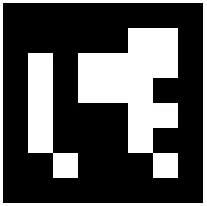
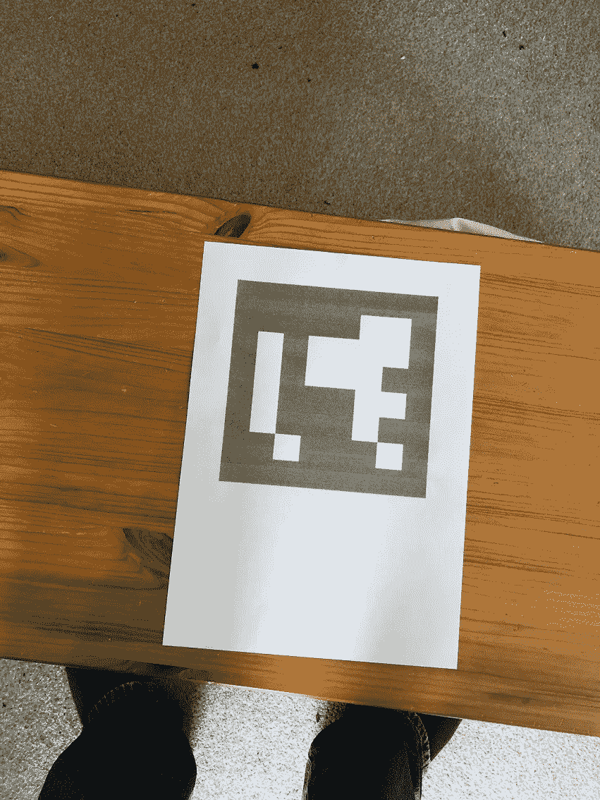
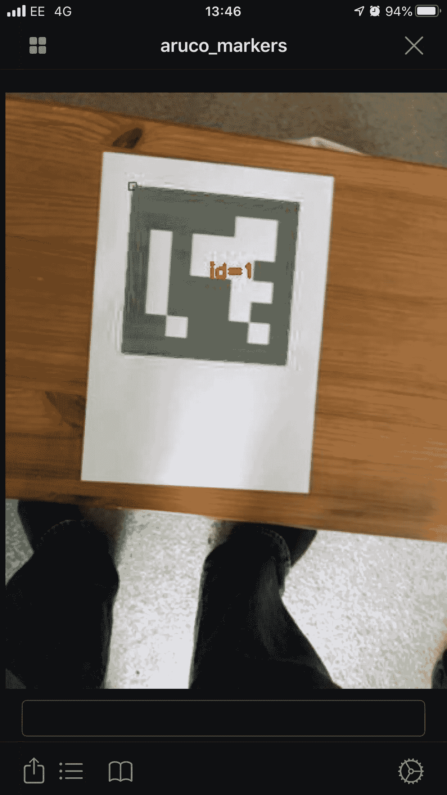
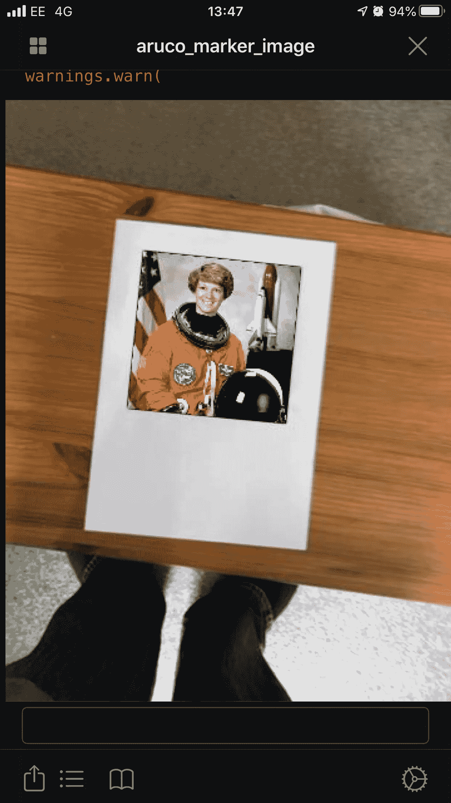

# 使用基准标记的增强现实

> 原文：<https://towardsdatascience.com/augmented-reality-using-fiducial-markers-b8124b8f528?source=collection_archive---------38----------------------->

## ArUco 基准标记

根据维基百科，基准标记“是放置在成像系统的视野中的物体，其出现在产生的图像中，用作参考点或测量点。它可以是放置在成像对象中或上的东西，或者是光学仪器的十字线中的一个标记或一组标记。”[1]基准标记已经在许多不同的场合作为测量手段使用。例如，如果你拍一张某人站在尺子旁边的照片，看看他们有多高，尺子将作为一个基准标记。

2014 年发表了一篇研究论文，提出了一种专门为相机姿态估计设计的基准标记系统[2]。相机姿态估计是寻找真实环境中的点和它们的 2D 图像投影之间的对应关系的过程。使用基准标记使这一过程变得容易得多。他们提出的标记被称为阿鲁科标记。该论文的两位作者拉斐尔·穆尼奥斯和塞尔吉奥·加里多制作了一个模块来与他们合作，这个模块又作为 aruco 模块并入 OpenCV[3]。

## 用 OpenCV 和 Python 检测 ArUco 标记

在之前的一篇文章中，我提到了 Pyto [4],所以我想我应该写一个脚本，从我的 iPhone 上的一个实时摄像头中找到一个 ArUco 标记，然后在它周围画一个方框。我使用了以下 ArUco 标记图像:

阿鲁科标记(id=1)

我把这张图片打印在一张纸上，放在我的桌子上:

你会发现我把透明度降低到 50%来保存我的黑色墨盒！它仍然工作正常。

下面是我的脚本，它检测标记，然后在它周围画一个框，并附上 ID:

下面是在我的桌子上用 ArUco 标记运行的脚本:

## 增强现实

一旦我能够检测到标记，我想在它上面放置一个图像会很好，这样可以在你移动相机时保持正确的视角。为了实现这一点，我们需要知道标记的单应性。然后，我们可以将图像转换成相同的单应性，并将其正确地放置在标记的顶部。

你不需要理解单应、齐次坐标或矩阵的实际细节就能实现这一点。但是如果你感兴趣的话，可以看看最后的维基文章参考文献[5][6]。

为了获得单应性，我们调用 OpenCV 方法**find 单应性**。一旦我们有了单应性，我们就可以调用方法 **warpPerspective** ，它将对图像进行仿射变换，以将其置于正确的角度，并将其正确地放置在标记的顶部。

这是我的脚本:

这是它在 Pyto 运行时的样子:

## 参考和链接

[1]维基百科对“基准标记”的定义:https://en.wikipedia.org/wiki/Fiducial_marker

[2]塞尔吉奥·加里多-朱拉多，拉斐尔·穆尼奥斯-萨利纳斯，弗朗西斯科·j·马德里-奎瓦斯和曼努埃尔·j·马林-希门尼斯，[遮挡情况下高度可靠的基准标记的自动生成和检测](https://www.researchgate.net/publication/260251570_Automatic_generation_and_detection_of_highly_reliable_fiducial_markers_under_occlusion)

[3][https://docs . opencv . org/4 . 1 . 0/D5/DAE/tutorial _ aruco _ detection . html](https://docs.opencv.org/4.1.0/d5/dae/tutorial_aruco_detection.html)

[4]皮托:【https://github.com/ColdGrub1384/Pyto】T4

[5] [单应维基百科定义](https://en.wikipedia.org/wiki/Homography_(computer_vision))

[6] [同质坐标维基百科定义](https://en.wikipedia.org/wiki/Homogeneous_coordinates)