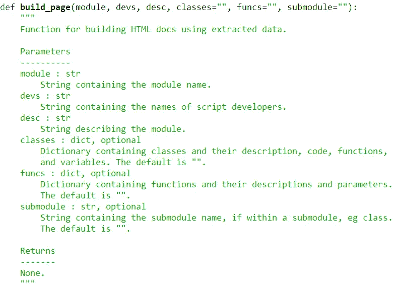
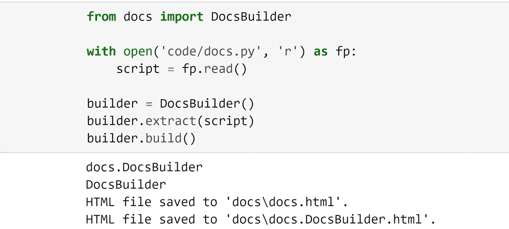

# Python 的自动文档

> 原文：<https://towardsdatascience.com/auto-docs-for-python-b545ce372e2d?source=collection_archive---------13----------------------->

## 编写代码很无聊，为什么要浪费时间呢？


照片由[阿德里安](https://unsplash.com/@aows?utm_source=medium&utm_medium=referral)在 [Unsplash](https://unsplash.com?utm_source=medium&utm_medium=referral) 上拍摄

不管我们喜不喜欢，好的文档绝对是项目成功的关键**。那么，为什么好的文档如此难找呢？**

在现实中，它常常被忽视，被当作代码本身的劣质产品。制作好的、用户友好的文档实在是太耗时了。

这种忽视是错误的。我们构建的工具的采用在很大程度上取决于易用性。如果文档难以浏览、理解，或者仅仅是使用起来没有吸引力，用户不会喜欢它。

因此，考虑到这一点，我相信我们都应该为简单而全面的文档而努力。


我们将介绍如何为任何 Python 项目快速构建自动文档工具。有了它，只需几秒钟就可以为包含大量代码的复杂项目生成文档。

正则表达式是我们的朋友，我们将在整篇文章中大量使用它们。我写这篇文章的目的是真正关注代码的这一方面，我希望你能从中学到很多东西(我当然有)。

*如果你使用*[*NumPy/SciPy docstring 标准*](https://numpydoc.readthedocs.io/en/latest/format.html) *，你甚至可以使用我使用的确切代码，这些代码在* [*GitHub 这里有*](https://github.com/jamescalam/autodocs) *！*

在开始之前，现成的文档工具是现成的。用起来都没毛病，其实[斯芬克斯](https://docs.readthedocs.io/en/stable/intro/getting-started-with-sphinx.html)，唯一一个我综合使用过的其实很不错。

然而，到目前为止，我还没有其他工具能特别快速地生成我喜欢的文档样式。

尽管如此，他们是好的，我建议你考虑你所有的选择。如果您对 Sphinx(或另一个)工具满意，请使用它。如果你想以你自己的风格构建一些东西(并学习正则表达式)，使用这个指南。


Jorn Eriksen 在 [Unsplash](https://unsplash.com?utm_source=medium&utm_medium=referral) 上拍摄的照片

# 结构

**autodocs** 文档结构可以表示为一棵树，如下所示:


由此我们可以看出，我们必须能够从代码中提取几个关键结构，它们是:

*   **文档字符串** : *(包含描述、参数、参数数据类型等)*这些是我们用来描述每个脚本、类和函数的块引用部分。
*   **类**:类定义本身、它们的描述(包含在 docstring 中)和方法。
*   **函数**:函数本身及其文档字符串，包含函数描述和参数。
*   **参数**:包含在函数 docstring 中。每个参数包含一个描述、数据类型和一个“可选”标志。

我们将采用这些组件中的每一个及其各自的子组件，并使用这些信息来开发另一个简化的、可理解的文档的树状结构。

# 文档字符串


Numpy/Scipy 标准文档字符串(包含在三重引号中的部分)。

如您所见，我们可以通过每个文档周围的三重引号来识别文档字符串。在 regex 中，我们写`(?s)\"{3}.*?\"{3}`。

这里发生了一些事情。

*   `\`用作转义字符。我们将它放在 Python `"`或 regex `{[()]}`中有其他含义的字符前面，以“逃离”它们的原生含义。表明我们实际上只是想寻找那个字符。
*   我们有两组`\"{3}`，这正好匹配我们的两组三重引号。
*   `.*`匹配除换行符之外的任何字符，`?`使其成为一个“懒惰”量词——停止正则表达式匹配`"""`的第一个实例到`"""`的最后一个实例，取而代之，我们匹配第一个和第二个、第三个和第四个实例，等等。
*   `(?s)`是一个全局模式修饰符，`s`告诉正则表达式我们希望`.*`也匹配换行符。

# 班级


一个类的示例格式，后跟一个类外函数。

一个类的开头可以很容易地通过单词`class`后跟一个空格、几个字母和一个冒号来识别。

为了防止我们匹配类开头之后的所有内容，我们将类的结尾标识为换行符直接跟在文本字符之后的第一个位置。

在 regex 中，我们写`(?sm)class [\w\d_]+:.*(^\w)`。

*   `[\w\d_]`匹配文本、数字和下划线字符，添加`+`意味着它将匹配无限数量的这些字符。
*   `(?sm)`还是我们的全局模式修饰符，`m`标志告诉正则表达式我们希望`^`和`$`分别表示一行的开始和结束。
*   `(^.)`是一行的开始`^`，后面紧跟着一个字符`.`。

# 功能



我们需要提取的例子。

功能有点不同。不像类，我们捕获类中包含的所有内容(这样我们也可以提取类方法)，我们只需要函数名和 docstring。

幸运的是，这使得我们的第一个函数匹配正则表达式更加容易，我们写`(?s)def [\w\d_]+\(.*?\):\s+\"{3}.*?\"{3}`。

## 描述

每个函数还包含我们必须提取的名称、描述和参数列表。我们分几部分来做，参数提取稍微复杂一点，我们将在下一部分讨论。

**函数** **名称**我们用`def [\w\d_]+\(`提取，用它我们去掉`def`和`(`，只留下函数名称。

```
name = re.search(r"def [\w\d_+\(", func).group()
name = name.replace("def ", "").replace("(", "").strip()
```

**描述** `desc`和参数表`params`是用`(?s)\"{3}.*?\"{3}`拉出 docstring 并在`Parameters\n`上拆分提取的。然后，我们删除三重引号和过多的空白。

```
docstring = re.search(r"(?s)\"{3}.*\"{3}").group()
desc, params = docstring.split("Parameters\n")
desc = re.sub(r"\s+", " ", desc.replace('"""', "")).strip()
```

# 因素

我们的参数列表包含在`params`中，看起来像这样:


为了匹配每个参数，我们编写`(?s)\w+ : .*?(?=\w+ :)`。

在很大程度上，我们已经涵盖了这方面的所有内容，除了一个部分— `(?=\w+ :)`。

在这种情况下，我们知道`\w+ :`将匹配后跟空格和冒号的多个字母。然而，它被包裹在`(?=)`中。这被称为**正向前瞻**断言。

通过添加这个，我们告诉 regex 对 **assert** `(?=)`声明，我们匹配的内容后面紧跟着`\w :`。


截图来自[regex101.com](https://regex101.com/)

如果我们把它放到一个在线正则表达式测试器中，我们可以看到它几乎完美地工作，但是不幸的是，它遗漏了最后一个参数(因为它后面没有跟随`\w :`)。

我们通过一次提取一个参数来解决这个问题。在这个循环中，如果我们发现没有找到参数，我们用修改后的参数 finding regex `(?s)\w+ : .*`再次尝试，提取最后一个参数。

## 参数细节呢？

我们最后的、最深的提取层要求我们提取参数名、数据类型、“可选”标志和描述。

为此，我们简单地用换行符`\n`分割我们的参数文本`new_param`。现在，在索引`0`处，我们有了包含参数名、数据类型和可能的*可选*标志的第一行。让我们修改上面的代码来包含这个提取。

这里唯一增加的逻辑就是`:`对`new_param`的第一行进行拆分，给我们`name`和`dtype`。接着检查`dtype`中的单词`'optional'`，给出`optional`。

然后我们简单地将这些参数细节添加到新的`params`字典中。给了我们这样的东西:


# 我们的准则

至此，我们已经完成了从代码中提取我们需要的所有内容的代码。我们已经创建了前面提到的树形结构:


脚本或类行中包含的任何内容都将有一个专门的文档页面。脚本页面将包含名称、描述以及指向其下任何类的链接。


从单个脚本 **docs.py** 生成的页面，其中包含一个名为 **DocsBuilder** 的类。

在构建文档时，我们将遍历项目中包含的每个脚本和类。迭代地为每一个构建文档。

有了这个，我们可以继续为我们的文档构建 HTML 代码。


照片由[你好我是尼克🎞](https://unsplash.com/@helloimnik?utm_source=medium&utm_medium=referral) on [Unsplash](https://unsplash.com?utm_source=medium&utm_medium=referral)

# 构建文档


这些文档分为四个主要部分:

*   脚本/类**信息**。这出现在每一页的顶部。这是来自第一个脚本或类级 docstring 的信息。
*   面包屑**导航**栏。允许我们上下浏览文档级别。
*   **类**节。在这里，我们将有一个脚本类列表，单击一个类按钮将显示类描述和文档链接。
*   **功能**部分。这包含一个函数列表，详细说明了它们各自的参数。

在动态构建这些部分之前，我们确实需要将`<head>`信息添加到我们的初始 HTML 页面，现在我们将保持它非常简单。

我们将为页面中的 CSS 和 JS 使用 [Bootstrap](https://getbootstrap.com/docs/4.4/getting-started/introduction/) 。在`<head>`中，我们使用`<link>`元素附加引导 CSS 样式表。JS 脚本是稍后添加的。

在 Python 中，我们可以将这段代码添加到三重引号块中，或者从文件中读取它。变量`html`最初将只包含这个`<head>`元素。

# 顶级信息

这是我们的脚本/类信息，出现在我们页面的顶部。

当我们独立地遍历每个脚本和类时，我们可以同样对待它们。两者之间的唯一区别是脚本页面将包含类部分，而类则不包含(除非您在类中有一个类)。

对于`docs.py`，`fullpath`将只包含一个条目`['docs']`。但是对于较低的级别，例如`DocsBuilder`，这将包含通向类`['docs', 'DocsBuilder']`的层列表。因此，我们的主标题是列表`fullpath[-1]`中的最后一个索引。

顶层描述包含在`desc`中。

# 面包屑导航

接下来是我们的导航部分，我们用最高级别的页面`readme`初始化它。

接下来，我们遍历`fullpath`中的条目，创建一个到当前页面的完整“面包屑路径”。

因为生成的文件名都是骆驼大小写，并且包括任何前面的类/脚本。我们将相同的格式应用于变量`path`。这使得`**DocsBuilder** -> **docs.docsbuilder**`。

# 班级

类别都存储在一个名为`classes`的字典中。该字典包含类名和描述键值对。

首先，我们检查当前级别是否包含类，如果没有，我们不添加类部分。

如果我们有类，我们添加类和类按钮部分的开头。然后我们遍历`classes`，为每个项目添加一个按钮，只包含类`name`。


接下来，我们添加类按钮的结尾和类描述(和链接)的开头。我们遍历每个项目，添加按钮内容。这允许我们在点击按钮时显示课程描述和链接。

最后，我们结束这节课。

# 功能


函数存储在名为`funcs`的字典中，格式如上。

由于每个函数内部都有额外的参数层，所以这里还会发生更多的事情。

所有函数都包含在一个无序列表`<ul>`中，其中每个列表项`<li>`由一个函数组成。


包含在`标签中的函数示例。`

我们首先添加函数`name`，然后添加包含在`<kbd>`元素中的函数示例，通过用`","`连接所有参数来构建。

下面是参数表。这里我们用标签`<table>`和`<tbody>`初始化表格的开头。一个循环逐行构建表，由参数名和描述组成。

在这之后是几个标签结束部分。由于 functions 部分是页面的最终动态构建部分，我们可以添加 Bootstrap JS 脚本和结束标记。

# 生成文档

一旦我们将所有这些代码提取和页面构建脚本放在一起，我们就可以只用几行代码来构建文档。



当然，在这里，你在整篇文章中看到的所有东西都被构建到了`DocsBuilder`类中。

我们使用的所有提取正则表达式都包含在`extract`方法中。在`build`方法中的 HTML 构建代码。

我在包含许多脚本和类的更大的项目中运行过相同的脚本。尽管如此，所有文档都是在瞬间构建的。

你可以在 [autodocs GitHub repo](https://github.com/jamescalam/autodocs) 中找到所有的代码。它绝不是一个完成的项目，所以请随时提出改进建议或指出不必要的代码！

如果你有任何其他问题或建议，请随时通过 [Twitter](https://twitter.com/jamescalam) 或在下面的评论中联系我们。

感谢阅读！

如果您喜欢这篇文章，您可能会对我最近写的另一篇关于处理来自 web 的文本数据的文章感兴趣。重点关注机器学习的数据准备:

[](/web-scraping-and-pre-processing-for-nlp-2e78810b40f1) [## 面向自然语言处理的网页抓取和预处理

### 使用 Python 抓取和处理 web 上的文本数据

towardsdatascience.com](/web-scraping-and-pre-processing-for-nlp-2e78810b40f1)