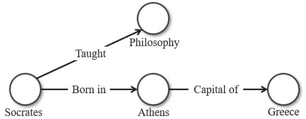
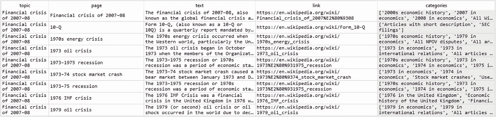
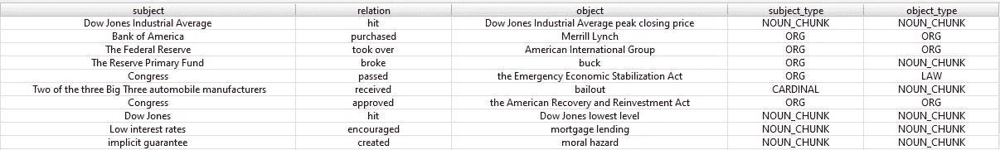
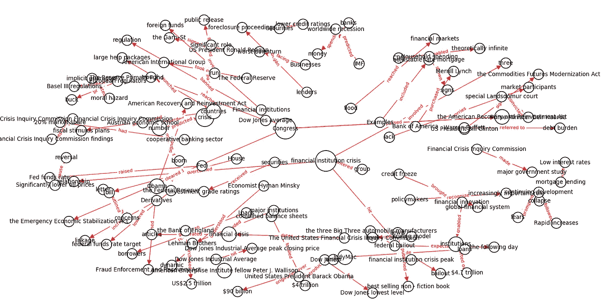
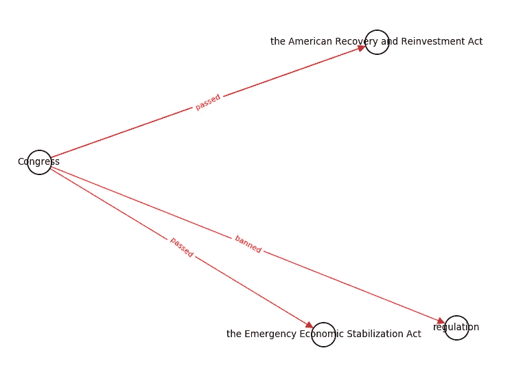

# 自动生成的知识图

> 原文：<https://towardsdatascience.com/auto-generated-knowledge-graphs-92ca99a81121?source=collection_archive---------3----------------------->

## 利用网络抓取机器人、计算语言学、自然语言处理算法和图论的集合。


**知识图**是一种数据科学工具，处理相互关联的**实体**(人、组织、地点、事件等)。).实体是通过**边**连接的**节点**。知识图由这些**实体对**组成，可以遍历这些实体对来发现非结构化数据中有意义的联系。



图形数据库有一些固有的问题，其中之一是构建它们需要手工操作。在本文中，我将讨论我使用 web 抓取机器人、计算语言学、自然语言处理(NLP)算法和图论(提供 python 代码)进行自动生成的研究和实现。

# 网页抓取

构建知识图表的第一步是收集你的资源。对于某些目的来说，一个文档可能就足够了，但是如果你想更深入地在网上搜索更多的信息，有多种方法可以使用网络抓取来实现。维基百科是一个不错的起点，因为该网站的功能是作为一个用户生成的内容数据库，引用了大多数可靠的二手来源，这些二手来源审查来自一手来源的数据。

***边注*** *:随时检查你的来源。信不信由你，网上的信息并不都是真的！对于基于启发式的解决方案，交叉引用其他网站或选择 SEO 指标作为信任信号的代理。*

我将尽可能避免屏幕抓取，对维基百科 API 使用直接的 python 包装器。

下面的函数在维基百科中搜索给定的主题，并从目标页面及其内部链接中提取信息。

让我们测试一下这个函数的题目:[“2007-08 年金融危机”](https://en.wikipedia.org/wiki/Financial_crisis_of_2007%E2%80%9308)

```
wiki_data = wiki_scrape('Financial crisis of 2007–08')
```

**输出:**

维基百科页面抓取:798



如果您想提取单页，请使用下面的函数:

# 计算语言学和自然语言处理算法

使用**词性**和**依存解析**可以从文本中自动构建知识图**和**。使用 NLP 库 **SpaCy** 从语法模式中提取实体对是快速的，并且可扩展到大量文本。

下面的函数将实体对定义为由根动词连接的具有主语-宾语依赖关系的**实体/名词块。其他的经验法则可以用来产生不同类型的连接。这种联系可以称为**主谓宾三元组**。**

调用主主题页面上的函数:

```
pairs = get_entity_pairs(wiki_data.loc[0,'text'])
```

**输出:**

提取的实体对:71



**共指消解**通过规范化文本、移除冗余以及将实体分配给代词，显著改进了实体对提取(*参见下面我关于共指消解的文章)*。

[](/coreference-resolution-in-python-aca946541dec) [## Python 中的共指消解

### 使用 NeuralCoref 将基于神经网络的共指消解集成到您的 NLP 管道中

towardsdatascience.com](/coreference-resolution-in-python-aca946541dec) 

如果您的用例是特定领域的(医疗、法律、科学)，那么训练一个[定制实体识别器模型](https://spacy.io/usage/training#ner)也是值得的。

# 图论

接下来，让我们使用 **NetworkX** 库来绘制网络。我将创建一个**有向多图**网络，其节点大小与**度中心性**成比例。

```
draw_kg(pairs)
```



如果绘制的图形变得难以理解，我们可以增加图形尺寸或过滤/查询。

```
filter_graph(pairs, **'**Congress**'**)
```



# 大规模知识图表

为了有效地为我们的主题使用整个语料库 **~800** 维基百科页面，使用在 *wiki_scrape* 函数中创建的列为每个节点添加属性，然后您可以跟踪每个节点位于哪个页面和类别。

我推荐使用**多处理**或者**并行处理**来减少执行时间。

大规模的知识图表是人工智能研究的前沿。唉，现实世界的知识并没有整齐地组织成一个模式，而是无组织的、杂乱的和有机的。